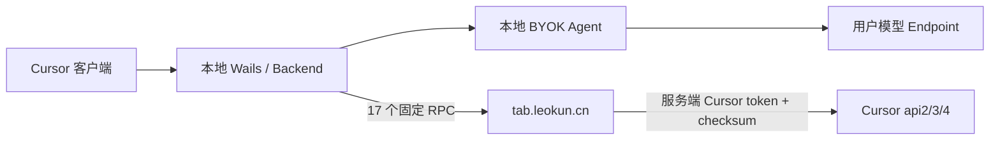

# Cursor BYOK 功能可用、Tab 中继与隐私验证路线图

## 1. 已核实的架构结论

- [`internal/backend/host.go`](/Users/yaogj/Downloads/works/yaogjim/cursor-byok/cursor-byok/internal/backend/host.go) 将 `tabServerBaseURL` 固定为 `https://tab.leokun.cn`，`tabServerUpstreamProcedure` 只替换目标 scheme/host，保留 RPC path/query；同一 action 同时用于 `Local` 与 `Upstream`。
- 客户端注册的 17 个 Tab/Cpp/Git/FileSync RPC，与 [`cursor-tab-server/main.go`](/Users/yaogj/Downloads/works/yaogjim/cursor-byok/cursor-byok/cursor-tab-server/main.go) 的 17 个启用路径逐项对应。服务端只多出客户端已注释的 `GetEffectiveUserPlugins`。
- 两部分由同一提交 `c083be5 (v0.3.8)` 成对引入，包括客户端路由、`cursor-tab-server` 全目录及 Docker 构建任务。这进一步证明它们是配套设计。
- [`cursor-tab-server/main.go`](/Users/yaogj/Downloads/works/yaogjim/cursor-byok/cursor-byok/cursor-tab-server/main.go) 不执行 Tab 模型推理；它读取服务端配置的 Cursor token，覆盖 `Authorization`，生成 `x-cursor-checksum`，再把请求转发到 Cursor 官方 `api2/3/4.cursor.sh`。
- [`cursor-tab-server/README.md`](/Users/yaogj/Downloads/works/yaogjim/cursor-byok/cursor-byok/cursor-tab-server/README.md) 明确要求从 Cursor `state.vscdb` 获取有效 access token。
- [`cursor-tab-server/go.mod`](/Users/yaogj/Downloads/works/yaogjim/cursor-byok/cursor-byok/cursor-tab-server/go.mod)、[`cursor-tab-server/Dockerfile`](/Users/yaogj/Downloads/works/yaogjim/cursor-byok/cursor-byok/cursor-tab-server/Dockerfile) 和 [`Taskfile.yml`](/Users/yaogj/Downloads/works/yaogjim/cursor-byok/cursor-byok/Taskfile.yml) 表明它是独立 module、独立容器和独立发布单元；根 [`main.go`](/Users/yaogj/Downloads/works/yaogjim/cursor-byok/cursor-byok/main.go) 未嵌入或启动它。

因此，源码层面可以确认：`cursor-tab-server` 就是 `tabServerUpstreamProcedure` 的配套服务端实现，`tab.leokun.cn` 是该实现预期的部署地址。严谨限制是：仅凭仓库不能证明线上实例当前运行的恰好是此 commit、此镜像或未修改版本。

## 2. 实际依赖边界

- **核心 BYOK Agent**：主要由桌面端、本地 backend、用户模型 Endpoint 和 Cursor 本地工具组成，不应笼统描述为必须依赖该 relay。
- **当前 17 个 RPC 的完整可用性**：确实依赖独立 relay、relay 持有的有效 Cursor token，以及 Cursor 官方服务。没有 relay 时，Tab、next-edit、部分 Git 辅助和 FileSync 会部分或全部失效。
- **不是纯本地 Tab BYOK**：relay 只是鉴权/协议中继，真正能力仍来自 Cursor 官方 upstream。
- **隐私边界**：relay 会接收这些 RPC 的 body 和大部分 headers，运营方在技术上可接触其中的代码、编辑历史、diff、文件内容及相关上下文；它不能被归类为“本地执行”。

## 3. 已确认的决策

1. 功能可用优先，任何路由变化前先建立现状基线。
2. 用户模型 Endpoint 与 Cursor 官方 upstream 属于默认信任区，但 local 失败不得静默自动 fallback。
3. `tab.leokun.cn` 暂不进入默认信任区，也暂不阻断、替换或切换。
4. 不把“高度对应的部署实例”表述为“线上版本身份已经证明”；后者需要部署记录、镜像 digest、版本响应或运维证据。
5. 一次只验证一个 RPC/变量，保留独立回滚路径；优先修复已证明的功能错误、隐私错误和数据损坏风险。
6. 超大文件拆分和状态机重构后置，不能先于功能回归保护。

## 4. 验证阶段

### 阶段 0：冻结工作基线

- 验证代理启停、Cursor 设置恢复、模型连通、Agent 单/多轮、thinking、工具调用、取消、错误和重启恢复。
- 为 BidiAppend、RunSSE、tool result、context/state 持久化建立脱敏 fixture/golden 基线。

### 阶段 1：被动确认 relay 行为，不改变路由

- 为 17 个 RPC 记录脱敏元数据：route、目标 host、状态、时序、body 大小、重试和终态；不保存源码、body、Authorization、Cookie 或 token。
- 比较线上响应协议、headers、流式行为和错误形态是否与仓库服务一致。
- 线上源码身份只能通过版本标识、部署记录、镜像 digest 或服务所有者证据确认；DNS、TLS 证书和接口可用只能证明关联性，不能证明二进制同源。
- 核对客户端到 relay、relay 到官方 upstream 两段 headers，确认无模型 API Key 或无关凭据泄露。

### 阶段 2：逐 RPC 功能影响实验

按低风险到高风险顺序验证现状、阻断、本地 no-op、官方直连候选的差异：

1. 遥测/反馈：`RecordCppFate`、`ReportAiCodeChangeMetrics`。
2. 编辑历史：`CppAppend`、`CppEditHistoryAppend`。
3. 配置/状态：`CppEditHistoryStatus`、`CppConfig`、`AvailableModels`。
4. Git：`WriteGitCommitMessage`、`WriteGitBranchName`。
5. FileSync：status/config，再 sync/upload。
6. 核心数据面：`RefreshTabContext`、classification、next cursor、`StreamCpp`。

每项记录 Cursor 版本、请求序列、用户可见结果、重试、状态恢复和可回滚方案。官方直连前先解决 token 来源与隔离，不能复用或泄露模型凭据。

### 阶段 3：验证其他功能错误假设

- 证明 Commit Message 实际路由命中及本地 provider handler 的可替代性。
- 逐项验证工具 `catalog -> compile -> dispatch -> result -> replay`。
- 检查 Repository/Docs/Upload 的 success 是必要兼容、部分能力，还是会误导后续状态的有害业务成功。
- 未经运行证据，不把 no-op、第三方泄露或协议不完整直接定性为已确认错误。

### 阶段 4：提交决策并最小实施

- 输出逐 RPC 的“保留 relay / 官方直连 / 本地兼容 / 本地实现 / 禁用”候选矩阵。
- 等待用户逐项确认后，以 feature flag 或细粒度路由开关实施；不批量切换，不自动 fallback。
- 先修用户可见错误和隐私错误，再补缺失功能；不同时做结构重构。

## 5. 停止条件

出现 Agent/Tab/工具回归、重试风暴、入口消失、不可恢复状态、未知外部目标、未脱敏凭据/源码落盘，或无法确认兼容 gate 语义时，立即停止实验并回到最近基线。

本轮只完成源码、构建边界和提交来源核验，不修改代码、配置、路由，也不探测线上业务接口。