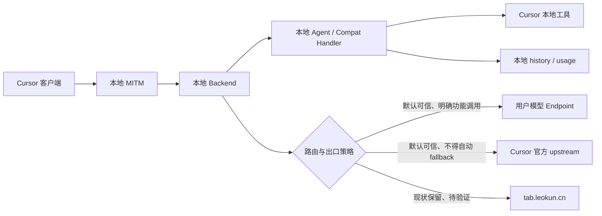
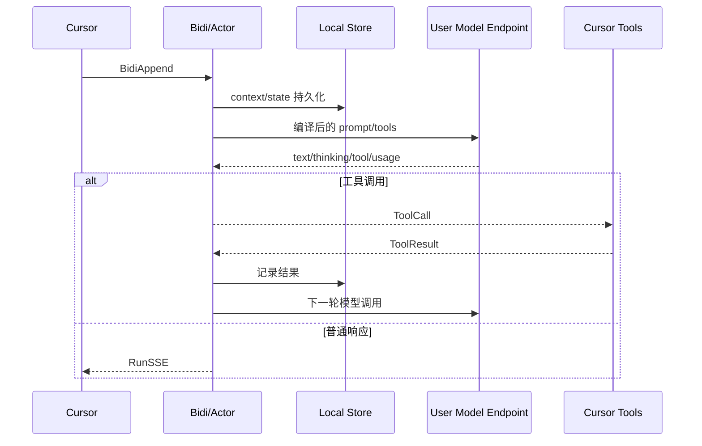

# Cursor BYOK 功能可用、隐私与稳定性验证路线图

## 1. 已确认的决策与优先级

1. **功能可用优先**：任何路由、协议响应、状态机和持久化修改前，必须先建立现状基线；不能因安全治理、结构优化或语义“纠正”导致现有功能失效。
2. **稳定优先于优雅**：先处理已验证的功能错误和功能不足；文件拆分、统一抽象、状态机重写只在直接解决缺陷且回归保护完备时进行。
3. **默认信任区**：
   - 用户配置的模型 Endpoint：默认允许访问。
   - Cursor 官方 upstream（如 `api2.cursor.sh`、`api3.cursor.sh`、`api4.cursor.sh`）：默认允许访问。
   - local 功能失败时**不得自动 fallback** 到 Cursor 官方 upstream；是否调用由明确路由模式和功能策略决定。
4. **未确认第三方**：`tab.leokun.cn` 不进入默认信任区，但当前暂不阻断。先验证它承载的真实功能、请求内容、线上行为和可替代性，提交报告后等待用户再次确认。
5. **未知第三方**：除上述信任目标外，新增硬编码或用户不可见的外部目标默认不允许进入正式路径。
6. **小步可回滚**：一次只验证或修改一个 RPC/功能；不得同时改变路由、协议响应、鉴权和 UI 状态。
7. **Tab 双模式目标**：用户自己的 Cursor token 本地官方直连为主要目标；`tab.leokun.cn` 仅作为用户明确启用的兼容模式；两个模式之间禁止自动 fallback。
8. **运行中实例保护**：当前会话依赖同一 `18080/18090` 代理；没有明确维护窗口时不切换实例，必要切换必须使用延迟交接、健康检查和失败自动回退。

## 2. 架构与网络边界

- “默认可信”表示网络访问被允许，不表示请求可携带任意字段，也不表示 local 失败可以静默转发。
- 所有外发仍需最小化 headers、凭据和 payload；尤其不能把模型 API Key、Authorization 或无关上下文转发到非目标服务。
- local/upstream 是业务执行模式；信任区是网络边界，两者必须分开建模。

## 3. 核心 Agent 链路的保护边界

以下链路属于当前主要功能，基线已经建立；后续修改不得改变其输入输出和时序：

- [`internal/backend/forwarder/service.go`](internal/backend/forwarder/service.go)、[`actor.go`](internal/backend/forwarder/actor.go)、[`projector.go`](internal/backend/forwarder/projector.go)、[`compaction.go`](internal/backend/forwarder/compaction.go) 不做结构重写。
- `context.json`、`state.json`、tool replay、reasoning signature 和 RunSSE 终态继续由现有测试保护。
- 已确认 `ForceBackgroundShell` 在没有 reasoning payload 时产生孤立 `tool_result`，旧 projector 会将其丢弃；已在 [`internal/backend/forwarder/projector.go`](internal/backend/forwarder/projector.go) 做最小 replay 修复，未改变客户端协议或工具执行。

## 4. `tabServerUpstreamProcedure` 已确认的源码行为

### 4.1 路由逻辑

[`internal/backend/host.go`](internal/backend/host.go) 中：

- `tabServerBaseURL` 固定为 `https://tab.leokun.cn`。
- `tabServerUpstreamProcedure` 保留请求 path/query，只替换 scheme/host。
- 同一 action 同时注册为 `Local` 和 `Upstream`，因此全局 routing mode 不会改变这些 RPC 的目标。
- [`internal/backend/server/upstream/action.go`](internal/backend/server/upstream/action.go) 读取完整 body 并复制请求 headers。
- [`internal/backend/server/upstream/client.go`](internal/backend/server/upstream/client.go) 除 hop-by-hop headers 和 `X-Server-Upstream-URL` 外基本原样转发 headers、body，并流式复制响应。

仓库中的 [`cursor-tab-server/main.go`](cursor-tab-server/main.go) 将同一批路径再映射到 Cursor 官方 `api2/3/4.cursor.sh`，使用服务端配置的 Cursor token。由此可推断该服务的设计用途是 Cursor 能力中继，但不能据此证明线上 `tab.leokun.cn` 当前部署版本和行为完全相同。

### 4.2 不能直接替换为官方 upstream 的原因

[`internal/client/lifecycle.go`](internal/client/lifecycle.go) 启动时调用 [`internal/cursor/state_db.go`](internal/cursor/state_db.go) 的 `InjectCursorUserInfo`，将 Cursor `accessToken/refreshToken` 改为 [`internal/runtime/defaults.go`](internal/runtime/defaults.go) 的本地模拟 token。

因此，直接把 Tab 路由切到 Cursor 官方 upstream 可能因鉴权失败导致功能中断。官方 upstream 虽在默认信任区，仍必须验证：

- 当前请求实际携带哪个 token。
- Cursor 官方是否接受该 token。
- 是否需要保留并隔离用户原始 Cursor token。
- 直连对 local 假账号、Dashboard/Auth mock 和 Cursor UI 的影响。

未经上述验证，不修改目标地址。

## 5. `tabServerUpstreamProcedure` 覆盖的能力与禁用影响

### 5.1 Tab 核心数据面：高功能影响、高数据敏感度

- `StreamCpp`：行内补全/ghost text。请求可含当前文件完整内容、路径、workspace root、diff history、其他文件内容、lint、LSP 上下文。
- `StreamNextCursorPrediction`：下一光标位置/下一编辑预测，包含与 Tab 类似的代码和编辑上下文。
- `GetCppEditClassification`：候选编辑评分/过滤，内含完整 `StreamCppRequest` 和文件内容。
- `RefreshTabContext`：刷新 Tab 的当前文件、附加文件、diff、workspace/repository 上下文。

**若直接禁用**：Cursor Tab、下一编辑预测大概率停止，或发生持续失败/重试；没有替代路径前不得阻断。

### 5.2 Tab 配置、模型与反馈：中等到低功能影响

- `CppConfig`：Tab 开关、debounce、上下文范围、FileSync 和后端地址等配置。
- `CppEditHistoryStatus`：编辑历史是否启用。
- `CppService/AvailableModels`：Tab 模型列表和默认模型。
- `CppService/RecordCppFate`：补全接受/拒绝/部分接受反馈。

**若直接禁用**：

- `CppConfig/AvailableModels` 失败可能让 Cursor 直接关闭 Tab。
- `CppEditHistoryStatus` 可考虑本地返回关闭，但必须验证客户端解释和重试行为。
- `RecordCppFate` 偏遥测，可能可本地确认；仍需验证是否参与后续状态。

### 5.3 编辑历史与指标：低直接功能影响，但可能有状态依赖

- `CppAppend`：上传二进制变更集合。
- `CppEditHistoryAppend`：上传 session、路径、URI、文字变更、光标选择、接受/拒绝事件和 privacy mode 状态。
- `ReportAiCodeChangeMetrics`：上报 AI 修改来源、模型和增删行数。

**若直接禁用**：编辑本身可能仍可用，但可能影响 Tab 个性化、服务端连续状态或引发重试；优先验证本地 no-op 成功是否安全。

### 5.4 Git 辅助功能：明确用户可见影响

- `WriteGitCommitMessage`：根据 diff、历史 commit 和显式上下文生成提交信息；请求协议允许携带 API Key/Azure/Bedrock credentials。
- `WriteGitBranchName`：根据 diff、上下文和 conversation ID 生成分支名，也允许携带 credentials。

**若直接禁用**：Cursor 的生成 Commit Message/Branch Name 操作失效。

- Commit Message 的本地 provider 实现位于 [`internal/backend/forwarder/commit_message.go`](internal/backend/forwarder/commit_message.go)。隔离路由测试已证明精确 `WriteGitCommitMessage` 路由会遮蔽 `/AiService/*` 通配 handler，因此该本地实现不会处理命中精确路由的请求。
- Cursor 3.12.17 Workbench 静态链路已定位：`cursor.generateGitCommitMessage` 先读取 staged diff，缺失时读取 working tree diff，再调用 `generateCommitMessage`；静态 build flag 为 `localMode: false` 时应调用 `AiService.WriteGitCommitMessage`。
- 运行时证据与静态预期冲突：unstaged/staged 两次 synthetic UI 生成均成功，但都未观察到 canary 匹配的 relay 请求或用户 provider 请求。当前结论为 `client-side transport unresolved`，不能据此切换或删除精确路由。
- Branch Name 尚未确认本地实现和真实调用链；需要在本地实现、官方直连或保留现状之间验证后选择。

### 5.5 FileSync：可能是 Tab 的必要依赖

- `FSIsEnabledForUser`：查询 FileSync 是否启用。
- `FSConfig`：同步大小、重试、debounce 和 cache 配置。
- `FSSyncFile`：发送路径、版本、增量更新和 hash。
- `FSUploadFile`：发送相对路径和完整文件内容。

**若直接禁用**：FileSync 停止；当 `CurrentFileInfo.rely_on_filesync=true` 时，Tab 请求可能只携带 hash/版本，服务端拿不到代码内容，补全可能失败或质量明显下降。必须和 Tab 核心请求联动验证。

## 6. “功能虚报成功”的重新定义

未经运行时证据，不再直接使用“虚报”定性。成功响应分为三类：

### 6.1 必要兼容成功

用于 Cursor 启动、能力 gate、避免重试或保持本地 Agent 可操作，例如部分 ServerTime、ServerConfig、Auth、Dashboard、Statsig 和 Repository handshake/status。

处理原则：

- 默认保留。
- 标记为 `compatibility`，不计入真实业务能力覆盖率。
- 只有证明删除不会影响 Cursor UI、重试和主要功能后才允许修改。

### 6.2 有本地副作用但能力不完整

例如保存索引元数据、文档 identifier/title/URL、knowledge/user rules，但没有完整抓取、分块、embedding 或语义检索。

处理原则：

- 保留已工作的本地副作用。
- 对用户和能力报告显示“部分支持/仅元数据”。
- 不先改协议状态；优先补齐实际效果。

### 6.3 已确认的误导性业务成功

隔离特征测试已稳定复现以下行为：

- `FastRepoInitHandshakeV2` 和 `FastUpdateFileV2` 返回成功，但文件路径、hash 和文件数据未写入索引；重建 store 后文件数仍为 0。
- 未握手、未上传、未持久化的 repository 也可被状态接口报告为已同步；多个写入/Merkle RPC 返回 `SUCCESS`、`match=true` 或 synced，但不消费对应内容。
- `UploadDocumentation` 只保存 identifier/URL 推导的元数据，不抓取或索引正文，却返回 `STATUS_SUCCESS` 和 `Progress=1`；重建 store 后仍被标记 indexed，查询成功但没有 chunk。
- `AvailableDocs` 会把请求中的未知 identifier 持久化为 indexed，形成读取接口改变持久化状态。
- `KnowledgeBaseAdd` 先保存规则，再保存 Docs 索引；第二步失败时仍返回 `Success=true`，形成部分提交。

这些行为已确认能力缺失、跨重启错误状态和部分提交风险，但尚未验证把响应改为 failure/unsupported 后的 Cursor UI、重试和 fallback 行为。因此生产实现暂不修改；后续修复必须先定义不会错误推进客户端状态机的诚实能力语义。

## 7. 功能错误调查结论

- `tab.leokun.cn` 仍是不在默认信任区的第三方依赖；是否保留、替换或禁用继续等待 token、功能影响和用户策略确认。
- Commit Message 的精确路由遮蔽已由隔离路由测试确认；Cursor 3.12.17 的 UI 命令和静态 `WriteGitCommitMessage` 分支已定位，但真实运行时 transport 与静态预期冲突，因此不修改路由。
- 工具链已按 `catalog -> compile -> dispatch -> result -> replay` 检查。所有实际暴露工具均有 dispatch 路径；已确认并最小修复 `ForceBackgroundShell` 无 reasoning 时结果无法 replay 的阶段断裂。
- Repository/Docs/Upload 的能力缺失、错误持久化状态和 KnowledgeBase 部分提交已由隔离特征测试确认；生产错误语义尚需客户端影响实验后再决定。

所有结论继续区分：运行时实测、隔离测试、静态可达性和未确认边界；RPC success、protobuf 字段或 bundle 字符串不能单独作为功能成立证据。

## 8. 分阶段实施路径与确认点

### 阶段 0：建立核心功能基线，不修改行为（已完成）

- 验证代理启停、Cursor 设置应用/恢复、模型配置和连接测试。
- 验证 Agent 单轮/多轮、text/thinking、单/多工具、取消和错误。
- 验证文件、搜索、shell、MCP、Ask/Plan/Task/todo。
- 保存脱敏 Bidi/RunSSE/tool fixture。

**检查点 A：已通过。** 代理、Agent、provider、主要工具、Cursor 设置和原账号恢复均已完成可重复验证。

### 阶段 1：被动分析 Tab 中继，不阻断（主要高敏感链路已完成，低可见 RPC 待补）

- 只记录 route、目标、状态、时序、body 大小、重试次数和响应终态，不记录源码/body/凭据。
- 分别操作 Tab、next cursor、Commit Message、Branch Name 和依赖 FileSync 的场景。
- 确认 `tab.leokun.cn` 线上证书、响应协议和与仓库 `cursor-tab-server` 行为的一致性；不将线上内容写入调试工件。
- 核对请求 headers，确认 Authorization、Cookie、自定义凭据是否被转发。

**检查点 B：部分通过。** 已形成 Agent、Tab、FileSync 和 Git 的 synthetic 聚合矩阵；`RecordCppFate`、`CppEditHistoryAppend`、`FSSyncFile` 等未稳定观察到的 RPC 仍需单独验证，未命中不得解释为未发送。

### 阶段 2：逐 RPC 影响实验，一次只改一个变量

在可逆测试开关或隔离测试环境中依次验证：

1. 遥测/反馈：`RecordCppFate`、`ReportAiCodeChangeMetrics`。
2. 历史：`CppAppend`、`CppEditHistoryAppend`。
3. 状态/配置：`CppEditHistoryStatus`、`CppConfig`、`AvailableModels`。
4. Git：`WriteGitCommitMessage`、`WriteGitBranchName`。
5. FileSync：先 status/config，再 sync/upload。
6. 核心数据面：最后验证 `RefreshTabContext`、classification、next cursor、`StreamCpp`。

每项记录：正常结果、阻断结果、本地 no-op 结果、官方直连结果、重试和 UI 影响。官方直连测试必须先解决 token 来源和隔离，不能复用或泄露模型凭据。

**检查点 C**：输出“保留中继 / 官方直连 / 本地兼容 / 本地实现 / 禁用”候选方案及证据，等待用户再次确认。未经确认不处理 `tab.leokun.cn`。

### 阶段 3：严格验证功能性错误（当前可验证范围已完成）

- Commit Message：证明实际 route 命中，比较 Tab 响应与本地 provider handler，再决定切换。
- 工具链：逐个验证 `catalog -> compile -> dispatch -> result -> replay`，只修复复现失败的工具。
- Repository/Docs/Upload：验证 UI、后续请求和 Agent 检索效果，区分必要兼容成功与误导性成功。
- 未知 RPC：记录版本和用户可见行为，不先改变通配处理。

**检查点 D：当前调查完成。** 已确认一个工具 replay 缺陷并完成最小修复；Repository/Docs/Upload 进入“待定义诚实语义”；Commit Message 保持 `client-side transport unresolved`，不进入路由修改。

### 阶段 4：按确认结果实施最小修复

- 使用独立 feature flag 或路由开关，不一次性替换全部 Tab 路由。
- local 不自动 fallback；任何官方 upstream 调用有明确 route reason。
- 保留旧行为作为短期回滚路径，确认新路径稳定后再移除。
- 先修用户可见错误，再补缺失功能；不同时进行结构重构。

### 阶段 5：Agent 稳定性与安全

- 覆盖断线重连、重复消息、取消、工具超时、后台 shell、重启恢复和资源回收。
- 验证持久化原子性后再按实际缺陷增加 schema/migration。
- API Key 进入 Keychain；日志、debug 工件和诊断报告脱敏并仅保存在本地。
- 为默认信任目标实施最小 headers/payload 策略，而不是简单全量放行。

### 阶段 6：补齐功能与可靠性驱动优化

- 先补真实代码库/文档检索、经确认需要的本地 BYOK Tab、Git 辅助和工具缺口。
- 只有已确认缺陷受现有结构阻碍且回归测试完备时，才局部拆分 forwarder、bridge 或前端 store。
- 不以文件长度、重复代码或“架构不优雅”单独立项。

## 9. 当前验证证据与状态

### 9.1 已完成

- 核心功能基线和恢复流程已完成；生产路由未改变。
- 专用隐私审计已实现并提交（`9728326`）：默认关闭、逐请求 canary 门控、无正文/凭据、`0600`、自动过期、事件上限和固定 endpoint 分类。
- synthetic Agent 请求已确认到达用户 OpenAI `responses` provider 并返回 HTTP 200；本次 synthetic 场景未观察到 Agent prompt 经已审计的 17 条 relay RPC 外发。
- `FSUploadFile` 已确认会发送 synthetic 文件完整内容，并在失败后重试；`StreamCpp` 已确认携带当前文件全文、相对 workspace 路径、光标、文件版本、additional files 和 diff history。
- Commit Message 的 unstaged/staged UI 生成均成功；静态调用链和路由优先级已定位，但真实 transport 未解析，不能归因于 relay 或用户 provider。
- Repository/Docs/Upload 特征测试已锁定成功语义失真、跨重启错误状态和部分提交。
- 工具目录均有 dispatch 路径；`ForceBackgroundShell` 孤立结果 replay 已完成最小修复。
- 最终 `go test ./...`、`go build ./...`、Go 格式检查和编辑文件诊断均通过；构建只出现既有的 macOS 目标版本链接警告。

### 9.2 仍待验证

- 17 个 RPC 中低可见项的真实触发条件、失败重试和 privacy mode 差异。
- 合法隔离 Cursor token 的 Hobby/付费权限、额度、过期和刷新行为。
- `local_official` / `external_relay` 的凭据导入、Keychain、身份隔离和禁止自动 fallback 设计。
- 各 RPC 在 relay、官方直连、本地实现、本地 no-op 和禁用之间的功能影响。
- Repository/Docs/Upload 改为诚实失败或补齐真实持久化后的 Cursor UI 与状态机行为。

## 10. 统一停止条件

出现任一情况立即停止当前实验或改动：

- Agent、文件工具、模型 Endpoint 或 Cursor 启动流程回归。
- Cursor 出现卡死、重试风暴、入口消失或不可恢复状态。
- 请求发送到默认信任区之外的新目标。
- 需要使用或保存未经脱敏的源码、凭据、Authorization、Cookie。
- 无法确定成功响应是否承担兼容 gate。
- 无法提供独立回滚路径。

当前继续保持生产路由和运行中实例不变。下一批执行从低可见 RPC、隔离 token 权限或 Repository/Docs 诚实语义设计中选择；涉及 `tab.leokun.cn` 目标、默认路由或运行中实例切换时必须再次获得用户确认。