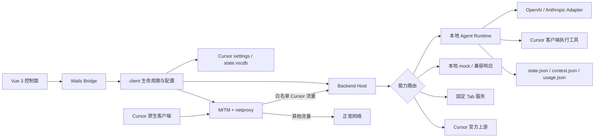
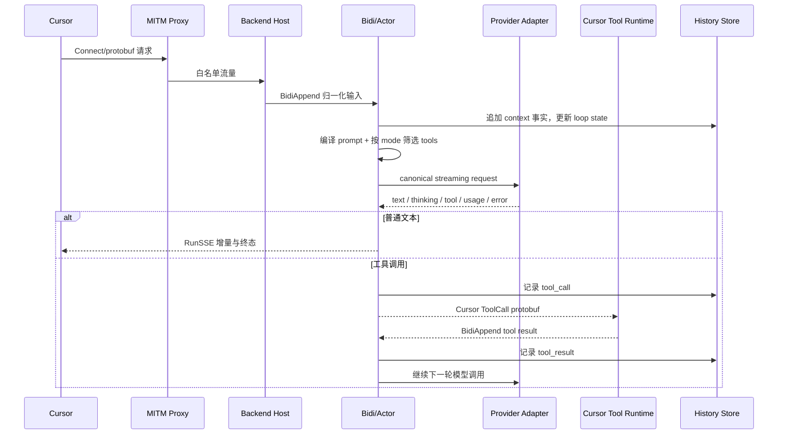

# Cursor BYOK 架构评估与后续路线图

## 1. 总体判断

项目本质是一个 **Cursor 原生客户端的本地兼容后端**，不是独立 IDE，也不是简单 API 转发器。它保留 Cursor 的 UI、上下文采集和工具执行能力，通过 Wails 控制面、MITM 代理和 Connect/protobuf 兼容层，将 Agent 推理替换为用户配置的 OpenAI/Anthropic 兼容模型。

当前核心 Agent 主链路已经形成闭环；主要短板不是“完全不可用”，而是：

- `local` 语义不纯：既可能本机执行，也可能 mock，甚至固定转发到 `tab.leokun.cn`。
- 部分索引/文档 handler 只完成协议握手和元数据持久化，不等于真实语义索引。
- 协议兼容、断线恢复、安全和测试基线弱于现有实现复杂度。
- 多个超大文件同时承载协议翻译、状态机、持久化和兼容逻辑，回归风险较高。

## 2. 架构与模块边界

- **桌面入口与控制面**：`[main.go](main.go)`、`[internal/app/runner.go](internal/app/runner.go)`、`[internal/bridge](internal/bridge)`、`[frontend/src](frontend/src)`。负责 Wails 启动、代理启停、配置、模型编辑、指标和更新。
- **Cursor 接入与生命周期**：`[internal/client](internal/client)`、`[internal/cursor](internal/cursor)`。负责配置、CA、Cursor 启停、settings 和 `state.vscdb`。
- **网络边界**：`[internal/mitm](internal/mitm)`、`[internal/netproxy](internal/netproxy)`。负责 TLS MITM、目标域名识别和流量转发。
- **协议入口与路由**：`[internal/backend/host.go](internal/backend/host.go)`、`[internal/backend/server](internal/backend/server)`。负责 HTTP/Connect 路由、`local/upstream` 策略、mock 和上游动作。
- **Agent Runtime**：`[internal/backend/forwarder](internal/backend/forwarder)`。负责 Bidi 输入、串行 actor、prompt 编译、provider 调用、工具循环、RunSSE、持久化、压缩和 usage。
- **协议桥与模型适配**：`[internal/backend/agent](internal/backend/agent)`。将统一工具/消息模型映射为 Cursor protobuf，并适配 OpenAI Responses、Chat Completions 与 Anthropic Messages。
- **独立 Tab 组件**：`[cursor-tab-server](cursor-tab-server)`。依赖 Cursor access token，不属于统一 BYOK Agent provider 链路。
- **协议资产与发布**：`[proto](proto)`、`[Taskfile.yml](Taskfile.yml)`、`[build](build)`。负责协议副本、生成代码和 macOS/Windows/Linux 发布。

## 3. 核心业务逻辑与数据流

关键约束：

- `context.json` 是可回放会话事实源；`state.json` 只保存当前 loop/运行状态，定义见 `[internal/backend/README.md](internal/backend/README.md)`。
- actor 串行消费 provider、客户端和工具事件，避免并发直接修改会话状态。
- `[internal/backend/forwarder/compiler.go](internal/backend/forwarder/compiler.go)` 和 `[projector.go](internal/backend/forwarder/projector.go)` 把历史、上下文、reasoning、tool call/result 投影为 provider 请求与 Cursor checkpoint。
- `[internal/backend/agent/model/router.go](internal/backend/agent/model/router.go)` 只接受 `openai`、`anthropic` 两类 provider；统一事件定义在 `[types.go](internal/backend/agent/model/types.go)`。
- shell、文件、搜索、MCP、交互等工具主要由 Cursor 客户端执行，本地 backend 负责参数转换、生命周期和结果回灌。

## 4. Cursor 能力基线

### 已形成完整或较完整本地闭环

- 代理启停、CA/MITM、Cursor 配置与生命周期管理。
- Agent 多轮对话、流式文本、thinking/reasoning、usage、错误和终态处理。
- OpenAI Responses、OpenAI Chat Completions、Anthropic Messages 兼容适配；支持自定义 Endpoint、Headers、额外参数、思考强度和模型基准测试。
- Agent/Ask/Plan/Debug/Multitask 模式的 prompt/tool catalog 基础。
- 文件读写与编辑、Glob/Grep/Ls、lint、shell 前后台控制、MCP 调用/资源读取、Task、WebSearch/WebFetch、AskQuestion、CreatePlan、SwitchMode、TodoWrite 等工具桥接。
- 工具结果回灌后继续模型循环；会话 replay、checkpoint、compaction、usage 和调试工件基础。
- `CountTokens`、thought annotation、token usage、共享 user rules 等辅助能力。
- 本地与 Cursor 官方 upstream 的全局模式切换。

### 部分支持或主要属于协议兼容c

- **Repository/Codebase Index**：`[repository_index_handler.go](internal/backend/forwarder/repository_index_handler.go)` 多数接口直接返回 `MATCH/SUCCESS/UP_TO_DATE`；`FastUpdateFile`* 没有消费文件内容。`[codebase_index_handler.go](internal/backend/forwarder/codebase_index_handler.go)` 保存路径、hash、阶段和事件，但没有 chunk、embedding、向量检索和增量依赖图。因此是“索引协议状态机/元数据兼容”，不是完整代码库语义索引。
- **Docs/Knowledge**：`[docs_index_handler.go](internal/backend/forwarder/docs_index_handler.go)` 可保存并返回单块内容，但无抓取、解析、分块、embedding 和相关性排序；`[upload_docs_handler.go](internal/backend/forwarder/upload_docs_handler.go)` 主要保存标识、标题和 URL，未真正上传/抓取页面内容。
- **Dashboard/Auth/Statsig**：多数为固定 mock，只为满足 Cursor 客户端启动或 UI 条件，不代表真实账号、计费、团队和企业功能。
- **GenerateImage/多模态**：存在图片内容结构、base64 结果映射和 token 估算，但当前 `GenerateImage` 需要 provider tool call 自带 `image_data`，不是独立图片生成 provider；附件端到端兼容仍需真实客户端验证。
- **MCP/Task/shell 恢复**：桥接代码存在，但不同 Cursor 版本下取消、重连、权限拒绝、后台恢复与错误语义缺少契约测试。
- **Commit Message**：本地 handler 已实现，但 `[host.go](internal/backend/host.go)` 中更早注册的 Tab 专用同路径路由可能使本地实现被遮蔽，需要以真实请求验证并消除路由歧义。
- **工具能力真相不一致**：`[tool_catalog.go](internal/backend/forwarder/tool_catalog.go)`、`[core/types.go](internal/backend/agent/core/types.go)` 和 exec bridge 的名单不同，例如 `Ls`、`GenerateImage`、`ReadTodos`、`ListMcpResources`，说明“可展示、可派发、可回放”尚未由单一能力模型驱动。

### 非本地 BYOK 或当前未支持

- Cursor Tab/Cpp 的纯 BYOK 本地推理。`StreamCpp`、next cursor prediction、Cpp 配置/历史等路由在 `local` 模式也固定转发到 `https://tab.leokun.cn`。
- FileSync 本地实现；当前相关明确路由同样走固定 Tab 服务，其他路径本地返回 404。
- Background Agent、Cloud Agent、远程沙箱、跨设备同步、团队协作与企业管理。
- Cursor 官方完整云端仓库索引、增量同步和语义检索能力。
- OpenAI/Anthropic 之外的 provider 原生协议；其他服务只能通过兼容协议接入。
- 未注册的新版本或实验性 RPC；通配路由可能返回本地 404，只有 upstream 模式能够兜底。
- 完整 Cursor 跨版本 E2E、前端自动化测试和协议契约证据。

## 5. 主要架构风险

1. **路由状态表达不足**：当前只有 `local/upstream`，无法表达 `runtime/mock/external-tab/not-found`，UI 也无法告诉用户请求实际去了哪里。
2. **职责过度集中**：`forwarder/service.go`、exec bridge、compaction、projector、OpenAI/Anthropic adapter 和 `appState.js` 都是千行级核心文件，协议变化容易扩散。
3. **canonical 与 legacy 交叉**：同一事实在 provider message、history entry、checkpoint protobuf 和 legacy HTTP 之间多次转换，缺少统一事件 schema 与显式状态机约束。
4. **“handler 存在”与“功能完整”混淆**：索引、文档和 Dashboard 最明显，容易高估本地覆盖率。
5. **安全边界不足**：API Key 进入普通配置对象；debug 工件可能包含 prompt、源码、header 和工具结果；MITM 与固定外部 Tab 服务需要显式披露和最小化。
6. **验证不足**：当前仅发现 5 个 Go 测试文件，未发现独立前端 test/spec；本轮为只读调查，尚未执行构建、`go test`、race test 或真实 Cursor E2E。

## 6. 分阶段实施路线

### P0：先建立“能力真相”和协议基线

- 建立单一 `CapabilityRegistry`，每项声明 `procedure/domain/localTarget/upstreamTarget/toolStages/supportedCursorVersions`；`localTarget` 至少区分 `runtime`、`compat_mock`、`external_service`、`unsupported`。
- 让 `[host.go](internal/backend/host.go)` 路由、工具 catalog、UI 能力说明和协议测试由同一 registry 派生，消除多份名单漂移。
- UI 对每次请求显示实际命中：本机 BYOK、兼容 mock、固定 Tab 外部服务、Cursor 官方上游；固定外部服务改为显式配置和用户可见开关。
- 记录目标 Cursor 版本的 Bidi、RunSSE、Tab、索引、文档、工具调用真实 fixture，并建立 Connect/protobuf 契约测试。
- 消除 Commit Message 路由遮蔽，以及 `Ls/GenerateImage/ReadTodos/ListMcpResources` 的 catalog/dispatch/replay 不一致。

### P0：提高 Agent 正确性和安全性

- 把 actor 状态机显式化，约束 `idle -> running -> waiting_tool -> completed/canceled/provider_error/failed`，为 request、provider call、tool call 建立幂等键和序号校验。
- 覆盖 provider 中断、SSE 断线、Cursor 重连、重复 Bidi、工具超时、取消、后台 shell 和进程重启恢复。
- 为 `state.json/context.json/usage.json` 增加 schema version、原子写校验、损坏恢复和迁移测试。
- API Key 接入系统 Keychain/凭据存储；调试工件和日志做字段级脱敏；限制 MITM 白名单、监听地址和上传/路径/shell 参数边界。

### P1：实现真正的本地检索能力

- 新建独立检索域模块，而不是继续把逻辑塞进 handler：`ingest -> normalize -> chunk -> embed -> index -> retrieve`。
- Repository 接口只做 Cursor 协议适配；索引域负责内容 hash、增量更新、删除、分支/工作区隔离、持久化和检索。
- Docs 支持 URL 抓取、格式解析、分块、增量刷新、删除和语义排序；Knowledge Base 与 Docs 共用 retrieval 接口，不重复实现存储。
- 先提供可测试的 lexical/FTS 基线，再引入可配置 embedding/vector backend，避免把 provider 选择耦合进协议层。

### P1：补齐高价值 Cursor 功能

- 对 Tab 做明确产品决策：实现独立 BYOK completion adapter，或正式标注为外部服务/上游依赖；不要继续称为本地模式。
- 完成本地 commit message/branch name 的统一模型路由。
- 补齐 MCP resources list、ReadTodos、图片/附件、GenerateImage provider、Task/交互工具的完整闭环与版本兼容。
- 对 Background/Cloud/Team/Enterprise 明确选择：本地实现、上游透传或明确不支持，避免无边界兼容。

### P1/P2：可观测性与架构收敛

- 统一 trace ID、conversation ID、request ID、provider call ID、tool call ID；UI 展示首 token、总耗时、token/cache、tool 轮数、失败阶段和真实执行目标。
- 拆分 `[forwarder/service.go](internal/backend/forwarder/service.go)` 为 ingress、actor commands、provider session、tool lifecycle、egress；actor 只拥有状态转换。
- 将 exec bridge 按 filesystem、search、shell、MCP、subagent 拆分；将 compaction、projection、persistence 变成稳定接口。
- 将 `[frontend/src/state/appState.js](frontend/src/state/appState.js)` 拆为 proxy、config、models、metrics、diagnostics stores。
- 抽取 provider 公共的 SSE、HTTP error、usage、tool-call aggregation 与 artifact redaction，保留 OpenAI/Anthropic 各自协议语义。

### Provider 断连 P1 实施状态

用户已触发并批准 P1 Active Work Package。当前状态：

| 切片 | 状态 | 已实现边界 | 残余风险 |
| --- | --- | --- | --- |
| 父子关联 | 核心完成 | root/parent conversation、parent tool/model call、subagent run、child/agent、model call、provider/http attempt 可选关联；缺失值保持空值 | 真实 Cursor child conversation 绑定来源仍待 fixture，不由 agent ID 推断 |
| durable handoff | 核心完成 | `run.json` + `result.json`、checksum、原子替换、首终态胜出、parent history 幂等提交、启动恢复 | 单 `historyRoot` 依赖单活 Backend；不提供跨进程 CAS，不承诺 child 执行点自动续跑 |
| typed terminal | 核心完成 | 只按已有 protobuf oneof/exec control 分类；无法可靠区分时保守为 `protocol_error` | timeout/provider/parent unavailable 等类别只有出现可靠 typed 来源后才能细分 |
| Provider fallback | 核心完成、默认关闭 | 显式 primary + ordered candidates；零原始字节/零 model event/零副作用门禁；共享预算与兼容检查 | 显式候选允许模型语义变化，UI 必须持续提示费用、隐私和兼容风险 |
| MITM 路由决策 | 保持暂缓 | 本轮无 MITM、CA、证书、CONNECT、系统代理或透明代理扩展 | 只在独立证据与决策门禁后重新评估 |

实施顺序已完成为：**父子关联 → durable run/result + typed terminal → parent 幂等交接 → 默认关闭 fallback**。真实 Cursor success/error/background/resume fixture 和最终全仓验证仍由 `task/todo.md` 跟踪。

必须保持以下边界：

- `durable-handoff` 只保证已生成终态在本地 parent history/tool-result 中幂等唯一交接；网络 checkpoint/update 可重发，未终结 child 不自动重派。
- Provider fallback 只尝试显式 allowlist，任意原始字节、model event 或副作用后立即停止切换。
- MITM whitelist、CONNECT、CA/证书、系统代理和透明代理行为保持现状。
- 同一 `historyRoot` 同时只能由一个活跃 Backend 写入。

## 7. 验收基线

- 每个已注册 RPC 都有明确能力分类和至少一个协议 fixture；未知 RPC 的行为可预测、可观测。
- Bidi/RunSSE 的正常、多工具、取消、重复、断线重连和恢复场景有 E2E 测试。
- provider adapter 覆盖碎片化 SSE、并行 tool calls、reasoning signature、cache usage、非标准兼容响应和错误体。
- compaction 前后 prompt replay、tool result、checkpoint 使用 golden tests 保证语义不漂移。
- 增加 MITM/证书/Cursor 设置恢复集成测试与 Vue store/配置 UI 测试。
- 实施阶段依次运行 `go test ./...`、race test、静态检查、前端构建/测试和目标 Cursor 版本真实 E2E；本次只读分析不执行这些命令。

