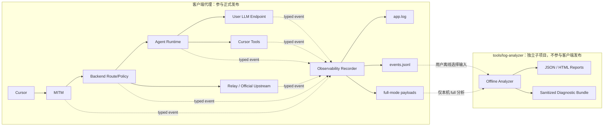

# Cursor BYOK 全链路日志与独立分析方案

## 现状结论

- **基础运行日志始终开启，但只是零散的人类可读文本。** [`internal/logger/logger.go`](internal/logger/logger.go) 固定以 `INFO` 写 stdout 和 `~/.cursor-local-assistant-v2/logs/app.log`，按 10,000 行裁剪；记录了应用/后端/MITM 生命周期、证书、网络代理、部分 handler 和错误，但没有统一 `trace_id`、请求终态、状态码、字节数、耗时或执行目标。标准库 `log.Printf` 只清除了 flags，并未接入同一文件输出，因此不少 forwarder 日志不会进入 `app.log`。
- **配置中的 `log` 不是基础日志开关，而是高敏 Agent debug 开关。** [`internal/backend/server/config/types.go`](internal/backend/server/config/types.go) 默认 `log: false`，[`internal/backend/server/config/manager.go`](internal/backend/server/config/manager.go) 只把它暴露给 `IsObservabilityLogEnabled`。命名与真实语义不一致。
- **本地 Agent 主链路已有较丰富但孤立的原文记录。** [`internal/backend/forwarder/debug_recorder.go`](internal/backend/forwarder/debug_recorder.go) 在 `history/<conversation>/debug/` 写 `bidi.raw.jsonl`、`bidi.decoded.jsonl`、`runtime.jsonl`、`runsse.jsonl`、`provider.jsonl`；[`internal/backend/agent/model/artifacts.go`](internal/backend/agent/model/artifacts.go) 会记录完整 provider 请求体、响应流和调用摘要。它能看到 Bidi 输入、intent、RunSSE 输出、Prompt、工具和模型流，但没有保留期/磁盘上限，写入失败被静默忽略，也未覆盖 MITM、路由和 relay。
- **`context.json` / `state.json` 是业务事实，不是传输日志。** [`internal/backend/forwarder/file_store.go`](internal/backend/forwarder/file_store.go) 保存会话、工具结果、reasoning 和恢复状态，可解释 Agent 语义，但无法还原 HTTP/MITM/relay 全过程，不应继续兼任日志系统。
- **专用隐私审计安全但覆盖窄。** [`internal/audit/audit.go`](internal/audit/audit.go) 默认关闭，具备 TTL、事件上限、`0600` 和元数据-only 约束；目前只覆盖 provider HTTP 和 `Audit: true` 的 17 条固定 relay RPC。它没有贯穿各层的关联 ID，也不是常规运行诊断系统，应继续保持独立职责。
- **本地转发与远端 relay 基本不可追踪。** [`internal/mitm/service.go`](internal/mitm/service.go) 主要记录连接/转发错误；[`internal/backend/server/route.go`](internal/backend/server/route.go) 没有 access/finish middleware；[`cursor-tab-server/main.go`](cursor-tab-server/main.go) 只记录启动、上游失败和响应状态，没有持久化、耗时、流量、关联 ID 或请求/响应形态。
- **配置 UI 没有真正暴露 `log` 选项。** [`frontend/src/views/Config.vue`](frontend/src/views/Config.vue) 只显示日志目录；[`frontend/src/state/appState.js`](frontend/src/state/appState.js) 虽然投影 `configLog`，但没有可见控件。并且 [`frontend/src/services/clientApi.js`](frontend/src/services/clientApi.js) 会把保存配置和模型测试 payload 直接输出到 DevTools console，可能暴露 API Key/custom headers，必须先治理。
- **因此目前不能完整重建 Cursor 通过本系统运行的全过程。** 本地 Agent 路径内容较全，但各层不能关联；relay/official upstream 只有局部元数据；Cursor UI 内部动作、未进入代理的动作不可见；非白名单 TLS 直通只能观察 CONNECT host，不能看到加密正文。方案中的“完整”严格定义为：**完整记录所有经过本系统可控代理、backend、runtime、provider 和可部署 relay 的阶段**，不声称观察 Cursor 进程内部未外显行为。

## 职责拆分

### 客户端代理职责

- 新建深模块 [`internal/observability`](internal/observability)，统一拥有日志等级、事件 envelope、关联上下文、凭据清洗、payload 存储、轮转、磁盘配额和 capture session 关闭语义。调用者只提交领域事件，不各自决定文件格式。
- 客户端只做**低开销、非阻塞、可降级的日志采集**；不读取历史日志、不执行定时分析、不生成 HTML/JSON 报告、不维护对比基线，也不打包分析器。
- 统一事件至少包含 `schema_version`、`timestamp`、`app_session_id`、`trace_id`、`span_id`、`parent_span_id`、`http_request_id`、`cursor_request_id`、`conversation_id`、`model_call_id`、`tool_call_id`、`layer`、`event`、`route`、`execution_target`、`protocol`、`status`、`duration_ms`、请求/响应字节数和可选 `payload_ref`。
- `trace_id` 贯穿 MITM → backend → runtime/provider 或 relay；Bidi/RunSSE 使用 Cursor `request_id` 关联同一业务 trace；远端 relay 使用内部 header 传递关联信息，并在访问 Cursor 官方 upstream 前剥离，避免把内部追踪信息外泄。
- [`internal/audit`](internal/audit) 继续作为临时隐私验证模块，不与 full 日志合并，避免改变既有 canary/TTL 语义。

### 独立分析子项目职责

- 创建独立 Go 子项目 [`tools/log-analyzer`](tools/log-analyzer)，拥有自己的 `go.mod`、CLI 入口、解析/校验、规则、报告、脱敏导出和测试。嵌套 module 用于保证根客户端 module 的构建与发布不会自动包含它。
- 分析器与客户端**只通过版本化日志文件协议耦合**，不导入客户端运行时包、不调用 Wails bridge、不访问运行中代理；通过 schema version 和固定 fixtures 验证兼容性。
- 分析器接受一个或多个只读输入目录，可同时加载本地客户端日志和人工取得的 relay 日志；输入保持不变，报告写入用户显式指定的输出目录。
- 分析器负责 trace 重建、缺失终态、重复/重试、Bidi/RunSSE 断链、provider timeout/TTFT、工具 call/result 配对、路由执行目标、relay 状态、字节/耗时异常和日志丢失检查。
- 分析器负责 `local_runtime`、`official_upstream`、`external_relay` 的离线对比；比较协议事件顺序、状态/终态、工具循环、headers allowlist、错误语义、usage 和阶段耗时，忽略时间戳、随机 ID 和模型文本等非确定值。
- 分析器生成机器可读 JSON、本机 HTML 和脱敏诊断包，不自动上传。诊断包移除 full payload、凭据、原始路径/UUID、完整 URL、Prompt 和源码/diff，只保留事件形态、统计、错误分类和版本信息。

## 日志模式与存储

- `basic`（默认）：保留人类可读 `app.log`，同时写结构化 `events.jsonl`；只记录生命周期、路由决策、目标分类、协议、状态、错误类别、耗时、字节数、阶段和关联 ID，不记录正文或完整 headers。
- `full`：包含 `basic` 的全部信息，并保存经过凭据清洗后的 Cursor protobuf/JSON、Prompt、源码/diff、工具参数与结果、provider 请求体和原始流式响应。`Authorization`、Cookie、API Key、token/secret/credential 字段、自定义敏感 header 和敏感 query 参数在任何模式下都不得落盘。
- 对无法安全解析并清除凭据的未知二进制 body，只保存长度、协议和 `decode_error`，不保留原始字节；因此“全量原文”是业务语义完整，而不是危险的无条件字节抓包。
- 客户端目录只包含采集产物：`logs/app.log`、`logs/traces/<session>/manifest.json`、`events.jsonl`、`payloads/`；客户端不创建 `reports/`，也不保存分析状态。
- 目录权限 `0700`、文件 `0600`；full 模式必须有 UI 警告、保留天数和磁盘上限。达到上限时先清理最旧的已关闭 full session，仍不足则停止 payload 采集并写明确事件，不能拖垮代理主链路。
- 将旧 `log: false/true` 迁移为 `observability.mode: basic/full`，保持旧配置可读；配置热更新时关闭旧 capture session 并开启新 session。

## 客户端配置界面

[`frontend/src/views/Config.vue`](frontend/src/views/Config.vue) 只提供日志采集相关能力：

- 日志等级：`basic` / `full`。
- full 模式的明确隐私和磁盘占用警告。
- 保留天数与最大磁盘空间。
- 当前日志目录、当前模式和采集降级/磁盘告警状态。
- 打开日志目录和清理**已关闭**日志 session。

客户端配置界面不提供分析周期、立即分析、报告查看或诊断包导出；这些能力全部属于独立分析子项目。

## 实施阶段与检查点

### 阶段 1：日志契约与安全基线

1. 更新 [`docs/prd_cursor_byok_工作决策基线.md`](docs/prd_cursor_byok_工作决策基线.md) 和 [`docs/prd_cursor_byok_系统架构与核心业务数据流.md`](docs/prd_cursor_byok_系统架构与核心业务数据流.md)，明确“客户端只采集、独立工具分析”和“本机 full 原文、永不记录凭据、仅分析器可生成脱敏导出”。
2. 在 [`internal/backend/server/config/types.go`](internal/backend/server/config/types.go)、store/manager 和 [`frontend/src/state/appState.js`](frontend/src/state/appState.js) 中引入 `observability.mode/retentionDays/maxDiskMB`，完成旧 `log` 迁移。
3. 实现 [`internal/observability`](internal/observability) 的事件协议、trace/span context、human/JSONL/payload sinks、递归凭据清洗、权限、轮转、配额和 session manifest；修复标准库日志未进入 `app.log`，并移除或脱敏 [`frontend/src/services/clientApi.js`](frontend/src/services/clientApi.js) 的敏感 console 输出。

**检查点：** basic/full 配置可热更新；secret 扫描通过；日志写入失败或磁盘满不会阻断代理请求。

### 阶段 2：客户端与 relay 全链路采集

1. 在 [`internal/mitm/service.go`](internal/mitm/service.go)、[`internal/backend/server/context.go`](internal/backend/server/context.go)、[`internal/backend/server/route.go`](internal/backend/server/route.go)、[`internal/backend/server/response_writer.go`](internal/backend/server/response_writer.go)、forwarder actor/debug recorder 和 model adapters 中接入统一事件。
2. 验证一条 Bidi → provider → tool → RunSSE terminal 链可由同一 trace 重建，同时保持 `context.json/state.json` 业务职责和格式不变。
3. 本地记录 fixed relay/direct upstream 出入站阶段；在 [`cursor-tab-server`](cursor-tab-server) 的独立 module 内写同 schema 日志，加入跨节点关联、流式响应统计和内部 header 剥离。仓库实现不代表线上 `tab.leokun.cn` 已部署，跨节点闭环需部署对应 relay 版本后验收。
4. 在 [`frontend/src/views/Config.vue`](frontend/src/views/Config.vue) 增加 basic/full、保留期、磁盘上限、状态、打开目录和安全清理 UI。

**检查点：** 本地 Agent 与 relay 请求均具备开始、阶段、结束事件；basic 无正文，full 有清洗后的业务原文；客户端没有任何分析任务或报告代码。

### 阶段 3：独立离线分析子项目

1. 创建 [`tools/log-analyzer`](tools/log-analyzer) 独立 module，定义 CLI：输入一个或多个日志目录、可选对比基线和显式输出目录。
2. 实现 schema 校验、trace 重建、完整性/性能/错误规则、跨本地与 relay 日志关联，以及 local/official/relay 对比。
3. 实现 JSON/HTML 报告和脱敏诊断包；对未知 schema 给出明确错误或兼容降级，不修改原始日志。
4. 明确更新 [`scripts/build-release.sh`](scripts/build-release.sh)、[`Taskfile.yml`](Taskfile.yml) 及发布校验：客户端 release 不构建、不复制、不归档 `tools/log-analyzer`，分析器仅供仓库内独立运行。

**检查点：** 在不启动客户端、不连接 Wails、不修改输入日志的条件下完成分析；客户端发布包扫描确认不包含分析器可执行文件、源码、模板或依赖。

### 阶段 4：回归与真实场景基线

- 客户端覆盖配置迁移、secret redaction、unknown binary 降级、权限/配额、并发流式写入、崩溃 session、route correlation、Agent 工具闭环和 relay header 剥离。
- 分析器覆盖 schema fixtures、多输入合并、断链识别、官方/relay 对比、HTML/JSON 输出、脱敏导出和只读输入。
- 按 Ask/Agent/Plan/工具调用/取消/provider 错误/Tab/FileSync/Git 场景采集可重复基线；不得为了获取基线加入 local→official 隐式 fallback。

## 验收标准

- basic 模式下可从结构化事件确定每个经过 backend 的请求命中了哪个 route、选择了哪个 execution target、何时结束，以及状态、耗时、字节数和错误类别；日志无正文与凭据。
- full 模式下，一条本地 Agent 工具循环可按 trace 重建 Cursor 输入、解码 intent、Prompt/provider 请求、provider 原始流、工具下发/回灌和 RunSSE 终态；所有已知凭据字段均被不可逆移除。
- fixed relay/direct upstream 在本地具备完整阶段；部署新版 relay 后可跨节点关联至 Cursor 官方 upstream，内部 trace header 不会继续外发。
- 客户端进程不读取历史日志、不执行分析、不生成报告；客户端发布包完全不包含 `tools/log-analyzer`。
- 独立分析器可离线消费闭合或崩溃遗留 session，生成 JSON/HTML 报告及脱敏包；导出包不存在 API Key、Authorization、Cookie、Prompt、源码/diff、完整路径、完整 URL 或 full payload。
- full 模式关闭后不再产生 payload；旧 `log` 配置迁移不影响 basic 默认可用性；磁盘策略不会删除活跃 session 或业务 history。