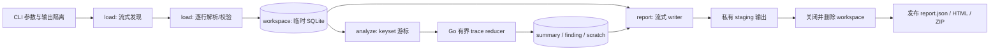

# 分析器临时 SQLite 内存优化

## 0. 计划状态与实施门禁

- **delivery_status**：`verified`
- **Design Readiness**：`approved`
- **Design Gate 结果**：`DESIGN-LOG-ANALYZER-SQLITE-001` 已写入 `docs/prd_cursor_byok_系统架构与核心业务数据流.md` §14.3，证据包含当前 CLI semantic baseline、SQLite 驱动离线跨平台构建、体积和许可证链。
- **执行结果**：Phase 1–5 主链路已完成；CLI 已改为临时 SQLite workspace → 流式导入 → 有界 reducer → 流式报告 staging/publish；旧 `contract.Dataset.Events` / `load.Dataset` 全量生产链路已删除。
- **独立评审说明**：用户要求“机型/模型评审”后，已完成评审并修复 4 个高置信问题：单 trace 高基数状态回流、baseline comparison 全量驻留、publish 中途失败回滚、diagnostic warning 绝对路径泄漏。

## 1. 完整功能链路状态

用户目标：对一个或多个日志输入及可选 baseline 执行离线分析，在不把事件总量常驻内存的前提下，得到与当前 CLI 契约兼容的 JSON、HTML 和脱敏诊断 ZIP。

| 链路环节 | 当前输入 → 输出 | 当前状态 | 目标状态与阻断 |
|---|---|---|---|
| CLI 参数与隔离校验 | `-input/-baseline/-out/-allow-unknown-schema` → 合法路径 | 已完成 | 参数和错误边界保持兼容；不得新增 SQLite 公开参数 |
| 输入发现与解析 | 目录/JSONL/manifest → 临时 SQLite `events`/metadata | 已完成 | 路径发现、schema 校验和事件导入均流式；无旧全量 Dataset 生产入口 |
| 全局排序与 trace 重建 | SQLite keyset 游标 → 当前 trace 状态 | 已完成 | SQLite 确定性索引 + 有界 reducer；高基数状态溢写 scratch |
| baseline 与派生结果 | current/baseline workspace → summaries/findings/comparisons | 已完成 | 派生结果回写 SQLite；baseline comparison 由 SQLite join 生成 |
| 报告输出 | workspace 游标 → JSON/HTML/ZIP staging | 已完成 | 从游标流式生成到 staging，成功后发布；无完整 Dataset/Report 聚合 |
| 清理与安全 | 输入只读、输出 `0600` | 已完成 | OS 私有临时 workspace，正常/失败均清理且不进入报告/归档 |
| 构建与发布隔离 | 独立 module，客户端归档隔离任务 | 已验证 | 新依赖仍仅在分析器 module，`CGO_ENABLED=0` 跨平台构建通过 |

**整链状态**：`verified`。当前分析器已完成 SQLite 临时 workspace 主链路替换；内存不再随事件总量通过 Go `[]Event` / Report 聚合线性增长，单 trace 高基数 scratch 和报告 labels 已改为分页/嵌套流式边界。

## 2. 路线图总览

1. **Phase 0 — Design Gate**：固化实施级 Design、依赖证据和兼容基线，解除实现阻塞。
2. **Phase 1 — 私有临时 workspace**：建立纯 Go SQLite 生命周期、schema、索引和安全边界。
3. **Phase 2 — 流式发现与导入**：删除全量加载入口，以批量事务写入 current/baseline。
4. **Phase 3 — 有界分析状态机**：按确定性顺序处理 trace，将高基数状态溢写 SQLite。
5. **Phase 4 — 流式报告与 CLI 接线**：不构造完整 Dataset/Report，生成并原子发布三类报告。
6. **Phase 5 — 验证与收口**：完成语义兼容、故障注入、内存规模、跨平台和发布隔离证据。

## 3. 完成状态与保留边界

当前阶段已从 Phase 0 推进到 Phase 5 收口：Design Gate 已批准，workspace、ingest、analyze、report、CLI 编排和验证证据均已落地。

保留边界：本计划只覆盖 `tools/log-analyzer` 的每次分析临时 SQLite workspace；不扩大到客户端、relay、日志采集协议、发布归档内容或长期缓存。后续若要调整采集 schema、客户端内分析或发布流程，需要另起 Design/Plan。

## 4. 范围、非目标与不可变约束

### 4.1 范围

- 功能代码仅修改独立 module `tools/log-analyzer`。
- 治理文档允许修改本计划、`task/todo.md` 和系统 Design 的离线分析章节。
- 重构输入发现、事件导入、分析 reducer、报告 writer 和 CLI 编排。
- 新增分析器 module 自有的 `go.sum`、SQLite workspace 包、测试 fixture/生成器和必要测试。

### 4.2 非目标

- 不修改客户端、relay、Wails、前端、日志 recorder、事件采集协议和 schema v1 生产端。
- 不将 SQLite 变成持久数据库、长期缓存、增量索引或跨运行复用状态。
- 不把分析规则改写成复杂 SQL；SQLite 负责有界存储、排序、索引和机械聚合，规则语义继续由 Go 表达。
- 不保留旧 `load.Dataset → []Event` 兼容路径、双实现、feature flag 或隐藏的全量回退。
- 不新增自动上传、后台分析、客户端内分析或诊断包自动生成。
- 不修改根 `go.mod/go.sum`，不把分析器依赖接入客户端构建图。

### 4.3 对外兼容边界

- CLI 参数、必填规则和成功摘要保持兼容：`-input`、`-baseline`、`-out`、`-allow-unknown-schema`。
- `report.json` 的字段名、类型、`omitempty` 语义及 current-only/baseline 行为保持语义兼容；`generated_at` 仍为单次运行统一 UTC 时间。
- HTML 保持现有信息区块、转义边界和数据语义；允许内部模板拆分，不以逐字节一致为目标。
- ZIP 仍只包含 `report.json` 和 `events.jsonl`；ID 伪名化、route/path/URL 清洗、fields allowlist、warning 清洗和无 payload 导出边界不变。
- 输入仍只读；输出目录不得位于任一输入目录内。
- current 或 baseline 没有事件、JSON/schema/必填字段错误时，整次运行失败，不发布本次正式报告。

## 5. 现实校准与证据分级

### 5.1 已核实事实（`evidence_status=verified`）

- `internal/contract/contract.go` 的 `Dataset.Events []Event` 是当前全量驻留入口。
- `internal/load/load.go` 为每个 `events.jsonl` 构造切片，再汇总并全局稳定排序；输入文件列表和 warning 也保存在内存。
- `internal/analyze/analyze.go` 再构造 `map[string][]Event`、完整 findings/targets/traces/comparison 切片。
- `internal/report/report.go` 对完整 `Report` 执行 `json.MarshalIndent`，HTML 模板遍历完整切片，ZIP 遍历 `dataset.Events`。
- `cmd/log-analyzer/main.go` 同时持有 current 与可选 baseline Dataset，之后才分析和输出。
- `tools/log-analyzer/go.mod` 当前无第三方依赖；根 module 已使用 `modernc.org/sqlite v1.50.1`，但 module 隔离意味着分析器仍须独立声明并验证依赖。
- 系统 Design `§14.3` 已规定：客户端与分析器只共享版本化文件协议；分析器只读输入、仅由用户主动输出报告、不得进入客户端进程和发布包。
- `Taskfile.yml` 已有 `release:verify:analyzer-isolation`，检查客户端发布归档中的分析器路径和 marker。

### 5.2 基于证据的推断（`evidence_status=inferred`）

- 峰值内存由 current/baseline 事件切片、trace 分组和报告派生切片叠加，事件量和 trace/finding 数量都会放大内存。
- 仅将事件写入 SQLite 但继续返回完整 `analyze.Report`，不能消除高 trace/finding 数据集的线性内存增长。
- 单连接模式下，长时间保持读游标同时回写派生表会阻塞同一连接；因此 reducer 必须采用 keyset 分块，关闭当前读游标后再批量回写。

### 5.3 Phase 0 必须关闭的证据缺口（`research-required`）

1. `modernc.org/sqlite` 选定版本在分析器目标组合上的 `CGO_ENABLED=0` 构建、许可证链和二进制体积增量。
2. 当前输出的完整语义 golden：unknown schema warning 次序、同 timestamp/sequence 并列次序、orphan trace key、finding 次序、JSON `omitempty`、HTML 转义和 ZIP 脱敏。
3. 受控内存预算及 SQLite `cache_size/mmap_size/temp_store` 参数；阈值必须由对照测量确认，不能仅凭计划中的建议值直接冻结。
4. Windows 下目录/文件权限与 staging rename 行为；Unix `0700/0600` 之外必须记录 OS ACL/语义差异。

任一缺口未关闭时，`Design Readiness` 继续为 `not-ready`；允许只读取证，不允许进入功能实现。

## 6. 目标架构与职责



### 6.1 模块职责

- `internal/contract`：保留外部 schema v1 DTO 和公开报告 DTO 的字段语义；删除承载全量运行状态的 `Dataset.Events`。
- `internal/workspace`：拥有临时目录、数据库、DDL、PRAGMA、事务、keyset 查询、派生表和幂等清理；不拥有业务 finding 规则。
- `internal/load`：拥有输入参数顺序、目录发现、文件去重、逐行 decode、schema/必填校验和批次边界；通过窄写入接口写 workspace。
- `internal/analyze`：拥有 trace key、事件配对、target 统计、finding、baseline comparison 和确定性规则；只保留有上限的 Go 状态。
- `internal/report`：拥有 JSON/HTML/ZIP 外部格式、转义、伪名化、allowlist、staging 和发布；只从只读查询接口取数。
- `cmd/log-analyzer`：只编排 `validate → workspace → ingest → analyze → stage reports → cleanup workspace → publish → stdout`，不承载数据库或规则细节。

### 6.2 禁止的职责穿透

- `load` 不返回事件切片；`report` 不接收 `contract.Dataset` 或完整 `analyze.Report`。
- `workspace` 不拼 finding message，不决定 terminal/provider/tool-call 规则。
- `report` 不直接执行任意 SQL字符串；查询形状由 workspace 的只读端口提供。
- 测试不得引入“仅测试可用”的全量事件 adapter 使旧模型回流；行为测试使用临时 workspace 和小型 fixture。

## 7. Design 待固化的数据与执行合同

本节是 Plan 的实施约束摘要，不替代 `DESIGN-LOG-ANALYZER-SQLITE-001`；DDL、字段级合同和状态机只在 Design 中维护单一真源。

### 7.1 workspace 生命周期与安全

- 使用 `os.MkdirTemp(os.TempDir(), "cursor-log-analyzer-*")` 创建每次运行独享目录；Unix 目录 `0700`，数据库预创建为 `0600`。Windows 记录继承 ACL 与实际权限验证结果。
- 临时数据库不得位于输入目录、`-out` 目录、诊断 ZIP或客户端归档。
- 预创建数据库后再 `sql.Open`，`SetMaxOpenConns(1)`；初始化后逐项读取并断言关键 PRAGMA。
- 候选 PRAGMA：`journal_mode=DELETE`、`synchronous=NORMAL`、`foreign_keys=ON`、`temp_store=FILE`、`mmap_size=0`、负值 `cache_size`。确切 cache 预算由 Phase 0 测量冻结。
- 正常和可恢复失败路径按 `rows/stmt/tx → db → sidecar → db file → temp dir` 顺序幂等清理；清理失败必须成为 CLI 错误，不静默成功。
- `SIGKILL` 无法执行 defer：只允许遗留带专用前缀的 OS 临时目录，由 OS 临时目录策略回收；不得在下次启动时扫描或删除其他进程的 workspace。

### 7.2 最小 schema 与身份键

Design 至少定义以下逻辑表；实现只建立实际查询使用的列和索引：

- `datasets`：区分 `current/baseline`，记录导入和分析状态。
- `input_arguments`：保留 CLI 参数绝对路径及 ordinal，供外部报告兼容。
- `input_files`：记录发现文件的 canonical path、类型、首个来源 ordinal；`UNIQUE(dataset_id, canonical_path)` 完成重叠输入去重。
- `manifests`、`warnings`：仅保存当前规则和报告需要的字段；warning 使用 ordinal 保序。
- `events`：保存结构化事件列、原 timestamp 文本、排序字段、`trace_key`、`safe_fields_json`；禁止保存完整原始 JSON、payload、`payload_ref`、未 allowlist 的 fields 或正文。
- `trace_summaries`、`trace_layers`、`trace_targets`、`target_summaries`、`findings`、`comparisons`：保存可流式报告的派生结果。
- `trace_pair_state`、`trace_tool_state`：只作为超大单 trace 的可清理 scratch 状态，trace 完成后删除。

关键键规则：

- trace 身份键保持现有语义：非空 `trace_id`；否则为 `orphan:<app_session_id>:<sequence>`。
- 时间排序拆为 `timestamp_seconds + timestamp_nanoseconds`，同时保存 canonical timestamp 文本，避免 `UnixNano` 范围溢出并保持诊断事件时间格式。
- `sequence` 是 `uint64`；不得直接压入 SQLite signed INTEGER。Design 应使用固定宽度十进制排序键或等价无损表示，确保 `0..MaxUint64` 排序和导出不变。
- `ingest_order` 是同 dataset 内严格递增的最终并列裁决键。
- finding 唯一键保持当前去重语义：`severity + code + message + trace_key`；另存首次事件顺序，保证输出稳定。

### 7.3 确定性顺序

- 输入参数按 CLI 出现顺序；每个目录内候选文件按路径排序；同一 canonical file 只处理第一次出现的位置。
- ZIP 事件及全局事件读取：`timestamp_seconds, timestamp_nanoseconds, sequence_key, ingest_order`。
- trace reducer：`trace_key, timestamp_seconds, timestamp_nanoseconds, sequence_key, ingest_order`。
- targets/comparison：`target ASC`；traces：`trace_key ASC`；warning：`ordinal ASC`。
- findings：`severity_rank DESC, first_ingest_order ASC, code ASC, message ASC, trace_key ASC`。若与当前 characterization 不一致，Phase 0 必须明确记录为“消除历史 map 非确定性”的兼容决策并由用户审核。

### 7.4 流式导入与错误语义

- 输入发现把候选路径直接登记到 workspace，再按确定性查询顺序处理，不保留全量文件列表。
- 事件逐行 decode 到单个 DTO，完成 schema/`layer/event` 现有校验后写 prepared statement；unknown schema 在允许模式下逐条记录 warning。
- 批次按“最多事件数 + 最大累计字节数”双阈值提交，避免 5,000 条超大事件形成内存尖峰；建议值需在 Phase 0 冻结。
- 增加单事件行和 manifest 文件上限；候选值分别为 8 MiB/1 MiB，最终值须由现有生产端约束与 fixture 证据确认。
- malformed JSON、unsupported schema、缺必填字段、超限、读错误或 DB 错误立即停止；之前已提交的临时批次不回滚也不可见，因为整库随后删除且不发布报告。
- current 与 baseline 使用不同 dataset key；任一 dataset 无事件均保持当前失败语义。

### 7.5 有界 Go reducer

- 采用 keyset 分块，不使用 `OFFSET`；每个读块关闭 rows 后才批量写派生结果，兼容单连接。
- reducer 在 Go 中解释事件语义；trace 标量状态有固定大小，layer/target distinct 值写规范化派生表。
- started/finished、provider、RunSSE 和 tool-call 配对 map 设置明确 entry 上限；达到阈值即将增量 UPSERT 到 scratch 表并清空 Go map。
- trace 切换时读取 scratch + 当前有界状态，生成 summary/finding 后删除该 trace scratch；即使单个 trace 含百万个唯一 tool ID，也不得让 Go heap随其线性增长。
- target 聚合使用同样的有界批量 UPSERT；baseline 至少生成 target summary，current 生成完整 trace/finding/target summary。
- 规则阈值保持当前语义，包括 `slow_stage >= 30_000ms`、terminal/provider/RunSSE/tool-call 配对和 current-only finding。
- 分析中断时不支持 resume；最终安全状态是删除整个 workspace，由用户以未改变的输入重新运行。

### 7.6 流式报告与发布

- 不构造完整 `analyze.Report`。先查询 scalar counts，再按固定字段顺序手工流式写 JSON 数组；每个元素仍使用 `encoding/json` 编码，禁止字符串拼接绕过转义。
- HTML 拆成页头、区块和单行 `html/template`，逐行渲染；finding empty state 由 count 查询决定。
- ZIP 的 `report.json` 从派生表流式生成；`events.jsonl` 按全局事件顺序逐行重建脱敏 Event。伪名化是无状态 hash，不维护全局 ID map。
- `safe_fields_json` 在导入边界按现有 allowlist 生成；报告边界仍执行 route、warning、finding message 和 ID 清洗，形成纵深防御。
- 三个正式文件先写到输出目录同一文件系统上的私有 staging；全部 close/flush 成功并完成 workspace 清理后再发布。
- 发布过程对现有三个受管文件做备份与失败回滚，避免混合新旧运行产物；临时/备份文件在成功或失败后清理。
- 正式输出目录 `0700`、文件 `0600`；任一 writer、flush、close、workspace cleanup 或 publish 失败时 CLI 返回非零且不打印成功摘要。

## 8. 需求—设计—阶段—证据追踪矩阵

| ID | 目标/约束 | Design 锚点 | 承接阶段 | 验收证据 | 当前缺口 |
|---|---|---|---|---|---|
| MEM-01 | 内存不随事件总量或单 trace 高基数状态线性增长 | `DESIGN-...` 有界状态/容量 | P2-P5 | 10 倍数据规模、同 trace 唯一 tool ID、baseline 压测 | Design 与测量阈值未冻结 |
| COMPAT-01 | CLI 参数、错误边界和成功摘要兼容 | 接口/兼容合同 | P0/P4/P5 | CLI characterization + smoke | golden 未建立 |
| COMPAT-02 | JSON/HTML/ZIP 语义与脱敏兼容 | 报告/安全合同 | P0/P4/P5 | semantic golden、ZIP forbidden markers | golden 未建立 |
| ORDER-01 | 多输入、同时间/sequence、orphan 与 finding 顺序确定 | 数据键/算法合同 | P0/P2/P3 | permutation 与重复运行测试 | finding 历史顺序非确定 |
| SAFE-01 | workspace 位于 OS 临时目录且权限/清理可靠 | 生命周期/失败恢复 | P1/P4/P5 | 权限、错误注入、无 DB 入 ZIP/输出 | Windows 证据未核实 |
| DATA-01 | current/baseline 隔离，输入只读，不保存 payload | 数据/安全合同 | P1-P3 | DB 断言、输入 hash 前后对比 | DDL 未固化 |
| RULE-01 | trace、target、finding、comparison 语义不变 | reducer/状态机合同 | P3/P5 | schema-v1、missing terminal、comparison 回归 | 新端口未实现 |
| BUILD-01 | 纯 Go、跨平台、独立 module | 依赖/发布合同 | P0/P5 | `CGO_ENABLED=0` build matrix | 驱动证据未完成 |
| RELEASE-01 | 分析器与 SQLite 依赖不进入客户端归档 | 系统 Design §14.3 | P5 | `task release:verify:analyzer-isolation` | 需变更后复验 |
| ROLLBACK-01 | 任一阶段失败可回退且不迁移用户数据 | 回滚合同 | P0-P5 | staging 回滚、workspace 删除、git diff | Design 未批准 |

## 9. 分阶段实施计划

### Phase 0 — 持久 Design 与兼容基线

**目标**：关闭实施承重缺口，使 `Design Readiness=approved`，不修改功能代码。

**范围**：

- 在系统 Design 增加 `DESIGN-LOG-ANALYZER-SQLITE-001`，完整定义本计划 §7 合同和 Design Gate 记录。
- 读取当前代码和测试，增加或规划 characterization fixture，冻结 current/baseline、ordering、warning、report 和隐私行为。
- 核实驱动版本、许可证、`CGO_ENABLED=0` 目标构建和当前/候选二进制大小。

**可执行切片**：

1. P0-S1（S，只读取证）：生成当前 CLI 规范化 golden，记录同键并列、orphan 和 warning 行为。
2. P0-S2（S，只读取证）：在临时 module 验证候选 SQLite 版本的许可证、macOS/Linux/Windows amd64 纯 Go 构建和体积。
3. P0-S3（M，文档）：完成实施级 Design、正向/失败/回滚模拟和用户审核。

**验收标准**：Design Gate 八项客观门禁通过；所有承重 `research-required` 关闭；阈值和兼容差异不含 TBD。

**测试/证据**：保存命令、版本、构建矩阵、二进制大小、golden hash/语义 diff 和 Design Gate verdict。

**文档更新**：系统 Design、本计划状态与追踪矩阵、`task/todo.md`。

**回退策略**：仅回退文档和 characterization 产物；不涉及功能代码或用户数据。若驱动验证失败，停在 Phase 0 重新选型，不进入 workspace 实现。

**退出门禁**：用户审核实施级决策，`Design Readiness=approved`；否则所有后续 todo 保持 `pending/blocked`。

### Phase 1 — 私有临时 workspace

**进入门禁**：Phase 0 退出门禁通过。

**目标**：建立可独立测试的临时 SQLite 存储与生命周期，不接 CLI 主链。

**范围**：`internal/workspace`、分析器 `go.mod/go.sum`、DDL/PRAGMA、查询端口、权限和清理测试。

**可执行切片**：

1. P1-S1（S）：先写权限、PRAGMA、schema 与幂等清理失败测试，再实现 `Open/CloseAndRemove`。
2. P1-S2（M）：先写 current/baseline、uint64 sequence、timestamp、唯一键和索引测试，再实现最小 repository 端口。

**验收标准**：workspace 仅位于 OS 临时目录；schema/索引符合 Design；数据库和 sidecar 不进入 output；正常/错误清理可重复调用。

**测试方式**：workspace 包单测、race；Unix mode 与 Windows 权限语义分平台断言；注入 close/remove 错误验证错误合并。

**文档更新**：Plan 记录实际驱动版本、schema migration version 和与 Design 的偏差；偏差影响合同则退回 Phase 0 审核。

**回退策略**：删除新增 workspace 包和独立 module 依赖即可；尚未接主链，不影响当前 CLI。

**退出门禁**：workspace API 无全量 event 返回值，相关测试通过，代码 review 无安全/生命周期阻塞项。

### Phase 2 — 流式发现与批量导入

**进入门禁**：Phase 1 通过；行上限和 batch 双阈值已在 Design 冻结。

**目标**：从真实 CLI 输入形态导入 SQLite，删除 `contract.Dataset.Events` 与 `load.Dataset` 全量入口。

**范围**：`internal/load`、`internal/contract`、导入端口、manifest/warning/input metadata。

**可执行切片**：

1. P2-S1（S）：先写重叠目录/重复文件/符号链接/参数顺序测试，再实现流式发现登记。
2. P2-S2（M）：先写 JSON/schema/必填/超限/批次中途失败测试，再实现逐行 decode 和双阈值事务。
3. P2-S3（S）：迁移 schema-v1 fixture 测试到 workspace 查询，删除旧 API 和直接构造全量 Dataset 的测试依赖。

**验收标准**：导入事件数、metadata、warning 次序与 current golden 一致；current/baseline 隔离；输入文件 hash 前后不变；任一错误不产生正式输出。

**测试方式**：load/workspace 集成测试、`go test -race`；在首批提交后注入 malformed/DB write error，断言 workspace 可清理。

**文档更新**：追踪矩阵更新 DATA-01/ORDER-01 证据，记录任何已审核兼容差异。

**回退策略**：Phase 2 未接 CLI 前可整体回退到 Phase 1；禁止保留旧全量 adapter 作为长期 fallback。

**退出门禁**：仓库搜索确认不存在生产路径 `Dataset.Events`/旧 `load.Dataset`；真实 fixture 能导入并通过 workspace 计数检查。

### Phase 3 — 有界分析状态机

**进入门禁**：Phase 2 通过；排序键与 finding 顺序合同已批准。

**目标**：用 keyset 游标和有界 Go 状态重现全部 current/baseline 分析语义。

**范围**：`internal/analyze`、派生/scratch 表端口、trace/target/finding/comparison 测试。

**可执行切片**：

1. P3-S1（M）：先写跨 chunk trace、同键并列和 orphan 测试，实现 trace keyset reducer 与 summary。
2. P3-S2（M）：先写高基数 pair/tool 状态测试，实现 bounded map → scratch UPSERT → trace finalize。
3. P3-S3（S）：实现 target summary 和 baseline comparison，验证只报告 current findings/traces。

**验收标准**：schema-v1、missing terminal、session degradation、decode/request/slow/tool findings、target 与 comparison 均与 semantic golden 一致；重复运行顺序稳定。

**测试方式**：规则单元测试 + workspace 集成测试 + race；以超过 map 上限的单 trace 证明 scratch flush 后结果不变。

**文档更新**：记录 reducer 状态上限、实际索引查询计划和兼容差异；业务阈值变化必须退回 Design 决策。

**回退策略**：回退 Phase 3 派生实现；workspace/ingest 可保留为未接线底座，但 delivery_status 只能是 `implemented-not-wired`，不得宣称优化完成。

**退出门禁**：分析 API 不返回完整 findings/traces 切片；规则回归、确定性和高基数测试通过。

### Phase 4 — 流式报告与 CLI 完整接线

**进入门禁**：Phase 3 通过；报告发布/回滚合同已批准。

**目标**：从真实 CLI 入口贯通到三类正式输出，全链不恢复全量 Go 数据模型。

**范围**：`internal/report`、`cmd/log-analyzer/main.go`、staging/publish、stdout/error 兼容。

**可执行切片**：

1. P4-S1（M）：先写 JSON semantic golden，实现 scalar + array 游标流式 writer。
2. P4-S2（M）：先写 HTML 转义/empty 和 ZIP forbidden markers 测试，实现 HTML/ZIP 流式 writer。
3. P4-S3（M）：先写 output writer/publish/cleanup 故障测试，接入 CLI 编排并删除旧 `WriteAll(Report, Dataset)`。

**验收标准**：CLI smoke 的 event/trace/finding 计数与现状一致；三类输出语义兼容、权限正确、无临时 DB；任何阶段失败不发布混合产物且不打印成功摘要。

**测试方式**：main package CLI 集成、报告 golden、ZIP 解包校验、publish 回滚故障注入、race。

**文档更新**：更新计划链路状态和运行证据；无需修改客户端文档，除非发现系统 Design 事实不一致。

**回退策略**：整体回退 Phase 4 接线恢复旧 CLI；不得用 runtime flag 同时保留两条路径。输出没有数据迁移，失败后可从原输入重跑。

**退出门禁**：从参数到输出的真实调用链通过；代码搜索确认生产路径不存在完整 Dataset/Report 聚合；review 无兼容/隐私阻塞项。

### Phase 5 — 规模、故障、跨平台与发布隔离验收

**进入门禁**：Phase 4 完整链路通过。

**目标**：用同对象、同环境层级的证据证明内存优化、兼容性和发布隔离，而非仅证明局部函数存在。

**范围**：大数据生成器、内存测量、故障注入、构建矩阵、license/size 复核、客户端归档隔离。

**可执行切片**：

1. P5-S1（M）：流式生成 100k/1M 事件 current 数据集、单 trace 百万高基数数据集及可选 500k baseline，运行内存对照。
2. P5-S2（S）：执行 malformed/oversized/DB write/output flush/publish/cleanup/cancel 故障矩阵。
3. P5-S3（S）：执行测试、race、vet、CLI smoke、`CGO_ENABLED=0` 构建矩阵和客户端发布隔离。

**验收标准**：

- 在 Phase 0 冻结的 `GOMEMLIMIT` 下完成 1M current + 500k baseline，并生成全部报告。
- 100k → 1M 事件时，稳定阶段 Go heap/RSS 增量不超过 Design 冻结预算；单 trace 百万唯一 tool ID 不产生线性 Go heap 增长。
- current/baseline 的 event/trace/finding/target/comparison 与等价小样本或参考 golden 一致；ZIP events 行数等于 current event count。
- 所有失败点返回非零、清理 workspace/staging、保留输入和上一份有效正式报告。
- macOS arm64/amd64、Linux amd64、Windows amd64 的 `CGO_ENABLED=0` analyzer build 通过；记录二进制大小增量和许可证清单。
- 客户端发布归档继续不含 `tools/log-analyzer`、`cursor-log-analyzer`、分析器二进制或 SQLite 新依赖 marker。

**测试/命令**：

```bash
cd tools/log-analyzer && go test ./...
cd tools/log-analyzer && go test -race ./...
cd tools/log-analyzer && go vet ./...
cd tools/log-analyzer && CGO_ENABLED=0 GOOS=darwin GOARCH=arm64 go build ./cmd/log-analyzer
cd tools/log-analyzer && CGO_ENABLED=0 GOOS=darwin GOARCH=amd64 go build ./cmd/log-analyzer
cd tools/log-analyzer && CGO_ENABLED=0 GOOS=linux GOARCH=amd64 go build ./cmd/log-analyzer
cd tools/log-analyzer && CGO_ENABLED=0 GOOS=windows GOARCH=amd64 go build ./cmd/log-analyzer
task release:verify:analyzer-isolation
git diff --check
```

注：build 输出必须写入测试临时目录或完成后清理，不把二进制留在 module；发布隔离任务需要已有客户端归档，若当前环境没有归档，只能记录 `env-gap`，不得声称该项通过。

**文档更新**：计划写入每项证据、测量环境和最终状态；`task/todo.md` 收口活动任务。若设计事实变化，同步系统 Design。

**回退策略**：任何硬门禁失败均回退到最近绿色阶段；内存或兼容门禁失败时整体回退 CLI 新链路，不发布部分优化版本。

**退出门禁**：追踪矩阵无阻塞缺口，Design/Plan/代码/测试一致，delivery_status 才可更新为 `accepted`；缺少跨平台或发布环境证据时最高只能是 `verified-partial`。

## 10. 故障矩阵与最终安全状态

| 失败点 | 重试 | 临时数据 | 正式输出 | 最终状态 |
|---|---|---|---|---|
| 输入不存在/不支持 | 不重试 | workspace 未建或删除 | 不变 | 返回路径错误 |
| JSON/schema/必填/超限 | 不重试 | 已提交批次随整库删除 | 不变 | 输入不改，可修复后重跑 |
| SQLite open/DDL/PRAGMA | 不重试 | 删除目录/sidecar | 不变 | 返回底层分类错误 |
| batch commit/磁盘写失败 | 不自动重试 | 整库删除 | 不变 | 防止重复/部分分析 |
| reducer/query/cancel | 不自动重试 | 派生/scratch 随整库删除 | 不变 | 可用原输入重跑 |
| JSON/HTML/ZIP write/flush/close | 不自动重试 | workspace 和 staging 删除 | 上一份有效输出保留 | 返回报告错误 |
| workspace close/remove | 不重试 | 尽力清理并报告残留路径类别，不输出敏感内容 | 不发布 staging | CLI 非零 |
| publish rename/权限 | 回滚本次发布，不循环重试 | staging/backup 尽力清理 | 恢复上一份受管文件 | CLI 非零 |
| 进程 `SIGKILL` | 不适用 | OS 临时目录可能遗留 | staging 不视为正式输出 | 由 OS 临时策略回收 |

## 11. 风险、回退与人工 Review 点

1. **驱动体积和构建风险**：纯 Go SQLite 会扩大分析器二进制。Phase 0 先量化；分析器不随客户端发布，但仍须记录分发成本。
2. **伪流式风险**：SQLite page cache、单 trace map、完整 Report、HTML 模板或 ZIP safe copy 都可能重新形成线性内存。通过 cache 上限、scratch spill、游标 writer 和代码搜索双重门禁防止。
3. **排序兼容风险**：历史 finding 同 severity 顺序受 map 遍历影响。确定性修正必须在 Design 中显式审核，不能静默当作纯重构。
4. **隐私风险**：临时库含结构化关联 ID 和路径 metadata，按敏感临时数据处理；只在私有 OS temp 存活，不进报告/ZIP。诊断包仍在输出边界二次清洗。
5. **输出发布风险**：跨平台 rename/替换语义不同。Phase 0/4 必须冻结并测试备份—发布—回滚协议。
6. **实现级人工 Review 点**：schema/键、line/batch/cache/memory 阈值、finding 顺序差异、Windows 权限、许可证、正式输出发布语义。
7. **整体回退**：没有持久迁移和用户状态；回退分析器 module 代码即可恢复旧实现。不得修改或删除用户输入，不需要客户端回滚。

## 12. 完成定义

只有同时满足以下条件，才能称为“分析器 SQLite 内存优化完成”：

- 持久 Design Gate 为 `approved`，且实现没有未经审核的合同偏差。
- CLI 真实入口已接入 SQLite 流式链，旧全量生产 API 已删除。
- current/baseline、全部规则、三类报告和脱敏边界通过 semantic golden。
- 大数据与单 trace 高基数场景满足冻结的内存预算。
- 正常、失败、取消和发布回滚路径均有可复现证据。
- `go test`、race、vet、纯 Go 跨平台构建及可执行的发布隔离检查通过。
- 临时 DB、sidecar、staging、备份和测试二进制未遗留，客户端归档不含分析器或 SQLite 新依赖。

## 13. 实施完成记录（2026-03-14）

- 主链路：`cmd/log-analyzer` 已编排 `workspace.Open`、`load.IntoWorkspace(current/baseline)`、`analyze.Workspace`、`report.StageWorkspace`、workspace cleanup 与 publish；SQLite workspace 只存在于每次分析的临时目录。
- 旧内存模型：旧 `contract.Dataset.Events`、`load.Dataset`、`report.WriteAll(Report, Dataset)` 和 `readEvents` 全量生产路径已删除；代码搜索未发现旧生产入口回流。
- 评审修复：
  - `finalizeTrace` 不再一次性读取单 trace 全部 pair/tool scratch，改为 `ListTracePairStates` / `ListTraceToolStates` 分页处理。
  - `report.json` 与 HTML trace labels 不再依赖 `group_concat` + slice 回填，改为按 trace 嵌套流式输出。
  - baseline comparison 不再在 Go 中构造 baseline map/current slice，改为 SQLite join 生成 comparisons。
  - `StagedReport.Publish` 回滚时会删除已经发布但没有 backup 的新 final，避免半份正式报告。
  - diagnostic bundle 的 safe warning 清洗扩大到通用绝对路径，覆盖 `/tmp`、`/var`、`/private/tmp` 等输入路径。
- 新增/补充验证：高基数单 trace 分页 scratch 回归、publish 故障注入、unknown schema diagnostic path 脱敏回归。
- 命令证据：
  - `GOPROXY=off GOSUMDB=off go test ./...`
  - `GOPROXY=off GOSUMDB=off go test -race ./...`
  - `GOPROXY=off GOSUMDB=off go vet ./...`
  - `GOPROXY=off GOSUMDB=off go run ./cmd/log-analyzer -input testdata/schema-v1 -out /tmp/cursor-byok-sqlite-cli-smoke-review`
  - `GOMEMLIMIT=96MiB GOPROXY=off GOSUMDB=off go run ./cmd/log-analyzer -input /tmp/cursor-byok-sqlite-large-review-final -out /tmp/cursor-byok-sqlite-large-out-review-final`（20,000 events / 1,000 traces）
  - `CGO_ENABLED=0 GOPROXY=off GOSUMDB=off go build -o /tmp/cursor-log-analyzer-review ./cmd/log-analyzer`
  - `GOOS=darwin GOARCH=arm64 CGO_ENABLED=0 GOPROXY=off GOSUMDB=off go build -o /tmp/cursor-log-analyzer-review-darwin-arm64 ./cmd/log-analyzer`
  - `GOOS=darwin GOARCH=amd64 CGO_ENABLED=0 GOPROXY=off GOSUMDB=off go build -o /tmp/cursor-log-analyzer-review-darwin-amd64 ./cmd/log-analyzer`
  - `GOOS=linux GOARCH=amd64 CGO_ENABLED=0 GOPROXY=off GOSUMDB=off go build -o /tmp/cursor-log-analyzer-review-linux-amd64 ./cmd/log-analyzer`
  - `GOOS=windows GOARCH=amd64 CGO_ENABLED=0 GOPROXY=off GOSUMDB=off go build -o /tmp/cursor-log-analyzer-review-windows-amd64.exe ./cmd/log-analyzer`
  - `task release:verify:analyzer-isolation`
  - `git diff --check -- ...`
- 输出确认：CLI smoke 和大样本 smoke 的输出目录均仅包含 `report.json`、`report.html`、`diagnostic-bundle.zip`。