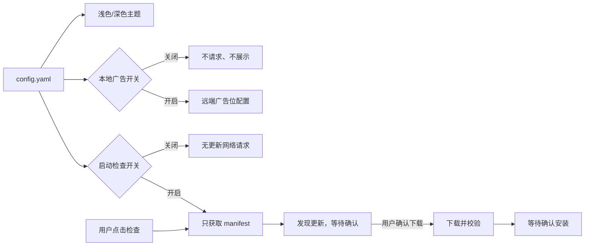

# Cursor 助手主题、广告与更新治理方案

## 现状结论

- **主题不能靠现有配置切换**：[`frontend/src/style/global.css`](frontend/src/style/global.css) 固定 `color-scheme: dark` 和 `#191919`；21 个前端文件约有 204 处暗色硬编码；[`internal/app/runner.go`](internal/app/runner.go) 与 [`internal/bridge/window.go`](internal/bridge/window.go) 的 Wails 原生窗口背景也固定为深色。
- **广告的 `enabled` 由远端广告包决定，不是用户开关**：[`internal/app/runner.go`](internal/app/runner.go) 在启动、窗口聚焦及每 3 分钟刷新三个 `ads.leokun.cn` 广告位；[`internal/ads/service.go`](internal/ads/service.go) 请求会携带版本、OS、设备 ID、模型数量和 Token/会话摘要。只删 [`frontend/src/components/HomeMetricsCard.vue`](frontend/src/components/HomeMetricsCard.vue) 的顶部广告 DOM 仍会继续联网。
- **客户端确实会自动下载自身更新**：[`internal/app/runner.go`](internal/app/runner.go) 启动时调用更新器，随后 [`internal/updater/manager.go`](internal/updater/manager.go) 立即检查、每 20 分钟复查，发现新版本后直接下载；目前只有安装/重启需要确认。
- **更新下载边界偏宽**：远端 manifest 可给出任意资源 URL，checksum 为空时会跳过校验，普通退出也没有统一清理已下载临时包。

## 配置与职责设计

扩展现有 [`internal/backend/server/config/types.go`](internal/backend/server/config/types.go)，继续使用 `~/.cursor-local-assistant-v2/config.yaml` 作为唯一持久化事实源：

```yaml
appearance:
  theme: light       # light | dark，默认 light
advertising:
  enabled: false     # 本地总开关，默认 false
updates:
  checkOnStartup: false  # 默认完全手动；即使开启也只能检查，不能自动下载
```

- [`internal/backend/server/config/store.go`](internal/backend/server/config/store.go) 负责缺失字段的安全默认值与旧配置迁移；前端 `localStorage` 只作为首屏缓存投影，不成为第二份配置源。
- 广告采用“双重许可”：`本地 advertising.enabled && 远端广告位 enabled`。本地关闭拥有最终否决权。
- 更新器采用硬性授权边界：配置最多允许“启动时检查”，**不存在自动下载配置**；下载和安装始终分别由用户确认。



## 实施步骤

1. **补齐统一配置契约与迁移**
   - 在 [`internal/backend/server/config/types.go`](internal/backend/server/config/types.go) 增加 `AppearanceConfig`、`AdvertisingConfig`、`UpdatesConfig`，校验主题枚举并设置安全默认值。
   - 更新 [`internal/backend/server/config/store.go`](internal/backend/server/config/store.go) 的规范化持久化判断，使旧配置自动补出三个新配置段且不丢失现有模型、路由和监听地址。
   - 在 [`frontend/src/state/appState.js`](frontend/src/state/appState.js) 中贯通 normalize/build/apply/save，确保任一设置页保存都不会覆盖这些偏好；在 [`frontend/src/views/Config.vue`](frontend/src/views/Config.vue) 提供主题、广告和“启动时检查更新”开关。

2. **将 UI 改为默认浅色并建立语义化主题层**
   - 在 [`frontend/src/style/global.css`](frontend/src/style/global.css) 定义背景、卡片、边框、正文、次要文字、悬浮和状态色等语义变量，保留 `light`/`dark` 两套 token，默认 `light`；避免继续扩散十六进制颜色。
   - 从共享组件开始迁移，再覆盖首页、配置页、模型列表/编辑器、图表、弹窗和底栏；重点文件包括 [`frontend/src/components/ui`](frontend/src/components/ui)、[`frontend/src/components/HomeMetricsCard.vue`](frontend/src/components/HomeMetricsCard.vue)、[`frontend/src/views`](frontend/src/views) 和 [`frontend/src/layouts/MainLayout.vue`](frontend/src/layouts/MainLayout.vue)。
   - 在 [`frontend/src/main.js`](frontend/src/main.js) 挂载前应用缓存主题，服务端配置加载后再校准；同时把 [`internal/app/runner.go`](internal/app/runner.go) 与 [`internal/bridge/window.go`](internal/bridge/window.go) 的三个原生窗口背景改为浅色，消除启动闪黑。

3. **广告默认关闭，并在后端阻断网络路径**
   - 为 [`internal/ads/service.go`](internal/ads/service.go) 增加本地 enabled gate：关闭时 `Refresh/FetchOnce` 直接 no-op，`GetRuntime` 返回不可用状态，不读取旧缓存用于展示。
   - [`internal/app/runner.go`](internal/app/runner.go) 继续保留广告能力，但只有本地配置开启后启动/执行刷新；关闭时窗口聚焦和定时器都不能访问 `ads.leokun.cn`。
   - [`frontend/src/views/Home.vue`](frontend/src/views/Home.vue) 与 [`frontend/src/App.vue`](frontend/src/App.vue) 根据同一配置停止获取广告 runtime、隐藏顶部广告入口和广告弹窗；关闭广告不自动删除缓存，重新显式开启后仍可恢复能力。

4. **把更新器重构为两次确认的手动状态机**
   - 在 [`internal/updater/manager.go`](internal/updater/manager.go) 删除 20 分钟循环；默认启动不发请求。仅当 `updates.checkOnStartup=true` 或用户点击“检查更新”时获取 manifest。
   - 增加 `available` 状态，将当前 `check -> download` 拆成 `check -> available -> 用户确认 -> download -> ready -> 用户确认 -> install`；`mandatory` 只能影响提示文案，不能跳过确认。
   - 在 [`internal/bridge/window.go`](internal/bridge/window.go)、[`frontend/src/services/clientApi.js`](frontend/src/services/clientApi.js)、[`frontend/src/state/appState.js`](frontend/src/state/appState.js) 与 [`frontend/src/App.vue`](frontend/src/App.vue) 增加显式 `DownloadAvailableUpdate` 操作和“下载/取消”提示，保留现有“重启安装/稍后”提示。
   - 收紧下载校验：资源 URL 必须是允许的 HTTPS GitHub 发布地址，checksum 必填且必须匹配，限制包体大小；取消、错误和正常退出时清理临时包。本次不顺带重写跨平台安装脚本，避免扩大回归面。

## 验证与验收

- 新增配置测试：旧 `config.yaml` 缺少新字段时得到 `light / false / false`，保存模型或路由时不丢失偏好，非法主题回退或报错符合约定。
- 新增更新器状态机测试：默认启动零请求；手动检查只请求 manifest；未确认时资源请求数为零；确认后才下载；checksum/URL/大小异常拒绝进入 `ready`；退出后无遗留临时包。
- 新增广告 gate 测试：默认关闭时启动、聚焦等刷新调用均不产生广告 HTTP 请求，runtime 不暴露缓存广告；开启后原能力可恢复。
- 执行 `go test ./...`、`go build ./...` 和 `yarn build`；实机检查主窗口、模型配置窗口、模型编辑窗口的浅色首屏、对比度、弹窗、图表和滚动条。
- 网络验收：默认配置下启动 30 分钟，不访问 `ads.leokun.cn`，不访问更新 manifest/资源；点击检查只访问 manifest，点击“下载更新”后才出现资源下载。