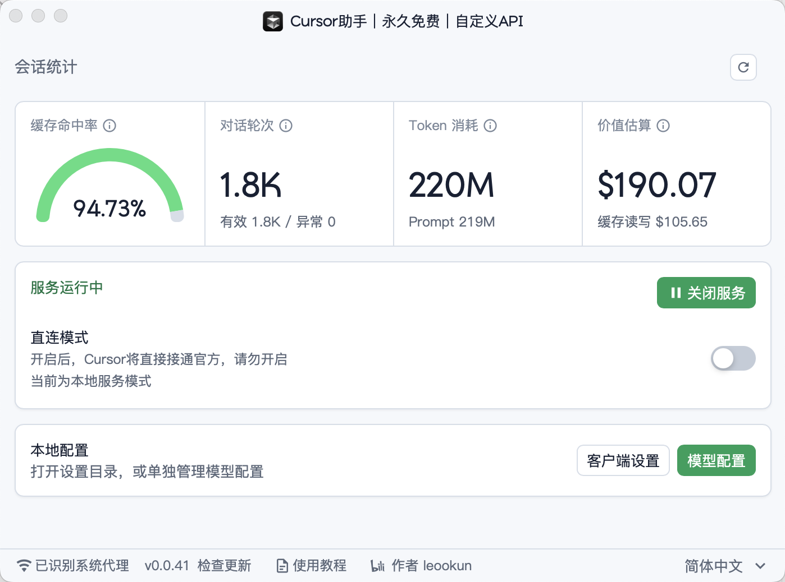
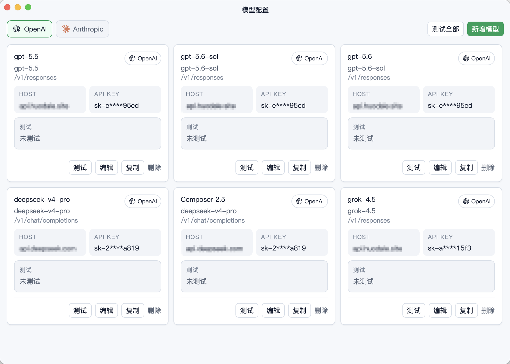

# Cursor BYOK noad

> 一句话：这是一个让 Cursor 使用你自己模型 API 的本地 BYOK 客户端；`noad` 分支额外默认浅色、默认不拉广告、不自动下载更新，把模型、界面和网络行为的控制权尽量交回用户。

## 核心特点

- **自带 BYOK 代理能力**：把 OpenAI、Anthropic 或兼容接口接入 Cursor，让已有模型额度直接用于 Chat、Agent 和开发辅助任务。
- **本地优先、可自托管**：核心服务运行在本机，默认使用 `127.0.0.1:18080` 代理和 `127.0.0.1:18090` 后端入口，也可按需扩展到自托管部署。
- **协议适配更灵活**：面向不同模型供应商处理协议端点、模型 ID、上下文窗口、额外参数和自定义 Header。
- **noad 体验治理**：默认关闭广告网络请求，默认不自动检查和下载更新，启动后是更干净的浅色客户端体验。
- **保留可控开关**：广告、更新检查、主题等行为集中在本地配置中；开启广告或更新下载都需要用户明确动作。

## 系统截图

**主界面**：快速确认本地服务状态、模型调用概览、Token 使用和常用入口。`noad` 分支默认不显示广告位，首页更聚焦模型接入和运行状态。

**模型配置**：配置自有模型的 Base URL、API Key、模型 ID、协议端点、上下文窗口和额外参数；适合把多个供应商或自托管模型统一接到 Cursor。

**本地设置**：集中管理主题、广告内容、启动时检查更新、本地端口和模型配置入口。`noad` 的关键行为都落在本地配置，不依赖远端默认值。

## noad 分支功能说明

`noad` 不是只隐藏广告 UI，而是把客户端体验拆成明确的本地状态机：

| 功能 | 默认行为 | 用户可控点 |
| --- | --- | --- |
| 广告 | 默认关闭；不拉取广告包，不展示顶部广告位和广告弹窗，不使用旧广告缓存展示 | 在设置中显式开启后才允许广告请求和展示 |
| 更新 | 默认不启动检查；检查、下载、安装分阶段确认 | 可手动检查；发现版本后仍需确认下载，下载完成后再确认安装 |
| 主题 | 默认浅色，减少启动闪黑和深色硬编码体验 | 可在设置中切换浅色 / 深色 |
| 配置 | `appearance`、`advertising`、`updates` 写入本地 `config.yaml` | 保存模型或路由时不会覆盖这些偏好 |

核心原则：**关闭就是关闭，默认不把广告请求和更新下载交给远端配置决定。**

## 基础使用路径

1. 启动客户端，让本地后端和代理服务运行在默认端口。
2. 在模型配置中添加自己的 OpenAI、Anthropic 或兼容 API。
3. 按需调整协议端点、上下文窗口、额外参数和自定义 Header。
4. 在 Cursor 中把流量指向本地代理，即可通过自己的模型完成 Chat、Agent 和开发辅助任务。

## 路线图

[正式版路线图](https://github.com/leookun/cursor-byok/discussions/32)
[详细使用教程](https://dcne38qm5vlg.feishu.cn/wiki/JeP7wdGnziBXuikNaF5czWbrn8c)

## 后续

后续会继续扩展更多工具和使用场景，包括但不限于：

- 支持更多 IDE 接入
- 支持更多 Chat 类应用
- 支持更多 Agent 工具和工作流
- 提供更完善的自托管部署方式
- 持续优化不同模型 API 的兼容性
- 降低接入成本，让已有模型额度可以被更充分地利用

最终希望做到：让你的模型 API 可以自由接入到你想使用的任何工具中。
