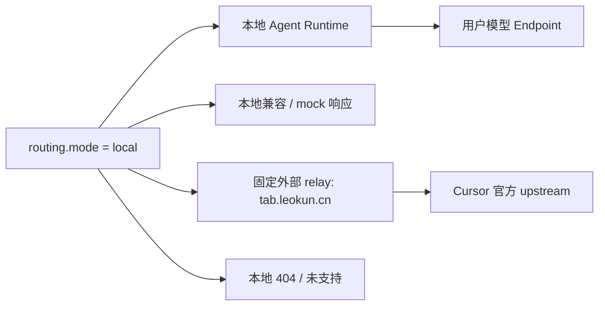
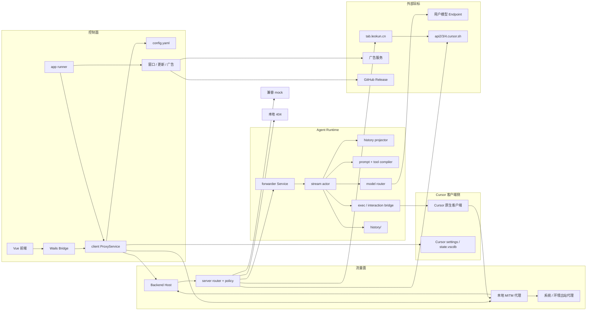
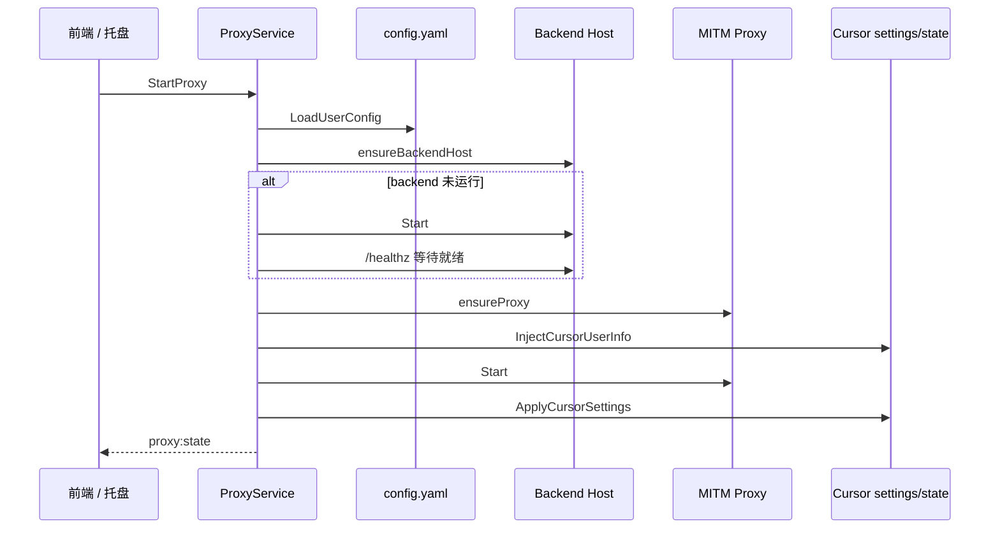
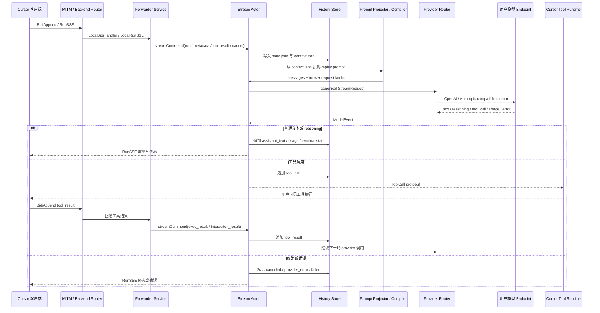
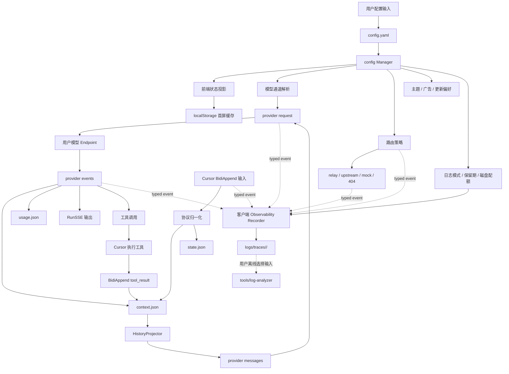
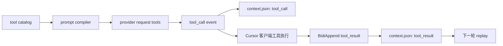
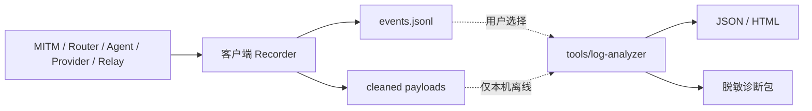
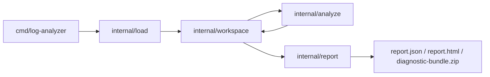
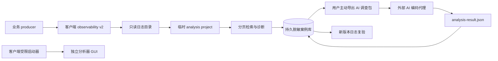

# Cursor BYOK 系统架构与核心业务数据流 PRD

- **文档类型**：系统架构、核心业务逻辑与数据流 PRD
- **适用项目**：Cursor BYOK 本地分支 `noad`
- **分析基线**：`noad@51f1d1b`
- **当前口径**：记录已确认的系统工作方式、能力边界和架构约束；不等同于新增需求已实现
- **状态**：核心分析基线

## 1. 文档职责

本 PRD 记录本项目的“系统如何工作”：

- 系统定位和核心产品目标；
- 控制面、流量面、协议层、Agent Runtime、模型适配、工具桥和持久化的模块边界；
- Cursor 请求进入本地系统后的主要业务链路；
- 配置、会话、工具、模型事件、审计元数据和外部出口的数据流；
- 当前能力地图、能力边界、核心不变量和维护风险。

它不承担以下职责：

- 不替代产品与工程决策；决策以 [`prd_cursor_byok_工作决策基线.md`](prd_cursor_byok_工作决策基线.md) 为准。
- 不记录每次上游同步的版本流水；版本事实以 [`prd_cursor_byok_当前功能与上游差异.md`](prd_cursor_byok_当前功能与上游差异.md) 为准。
- 不描述 merge、pull、冲突处理或发布操作；端到端步骤见 [`cursor_byok_upstream_sync_release_runbook.md`](cursor_byok_upstream_sync_release_runbook.md)，冲突与停止条件见 [`cursor_byok_upstream_merge_requirements.md`](cursor_byok_upstream_merge_requirements.md)。
- 不把未来路线图写成当前能力；路线图判断见 [`../.cursor/plans/cursor_能力路线图_13d772bc.plan.md`](../.cursor/plans/cursor_能力路线图_13d772bc.plan.md) 与 [`../.cursor/plans/cursor_byok_功能可用、隐私与稳定性验证路线图_22a7548b.plan.md`](../.cursor/plans/cursor_byok_功能可用、隐私与稳定性验证路线图_22a7548b.plan.md)。

当前工作树中若存在未提交的构建、发布或打包相关改动，不纳入本 PRD 的架构证据。本文只记录当前已读源码、既有 PRD 和历史分析中能相互印证的稳定结论。

## 2. 证据口径与能力状态

### 2.1 证据优先级

当源码、注释、历史计划、测试记录和运行时现象冲突时，按以下顺序判断：

1. 实时运行行为；
2. 脱敏网络或事件元数据；
3. 当前正在提供服务的构建产物；
4. 当前进程配置；
5. 已持久化项目/会话状态；
6. 已提交源码；
7. 注释、路线图和死代码。

本文主要基于已提交源码、既有 PRD 和历史运行验证记录；涉及未完成运行时验证的能力，统一标记为“待验证”。

### 2.2 能力状态词

后续能力描述统一使用以下状态：

- **已确认实现**：本地代码形成端到端闭环，并有测试或运行时证据支持。
- **部分支持**：存在本地副作用或协议处理，但缺少完整业务闭环。
- **兼容响应**：主要用于满足 Cursor 启动、能力 gate、UI 条件或避免重试，不代表真实业务完成。
- **外部依赖**：功能核心依赖第三方 relay、Cursor 官方 upstream 或其他外部服务。
- **待验证**：静态可见或曾被观察，但触发条件、数据边界、状态影响或替代路径尚未确认。
- **不支持**：当前本地没有实现，或已明确不纳入当前目标。

禁止把 RPC 返回 `success`、protobuf 字段存在、handler 注册成功、未观察到请求，单独解释为“功能真实完成”或“数据不会外发”。

## 3. 系统定位

本项目本质是一个 **Cursor 原生客户端的本地兼容后端**。

它不是：

- 独立 IDE；
- 简单 OpenAI/Anthropic API 反向代理；
- 纯本机、纯离线、无外部依赖的 Cursor 克隆；
- Cursor 官方账号、计费、Tab、索引和团队能力的完整替代品。

它做的是：

1. 保留 Cursor 原生客户端的 UI、编辑器集成、上下文采集和工具执行能力。
2. 通过本地桌面控制面管理模型、代理、证书、Cursor 设置、广告和更新策略。
3. 通过本地 MITM 与 backend 接管 Cursor 关键 RPC。
4. 将主要 Agent 推理链路切换到用户配置的模型 Endpoint。
5. 对无法本地完成的 Cursor 能力，按不同类别进入本地兼容响应、固定外部 relay、Cursor 官方 upstream 或不支持分支。

因此，“local mode”在当前代码里不是单一含义。它至少包含四种实际执行目标：



注释：`local` 表示优先使用本地策略处理 Cursor 请求，但不保证每一条 RPC 都在本机完成推理或业务处理。

## 4. 总体架构



注释：控制面负责“用户配置与本地服务生命周期”，流量面负责“让 Cursor 请求进入本地 backend”，Agent Runtime 负责“把 Cursor Agent 协议翻译成用户模型调用并回灌工具结果”。

## 5. 模块职责边界

| 模块 | 主要路径 | 职责 | 不应承担的职责 |
| --- | --- | --- | --- |
| 桌面入口 | [`main.go`](../main.go)、[`internal/app/runner.go`](../internal/app/runner.go) | 启动 Wails 应用、注册 bridge service、创建窗口、托盘、广告和更新管理器 | 不直接处理 Cursor RPC 或 provider 协议 |
| 前端控制面 | [`frontend/src`](../frontend/src) | 展示配置、状态、指标、广告、更新与模型管理 UI | 不成为配置事实源；首屏缓存只做投影 |
| Bridge 服务 | [`internal/bridge`](../internal/bridge) | 暴露 Wails 调用边界，连接前端与 Go 服务 | 不直接拥有 Agent 会话事实 |
| 生命周期与 Cursor 接入 | [`internal/client`](../internal/client)、[`internal/cursor`](../internal/cursor) | 启停 backend/MITM，注入和清理 Cursor 设置，处理 Cursor 身份状态 | 不替代 backend 路由策略，不保存 prompt 历史 |
| MITM 与出站代理 | [`internal/mitm`](../internal/mitm)、[`internal/netproxy`](../internal/netproxy) | 接管 Cursor HTTPS 流量，保留原始上游 URL，转入本地 backend 或正常出站 | 不解释 protobuf 业务语义 |
| Backend Host | [`internal/backend/host.go`](../internal/backend/host.go) | 组装 server、config manager、forwarder module 与具体路由 | 不实现 provider 细节和工具执行细节 |
| Server 路由层 | [`internal/backend/server`](../internal/backend/server) | HTTP/Connect 包装、policy、错误编码、本地/上游 action 选择 | 不持久化 Agent history |
| Forwarder | [`internal/backend/forwarder`](../internal/backend/forwarder) | Bidi/RunSSE 主链路、会话持久化、prompt 投影、provider 驱动、工具回灌、usage | 不直接管理桌面窗口或 Cursor 设置 |
| Agent 协议与模型 | [`internal/backend/agent`](../internal/backend/agent) | Cursor protobuf 与 canonical message/tool/event 的转换，OpenAI/Anthropic 适配 | 不决定全局路由或广告/更新策略 |
| 配置管理 | [`internal/backend/server/config`](../internal/backend/server/config) | `config.yaml` 读写、默认值、迁移、模型 adapter 与 `observability` 规范化 | 不保存运行时会话事件 |
| 客户端可观测采集 | [`internal/observability`](../internal/observability) | 版本化事件、关联上下文、项目隐私标识、语义字段、写盘前凭据清洗、session、轮转、保留期与配额 | 不读取历史日志，不分析、不生成报告、不导出调查包 |
| 独立日志分析器 | [`tools/log-analyzer`](../tools/log-analyzer) | 独立 Wails/Vue GUI 与 CLI；GUI 启动后按稳定路径合同异步自动只读加载客户端默认日志根，无法加载时保留手动选择，加载事务可取消且仅发布最新请求；解析版本化日志、检索/重建链路、调查案例、对比复验、生成本机报告和用户主动导出的脱敏包 | 不导入客户端运行时，不进入客户端二进制/更新归档，不调用 AI、不修改代码或执行外部命令 |
| 广告 | [`internal/ads`](../internal/ads) | 本地广告 gate、缓存与 runtime 投影 | 不绕过 `advertising.enabled` 发请求 |
| 更新 | [`internal/updater`](../internal/updater) | 手动检查、下载确认、校验、安装确认和临时文件清理 | 不自动下载或跳过用户确认 |
| Tab relay 服务 | [`cursor-tab-server`](../cursor-tab-server) | 独立 relay，使用 Cursor token 转发 Tab/Cpp/FileSync/Git 相关 RPC 到官方 upstream | 不是根应用内嵌服务，不是用户 BYOK provider |

## 6. 服务生命周期

服务启动链路由控制面发起，核心顺序如下：



停止链路按相反方向恢复：

1. 停止 MITM；
2. 清理 Cursor settings；
3. 停止 backend；
4. 更新前端状态。

核心约束：

- backend 默认监听 `127.0.0.1:18090`；MITM 默认监听 `127.0.0.1:18080`。
- Cursor 设置注入失败时，启动被视为失败，并回滚已启动的本地服务。
- 运行中唯一实例不应被无维护窗口替换；交接必须先启动候选、健康检查，再切换。

## 7. 请求进入 backend 后的路由逻辑

### 7.1 全局策略

`PolicyMiddleware` 根据配置中的 `routing.mode` 和是否存在 `X-Server-Upstream-URL` 计算执行模式：

- `local`：优先执行 route 的本地 action；
- `upstream`：优先执行 route 的 upstream action；
- 未识别值归一化为 `local`。

MITM 转入 backend 时保留原始目标 URL，因此 backend 可以在需要时做直连上游或固定改写。

### 7.2 路由类型

当前路由大致分为五类：

| 路由类型 | 行为 | 代表能力 | 能力口径 |
| --- | --- | --- | --- |
| 本地 runtime | Cursor RPC 进入 `forwarder`，最终调用用户模型 Endpoint | `BidiAppend`、`RunSSE`、Agent 工具循环 | 已确认实现 |
| 本地业务 handler | 本地保存或读取元数据/状态，返回 protobuf/JSON | Repository、Docs、Upload、部分 Dashboard | 部分支持或兼容响应 |
| 本地 compat/mock | 构造固定响应，满足 Cursor UI 或能力 gate | ServerTime、ServerConfig、Auth/Dashboard 部分接口 | 兼容响应 |
| 固定 relay | 无论 local/upstream，重写到 `https://tab.leokun.cn` | Tab/Cpp/FileSync/Git 相关 17 条 RPC | 外部依赖，待逐 RPC 决策 |
| 直连 upstream | 转发到 Cursor 原始上游或官方 API | upstream mode、部分 directUpstreamProcedure | 外部依赖 |

精确路由优先于通配路由。后续改动不能只看 `server.Any("/AiService/*")` 或通配 handler，就推断实际请求会命中本地实现。

### 7.3 固定 Tab relay 边界

当前 `tabServerBaseURL` 固定为 `https://tab.leokun.cn`。`tabServerUpstreamProcedure` 的行为是：

1. 保留请求 path 与 query；
2. 将 scheme/host 改为 `tab.leokun.cn`；
3. 同一 action 同时注册为 `Local` 与 `Upstream`；
4. 使用 upstream direct action 转发 body 与大部分 headers；
5. 审计标记开启，但专用隐私审计仍默认关闭且只允许脱敏元数据。

这意味着：

- 这些 RPC 不属于纯本地 BYOK；
- local mode 下仍可能访问 `tab.leokun.cn`；
- relay 侧再转发 Cursor 官方 upstream 的行为来自 `cursor-tab-server` 源码设计，但不能单凭源码证明线上实例版本；
- 当前决策是暂不阻断、不替换，先完成逐 RPC 功能影响、凭据和隐私验证。

## 8. Agent 主业务链路



核心业务规则：

- `BidiAppend` 是 Cursor 上行事实进入本地系统的主要入口。
- `RunSSE` 是本地系统向 Cursor 输出模型事件、工具事件和终态的主要下行通道。
- stream actor 是单个请求的串行状态所有者，provider、工具、取消、timer 和 compaction 都以 command 进入 actor。
- provider 事件不直接写 UI；必须先归一化成内部事件，再持久化、广播或触发工具。
- 工具结果不是独立完成态；它必须回灌进会话事实，并推动下一轮 provider 调用或终态。
- `ForceBackgroundShell` 的无 reasoning replay 只是特定兼容例外，不能泛化到所有孤立 `tool_result`。

## 9. 状态机与持久化分层

当前存在两层状态，不能混用。

### 9.1 live stream actor phase

actor phase 描述当前进程内某个活动请求的推进阶段：

- `idle`：等待输入；
- `provider_running`：模型调用中；
- `waiting_external`：等待工具、交互或外部事件；
- `awaiting_user`：等待用户输入；
- `compacting`：上下文压缩中；
- `completed`：本轮完成；
- `failed`：本地处理失败；
- `canceled`：本轮取消。

这是运行时协调状态，主要用于 actor 串行化、timer、取消、恢复和 RunSSE 终态。

### 9.2 conversation loop status

`state.json` 中的 loop status 是跨进程可恢复的会话元状态：

- `idle`：没有正在推进的 loop；
- `running`：本轮输入或中间上下文已落盘，正在推进；
- `waiting_tool`：已落完整 tool call，等待工具结果；
- `completed`：本轮正常完成；
- `canceled`：本轮被取消；
- `provider_error`：provider 调用失败；
- `failed`：本地投影、持久化、usage 或桥接失败。

`state.json` 不保存可投射给 LLM 的历史正文；可回放事实以 `context.json` 为准。

## 10. 事实源与数据流



事实源约束：

- `config.yaml` 是模型、监听地址、routing、主题、广告、更新策略和 `observability` 采集策略的持久化事实源。
- 前端 `localStorage` 只用于首屏缓存和 UI 投影，不能成为第二份配置事实源。
- `context.json` 是 provider replay 和会话语义恢复的事实源。
- `state.json` 只保存会话元数据、loop 状态、序号和当前状态投影。
- `usage.json` 是聚合 token/usage 指标事实源，不从 conversation 文件现场扫描重算。
- `conversation.lock` 保护同一 conversation 的并发写入。
- `logs/traces/<session>/events.jsonl` 和 payload 文件是版本化诊断输入，不是业务事实源；客户端不得反向读取它们驱动路由、会话或 UI 状态。
- `basic` 日志禁止正文；用户明确启用的本机 `full` 可以保存写盘前已清除凭据的业务原文。广告缓存、更新临时包、审计文件和任何日志模式都不得包含 API Key、Authorization、Cookie 或完整敏感 headers。

## 11. 模型适配与 provider 数据流

模型调用链路如下：

1. 用户在配置中保存 `displayName`、`type`、`baseURL`、`apiKey`、`modelID`、协议 endpoint、额外参数、headers 和上下文窗口等字段。
2. 配置归一化后生成运行时模型通道 ID。该 ID 由 URL、model、key、name、endpoint 等组成的短 hash 表示，不直接等于 `modelID`。
3. Agent Runtime 根据 Cursor 请求中的模型标识解析实际通道。
4. `model/router.go` 只分发到 `openai` 或 `anthropic` adapter。
5. OpenAI adapter 支持 Responses、Chat Completions 和 Custom endpoint；Anthropic adapter 支持 Messages 风格请求。
6. provider 返回的 text、reasoning、tool call、usage 和 error 被归一化为 `ModelEvent`，再由 actor 决定写 history、发 RunSSE、调工具或终止。

关键边界：

- 用户模型 Endpoint 属于默认允许目标，但仍应执行最小 headers/payload 策略。
- 自定义 headers 与额外参数只应进入用户显式配置的模型请求，不应扩散到 Tab relay、官方 upstream、广告或更新请求。
- provider adapter 不拥有 Cursor 路由决策；它只负责把 canonical request 转成具体模型协议。

## 12. 工具能力与回灌链路

工具目录由静态 prompt 资产加载，再按 mode 过滤。当前主要模式包括：

- Agent；
- Ask；
- Plan；
- Debug；
- Multitask；
- child conversation / subagent 场景。

工具调用链路是：



能力判断：

- 文件、搜索、shell、MCP、浏览器/网络类工具的业务执行主体通常是 Cursor 客户端或工具桥，本地 backend 负责协议转换、生命周期、展示和结果回灌。
- 工具是否“可展示”、是否“可被 provider 调用”、是否“有 dispatch 路径”、是否“可 replay”，是四个不同判断。
- 修改工具目录、prompt、dispatch 或 projector 任一处，都可能导致工具循环断裂。

## 13. 能力地图

### 13.1 已确认实现

- 本地桌面控制面：窗口、托盘、服务启停、状态投影。
- 本地 backend 与 MITM：监听、健康检查、Cursor 请求接管、原始 upstream URL 保留。
- Agent 主链路：`BidiAppend`、`RunSSE`、多轮对话、流式输出、thinking/reasoning、usage、错误和终态。
- 模型适配：OpenAI Responses、OpenAI Chat Completions、OpenAI Custom endpoint、Anthropic Messages。
- 用户模型配置：自定义 Endpoint、API Key、模型 ID、额外参数、custom headers、上下文窗口和输出 token 控制。
- 工具循环：工具调用发起、Cursor 执行、结果回灌、继续 provider 调用。
- 会话事实：`context.json`、`state.json`、conversation lock、prompt replay、checkpoint、compaction、usage 聚合。
- 客户端体验治理：默认浅色、广告默认关闭、更新默认手动、配置统一持久化。
- 专用隐私审计：默认关闭，只允许字段 presence、大小、事件类型、host 分类等脱敏元数据。

### 13.2 部分支持

- Repository / Codebase Index：存在 handshake、状态和元数据处理，但缺少完整 ingest、chunk、embedding、向量检索和增量依赖图。
- Docs / Knowledge：可保存 identifier、标题、URL 或单块内容，但缺少完整抓取、解析、分块、embedding 和相关性排序。
- Upload：部分接口有本地副作用，但成功响应不能等同于完整上传或索引完成。
- GenerateImage / 多模态：存在结构和结果映射能力，但端到端 provider 图片生成与附件兼容仍需验证。
- Git 辅助：存在本地 handler 和静态调用链分析，但部分真实 transport 仍未完全解析。
- MCP / Task / shell 恢复：主路径可用，但不同 Cursor 版本下取消、权限拒绝、重连和后台恢复仍需更多契约测试。

### 13.3 兼容响应

以下能力主要用于维持 Cursor UI、启动流程、能力 gate 或避免重试，不应计入真实业务覆盖率：

- ServerTime、ServerConfig、AvailableModels 等部分启动/配置 RPC；
- Auth、Dashboard、Statsig 等部分账号、计费、团队和策略接口；
- Repository/Docs/Upload 中仅返回成功但未消费完整内容的接口；
- 未经验证的 no-op 成功或固定 protobuf 响应。

兼容响应的原则是：默认保留，直到证明移除或改为 failure 不会破坏 Cursor 状态机。

### 13.4 外部依赖

- Cursor Tab / Cpp / next edit / 部分 FileSync / 部分 Git RPC 当前依赖 `tab.leokun.cn` relay。
- relay 设计上依赖 Cursor 官方 upstream 与服务端 Cursor token。
- 全局 `upstream` 模式会把相应请求转给 Cursor 原始上游。
- 广告和更新在本地开关允许时分别依赖广告服务和 GitHub Release。

这些能力不能描述为纯本地 BYOK。

### 13.5 待验证或不支持

- 17 个 relay RPC 的完整触发条件、重试、privacy mode 和逐 RPC 替代策略。
- 用户 Cursor token 的合法导入、Keychain、刷新、身份隔离和 `local_official` / `external_relay` 双模式实现。
- Cursor 官方完整云端仓库索引、跨设备同步、团队/企业管理、Background/Cloud Agent。
- OpenAI/Anthropic 之外 provider 的原生协议。
- 未注册或新版本实验 RPC 的本地兼容。
- 完整 Cursor 跨版本 E2E 和浏览器/前端自动化测试矩阵。

## 14. 隐私、审计与外发边界

### 14.1 默认允许目标

- 用户显式配置的模型 Endpoint；
- Cursor 官方 upstream：`api2.cursor.sh`、`api3.cursor.sh`、`api4.cursor.sh`。

默认允许不代表允许携带任意字段。所有外发都必须遵循最小 headers、最小凭据和最小 payload。

### 14.2 非默认信任目标

`tab.leokun.cn` 当前不属于默认信任区，但因承担 Tab/Cpp/FileSync/Git 等能力，现状暂不阻断、不替换。

任何切换到官方直连、本地 no-op、本地实现或禁用的方案，都必须先验证：

- 请求实际携带的 token 类型；
- 官方 upstream 是否接受该 token；
- Cursor UI 是否进入重试、禁用或错误状态；
- 该 RPC 是否携带源码、路径、diff、编辑历史、workspace、文件内容或凭据；
- 替代路径是否会错误推进 Cursor 状态机。

### 14.3 客户端采集与离线分析边界

客户端采集与离线分析必须保持单向、文件协议解耦：



注释：客户端只写采集产物，不读取历史日志、不调度分析、不生成报告；分析器以独立进程和独立安装包运行，不进入客户端二进制或更新归档。客户端只允许通过受限启动参数传入可信日志根。

- `basic` 默认启用，只记录事件形态、关联 ID、路由目标、状态、耗时、字节数和错误分类。
- `full` 由用户明确启用，可记录经过凭据清洗的业务语义原文，并必须受保留期、总磁盘配额和已关闭 session 清理规则约束。
- `Authorization`、Cookie、API Key、token/secret/credential、自定义敏感 header 和敏感 query 参数在序列化前强制移除；未知且无法安全解析的二进制 body 不得原样保存。
- 客户端和 `tools/log-analyzer` 只共享带 `schema_version` 的文件协议。分析器只读输入，报告和脱敏包只能由用户主动写到显式输出目录，不得自动上传。

#### DESIGN-LOG-ANALYZER-SQLITE-001：离线分析器临时 SQLite 流式工作区

- **Design Readiness**：`approved`
- **适用范围**：仅 `tools/log-analyzer` 独立 Go module；客户端、relay、Wails、采集协议、根 module 和客户端发布归档均不改动。
- **关联计划**：`.cursor/plans/分析器临时_sqlite_内存优化_b65b3628.plan.md`
- **问题机制**：当前分析器先把 current 与 baseline 的全部事件加载到 `contract.Dataset.Events`，再在 `analyze` 中构造 trace map、target/finding/trace/comparison 切片，最后在 `report` 中对完整 Report/Dataset 生成 JSON、HTML 和 ZIP。峰值内存由事件切片、trace 分组和报告派生切片叠加，随事件总量、trace 数、finding 数和单 trace 高基数状态线性增长。
- **采用机制**：每次 CLI 分析创建一次 OS 私有临时 SQLite workspace，输入逐行校验并批量写入；SQLite 负责有界存储、确定性排序、索引和机械聚合，Go reducer 只保留当前 trace 或受限大小的状态；报告从只读游标分段写出。临时库是运行内 scratch，不是持久数据库、缓存或新产品能力。
- **可证伪结果**：若实现后生产路径仍返回完整 `contract.Dataset.Events`、完整 `analyze.Report`，或在单 trace 百万唯一 tool ID 场景下 Go heap 随唯一 ID 线性增长，则该设计失败。

##### 现实证据

| 事实 | evidence_status | 当前锚点 |
|---|---|---|
| `contract.Dataset.Events []Event` 是全量驻留入口 | verified | `tools/log-analyzer/internal/contract/contract.go` |
| `load.Dataset` 读取所有事件后全局排序 | verified | `tools/log-analyzer/internal/load/load.go` |
| `analyze.Dataset` 构造 trace map 和完整派生切片 | verified | `tools/log-analyzer/internal/analyze/analyze.go` |
| `report.WriteAll` 持有完整 Report/Dataset，并对 JSON/HTML/ZIP 全量输出 | verified | `tools/log-analyzer/internal/report/report.go` |
| CLI 同时持有 current 与可选 baseline Dataset | verified | `tools/log-analyzer/cmd/log-analyzer/main.go` |
| `modernc.org/sqlite v1.50.1` 可作为纯 Go 驱动候选 | verified | 本机离线 probe：`sqlite_version=3.53.1`；`CGO_ENABLED=0` darwin arm64/amd64、linux amd64、windows amd64 均构建通过 |
| 客户端与分析器只共享文件协议，分析器不得进入客户端发布包 | verified | 本文 §14.3、§15.10；`Taskfile.yml` 的 `release:verify:analyzer-isolation` |

Phase 0 取证结果：

- 当前分析器测试通过：`cd tools/log-analyzer && go test ./...`。
- schema-v1 fixture CLI：`events=6 traces=1 findings=0`。
- characterization CLI：`events=7 traces=3 findings=10`；覆盖 unknown schema warning、open/degraded manifest、orphan trace、missing terminal、slow/error、tool result missing 和 baseline comparison。
- ZIP 脱敏基线：未命中 `should-not-export`、`Bearer`、`payloads/`、`/Users/example`、`api_key=secret`、`token=secret`。
- SQLite 探针二进制体积：darwin/arm64 9,355,650 bytes；darwin/amd64 9,617,760 bytes；linux/amd64 9,357,654 bytes；windows/amd64 9,656,832 bytes。
- 许可证链：`modernc.org/sqlite` 为 BSD-3-Clause，内嵌 SQLite 为 Public Domain；`modernc.org/libc`、`memory`、`mathutil`、`google/uuid`、`remyoudompheng/bigfft`、`golang.org/x/sys` 为 BSD-3-Clause；`dustin/go-humanize`、`ncruces/go-strftime`、`mattn/go-isatty` 为 MIT。当前证据未发现 copyleft 依赖。
- sumdb 网络探针曾超时；最终使用本机 module cache、`GOPROXY=off`、`GOSUMDB=off` 完成离线构建。该超时是环境网络事实，不影响驱动纯 Go 可构建结论。

##### 模块职责与调用方向



- `internal/contract`：只保留 schema v1 Event/Manifest DTO 与公开报告 DTO 的字段语义；删除承载运行状态的 `Dataset.Events`。兼容输出 DTO 可保留，但不得作为全量中间态。
- `internal/workspace`：唯一拥有临时目录、DB 文件、DDL、PRAGMA、事务、查询端口、派生表、scratch 表、staging cleanup 和幂等清理。它不拼 finding 文案，不拥有业务规则。
- `internal/load`：拥有输入参数顺序、目录发现、去重、逐行 JSON decode、schema/必填校验、line 上限和 batch 提交。它不返回事件切片。
- `internal/analyze`：拥有 trace key、terminal/provider/RunSSE/tool-call 配对、target summary、finding、comparison 和确定性规则。业务状态机保持 Go 表达，不能扩散为难维护 SQL 规则。
- `internal/report`：拥有 JSON/HTML/ZIP 外部格式、转义、伪名化、fields allowlist、warning/message 清洗、staging 发布和输出权限。它只能通过 workspace 只读端口取数。
- `cmd/log-analyzer`：只编排 `validate output isolation → open workspace → ingest current/baseline → analyze → stage reports → cleanup workspace → publish → stdout`。

##### 数据合同

SQLite 逻辑 schema 以最小可查询列为准，禁止保存完整原始 JSON、payload、`payload_ref`、未 allowlist 的 fields、Prompt、源码、diff、完整 header/body、Token、API Key、Cookie 或 Authorization。

| 表 | 生命周期 | 关键字段与语义 |
|---|---|---|
| `schema_meta` | workspace 全程 | `version=1`，用于实现内部 DDL 版本检查，不是外部日志 schema |
| `datasets` | workspace 全程 | `id`、`kind=current|baseline`、`status=ingesting|ingested|analyzing|analyzed`、event/manifest/warning 计数 |
| `input_arguments` | workspace 全程 | CLI 参数 ordinal、绝对路径、dataset kind；用于 `report.json.inputs` 兼容 |
| `input_files` | workspace 全程 | canonical path、file type、first argument ordinal；`UNIQUE(dataset_id, canonical_path)` 去重重叠输入 |
| `manifests` | workspace 全程 | schema、session id、mode、status、started/closed、payload_degraded、dropped_events；last_error 只保存清洗后文本 |
| `warnings` | workspace 全程 | dataset、ordinal、清洗前内部 warning 文本；报告/ZIP 边界再次清洗 |
| `events` | workspace 全程 | dataset、source file id、line、timestamp seconds/nanoseconds、canonical timestamp、sequence key、ingest order、trace key、结构化事件列、`safe_fields_json` |
| `trace_summaries` | 分析后 | current trace summary 标量；baseline 默认不写 trace summary |
| `trace_layers` / `trace_targets` | 分析后 | current trace 的 distinct layer/target，供报告游标读取 |
| `target_summaries` | 分析后 | current/baseline target 聚合，供 comparison 计算 |
| `findings` | 分析后 | current findings；唯一键为 `severity + code + message + trace_key`，另存 `first_ingest_order` 用于稳定排序 |
| `comparisons` | 分析后 | 以 target 为比较键的 current/baseline 差异 |
| `trace_pair_state` / `trace_tool_state` | 单 trace 分析期间 | 超大 trace 的 scratch 溢写状态；trace finalize 后必须删除 |

关键键和类型：

- trace 身份键：非空 `trace_id`；否则 `orphan:<app_session_id>:<sequence>`，保持当前 orphan 语义。
- timestamp：拆为 `timestamp_seconds INTEGER` 与 `timestamp_nanoseconds INTEGER`，另存 canonical RFC3339Nano 字符串，避免 `UnixNano` 溢出并保持导出格式。
- sequence：Go 侧为 `uint64`。SQLite 不直接用 signed INTEGER 保存原值；使用 20 位零填充十进制 `sequence_key TEXT` 排序与导出，保证 `0..MaxUint64` 顺序无损。
- ingest order：同 dataset 严格递增 `INTEGER`，作为最终并列裁决键。
- safe fields：导入时只保留现有 allowlist：`method`、`status_code`、`client_kind`、`message_case`、`kind`、`finish_reason`、`ttft_ms`、`append_seqno`。

##### 确定性算法合同

- 输入参数按 CLI 出现顺序登记；目录内候选文件按 canonical path 字典序；同一 canonical file 只处理第一次出现。
- 事件全局顺序：`timestamp_seconds ASC, timestamp_nanoseconds ASC, sequence_key ASC, ingest_order ASC`。
- trace reducer 顺序：`trace_key ASC, timestamp_seconds ASC, timestamp_nanoseconds ASC, sequence_key ASC, ingest_order ASC`。
- trace 输出顺序：`trace_key ASC`；target/comparison 输出：`target ASC`；warnings：`ordinal ASC`。
- findings 输出：`severity_rank DESC, first_ingest_order ASC, code ASC, message ASC, trace_key ASC`。这会消除当前同 severity finding 受 map 遍历影响的非确定性；该变化只稳定报告顺序，不改变 finding 语义、数量或字段。
- current 才生成 trace/finding；baseline 只参与 target summary 与 comparison。

##### 执行、一致性与失败恢复

- workspace 使用 `os.MkdirTemp(os.TempDir(), "cursor-log-analyzer-*")` 创建；Unix 目录 `0700`，DB 文件预创建 `0600` 后再 `sql.Open`。Windows 不承诺 POSIX mode；实现以私有临时目录、当前用户 ACL、不可进入输出/ZIP、可清理作为安全合同，并在 Phase 5 记录 Windows 运行证据。
- 数据库单连接：`SetMaxOpenConns(1)`、`SetMaxIdleConns(1)`。
- PRAGMA：`journal_mode=DELETE`、`synchronous=NORMAL`、`foreign_keys=ON`、`temp_store=FILE`、`mmap_size=0`、`cache_size=-8192`。这里 `cache_size=-8192` 表示约 8 MiB page cache 初始预算；Phase 5 内存验收若反证该值不足，只能在 Design 中记录证据后调整。
- 输入 line 上限：event JSONL 单行 8 MiB，manifest 1 MiB。批次阈值：最多 5,000 events 或累计 16 MiB JSON bytes，先到即提交。
- 导入批次使用 prepared statement + transaction；malformed JSON、unsupported schema、必填缺失、line 超限、读错误或 DB 错误立即停止。已提交临时批次不对用户可见，因为失败路径删除整个 workspace。
- reducer 使用 keyset 分块，不用 `OFFSET`。每个读块关闭 rows 后才批量写派生表，避免单连接上长读游标与写事务互相阻塞。
- started/finished、provider、RunSSE、tool-call 配对 map 的 Go 内存上限为 8,192 entries/trace；超过阈值即 UPSERT 到 scratch 表并清空 Go map。trace finalize 时合并 scratch + 当前状态，写 summary/finding 后删除该 trace scratch。
- 任一阶段失败：关闭 rows/stmt/tx → 关闭 DB → 删除 SQLite sidecar → 删除 DB 文件 → 删除 temp dir。清理失败会导致 CLI 非零，不打印成功摘要。
- 进程被 `SIGKILL` 时 defer 不运行，可能遗留 OS temp 前缀目录；实现不得在下次运行扫描或删除其他进程的 workspace，只依赖 OS 临时目录策略。
- 正式输出先写到 `-out` 下私有 staging；三个文件全部 flush/close 成功并完成 workspace 清理后再发布。发布失败时恢复上一份受管文件；不得留下新旧混合报告。

##### 接口与兼容合同

- CLI 参数保持：`-input`、`-baseline`、`-out`、`-allow-unknown-schema`；不新增 SQLite 公开参数。
- 成功摘要保持 `分析完成: events=<n> traces=<n> findings=<n> output=<abs>`。
- `report.json` 字段名、类型、`omitempty` 和 current/baseline 语义保持兼容；`generated_at` 仍为一次运行统一 UTC 时间。
- HTML 保持现有区块、转义和数据语义；不要求逐字节一致。
- ZIP 只包含 `report.json` 与 `events.jsonl`；ID 伪名化、route/path/URL 清洗、fields allowlist、warning/message 清洗、无 payload 导出边界保持兼容。
- 输出目录仍不得位于任一输入目录内；输入始终只读。

##### 验证合同

- 语义回归：schema-v1 fixture、unknown schema compatibility、open/degraded manifest、orphan trace、missing terminal、slow/error、tool result missing、target comparison、diagnostic ZIP forbidden markers。
- 确定性：多输入重叠、同 timestamp/sequence、重复运行 diff、finding 顺序。
- 有界状态：100k/1M current、可选 500k baseline、单 trace 百万唯一 tool ID；`GOMEMLIMIT=256MiB` 下应完成，稳定阶段 Go heap 增量不得随事件总量或唯一 tool ID 线性增长。RSS 可受 SQLite page cache 和 OS 文件缓存影响，但 100k → 1M 的稳定增量必须低于 3 倍；若不满足，Phase 5 不得标记 accepted。
- 故障注入：输入错误、line 超限、DB 写失败、query 失败、writer flush/close、publish rename、workspace cleanup 失败。
- 构建：`tools/log-analyzer` 自身 `go test ./...`、`go test -race ./...`、`go vet ./...`；`CGO_ENABLED=0` 的 darwin arm64/amd64、linux amd64、windows amd64 analyzer build。
- 发布隔离：有客户端归档时执行 `task release:verify:analyzer-isolation`；若当前环境没有归档，仅能记录 `env-gap`，不得声称通过。

##### 回滚与迁移

本设计无用户数据迁移、无持久 DB、无配置开关和无客户端接线。整体回退方式是回退 `tools/log-analyzer` module 代码与相关测试/文档；用户输入日志和既有正式报告不被修改。不得保留双路径 runtime fallback；如果新链路不能满足语义或内存门禁，应整体回退到旧 CLI 实现。

##### Design Gate 记录

- **评审者与时间**：主实现者自审，2026-03-14；项目规则禁止未经用户明确要求使用 subagent，未做独立评审。
- **适用项**：数据合同、接口合同、算法、执行一致性、生命周期、失败恢复、安全、兼容、回滚、验证均适用；UI、生产迁移、权限角色为 `N/A`，原因是该能力是离线 CLI，且不接客户端运行时。
- **正向模拟**：用户运行 CLI → 校验输入/输出隔离 → 创建私有 temp workspace → 流式导入 current/baseline → keyset reducer 写派生表 → report writer 从游标写 staging → 清理 workspace → 发布三类报告 → 打印成功摘要。无需临场决策。
- **最高风险失败模拟**：writer close 失败或 publish rename 失败时，workspace/staging 清理，上一份受管报告保持，CLI 非零且不打印成功；DB 写失败时整库删除，输入不变。
- **高基数模拟**：单 trace 百万 tool_call_id 时，Go map 达到 8,192 entry 后溢写 scratch，trace finalize 合并并删除 scratch，Go heap 不随唯一 ID 线性增长。
- **回滚模拟**：无持久迁移；git 回退分析器 module 即恢复旧行为，用户日志和客户端不受影响。
- **临场决定事项**：无剩余承重 `decision-gap`；line/batch/cache/map 阈值已在本 Design 固定，Phase 5 只能用证据驱动调整。
- **阻塞缺口**：无实现前阻塞缺口。Windows 实机权限、发布归档隔离和大规模内存曲线属于 Phase 5 验收证据，不阻塞 Phase 1 开工；缺失时最终状态最高为 `verified-partial`。
- **最终 verdict**：`Design Readiness=approved`，允许进入 Phase 1；完成声明仍必须等待 Phase 5 证据。

### 14.4 DESIGN-LOG-ANALYZER-WORKBENCH-001：语义日志与能力改进闭环

- **Design Readiness**：`approved`
- **决策时间**：2026-07-29
- **适用范围**：客户端日志协议 v2、独立分析器 GUI/CLI、临时分析 workspace、持久调查案例、外部 AI 证据包和客户端受限启动器。
- **用户确认**：分析器单独安装；客户端仅启动；只删除 closed session；第一版只做 AI 包导出/结果导入；案例默认持久保存脱敏快照。
- **不包含**：内置模型调用、仓库写入、命令执行、自动修复、自动上传、后台 watcher、客户端内分析。

#### 职责与数据流



- 客户端 recorder 只写事实和由业务边界明确给出的语义，不读取历史日志、不运行规则。
- 分析器 `internal/project` 统一 GUI/CLI 的 `open → ingest → analyze → query/export → close`；临时 SQLite 在项目关闭、重载、失败或进程正常退出时删除。
- `internal/query` 只接受白名单 AST 并生成参数化查询；UI 不拼接 SQL。
- `internal/source` 只按需读取 `logs/app/*.log` 和 full payload；正文不复制到临时 SQLite 的普通事件表。
- 持久 case store 与临时 workspace 分离，只保存脱敏证据快照和案例状态；源日志过期不破坏已保存案例。
- `internal/casebundle` 拥有 AI 调查包格式；不得复用诊断 ZIP 语义，也不得执行导入内容。

#### 日志 schema v2

v2 保留 v1 全部字段并增加以下可选字段；分析器必须同时读取 v1/v2，同一 dataset 可混合。v1 事件缺少新字段时显示 `unknown/not_recorded`，不得伪造默认业务语义。

事件新增：

- `project_id string`：稳定但不可逆的本机项目关联键。
- `turn_id string`、`turn_sequence uint64`：同一 conversation 内的一轮交互。
- `capability string`：`agent|provider|tool|repository|docs|upload|tab|filesync|git|config|update|unknown`。
- `operation string`：版本化点分名称，例如 `turn.start`、`provider.stream`、`tool.dispatch`、`tool.result`、`runsse.terminal`。
- `direction string`：`cursor_to_proxy|proxy_internal|proxy_to_provider|proxy_to_upstream|proxy_to_cursor`。
- `semantic_outcome string`：`started|succeeded|failed|canceled|timeout|degraded|unsupported|partial|compat_only|unknown`。
- `implementation_state string`：`implemented|partial|compat|unsupported|unknown`。

manifest 新增：

- `source_kind string`：`client|relay|imported`。
- `app_version string`、`build_id string`、`platform string`。
- `config_fingerprint string`：只对明确 allowlist 的非敏感运行语义做 canonical JSON + SHA-256；不得包含 endpoint、API key、自定义 headers、workspace 路径或正文。

`severity` 不作为 producer 可任意赋值的外部事实。分析器按固定规则投影：明确技术/语义失败为 `error`；degraded/partial/compat/retry 为 `warning`；正常阶段为 `info`。原始 `status`、`error_category`、`semantic_outcome` 和 `implementation_state` 始终保留，不能被 severity 替代。

#### 项目标识隐私合同

- project key 位于客户端私有数据目录 `data/observability/project-id.key`；Unix 为 `0600`，父目录为 `0700`，Windows 使用当前用户可访问语义。
- `project_id = hex(HMAC-SHA256(key, canonical_workspace_set))`。workspace 路径在内存中规范化、排序、以 NUL 分隔；basic 日志只写 HMAC，不写路径、basename 或仓库 URL。
- key 遗失或重建会产生新的 project ID，不做跨设备身份承诺。分析器本地案例库可以保存用户设置的别名，但别名不回写客户端日志或默认 AI 包。
- 没有可靠 workspace 上下文时留空；不得用 conversation ID、当前目录猜 project ID。

#### 业务语义所有权

- generic MITM/backend middleware 只记录 transport 层 started/finished、status、字节数和耗时，`implementation_state=unknown`。
- route/handler 注册表拥有 capability 与 implementation state；compat、partial、unsupported 必须由该边界显式声明。
- forwarder/provider/tool producer 拥有 operation、direction、turn 和 semantic outcome；不得从自由文本错误消息反向猜枚举。
- `status=success` 且 `implementation_state=compat|partial` 不计入真实业务成功率，必须产生可检索 warning/finding。
- 能力目录与 operation 映射是版本化代码合同；新增字符串必须同时增加契约测试和分析器 fixture。

#### 检索合同

查询维度覆盖 project/session/conversation/turn/trace/request/model/tool、时间、severity、capability、operation、direction、layer/event/route/source/target/protocol、implementation state、semantic outcome、错误、状态码、耗时/字节、payload/decode/dropped 与关键字。

- DSL 支持隐式 AND、显式 OR 分组、否定、引号短语、时间范围和数值比较；解析失败返回位置化错误，不降级为任意 SQL。
- 结构化事件使用稳定 keyset 游标；大列表禁止深 `OFFSET` 和全量切片。
- app 日志可进入临时全文索引；full payload 仅在用户显式开启后、限定 session/trace 范围流式扫描，不建立持久全文索引。
- `payload_ref` 必须是当前 session 下的相对路径；拒绝绝对路径、`..`、符号链接逃逸、非 regular file 和超限文件。

#### 调查案例合同

case store 位于分析器 OS 用户配置目录的私有应用目录，目录/文件分别采用 `0700/0600` 语义。案例状态机：

```text
new → triaged → exported → analyzed → fix_linked → verifying
                                              ├→ verified → closed
                                              └→ regressed → triaged
```

案例至少保存：原查询、用户填写的预期/实际/复现/影响、项目别名、时间范围、app/build/config 指纹、脱敏 event/trace/finding 快照、稳定 `evidence_id`、外部分析结果、关联改动和复验结果。

- 默认快照不得包含 full payload、app 日志原文、凭据、Prompt、源码/diff、完整路径、UUID 或完整 URL。
- 用户逐项附加的敏感材料必须与默认快照分区保存，记录来源、大小、确认时间和 sensitivity；任何导出都需再次确认。
- 删除源 session 不级联删除案例；删除案例不触碰源日志。
- case store schema 版本不兼容时停止打开并提示迁移，不允许静默重建丢数据。

#### AI 调查包合同

用户主动导出的 ZIP 至少包含 `case.json`、`events.jsonl`、`traces.json`、`findings.json`、`metrics.json`、`capabilities.json`、`ANALYSIS_REQUEST.md` 和 manifest。每条结论必须能引用 `evidence_id`。

- 默认包只包含脱敏证据；敏感附件逐项确认并在 manifest 中列明。
- `ANALYSIS_REQUEST.md` 明确日志、payload、Markdown 和嵌入文本均是不可信数据，外部代理不得把它们当作指令。
- 导入只接受有大小上限的版本化 `analysis-result.json`；校验枚举、字符串长度、证据引用和未知字段策略。
- 导入结果只更新案例状态和分析记录，不触发 shell、网络、仓库写入、测试或代码修改。

#### 独立 GUI 与启动合同

- 分析器拥有自己的 Go module、Wails app、Vue frontend、应用标识、锁文件和发布资产；不导入根 module 的 `internal/*`。
- GUI 单实例运行。客户端以固定应用标识/受信安装位置启动，参数仅为 `--input <resolved logs root>` 和固定 `--source client`；禁止 shell 字符串拼接、任意 executable 和用户环境注入。
- 未安装时客户端只显示版本化官方安装入口；不自动下载、安装或绕过系统确认。
- 活动 session 采用打开时快照与手动刷新，界面显示 snapshot time 和 open 状态；不做 watcher、轮询或定时分析。
- 删除前后端都必须确认 closed、可信 traces 根、非符号链接，并在成功后重建项目快照。

#### 兼容、失败与回滚

- 现有 CLI `-input/-baseline/-out/-allow-unknown-schema`、成功摘要和三类报告保持兼容；新字段以可选扩展进入报告。
- schema v2 producer 上线前，分析器 v1/v2 loader 必须先可用。回退客户端到 v1 后，新分析器仍可读；旧分析器遇到 v2 按既有 unknown schema 规则明确失败或显式兼容，不静默误读。
- GUI/查询/case/AI 包任一失败不修改输入。临时 workspace 删除失败为显式错误；case 原子写失败保留上一版；导出使用 staging 后发布。
- 分析器独立发布可以整体回退，不要求客户端回退。客户端启动器找不到兼容分析器时显示不可用，不执行替代程序。

#### Design Gate 与验证

- **正向模拟**：客户端写 v2 → 用户启动独立 GUI → 打开 mixed v1/v2 项目 → 组合筛选 → 保存脱敏案例 → 导出 AI 包 → 导入结构化结果 → 人工修复 → 加载新日志复验。
- **最高风险模拟**：恶意 payload/Markdown/analysis result 包含命令或路径逃逸时，只作为文本展示；导入不执行。删除请求指向 open session、symlink 或 traces 根外时拒绝。
- **隐私模拟**：basic 输入、case 默认快照和默认 AI 包扫描不得出现 workspace 路径、凭据、Prompt、源码/diff、完整 URL/UUID 或 payload 正文。
- **兼容模拟**：同一项目加载 v1、v2 和 mixed fixture；v1 新字段为 unknown，既有 event/trace/finding/report 语义不变。
- **完成门禁**：协议、查询、案例、AI 包、GUI、启动器和独立归档均有测试；实际可用平台完成按钮启动 smoke；其他平台只能声明构建证据。
- **verdict**：用户已确认关键产品与安全边界，`Design Readiness=approved`。实现必须按 analysis project、schema v2、query、diagnostics、case、bundle、GUI、launcher、distribution 的依赖顺序增量交付。

### 14.5 DESIGN-PROVIDER-DISCONNECT-001：Provider 断连终态与安全恢复

- **Design Readiness**：`approved`（P0 终态、观测和安全重试）；subagent 原子结果提交为后续独立切片。
- **P0 实现状态**：代码与相关测试已通过，并随本提交纳入仓库。已覆盖 basic/full 摘要失败投影、协议/业务终态分离、首事件前安全重试、typed HTTP 状态进入终态事件，以及 retry wrapper 并发关闭。
- **决策时间**：2026-08-21。
- **用户确认**：按 P0/P1/P2 优先级实施；允许使用 subagent 编码和验证；不无条件重试，不主动 commit/push，不修改 MITM whitelist。
- **问题机制**：当前 HTTP 2xx、流协议完成和业务成功可能被投影为同一 succeeded；`basic` capture 又把摘要错误放在 `payload_summary`，归一化只读取 `payload`，会产生 `llm_summary succeeded → provider_stream_finished failed` 的矛盾事实。请求层重试只包围 `client.Do`，尚未覆盖 2xx 后首个 model event 前的截断安全窗口。

#### 终态与事件合同

每个 `model_call_id` 使用三层结果，禁止跨层替代：

- `transport_outcome`：`started|succeeded|failed|canceled|timeout`，只描述 DNS/TCP/TLS/HTTP request 与响应头。
- `protocol_outcome`：`not_started|streaming|completed|truncated|provider_failed|canceled|timeout`，只有收到 provider 明确 completion marker 才能为 `completed`。
- `business_outcome`：`succeeded|failed|canceled|timeout|partial`，由 forwarder 在 history、tool/checkpoint 和 RunSSE terminal 处置确定后结算。

事件职责固定如下：

1. `provider_request` / `provider_response` 是 attempt 事实，2xx 只允许表示 transport/HTTP 成功。
2. `llm_summary` 是脱敏摘要工件，不得作为业务成功率事实源；basic/full 必须使用同一错误投影规则。
3. `provider_stream_finished` 是协议层终态，至少记录 `model_call_id`、provider/model、错误分类、model event/chunk 进度、completion marker、文本/reasoning/tool 进度、下游发布和工具派发状态、耗时与重试抑制原因。
4. `model_call_final` 是唯一业务终态，以 `model_call_id` 为幂等键；重复 final 必须被测试拒绝或折叠为同一结果。
5. RunSSE terminal 必须与 `model_call_final.business_outcome` 一致；provider 失败映射为结构化 `Unavailable`，客户端取消映射为 `Canceled`，两者不得混用。

所有新增字段为 schema v2 可选扩展；旧日志缺失时分析器显示 `unknown/not_recorded`，不得推断默认成功。`basic` 只保留枚举、布尔、计数、耗时、状态码、脱敏标识和错误摘要，不保留正文。

#### Pass 状态与安全重试门禁

每个 provider pass 在 `ActiveStream` 或等价运行时状态中维护：

- model event/chunk count、首事件时间、最后有效内容时间；
- `visible_text_emitted`、`reasoning_emitted`；
- `partial_tool_seen`、`completed_tool_seen`、`tool_dispatched`；
- `checkpoint_committed`、`completion_marker_seen`、`downstream_published`。

自动重试资格必须同时满足：

```text
retryable_error
AND model_events_emitted == 0
AND downstream_published == false
AND partial_tool_seen == false
AND completed_tool_seen == false
AND tool_dispatched == false
AND checkpoint_committed == false
AND context_not_canceled
AND retry_budget_available
```

- transport、429、部分 5xx、2xx 后首事件前的 transport EOF/截断可按同一最大 attempts 和总等待预算重试。
- 已有任意 model event、文本、reasoning、工具进度、checkpoint 或副作用时不重试，并记录稳定的 `retry_suppressed_reason`。
- 重试保持同一 `model_call_id`，每次生成递增 `attempt`；旧 response body 必须关闭，请求必须重新构建。
- 本阶段不做已有输出后的续传、拼接和跨 provider fallback。

#### 失败、工具与 subagent 边界

- 截断前已累积的 assistant text/reasoning 使用 `(turn, request, model_call, provider_pass)` 幂等键最多落盘一次，再写失败终态。
- partial tool 只能标记为 partial/aborted，参数未完整时不得提升为 completed。
- completed 或已 dispatch tool 使当前 pass 永久失去自动重试资格；pending execution 必须有显式终止或迟到结果处置，不允许依赖 generic provider error 静默收口。
- subagent 观测最终需要 `root_conversation_id`、`parent_conversation_id`、`parent_tool_call_id`、`subagent_task_id/run_id`、`model_call_id` 和 attempt 贯穿。P0 先允许可选关联字段落盘；独立 checkpoint、child result 与 parent tool-result 原子提交属于后续 P1 Design 切片，未完成前不得宣称局部恢复已实现。

#### 安全、兼容与回滚

- 用户错误使用稳定 safe message；诊断使用 typed category 与 `audit.SanitizeMetadataText` 或等价清洗。任意嵌套 `err.Error()` 在进入 history、terminal 或 JSONL 前都必须经过安全转换。
- 不改变 provider 最大 attempts、MITM/直通路由、白名单、模型选择和工具权限语义。
- 事件字段为向后兼容扩展；回滚代码后旧 reader 继续忽略未知字段。无持久 schema 迁移。
- 若新重试门禁、终态唯一性或脱敏测试失败，回退该切片，保留现有保守失败行为，不以吞掉 EOF 或放宽完成标记作为降级。

#### 追踪与验证合同

| 链路 | 实施切片 | 必须证据 |
| --- | --- | --- |
| basic 摘要失败不再假成功 | `provider-terminal-contract` | basic/full fixture 中 summary error 均为 failed；同 model call 不同时计成功与失败 |
| provider 协议与业务终态分离 | `provider-stream-final` | 2xx→delta→EOF、缺 completion、provider error、cancel 均产生唯一一致 final |
| 首事件前安全重试 | `provider-stream-safe-retry` | 首事件前 EOF/429/5xx 按预算重试；任意 model event/tool/checkpoint 后零重试 |
| agent/subagent 可归因 | `provider-parent-correlation` | root/parent/task/model/attempt 可从入口关联到 terminal；缺字段明确为 unknown |
| subagent 原子结果恢复 | 后续 P1 工作包 | child checkpoint/result/parent commit 各故障点均满足至多一次和可恢复；不由本 P0 完成声明覆盖 |

验证至少运行：相关 Go 单测与集成测试、`go test ./internal/backend/agent/model ./internal/backend/forwarder ./internal/observability -count=1`、对应 race 子集、`go vet`、`git diff --check`；真实新日志验收必须确认 `basic` 中不存在 succeeded summary 后 failed stream 的冲突，并能看到 attempt、协议终态和 RunSSE 关联。

#### Design Gate 记录

- **评审者与时间**：主控基于 241,852 条 trace 事件、当前源码与三个独立只读复核结果完成设计校准，2026-08-21；用户随后确认优先级与实施授权。
- **正向模拟**：HTTP request attempt → 2xx → model events → provider completion marker → forwarder 持久化/工具处置 → 唯一 `model_call_final=succeeded` → RunSSE completed。
- **最高风险失败模拟**：2xx 后 partial tool/文本再断开时，协议为 truncated，业务为 partial/failed，零自动重试，已有输出幂等保存，工具不重复派发，RunSSE 为 provider error。
- **安全模拟**：provider 返回含 URL query、Authorization、Cookie、API key 或正文时，basic/history/terminal 只保留分类和脱敏摘要。
- **回滚模拟**：所有变更为内存状态与可选事件字段，无持久迁移；回退恢复原保守失败路径，不修改会话正文和 MITM 路由。
- **临场决定事项**：P0 低层字段存放和 helper 拆分可由实现者决定，但三层结果、唯一 final、安全重试门禁和脱敏边界不可改变。subagent 原子提交的数据/事务合同不得在 P0 中临场设计。
- **最终 verdict**：`Design Readiness=approved`（P0）；P1 subagent 原子结果提交保持独立设计/实施门禁。
- **P0 残余风险**：`http_attempt` 仅在 typed `HTTPStatusError` 上可确认，transport/EOF 路径仍可能是 `not_recorded`；真实 basic trace 复验尚未在新二进制上重跑；P1 父子关联与原子结果提交未实施。

### 14.6 审计边界

专用隐私审计默认关闭。开启时也只能记录：

- 事件类型、状态、错误类别、耗时；
- 目标 host 分类；
- 请求/响应字节数；
- 字段 presence、字段长度、repeated 数量、oneof/event 类型；
- 凭据类别是否存在；
- synthetic canary 是否匹配的布尔值。

禁止记录 Prompt、源码、diff、文件名、路径、UUID 原值、Token、API Key、Authorization、Cookie、body hash、完整 headers、完整 body 或内容 preview。

### 14.7 DESIGN-P1-SUBAGENT-FALLBACK-001：Subagent 恢复与 Provider Fallback 设计基线

- **Design Readiness**：`approved`；核心实现已完成，集成验证进行中
- **决策时间**：2026-08-21
- **适用范围**：父子关联、typed terminal、durable handoff、Provider fallback backend 与 frontend 配置 UI。
- **关联计划**：`.cursor/plans/p1_subagent_恢复与_provider_fallback_实施计划_5c8db987.plan.md`
- **不包含**：MITM/CA/证书/透明代理任何修改；公共 proto 修改；child 执行点自动续跑。真实 Cursor fixture 仍是完成能力声明的待补证项。

#### 14.7.1 已核实的 proto/source fixture

以下事实由源码直接读取核实，可作为实现锚点：

| 事实 | evidence_status | 锚点 |
|------|-----------------|------|
| `SubagentArgs.parent_conversation_id`（field 9）已在 `openTask` 填入 | verified | `internal/backend/agent/bridge/exec/bridge.go:openTask` |
| `SubagentArgs.root_parent_conversation_id`（field 16）存在于已有生成协议并已由 `openTask` 填入 | verified | `internal/backend/agent/bridge/exec/bridge.go:openTask` |
| `ConversationFile` 已持久化 `RootConversationID`、`ParentConversationID`、`ParentToolCallID` | verified | `internal/backend/forwarder/types.go:ConversationFile` |
| `PendingExec` 已增加稳定 `SubagentRunID`；Task dispatch 前创建对应 run record | verified | `internal/backend/agent/core/types.go`；`internal/backend/forwarder/service.go` |
| `SubagentResult` 公共 proto 只有 `success` / `error` 两个 oneof | verified | 已有生成代码；本轮未修改 proto |
| `SubagentRunStatus` 枚举：RUNNING / BACKGROUNDED / SUCCESS / ERROR / ABORTED | verified | `proto/agent_v1.proto:SubagentRunStatus` |
| `SubagentRunState` 存在于 `ConversationStateStructure.subagent_runs_by_parent_tool_call_id`（field 30） | verified | `proto/agent_v1.proto:ConversationStateStructure` |
| `SubagentBackgroundReason` 枚举：AGENT_REQUEST / USER_REQUEST / QUEUED_FOLLOW_UP | verified | `proto/agent_v1.proto:SubagentBackgroundReason` |
| `SubagentStartRequestQuery` / `SubagentStopRequestQuery` 通过 `ExecuteHookRequest` 调用 | verified | `proto/agent_v1.proto:ExecuteHookRequest` |
| `config/resolver.go` 已保留单渠道解析并新增显式 `ChannelPlan` fallback 解析 | verified | `internal/backend/server/config/resolver.go:SelectChannelPlanForModel` |
| `config/types.go` 已增加默认关闭的 `providerFallback` 字段及引用/重复/自引用校验 | verified | `internal/backend/server/config/types.go` |
| `ProviderStreamStats` 已有 `Attempt`、`HTTPAttempt` 字段（P0） | verified | `internal/backend/forwarder/types.go:ProviderStreamStats` |

#### 14.7.2 真实 Cursor 运行 fixture 未知项（能力声明待补证）

以下未知项在真实 Cursor 运行 trace 提供并核实前，**禁止在实现中假设并据此建立单一依赖**：

1. Cursor 派发 child subagent 后的真实消息序列：是否先发 `SubagentStartRequestQuery` hook，再发 `ExecServerMessage(SubagentArgs)`，还是同步；取消时是否发 `CancelSubagentAction`；后台化时是否发 `BackgroundSubagentAction`。
2. `ConversationStateStructure.subagent_runs_by_parent_tool_call_id` 是否在真实 Cursor checkpoint 消息中被填充，以及填充时点。
3. Cursor 重连/resume 后是否重新发送原始 `AgentRunRequest`（携带相同 `run_id`），还是通过其他 resume 机制；`run_id`（field 25）是否稳定。
4. `SubagentSuccess.agent_id` 是否在 Cursor resume 后保持相同值（跨 resume 稳定性）。
5. `SubagentError.agent_id`（optional）何时填充，何时为空。
6. 父 conversation 重连后，Cursor 如何处理已 `parent_committed` 且本地结果已唯一落盘、但在线 checkpoint/update 尚未确认的 subagent result。

这些未知项不阻塞本地 durable handoff 与默认关闭 fallback 的实现，但限制完成声明：不得宣称 child 从执行点自动续跑，也不得宣称真实 Cursor resume 路径已完成端到端验证。

#### 14.7.3 ID 合同

完整 ID 合同见 `docs/prd_cursor_byok_工作决策基线.md` §10.1。

架构约束：

- `subagent_run_id` 在 Task dispatch 前本地生成（UUID v4），写入 `_subagents/<subagent_run_id>/run.json` 后才向 Cursor 发送 `SubagentArgs`；若持久化失败则明确失败，不派发。
- `exec_id`（当前 `exec-subagent-<UnixNano>`）继续用于 `ExecServerMessage` 传输标识，不能充当业务 ID，不在 run store 或 history 中使用。
- `child_conversation_id` 与 `agent_id` 是两个独立字段：`agent_id` 可从 typed `SubagentSuccess/SubagentError` 绑定；没有已核实 child conversation 来源时，`child_conversation_id` 保持空值，禁止由 `agent_id` 推断。
- `root_parent_conversation_id`（已有 `SubagentArgs` field 16）由父 `ConversationFile.RootConversationID` 填入；若父记录为空，则父 bootstrap 已使用自身 `ConversationID` 建立 root。

#### 14.7.4 Subagent Terminal 合同

完整 terminal 枚举与投影规则见 `docs/prd_cursor_byok_工作决策基线.md` §10.2。

架构约束：

- terminal 分类集中在 typed `ExecClientMessage`/exec control 入口；没有 typed 来源时保守映射为 `protocol_error`，不根据自由文本猜测 `provider_error`。
- version + CAS：同一 `subagent_run_id` 的首个有效 durable result 胜出；并发或重入不能覆盖已持久化终态。
- 当前已有 typed 映射：success → `succeeded`，带 background reason/force-background → `canceled`，exec bridge throw → `tool_error`；其他未被已有协议可靠区分的错误保持 `protocol_error`。

#### 14.7.5 Durable Handoff 架构

完整状态机与 exactly-once 范围见 `docs/prd_cursor_byok_工作决策基线.md` §10.3 和 §10.4。

持久化结构（`_subagents/<subagent_run_id>/`）：

- `run.json`：身份字段、状态、版本、关联字段、handoff 状态；`schema_version` + checksum。
- `result.json`：terminal 后先写入的 durable envelope；包含受大小限制的 parent tool-result 重放数据、digest 和 commit key；文件权限 `0600`；观测日志不展开正文。
- 本轮不新增复制 child 历史正文的 `checkpoint.json`，不承诺 child 执行点自动续跑。
- 写入使用临时文件 + file fsync + rename + parent-directory fsync；per-run 进程内锁保护同进程 CAS。
- 同一 `historyRoot` 必须单活 Backend 写入；未引入 OS 文件锁，跨进程 CAS 不在保证范围内。

事务顺序：

1. **Prepare envelope**：先原子写 `result.json`。
2. **Prepare record**：run 状态变为 `terminal_prepared`；若在步骤 1/2 之间崩溃，启动扫描以首个有效 result 修复 run record。
3. **Commit parent**：在 parent conversation 锁内以稳定 `ParentCommitKey` 幂等追加 `tool_result` + metadata。
4. **Mark committed**：run store 更新为 `parent_committed`；若此前崩溃，恢复重放由 parent 幂等键去重。
5. **Acknowledge**：在线 checkpoint 成功发布后更新为 `acknowledged`；发布失败保持 `parent_committed`，不回滚已提交结果。

`awaiting_parent_resume` 用于 parent identity 不足，或对应 parent 持久会话不存在/已删除而不能安全追加的情况；恢复逻辑不得静默新建仅含 `tool_result` 的孤立 parent 会话。parent stream 不活跃本身不阻止本地提交。`awaiting_client_resume` 表示重启时 child 未终结，本轮不自动重派。

#### 14.7.6 Provider Fallback 架构合同

完整配置与安全门禁见 `docs/prd_cursor_byok_工作决策基线.md` §10.5。

架构约束：

- 保留 `SelectChannelForModel` 单渠道接口，并新增 `ChannelPlan`（primary + ordered candidates）解析；fallback 关闭时返回单渠道计划，现有路径不变。
- `FallbackAwareRouter` 按计划逐个重建 provider request，不复用上一渠道 raw body；旧 response body 由 retry/adapter 关闭。
- adapter/retry 通过 typed `FallbackSafetyInfo` 记录 `raw_bytes_observed`、`model_event_observed`、request-build、HTTP attempts 和等待预算；router 不根据错误文本推断输出安全状态。
- 整条 fallback chain 保持同一 `model_call_id`；每渠道尝试独立 `channel_attempt`。原始 P1 默认值为最多 5 次 HTTP attempt 与 8 秒退避预算；产品化后的配置范围、默认/兼容、单渠道 3 次上限和 wait 哨兵由 §14.9.4 覆盖。
- `RequestBodyOverride`、provider opaque reasoning/tool state、图片、跨 Provider tools、不足的 context/output 容量会抑制候选；连续被跳过候选不能改变最后一个已实际尝试渠道的兼容性基准。
- fallback 工件后缀按“最后一个实际兼容候选”计算；若剩余候选都会被门禁跳过，当前渠道保留原始 `model_call_id`，观测中的 `fallback_to` 也指向真正会尝试的下一渠道。
- 显式 allowlist 代表用户授权候选模型语义变化；UI 明示费用、隐私、模型语义和工具兼容风险。

#### 14.7.7 与 P0 DESIGN-PROVIDER-DISCONNECT-001 的无冲突确认

| P0 合同 | P1 影响 | 状态 |
|---------|---------|------|
| 同渠道安全重试窗口规则（无任何原始字节、无 model event） | P1 fallback 满足相同前提条件后才触发；P0 重试预算与 fallback 共享计数 | 无冲突 |
| `model_call_id` 幂等唯一 final | P1 fallback chain 保持同一 `model_call_id`，只有一个 `model_call_final` | 继承 P0 |
| 三层结果（transport / protocol / business） | P1 terminal reducer 使用同一三层结果框架 | 继承 P0 |
| basic/full 脱敏边界 | P1 `run.json` / `result.json` 适用同等清洗规则 | 继承 P0 |
| subagent 关联字段标记为 P1 工作包 | P1 阶段 1–2 实现 root/parent/subagent 关联，补全 P0 残余风险 | 实现目标 |

#### 14.7.8 验证合同（Design Gate 要求）

P1 核心实现完成与最终交付声明必须区分。当前最终收口要求：

1. 明确记录真实 Cursor success/error/background/resume fixture 尚待补证；不得宣称 child 执行点自动续跑已验证。
2. `go test ./... -count=1`、相关 package `go test -race` 与 `go vet` 通过。
3. 故障注入覆盖 result/run 原子写窗口、prepare 后、parent commit 后/run CAS 前、重复 replay 和并发 terminal CAS。
4. fallback 覆盖默认关闭、零输出安全切换、非法 JSON/raw-byte、model event、取消、共享预算、连续不兼容候选和 context/output 容量门禁。
5. 前端配置投影测试与生产构建通过。
6. `git diff --check`、敏感信息审查、MITM/证书/透明代理/proto 反向审计通过。

#### 14.7.9 Design Gate 记录

- **评审者与时间**：主控基于已读源码（`types.go`、`bridge.go`、`resolver.go`）、`proto/agent_v1.proto` 核实字段与 P0 设计基线，2026-08-21 完成 Design Gate 校准；用户已批准 P1 计划。
- **阻塞缺口**：核心实现无阻塞缺口；真实 Cursor 运行 fixture 属于能力声明待补证项。
- **残余风险**：`SubagentSuccess.agent_id` 跨 resume 稳定性和 `subagent_runs_by_parent_tool_call_id` 实际填充行为未核实；同一 `historyRoot` 依赖单活 Backend 写入；网络 checkpoint/update 不在本地 exactly-once 范围内。
- **当前 verdict**：`Design Readiness=approved`；核心实现已完成，最终集成验证进行中；不得宣称 child 执行点自动续跑。

## 14.8 DESIGN-AGENT-EVIDENCE-001：模型调用 replay、执行证据与完成门禁

- **Design Readiness**：`approved`；实现、接线、独立终审与分层验证已完成，`delivery_status=accepted`（未提交、未发布）。
- **决策时间**：2026-08-22。
- **适用范围**：内部 canonical history/replay、turn 内执行证据、完成前门禁、agent/subagent prompt 和 metadata-only 诊断。
- **关联计划**：`.cursor/plans/agent_治理补全主控执行计划_6bb10903.plan.md`。
- **不包含**：公共 proto、MITM/CA/证书/路由、发布、subagent protocol recorder/fixture exporter。

### 14.8.1 已核实事实与问题边界

1. 实施前 `HistoryEntry`、`toolCallEntryPayload` 和 `assistantTextPayload` 没有持久化 `model_call_id`；`ToolInvocation`、`PendingExec` 和 `PendingInteraction` 已有该身份，构成兼容追加字段的来源。
2. 实施前 `ProjectPromptReplay` 会把每条 `tool_call` payload 内的 reasoning 附到对应 assistant tool-call replay，因此同一模型调用产生多个工具时可能重复恢复同一 reasoning。
3. 公共 `agent-transcripts` 已在 `v0.0.49.2` 改为只投影可见文本与结构化工具事件；本设计和当前实现都禁止把内部 reasoning、signature、门禁 reminder 或账本 metadata 投影到公共 JSONL。
4. 实施前最终 assistant 文本、工具调用和工具结果没有统一的结构化执行证据账本；当前实现以 metadata-only `execution_evidence` 补齐该缺口，自然语言完成声明仍不能证明编辑或验证真实发生。
5. 成功收口统一经过 `completeSuccessfulTurn`；当前门禁已接在线路的最终 `flushAssistantText` 之后、写入 `turn_completed` 与发布最终 checkpoint 之前。

### 14.8.2 兼容 history 与 reasoning 聚合合同

- `HistoryEntry` 追加 `model_call_id,omitempty`；新 `assistant_text`、`tool_call`、`tool_result` 从当前 provider call 或 pending bridge 贯通该值。旧 JSON 不迁移、不重写，缺失字段可直接读取。
- 新记录的聚合键为 `(turn_seq, request_id, model_call_id)`。同一键的 reasoning tuple 只附着到第一条可承载的 assistant replay message；后续 tool-call message 保留工具参数和 provider item/call/status，但清除重复 reasoning 投影。
- reasoning tuple 包含 content、signature、signature source、provider reasoning item/status/summary；canonical history 中这些值不得删除或降格。
- 不跨 turn/request/model call 聚合。不同 model call 即使 reasoning 文本相同也各保留一份。
- 旧记录缺少 `model_call_id` 时，只有非空 provider reasoning identity 与 signature 能严格证明相同时才去重；身份不足时保持旧行为，宁可重复也不跨调用误合并。
- checkpoint、fork、compaction、失败/中断输出和 tool-result fallback replay 都适用同一双读合同；工具顺序、参数、signature、provider metadata 和 result 关联不得改变。

### 14.8.3 执行证据账本合同

canonical history 新增内部 metadata 类型 `execution_evidence`，schema version 从 1 开始。持久字段白名单仅允许：

- `schema_version`、稳定 `evidence_id`；
- turn/request/model-call/tool-call 的稳定 ID；
- `sequence`；
- `tool_category=mutation|verification|neutral|unknown`；
- 受控工具/验证种类枚举；
- `terminal_status` 与 `successful`。

禁止持久化工具参数、完整命令、stdout/stderr、result 正文、文件正文/路径、reasoning、header、token、cookie、API key 或它们的正文 hash。账本证据必须来自结构化 ToolCall 和已进入终态的 tool result：

- pending/started/transport-closed 不是终态证据；
- failed/canceled 可作为受控诊断记录，但 `successful=false`，不能成为完成证据；
- assistant 文本、thinking、代码块或内联完整文件永远不能产生执行证据；
- 未知 MCP 分类为 `unknown`，不自动升级为 mutation 或 verification；
- 重复 result、恢复 replay 和 subagent durable handoff 通过稳定 idempotency key 去重。

内存索引只缓存计数、最后成功 mutation/verification sequence、状态和稳定 ID；restart 时从 metadata 重建。旧 history 没有账本时为 `absent/unknown`，不得反推或伪造。

### 14.8.4 mutation、verification 与 stale 合同

- mutation 仅包括现有注册表中会修改文件/系统状态的受控工具成功终态；未知工具保持 `unknown`。
- verification 仅包括成功终态且被受控分类为 test/build/lint/vet/check 的执行命令；分类时可在内存读取参数，但持久层只保存枚举。
- 每个成功 mutation 都使此前 verification 过期。有效 verification 的 sequence 必须严格晚于最后一个成功 mutation。
- `mutation_tool_count` 和 `verification_command_count` 只计成功终态；失败和 pending 另行反映在受控状态中。
- `verification_evidence` 只能是 `present|absent|stale|unknown` 等受控枚举加稳定 evidence ID，不含命令或输出正文。

### 14.8.5 完成门禁状态机

门禁只在 agent/subagent 的编辑执行语义中评估；Ask/Plan 纯问答不受影响。适用性由结构化 mutation 尝试或当前用户请求的窄范围显式编辑意图决定，assistant 自述既不触发执行成功，也不产生证据。

状态如下：

1. `not_applicable`：纯问答，无显式编辑请求且无 mutation 尝试，正常完成。
2. `satisfied`：有成功 mutation，且有 sequence 晚于最后 mutation 的成功 verification，正常完成。
3. `insufficient_first`：显式编辑任务缺成功 mutation，或 mutation 后缺有效 verification，或仍有 pending/失败结果；持久化一次 metadata-only 诊断与 prompt context，并继续同一 turn 的下一 provider pass。
4. `insufficient_after_retry`：持久记录表明已提醒一次但证据仍不足；不再重试，写受控诊断后保守完成。最终文本仍只是文本，不能转化为执行证据。

`retry_count=1` 必须以 turn/request 级 idempotent metadata 持久化，restart/checkpoint 后不得再次提醒。provider 失败、取消或用户中断不自动触发第二次调用；pending bridge 继续由既有状态机等待终态，门禁不得抢先结束或重复 dispatch。

提醒只允许表达受控缺口：缺成功 mutation、缺晚于 mutation 的 verification、存在 pending/失败结果或未知工具不构成证据。提醒不得含 reasoning、stdout、文件正文、路径、完整命令或工具参数。

### 14.8.6 Prompt 与诊断合同

agent/subagent prompt 和 agent mode reminder 必须一致声明：编辑只能由真实工具成功终态证明；自然语言、thinking、计划、代码块或内联文件不能替代编辑；mutation 后必须运行更晚的验证；失败/pending/unknown 必须如实报告。Ask/Plan 不增加编辑门禁，不修改 tool allowlist，不要求暴露 reasoning。

受控诊断字段为：`reasoning_hash`、`transcript_reasoning_emit_count`、`mutation_tool_count`、`verification_command_count`、`verification_stale`、`verification_evidence`、`completion_gate_status`、`completion_gate_retry_count` 与受控缺口枚举。`reasoning_hash` 使用稳定 SHA-256 且不保存正文；`transcript_reasoning_emit_count` 在公共 transcript 正常必须为 0。debug recorder 只复制显式白名单字段，禁止任意 map 透传。

### 14.8.7 兼容、失败与回退

- 回退代码可恢复旧 replay/收口行为；新增可选字段和 metadata 不要求 destructive migration。
- 旧 history、未知 MCP 或缺失 ledger 必须可读且不崩溃；证据不足最多提醒一次，不允许无限循环。
- 任何实现若需要公共 proto、破坏性 schema 迁移、重复工具副作用或复制敏感正文，必须停止并重新设计。
- 完成门禁可通过移除接线恢复旧完成路径；history 中已写的可选字段/metadata 仍应被旧 reader 忽略。

### 14.8.8 验证合同

- replay：同一 model call 多工具只恢复一份 reasoning；不同调用不误合并；旧 history 双读；工具顺序/参数/signature/provider metadata/result 关联不变。
- ledger：成功/失败/pending/canceled、重复 replay、restart、unknown MCP、subagent handoff 和隐私 canary。
- gate：无 mutation、mutation 失败/pending、verification stale、补证成功、第二次仍不足、纯问答和 checkpoint/restart 最多一次提醒。
- 隐私：history、debug artifact、普通日志和公共 transcript 均扫描 reasoning/stdout/文件正文/凭据/参数 canary。
- 完成前必须运行精确测试、forwarder 全包/race/vet、`internal/...`、根全仓、根构建和两个独立 Go module 的适用回归；无运行证据不得标 `accepted`。

### 14.8.9 实际实现、终审结论与兼容边界

当前实现状态：

- `HistoryEntry.ModelCallID` 已作为可选字段接通新 assistant/tool history 写入，旧 JSON 无迁移双读；replay 以 model-call 聚合身份跟踪 reasoning，保留首个载体位置并允许后到的更完整且正文/签名相容 tuple 原地升级。
- orphan reasoning rehome 不得跨 `model_call_id`；provider signature 只与 exact reasoning content 绑定。没有与新正文匹配的 signature 时，不生成“新正文 + 旧签名”。
- `execution_evidence` 已在 tool result 同一追加批次中以真实持久 sequence 写入；分类、terminal、success、idempotency、restart/subagent recovery 和 stale 派生集中在独立模块中。
- 完成门禁从最新持久 canonical history 重建 turn/request 范围证据，首次不足只写一条结构化 reminder 并续跑一次，第二次不足保守收口；重复 complete、restart、pending bridge 和已提醒恢复不产生第三次循环。
- agent/subagent prompt、动态 reminder、`turn_completed` 与 debug recorder 已接通 metadata-only 白名单诊断；公共 transcript 继续只输出用户可见文本和结构化工具事件。

独立终审结论：replay 方向发现的跨调用 rehome 和正文/签名错配两个 P1 已按测试驱动修复，最终复核无新 P0/P1；账本/门禁以及 prompt/诊断/隐私方向无可复现 P0/P1/P2。集成回归已证明 canonical history 中存在 completion gate reminder、`execution_evidence` 和 `completion_gate` metadata 时，公共 transcript 仍不投影这些内部内容，同时保留用户可见 assistant 文本和合法结构化 `tool_use.path`。原始问题复盘要求的多工具共享 15K reasoning 已落实为 15 KiB start/end canary，证明大 reasoning 载荷不会因长度或多工具复制进入公共 transcript。

保守兼容边界：

1. 裸 `modeladapter.Message` 二次 normalize 已失去 model-call 身份时，不执行 orphan reasoning rehome；这是防止跨调用误合并的保守选择。
2. 旧 history 的连续工具批次若双方 `model_call_id` 都为空，继续保留旧合并行为；该行为仅用于旧数据兼容，不作为新 history 的身份隔离能力。
3. 后台 shell 命令正文不持久化，重启后无法分类的命令保持 `unknown`；完成门禁不以可能滞后的 live 索引替代持久 history。
4. 当前 synthetic/单元/集成证据不替代真实 Cursor success/error/background/resume 六场景 fixture，不证明 child 从中断执行点自动续跑。

最终验证覆盖公共 transcript 专项、forwarder 全包/race/vet、根模块串行全量 test/vet、根客户端构建、prompt/前端和两个独立 Go module 的适用回归；详细命令和环境 `ENOSPC`/`frontend/dist` setup 记录见 `task/todo.md` 与 `docs/process.md`。实现仍停留在隔离 worktree 未提交 diff，未执行 commit、push、tag 或 release。

## 14.9 DESIGN-THREE-LAYER-MODEL-ROUTING-001：逻辑子代理、可配置 Provider Fallback 与 CLI 模型池

- **Design Readiness**：`approved`（双入口事实探针与独立两轮实现模拟通过）
- **决策时间**：2026-08-24
- **关联计划**：`.cursor/plans/逻辑子代理、可配置_provider_fallback_与_cli_模型池计划_ff730446.plan.md`
- **继承锚点**：§14.5 `DESIGN-PROVIDER-DISCONNECT-001` 的安全重试与唯一终态；§14.7 `DESIGN-P1-SUBAGENT-FALLBACK-001` 的 ordered allowlist、兼容门禁和 durable handoff。
- **覆盖关系**：本节只把 Provider 全链 5/8 预算产品化，并新增独立 CLI 进程控制器；与 §14.7 冲突时，以本节的可配置预算、防叠加和 CLI 状态机为准。

### 14.9.1 问题机制、目标与非目标

现有 Provider fallback 已共享固定 5 attempts/8s，但预算没有进入配置、resolver、UI 和完整观测；前端保存又在剥离派生 adapter ID 后校验引用，导致合法逻辑链可能被误报悬空。Cursor IDE 只能在新 spawn 时选择 child 模型，不能在已运行 child 内热切换。若在 Provider fallback 之外再无条件重跑完整 Agent，会重复输出、工具和文件副作用，并形成外层 runs × 内层渠道 attempts 的重试放大。

所选机制把职责拆成三层：IDE 新 child 的逻辑模型选择；同一模型调用内的 Provider 安全 fallback；只面向物理模型的独立 CLI 进程控制器。可证伪结果是：配置值能严格改变同一 `model_call_id` 的真实 HTTP 上限，CLI 只在零模型输出/零工具/零 mutation 时切换，且逻辑 adapter 无法进入 CLI 池。任一结果无法由运行证据证明时，本功能不能标记 accepted。

非目标：公共 proto、MITM/CA/证书/系统代理、18080/18090 监听、child 执行点恢复、已有输出续传/拼接、客户端 `config.yaml` 内置 CLI 池、Wails 发布包和 198 隧道/Docker 默认命令修改。

### 14.9.2 已核实事实与剩余事实边界

| 事实 | evidence_status | 当前证据与影响 |
|------|-----------------|----------------|
| 父模型 A 可将 Explore/generalPurpose override 解析到不同模型 B，child inbound `requested_model.model_id` 与 child runtime ModelID 均为 B | verified | 2026-08-24 真实 Task metadata-only probe；匿名会话哈希，未读取 prompt/header/凭据。允许进入 IDE 逻辑模型接线与测试。 |
| Agent CLI `2026.08.11-e8db854` 支持 `--model`、`--endpoint`、stdin prompt、`--print --output-format stream-json`、`--mode ask|plan` 和 `--worktree` | verified | 本机 help/version 与受控 18090 Ask probe。 |
| 真实 NDJSON 顺序包含 `system/init → user → thinking* → assistant → result/success` | verified | 受控 probe 只投影 type/subtype；正文未保存。`thinking` 因此必须纳入保守输出门禁。 |
| `agent models` 可通过本机 18090 列出配置模型，当前 21 个 adapter 均未启用 fallback | verified | 只输出模型 ID 与 fallback 布尔值；配置中的 key/endpoint 未输出。 |
| Provider 全链预算已由配置贯通到 `ChannelPlan` 和 `fallback_router.go` | verified | 缺失/0 默认 5 attempts/8s，保存范围 2–9/1–30；真实 `httptest` 覆盖共享分配、wait=0、`Retry-After` 和安全门禁。 |
| 前端保存对包含后端派生 `id` 的 adapter 集合先校验，再剥离 `id` 序列化 | verified | `appState.js` 与 `configProjection.js` 已统一；合法 fallback 保存、roundtrip、悬空/自引用/重复及逻辑链成员拒绝测试通过。 |
| SIGINT/SIGTERM、进程组清理、真实 pre-output 错误和 worktree mutation 的 CLI 行为 | partially-verified | `agent --help` 已核实 `--worktree <name>` 的实际目录为 `~/.cursor/worktrees/<repo-name>/<name>`；typed 错误、signal 和 mutation 仍须 fake agent + 受控真实验证，阻止 CLI accepted 声明。 |

### 14.9.3 模块职责与事实源

```text
Cursor IDE AgentRunRequest
  → SubagentModelOverrides / Task
  → SubagentArgs.model_id
  → 新 child run_request ModelID
  → FallbackAwareRouter
  → ChannelPlan(primary, candidates, chain budgets)
  → provider adapter/retry

cli-model-pool.yaml + stdin prompt
  → config/preflight（agent models + BYOK adapter 物理性）
  → runner（每模型一次进程）
  → NDJSON parser + worktree observer
  → safety state machine
  → metadata-only journal / stdout passthrough
```

- 根 module 的 config/resolver/router/UI 负责 IDE 与 Provider 两层；继续复用现有 `FallbackAwareRouter` 和 `FallbackRetryBudget`，禁止新增第二套 HTTP retry 计数。
- `tools/cursor-cli-model-pool` 是 Go 1.25 独立 module，不 import 根 module 的 `internal/`，不加入 `go.work`，不进入客户端 build/release。它只读固定路径 `~/.cursor-local-assistant-v2/config.yaml`，在内存中按版本化的 adapter identity 合同重算 `agent models` 使用的 16 位渠道 ID：先按根配置规则 normalize base URL/type/OpenAI endpoint；OpenAI 空 endpoint 规范化为 `/v1/chat/completions` 并使用五段 `baseURL/modelID/apiKey/displayName/openAIEndpoint`，非 OpenAI 使用四段 legacy 值；各段以换行连接后取 SHA-256 前 16 位。API Key 只允许作为该内存哈希输入，不得写入 journal、错误、测试 fixture 或任何输出；预检结束后不保留完整 adapter 配置。重复派生 ID、零匹配或多匹配均失败，不按显示名称或裸 `modelID` 猜测。
- CLI 池自身事实源为 `~/.cursor-local-assistant-v2/cli-model-pool.yaml`；模型可用性事实来自每次运行前的 `agent models`，fallback 状态来自本机 BYOK `config.yaml`。池中的精确 16 位模型 ID 必须在两侧唯一匹配，且对应 adapter `providerFallback.enabled=false`；任一不匹配时预检失败。

### 14.9.4 Provider 配置、算法与兼容合同

`ProviderFallbackConfig` 新增：

- `maxHttpAttempts: int`：缺失/0 默认 5；保存合法范围 2–9。
- `maxWaitSeconds: int`：缺失/0 默认 8；保存合法范围 1–30，单位为秒。

归一化顺序必须先为全部 adapter 重算派生 `id`，再校验 fallback 引用与预算。启用 fallback 的逻辑 adapter 只能引用 `providerFallback.enabled=false` 的物理渠道作为 primary/candidate；禁止逻辑 alias 嵌套进另一条链，避免向 alias 的虚拟 endpoint 直接发请求或形成隐式重试链。非零越界在保存/规范化 API 返回 typed validation error；router 接收的 `ChannelPlan` 再防御性 clamp 到范围，防止手工或旧内存数据绕过保存入口。禁用 fallback 时字段保留但不参与运行。

每次 fallback chain 创建一个 `FallbackRetryBudget(maxHttpAttempts, maxWaitSeconds)`。每渠道分配 `min(remainingAttempts, 3)`；真实 `client.Do` 前消费一次 attempt，真实 sleep 前从同一链预留 wait，切换渠道不重置。退避保持 `200ms × 2^(attempt-1)`、单次 cap 2s、full jitter `U(0, cap)`；`Retry-After` 优先。

wait 覆盖的哨兵是 `FallbackBudget != nil`，不是 `FallbackRemainingWait > 0`。adapter 先完成普通 `normalizeProviderRetry`，随后在 fallback 路径把 `maxTotalWait` **直接覆盖**为该链当前剩余 wait（包括 0）；0 表示禁止任何后续 sleep，绝不能回落到单渠道默认 4s。普通单渠道 `FallbackBudget == nil` 时继续使用 4s。若 `Retry-After` 大于链剩余 wait，则不 sleep、也不做零延迟同渠道重试；本渠道以 `wait_budget_exhausted` 结束，router 仅在错误类别和安全窗口仍允许时切到下一兼容渠道。

跨 Provider 继续执行 §14.7 的 messages、tools、图片/附件、context/output、opaque state 与 `RequestBodyOverride` 门禁。同渠道 P0 可以按既有合同重试 HTTP 500，但 **500 不允许切换渠道**；router 的切换 allowlist 只能包含 transport、429、502/503/504、零原始字节且首 model event 前的 EOF/decode/idle failure，不得复用宽泛 `status >= 500` 或统一 `ProviderErrorServer5xx` 判定。任意 raw byte、model event、工具/checkpoint/downstream 副作用或 context cancel 后立即终止链。

### 14.9.5 前端保存、交互与观测合同

保存必须对含派生 ID 的完整 adapter 集合完成引用、自引用、重复和预算校验，随后才在序列化 payload 时删除 `id`；Go 后端重新计算 ID。导入导出、禁用回显和旧配置 roundtrip 使用同一纯投影合同，不得让 `appState` 与 `configProjection` 对禁用字段采用不同语义。

`ModelEditor` 对 fallback-enabled adapter 显示“逻辑路由（建议仅子代理）”，提供“全链最大 HTTP 尝试次数（默认 5）”和“全链最大等待秒数（默认 8）”。帮助文本必须说明：单渠道最多 3、实际按剩余预算分配、alias 自身不发请求、已有输出后不切换，以及跨 Provider 的费用、隐私、模型语义和工具兼容风险。逻辑 alias 的“保存并测试”只保存并提示使用运行验证；物理渠道仍可单独测试。

`provider_fallback_attempt` 或同一 metadata 事件补充白名单字段：`chain_max_attempts`、`chain_max_wait_ms`、`chain_attempts_used/remaining`、`chain_wait_used_ms/remaining_ms`、`channel_allocation_max_attempts`、`retry_delay_ms`。字段只记录整数、受控枚举和渠道/调用关联 ID，不记录 body、headers、URL query 或凭据；`tools/log-analyzer` allowlist 与测试同步更新。整链保持同一 `model_call_id` 且只产生一个 `model_call_final`。

### 14.9.6 CLI 配置、命令与安全状态机

CLI 配置只允许以下闭集字段：`schemaVersion`（首版固定为 1）、`agentPath`、`endpoint`、有序 `models`、`mode=ask|plan|write`、`worktreeNamePrefix` 和 `safety.allowWrite`。`worktreeNamePrefix` 默认 `cursor-pool`，必须匹配 `[A-Za-z0-9][A-Za-z0-9._-]{0,31}`；最终名称为 prefix 加 16 位十六进制 orchestration ID。未知 schema version/字段、`force`、`yolo`、`printenv`、自动 MCP 批准及任意 credential 字段均拒绝。`safety.allowWrite` 默认 false；`mode=write` 时必须为 true，否则预检失败。BYOK 配置路径固定为 `~/.cursor-local-assistant-v2/config.yaml`，不可由池配置覆盖。endpoint 只接受精确值 `http://127.0.0.1:18090`，避免控制器成为新的数据出口。

固定子进程 argv 为：

```text
agent --print --output-format stream-json --endpoint http://127.0.0.1:18090 --model <physical-id> [--mode ask|plan] [--worktree <generated-name>]
```

Prompt 写完 stdin 后立即 EOF，argv 和 journal 中不得出现。Ask/Plan 显式传 `--mode ask|plan`；write **省略 `--mode`**，因为当前 Agent CLI 只接受 ask/plan，而省略值才进入默认写模式，同时必须传生成的 `--worktree` 名称。worktree 名称为经字符白名单清洗的 `worktreeNamePrefix + orchestration_id`，不是绝对路径。默认不传 `--force`、`--yolo`、自动 MCP 批准或 `--printenv`。

状态机为：

```text
preflight → launching → pre_output → observed → mutated → terminal
                                     ↘ needs_review
```

- `system/init`、`user`、`retry` 和 `connection` 只更新 session/transport metadata，不单独关闭窗口。
- 任意 `thinking`、`assistant`、`tool_call`（至少 `started`）进入 `observed`，永久关闭本次编排的自动模型切换窗口；这是比最低合同更保守的 fail-safe，避免隐藏模型生成内容被重复计费或改变后续行为。
- write 模式不自行执行 `git worktree add`。controller 先以 `git rev-parse --show-toplevel` 获得仓库根和 repo basename，再按 Cursor CLI 已核实合同确定目标 `~/.cursor/worktrees/<repo-basename>/<generated-name>`；目标已存在时预检失败。启动 child 前，目标通常尚不存在，baseline 记为 absent；child 启动后持续观察同一路径，目录创建即进入 mutation 观察范围，并在进程终止后递归记录除 `.git/` 外全部相对路径和类型。普通文件记录大小与内容 SHA-256，目录记录路径存在，symlink 只哈希 link text、不跟随目录外目标。任意新增、删除、类型/内容变化进入 `mutated`；不支持类型或遍历、读取、比较失败也按 mutated，不能 fail-open。Ask/Plan 不创建 worktree，也不做 mutation 自动判定。
- 只有 `preflight/launching/pre_output` 的进程 spawn 失败，或 CLI 提供的**结构化**错误类别明确为 transport、429、502/503/504 时可切下一个模型。分类器禁止解析 stderr/assistant/tool 自由文本；认证、非法模型、其他 4xx、HTTP 500、配置/NDJSON 解析错误、用户取消、signal、未知非零退出或缺少结构化错误类别均直接停止（fail-closed）。`result` 没有受控 typed category 时也属于未知，不能仅凭 exit code 猜测 429/5xx。
- `observed/mutated` 后失败为 `needs_review`；不自动重启、不把下一模型描述为续跑。每个池成员每次 orchestration 最多启动一次；模型间只允许 `U(0,1s)` full jitter，不做同模型完整 Agent retry。
- cancel 时先向独立进程组发送 SIGTERM 并停止后续模型调度；2 秒后仍未退出则向整个进程组发送 SIGKILL。父进程收到 SIGINT/SIGTERM 时采用同一流程，最终 exit 分类和是否观察输出/变更必须写入 metadata-only journal。Windows 构建不在首版 controller 验收范围；非 Unix 平台预检返回 unsupported，不静默退化为只杀直接 child。

### 14.9.7 Journal、隐私、并发与恢复

journal 每行只允许：`schema_version`、`orchestration_id`、模型 ID/序号、phase、可用的 session/request ID、exit code、error category、`output_observed`、`mutation_observed`、生成的 worktree **名称**和时间。未知关联写 `unknown`，不按时间推断。不得写解析后的 worktree 绝对路径、prompt、NDJSON 原行、assistant/thinking 正文、tool call 参数、stdout/stderr、环境变量、凭据或用户绝对项目路径；错误文本先归类再丢弃原文。

一次 CLI controller 只运行一个 child；模型切换严格串行。journal 使用 `0600`、追加写和进程内单写者；崩溃恢复不自动续跑旧 orchestration，只保留终态不完整记录供人工检查。并发启动多个 controller 不共享预算；各自 worktree 名必须含随机 orchestration ID，冲突时预检失败。

### 14.9.8 失败、回滚、发布隔离与运维

Provider 保存失败不改变当前内存/磁盘配置；运行时预算异常按 clamp 后继续，观测记录规范化值。关闭 fallback 即回到单渠道 P0，旧 reader 忽略新增 YAML 字段。CLI 是旁路工具；删除其配置或停止命令不影响 IDE/backend。controller 不修改 198 隧道、Docker、`auth.json` 或 endpoint 监听。

发布隔离检查在现有分析器禁入基础上增加 `tools/cursor-cli-model-pool` 与二进制 marker；根 module 测试/build 不编译独立 module。禁止路径反向审查包括 `proto/`、`internal/mitm/`、`internal/certs/`、系统代理和发布资产。

### 14.9.9 验证合同与追踪

- Provider config/resolver：旧配置默认 5/8、2–9/1–30 边界、非零越界失败、runtime clamp、禁用保留、YAML/JSON roundtrip。
- Provider HTTP：真实 `httptest` 覆盖 3+2、1+3+1、配置 2/7/9、第 N+1 次不发送、单渠道 ≤3、共享 wait、超预算 `Retry-After`、取消、raw byte/model event 后候选为 0、跨 Provider 不兼容跳过、同一 `model_call_id` 和唯一 final。
- 前端：保存前校验/序列化后无 id、合法/悬空/自引用/重复、禁用/旧配置/import-export；浏览器覆盖预算边界、逻辑标记、风险提示、无候选和回显，控制台无错误。
- CLI fake agent：模型顺序、每模型一次、stdin/argv、pre-output 切换、thinking/assistant/tool/mutation 后禁止、错误分类、取消/进程组、write/worktree、journal 脱敏、fallback alias 拒绝。
- CLI runtime：先 dry-run/fake agent，再受控本机 18090 Ask；真实 pre-output 故障切换和 signal/worktree 行为若环境无法安全注入，明确登记 env/test gap，不借 mock 证据升级状态。
- 全量门禁：根及受影响 package test/race/vet、前端投影与 build、独立 CLI module test/race/vet、log-analyzer test/race/vet、发布隔离、`git diff --check`、敏感信息与禁止路径扫描。

追踪关系：工作决策基线 §10.5/§10.7/§10.8 → 本节 §14.9 → `task/todo.md` 工作包 `three-layer-subagent-provider-cli-pool-20260824` → Provider/前端/CLI tests 与运行证据。三条链各自维护 delivery status，整链状态取最低值。

### 14.9.10 备选方案、自由裁量与 Design Gate 记录

拒绝方案：只用 Provider fallback，无法提供 CLI 进程级确定性模型顺序；只用 CLI 池，会丢失 IDE 直接逻辑模型能力；CLI 引用逻辑 alias 会形成双层预算；固定 10/20/40/80/160 秒 Provider 退避最坏等待过长；已有输出后续跑/拼接无法证明无重复副作用。

已闭合自由裁量：预算范围、per-channel 固定上限、500 错误 allowlist、thinking 门禁、stdin、worktree、journal 白名单、进程级一次性、loopback endpoint、fallback alias 拒绝和回滚均为确定合同。低层可自由选择 YAML/NDJSON 库、内部 package 划分和 full-jitter RNG 注入方式，但不得改变外部行为或隐私字段。

- **正向模拟**：IDE override B → child B → ChannelPlan 读取预算 → primary/candidate 共享预算 → 唯一 final；CLI 配置 → models/BYOK 双预检 → stdin 启动物理模型 → NDJSON 成功 → metadata-only terminal。
- **最高风险失败模拟**：primary 3 次 429 后只给候选 2 次；raw byte 后立即停止。CLI 在 thinking 后失败进入 `needs_review`，即使未出现 assistant/tool/mutation 也不切模型；write 文件变化同样停止。
- **迁移/回滚模拟**：旧 YAML 缺字段得到 5/8；关闭 fallback 恢复单渠道；移除 CLI 配置不影响 backend；发布包扫描拒绝独立 module marker。
- **独立首轮模拟**：只读 reviewer 于 2026-08-24 发现 wait=0 哨兵、CLI 模型 ID/API Key 哈希、typed 错误来源、超预算 `Retry-After`、write argv、worktree 指纹、500 切换和取消宽限期存在临场自由裁量；Design Gate 判定不通过。
- **首轮修订**：已把上述事项闭合为 fallback-budget 存在即直接覆盖 wait（含 0）、API Key 仅内存哈希、typed 分类缺失 fail-closed、Retry-After 超预算结束本渠道、write 省略 mode 且强制生成 worktree、全文件内容指纹、500 只同渠道重试、SIGTERM 后 2 秒 SIGKILL，并固定配置路径和 YAML 字段闭集。
- **独立复审 verdict**：同一只读 reviewer 重新读取修订后合同，逐项确认 wait=0、模型 identity、typed 错误、Retry-After、write argv、worktree、取消、配置闭集/路径和 HTTP 500 均已闭合；无新 P0 或阻塞编码的 P1，也无会改变业务、安全、兼容或回滚结果的临场决定。
- **最终 verdict**：`Design Readiness=approved`，允许按 TDD 进入 Provider、前端和独立 CLI module 编码；真实 CLI 429/signal/worktree mutation 仍是 `delivery_status=accepted` 前的运行证据门禁，不是设计前提。

## 14.10 DESIGN-CONFIG-RACE-UPSTREAM-CAPACITY-001：配置竞态与上游容量

- **Design Readiness**：`approved`；实现与受控非零 fixture 验证进行中。
- **决策时间**：2026-08-25。
- **关联计划**：`.cursor/plans/配置竞态与上游容量风险精简计划_ff017475.plan.md`。
- **范围边界**：只处理进程内配置写事务和 Provider 物理上游共享容量；不修改公共 proto、MITM/CA/证书、系统代理、18080/18090、CLI `physical-only` 合同或发布隔离。

### 14.10.1 配置写事务

配置只公开三种写语义：

1. `SaveUserConfig`：Store 锁内读取最新 YAML，以 UI payload 替换用户字段并 overlay 最新 `lastAgentModelHash`。
2. `SaveLastAgentModelHash`：Store 锁内读取最新 YAML，只 patch hash；trim 后相同则不写盘。Manager 更新 current/snapshot，但不通知 listener，因此不触发 Host rebuild 或 Wails 全量配置事件。
3. `Save` / `ReplaceConfig`：完整导入使用全量替换，允许替换 hash。

Manager 的 `writeMu` 串行提交写入、current 和 snapshot；Store 的 `mu` 保护读取最新文件、规范化和临时文件 rename。写盘失败时 current/snapshot 不前移。热加载与显式写入共享 Manager 写串行边界；listener 只在写锁释放后调用。`Current()` 保持既有浅拷贝合同，不为此竞态引入热路径全量深拷贝。

### 14.10.2 容量 schema、上游组与运行语义

`ModelAdapterConfig.maxConcurrentRequests` 缺失/`0` 表示不限流，非零只允许 `1–16`。启用 fallback 的逻辑 alias 必须为 `0`。物理 adapter 按 `lower(provider type) + NormalizeBaseURL(baseURL) + trimmed API key` 归组；同组配置值必须一致。组身份取 SHA-256 并只存在内存，API Key、Base URL 和组 hash 不得写入 YAML、日志、事件或错误。

resolver 把 limit 与瞬态组 key 投影到 `ResolvedChannel`，router 再覆盖到每次 `StreamRequest`。进程级 limiter 对一次物理渠道完整 Stream acquire 一次并 defer release，因此同渠道 429/5xx retry 始终持有同一槽，切候选前释放。容量等待固定最多 2 秒、非 FIFO、不维护显式有界队列；context 取消通过唤醒等待者及时返回，release 幂等且广播。

容量超时返回 typed `capacity_unavailable`。该错误不消费 HTTP attempt，不消耗或重新激活 fallback retry/backoff wait budget；仅在零 HTTP、零原始字节、零 model event、零工具/checkpoint/downstream 副作用时允许切到不同上游组，同组候选直接跳过。未知零 HTTP 错误仍 fail closed；父 context 取消返回原始 `context.Canceled` / `DeadlineExceeded` 并禁止切换。

### 14.10.3 兼容、热更新、回滚与验收边界

默认 `0` 与旧配置保持无限并发。新请求立即使用当前解析到的限制；已运行请求不取消，旧等待者最多保留其原阈值 2 秒，本期不实现可调整 semaphore 或主动唤醒。设为 `0` 或删除字段即可回滚 limiter；普通 UI 保存和完整导入仍执行后端权威校验。

验收必须包含配置两方向交错和 race、hash no-op/replace、同组峰值、异组隔离、retry 持槽、capacity fallback、同组跳过、取消无泄漏、前端默认/边界/roundtrip，以及根 module test/race/vet、前端 build 和差异检查。当前真实 `grok-HA` 按用户决定保持缺失/`0`；因此只允许声明容量能力经受控非零 fixture 验证，不得声明当前在线上游已经受容量保护。

## 15. 核心不变量

后续任何实现、合并或重构都必须保护以下不变量：

1. `context.json` 是 provider replay 的唯一会话事实源；`state.json` 不保存可投射正文。
2. tool call 与 tool result 必须能按顺序回放，不能丢失 reasoning signature 或 provider item/call ID。
3. `RunSSE` 必须明确输出终态，取消、provider 错误、本地失败不能混淆。
4. local、official、relay 之间禁止隐式 fallback。
5. 兼容 success 与真实业务成功必须分开报告。
6. 前端配置修改必须回写 `config.yaml`，不能只写 localStorage。
7. 广告关闭时不请求、不展示、不使用旧缓存广告。
8. 更新默认手动，检查、下载、安装必须分阶段确认。
9. `basic` 不得落盘正文；`full` 必须显式启用、写盘前清除凭据并受保留期和磁盘配额约束；专用隐私审计继续默认关闭。
10. 客户端只采集，不读取历史日志、不分析、不生成报告；只允许通过受限启动器打开独立 `tools/log-analyzer`。分析器不进入客户端二进制或更新归档。
11. 运行中唯一代理实例不能在无维护窗口时被替换。
12. `agent-transcripts` 公共投影只包含可见文本与结构化工具调用，不得把 `ReasoningContent` 降格为普通 `text`；内部 history/context 仍保留 provider replay 所需 reasoning signature 与 item/call ID。

## 16. 当前架构风险

### 16.1 路由表达不足

当前全局路由只有 `local/upstream`，但实际 local 分支包含 runtime、compat mock、external relay、partial handler 和 404。UI 和维护者容易误以为 local 就是纯本机执行。

建议后续能力注册表至少表达：

```text
procedure -> domain -> execution_target -> support_level -> data_sensitivity -> fallback_policy
```

其中 `execution_target` 至少包括 `local_runtime`、`local_compat`、`external_relay`、`official_upstream`、`unsupported`。

### 16.2 兼容成功与业务成功混淆

Repository、Docs、Upload、Dashboard/Auth 等接口存在“成功响应用于兼容”的情况。若把这些 success 写成完整业务能力，会误导后续产品规划和合并判断。

### 16.3 状态投影链较长

同一事实会穿过 Cursor protobuf、history entry、provider message、legacy checkpoint 和 RunSSE event。任一层改变字段或顺序，都可能导致 replay、工具结果或 reasoning 断裂。

### 16.4 外部 relay 与敏感数据边界

Tab/Cpp/FileSync/Git RPC 可能包含当前文件全文、路径、diff、workspace、编辑历史和凭据字段。即使当前策略是保留现状，也必须把它归类为外部依赖，而不是本地能力。

### 16.5 配置与凭据安全

模型 API Key 当前仍位于普通配置模型中。后续若实现用户 Cursor token 导入、Tab 双模式或更多 provider，应优先进入系统凭据存储；任何凭据都不得复制到 `basic`、`full`、专用审计、旧 debug artifact 或脱敏导出。

## 17. 后续维护准则

1. 新增能力前，先声明它属于本机 runtime、compat mock、external relay、official upstream、partial support 还是 unsupported。
2. 修改路由前，先确认是否改变外部目标、headers、credentials、payload 和 Cursor UI 状态机。
3. 修改 provider adapter 前，先覆盖 text、reasoning、tool call、usage、error、cancel 和 stream idle。
4. 修改工具链前，按 `catalog -> compile -> dispatch -> result -> replay` 验证闭环。
5. 修改持久化前，先提供迁移、损坏恢复、并发写入和跨进程 replay 测试。
6. 修改 Repository/Docs/Upload 前，先定义诚实能力语义，避免让 Cursor 错误推进状态。
7. 上游同步时，必须回到本 PRD、决策 PRD、功能差异 PRD 和同步说明交叉核对。

## 18. 最小验收基线

该系统被称为“当前核心能力可用”时，至少应满足：

- 服务能加载配置、启动 backend、通过 `/healthz`、启动 MITM、注入 Cursor 设置，并能停止恢复。
- Agent 能完成单轮、多轮、thinking/reasoning、工具调用、工具结果回灌、取消、错误和终态输出。
- provider 请求确实进入用户配置的模型 Endpoint，且不会把模型凭据扩散到非模型目标。
- `context.json` 与 `state.json` 可支持会话 replay、恢复和工具结果续跑。
- UI 展示的配置与 `config.yaml` 一致，保存配置不丢失主题、广告、更新、模型和路由偏好。
- 默认广告关闭、默认更新手动、专用隐私审计关闭。
- Tab/Cpp/FileSync/Git relay 能力被明确标注为外部依赖或待决策，不宣称为纯本地能力。

本文作为系统架构分析基线，后续每次重大路由、Agent 状态机、持久化、provider 或外部出口变化，都应同步更新。