# Cursor BYOK 系统架构与核心业务数据流 PRD

- **文档类型**：系统架构、核心业务逻辑与数据流 PRD
- **适用项目**：Cursor BYOK 本地分支 `noad`
- **分析基线**：`noad@51f1d1b`
- **当前口径**：记录已确认的系统工作方式、能力边界和架构约束；不等同于新增需求已实现
- **状态**：核心分析基线

## 1. 文档职责

本 PRD 记录本项目的“系统如何工作”：

- 系统定位和核心产品目标；
- 控制面、流量面、协议层、Agent Runtime、模型适配、工具桥和持久化的模块边界；
- Cursor 请求进入本地系统后的主要业务链路；
- 配置、会话、工具、模型事件、审计元数据和外部出口的数据流；
- 当前能力地图、能力边界、核心不变量和维护风险。

它不承担以下职责：

- 不替代产品与工程决策；决策以 [`prd_cursor_byok_工作决策基线.md`](prd_cursor_byok_工作决策基线.md) 为准。
- 不记录每次上游同步的版本流水；版本事实以 [`prd_cursor_byok_当前功能与上游差异.md`](prd_cursor_byok_当前功能与上游差异.md) 为准。
- 不描述 merge、pull、冲突处理或发布操作；端到端步骤见 [`cursor_byok_upstream_sync_release_runbook.md`](cursor_byok_upstream_sync_release_runbook.md)，冲突与停止条件见 [`cursor_byok_upstream_merge_requirements.md`](cursor_byok_upstream_merge_requirements.md)。
- 不把未来路线图写成当前能力；路线图判断见 [`../.cursor/plans/cursor_能力路线图_13d772bc.plan.md`](../.cursor/plans/cursor_能力路线图_13d772bc.plan.md) 与 [`../.cursor/plans/cursor_byok_功能可用、隐私与稳定性验证路线图_22a7548b.plan.md`](../.cursor/plans/cursor_byok_功能可用、隐私与稳定性验证路线图_22a7548b.plan.md)。

当前工作树中若存在未提交的构建、发布或打包相关改动，不纳入本 PRD 的架构证据。本文只记录当前已读源码、既有 PRD 和历史分析中能相互印证的稳定结论。

## 2. 证据口径与能力状态

### 2.1 证据优先级

当源码、注释、历史计划、测试记录和运行时现象冲突时，按以下顺序判断：

1. 实时运行行为；
2. 脱敏网络或事件元数据；
3. 当前正在提供服务的构建产物；
4. 当前进程配置；
5. 已持久化项目/会话状态；
6. 已提交源码；
7. 注释、路线图和死代码。

本文主要基于已提交源码、既有 PRD 和历史运行验证记录；涉及未完成运行时验证的能力，统一标记为“待验证”。

### 2.2 能力状态词

后续能力描述统一使用以下状态：

- **已确认实现**：本地代码形成端到端闭环，并有测试或运行时证据支持。
- **部分支持**：存在本地副作用或协议处理，但缺少完整业务闭环。
- **兼容响应**：主要用于满足 Cursor 启动、能力 gate、UI 条件或避免重试，不代表真实业务完成。
- **外部依赖**：功能核心依赖第三方 relay、Cursor 官方 upstream 或其他外部服务。
- **待验证**：静态可见或曾被观察，但触发条件、数据边界、状态影响或替代路径尚未确认。
- **不支持**：当前本地没有实现，或已明确不纳入当前目标。

禁止把 RPC 返回 `success`、protobuf 字段存在、handler 注册成功、未观察到请求，单独解释为“功能真实完成”或“数据不会外发”。

## 3. 系统定位

本项目本质是一个 **Cursor 原生客户端的本地兼容后端**。

它不是：

- 独立 IDE；
- 简单 OpenAI/Anthropic API 反向代理；
- 纯本机、纯离线、无外部依赖的 Cursor 克隆；
- Cursor 官方账号、计费、Tab、索引和团队能力的完整替代品。

它做的是：

1. 保留 Cursor 原生客户端的 UI、编辑器集成、上下文采集和工具执行能力。
2. 通过本地桌面控制面管理模型、代理、证书、Cursor 设置、广告和更新策略。
3. 通过本地 MITM 与 backend 接管 Cursor 关键 RPC。
4. 将主要 Agent 推理链路切换到用户配置的模型 Endpoint。
5. 对无法本地完成的 Cursor 能力，按不同类别进入本地兼容响应、固定外部 relay、Cursor 官方 upstream 或不支持分支。

因此，“local mode”在当前代码里不是单一含义。它至少包含四种实际执行目标：

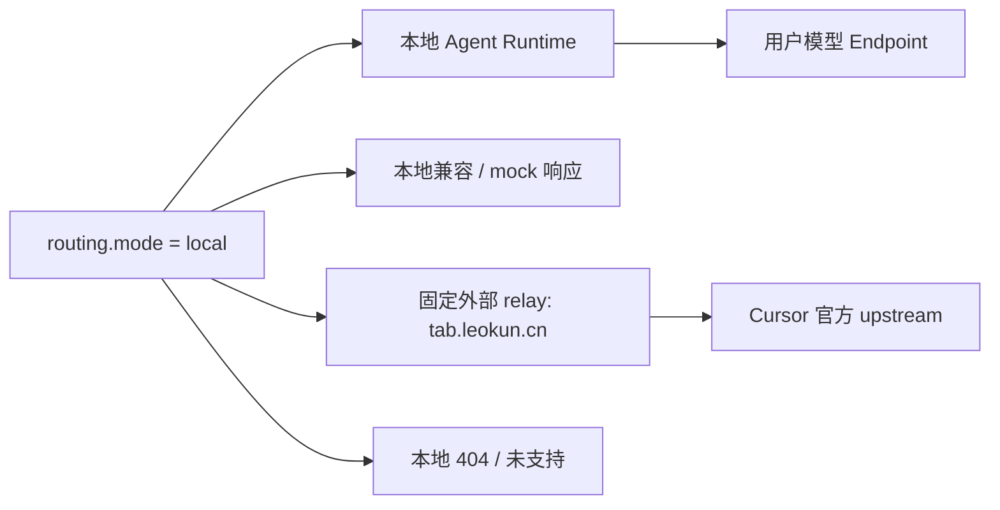
```mermaid
flowchart LR
    LocalMode["routing.mode = local"] --> Runtime[本地 Agent Runtime]
    LocalMode --> Compat[本地兼容 / mock 响应]
    LocalMode --> Relay[固定外部 relay: tab.leokun.cn]
    LocalMode --> Unsupported[本地 404 / 未支持]

    Runtime --> Provider[用户模型 Endpoint]
    Relay --> Official[Cursor 官方 upstream]
```

注释：`local` 表示优先使用本地策略处理 Cursor 请求，但不保证每一条 RPC 都在本机完成推理或业务处理。

## 4. 总体架构

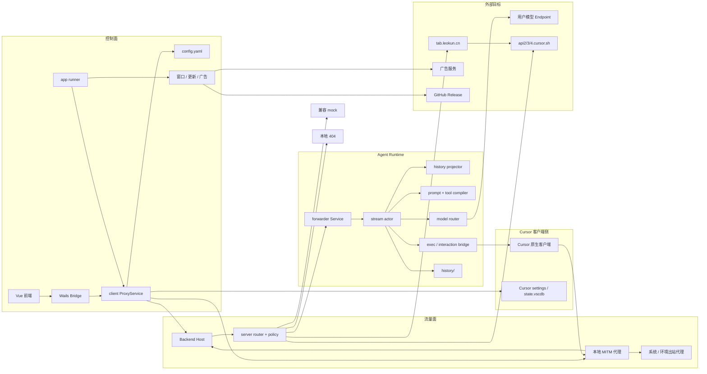
```mermaid
flowchart LR
    subgraph ControlPlane[控制面]
        FE[Vue 前端]
        Wails[Wails Bridge]
        AppRunner[app runner]
        ProxyService[client ProxyService]
        ConfigStore["config.yaml"]
        WindowUpdateAds[窗口 / 更新 / 广告]
    end

    subgraph CursorSide[Cursor 客户端侧]
        Cursor[Cursor 原生客户端]
        CursorSettings[Cursor settings / state.vscdb]
    end

    subgraph TrafficPlane[流量面]
        MITM[本地 MITM 代理]
        NetProxy[系统 / 环境出站代理]
        BackendHost[Backend Host]
        Router[server router + policy]
    end

    subgraph AgentPlane[Agent Runtime]
        Forwarder[forwarder Service]
        Actor[stream actor]
        Projector[history projector]
        PromptCompiler[prompt + tool compiler]
        ProviderRouter[model router]
        ToolBridge[exec / interaction bridge]
        HistoryStore["history/"]
    end

    subgraph External[外部目标]
        UserProvider[用户模型 Endpoint]
        TabRelay[tab.leokun.cn]
        CursorOfficial[api2/3/4.cursor.sh]
        AdsService[广告服务]
        Release[GitHub Release]
    end

    FE --> Wails --> ProxyService
    AppRunner --> ProxyService
    ProxyService --> ConfigStore
    ProxyService --> BackendHost
    ProxyService --> MITM
    ProxyService --> CursorSettings
    AppRunner --> WindowUpdateAds

    Cursor --> MITM
    MITM --> BackendHost
    MITM --> NetProxy
    BackendHost --> Router
    Router --> Forwarder
    Router --> TabRelay
    Router --> CursorOfficial
    Router --> CompatMock[兼容 mock]
    Router --> Unsupported404[本地 404]

    Forwarder --> Actor
    Actor --> HistoryStore
    Actor --> Projector
    Actor --> PromptCompiler
    Actor --> ProviderRouter
    ProviderRouter --> UserProvider
    Actor --> ToolBridge
    ToolBridge --> Cursor

    WindowUpdateAds --> AdsService
    WindowUpdateAds --> Release
    TabRelay --> CursorOfficial
```

注释：控制面负责“用户配置与本地服务生命周期”，流量面负责“让 Cursor 请求进入本地 backend”，Agent Runtime 负责“把 Cursor Agent 协议翻译成用户模型调用并回灌工具结果”。

### 4.1 控制面双集成导航

主窗口控制面按已批准计划拆成五条同层路由，由 [`frontend/src/router/index.js`](../frontend/src/router/index.js) 与 [`frontend/src/layouts/MainLayout.vue`](../frontend/src/layouts/MainLayout.vue) 共用一个壳。产品名称与保存合同见工作决策基线 §10.13。

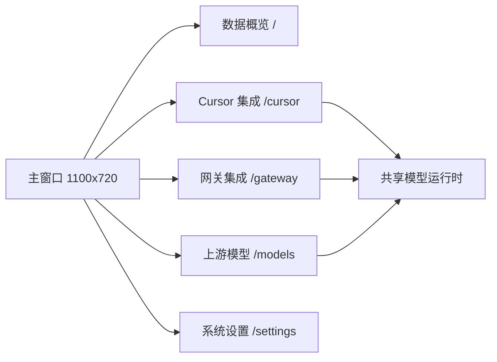
```mermaid
flowchart LR
    App[主窗口 1100x720]
    App --> Overview["数据概览 /"]
    App --> Cursor["Cursor 集成 /cursor"]
    App --> Gateway["网关集成 /gateway"]
    App --> Models["上游模型 /models"]
    App --> Settings["系统设置 /settings"]
    Cursor --> Runtime[共享模型运行时]
    Gateway --> Runtime
    Models --> Runtime
```

实现约束：

- 侧栏短名为「概览 / Cursor / 网关 / 模型 / 设置」；页面标题使用完整名称。Cursor 与 Gateway 显示运行状态圆点；Gateway 未启用显示「未启用」，运行失败显示告警。
- 旧 `/config` 重定向到 `/settings`，旧 `/model-config` 重定向到 `/models`。模型配置不再打开独立窗口。
- 离开 dirty 页面时由路由守卫确认并丢弃本页草稿；各页通过 `SaveCursorConfig` / `SaveGatewayConfig` / `SaveModelAdapters` / `SaveSystemSettings` 做 section 合并，不提交整份用户配置覆盖其他页。
- 启停 Cursor 只走 `StartProxy` / `StopProxy`；启停 Gateway 只走独立 `StartGateway` / `StopGateway`。两者不共用一个 `serviceBusy` 语义去阻塞对方生命周期。
- 本小节描述当前源码中的导航与保存接线。Wails 窗口视觉点击不属于本 PRD 的已确认运行证据。
- 已批准但未实现的四页 IA、`/access` 路由与小时桶见 §4.2、§10.2 与 §14.16；不得把那些合同写成当前源码行为。

### 4.2 控制面 v5 四页导航（已批准，未实现）

已批准的下一代控制面改为顶部四页，由未来的 `MainLayout` 顶部标签栏与 `/access` 接入中心承载。产品名称与保存合同见工作决策基线 §10.14。在代码落地前，本小节不是当前运行证据。

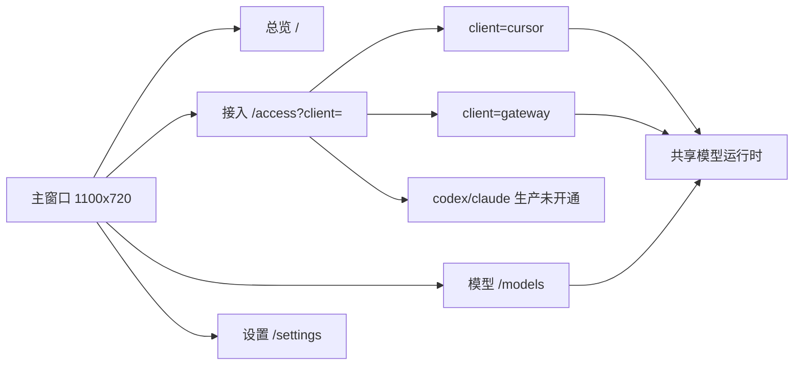
```mermaid
flowchart LR
    App[主窗口 1100x720]
    App --> Overview["总览 /"]
    App --> Access["接入 /access?client="]
    App --> Models["模型 /models"]
    App --> Settings["设置 /settings"]
    Access --> Cursor["client=cursor"]
    Access --> Gateway["client=gateway"]
    Access --> Future["codex/claude 生产未开通"]
    Cursor --> Runtime[共享模型运行时]
    Gateway --> Runtime
    Models --> Runtime
```

目标约束：

- 旧 `/cursor` → `/access?client=cursor`，`/gateway` → `/access?client=gateway`；`/config` → `/settings`，`/model-config` → `/models` 保持。
- 接入内部切换与离开页面都按当前 client 对应 scope 做 dirty 确认；保存仍是单 scope，禁止总保存。
- 接入/模型计数来自真实状态。Codex/Claude 生产面板为空态或 unsupported。
- 窗口最小尺寸仍为 `980×640`；系统主题与小时报告见 §10.2 / §14.16。

## 5. 模块职责边界

| 模块 | 主要路径 | 职责 | 不应承担的职责 |
| --- | --- | --- | --- |
| 桌面入口 | [`main.go`](../main.go)、[`internal/app/runner.go`](../internal/app/runner.go) | 启动 Wails 应用、注册 bridge service、创建窗口、托盘、广告和更新管理器 | 不直接处理 Cursor RPC 或 provider 协议 |
| 前端控制面 | [`frontend/src`](../frontend/src) | 展示配置、状态、指标、广告、更新与模型管理 UI | 不成为配置事实源；首屏缓存只做投影 |
| Bridge 服务 | [`internal/bridge`](../internal/bridge) | 暴露 Wails 调用边界，连接前端与 Go 服务 | 不直接拥有 Agent 会话事实 |
| 生命周期与 Cursor 接入 | [`internal/client`](../internal/client)、[`internal/cursor`](../internal/cursor) | 启停 backend/MITM，注入和清理 Cursor 设置，处理 Cursor 身份状态 | 不替代 backend 路由策略，不保存 prompt 历史 |
| MITM 与出站代理 | [`internal/mitm`](../internal/mitm)、[`internal/netproxy`](../internal/netproxy) | 接管 Cursor HTTPS 流量，保留原始上游 URL，转入本地 backend 或正常出站 | 不解释 protobuf 业务语义 |
| Backend Host | [`internal/backend/host.go`](../internal/backend/host.go) | 组装 server、config manager、forwarder module 与具体路由 | 不实现 provider 细节和工具执行细节 |
| Server 路由层 | [`internal/backend/server`](../internal/backend/server) | HTTP/Connect 包装、policy、错误编码、本地/上游 action 选择 | 不持久化 Agent history |
| Forwarder | [`internal/backend/forwarder`](../internal/backend/forwarder) | Bidi/RunSSE 主链路、会话持久化、prompt 投影、provider 驱动、工具回灌、usage | 不直接管理桌面窗口或 Cursor 设置 |
| Agent 协议与模型 | [`internal/backend/agent`](../internal/backend/agent) | Cursor protobuf 与 canonical message/tool/event 的转换，OpenAI/Anthropic 适配 | 不决定全局路由或广告/更新策略 |
| 配置管理 | [`internal/backend/server/config`](../internal/backend/server/config) | `config.yaml` 读写、默认值、迁移、模型 adapter 与 `observability` 规范化 | 不保存运行时会话事件 |
| 客户端可观测采集 | [`internal/observability`](../internal/observability) | 版本化事件、关联上下文、项目隐私标识、语义字段、写盘前凭据清洗、session、轮转、保留期与配额 | 不读取历史日志，不分析、不生成报告、不导出调查包 |
| 独立日志分析器 | [`tools/log-analyzer`](../tools/log-analyzer) | 独立 Wails/Vue GUI 与 CLI；GUI 启动后按稳定路径合同异步自动只读加载客户端默认日志根，无法加载时保留手动选择，加载事务可取消且仅发布最新请求；解析版本化日志、检索/重建链路、调查案例、对比复验、生成本机报告和用户主动导出的脱敏包 | 不导入客户端运行时，不进入客户端二进制/更新归档，不调用 AI、不修改代码或执行外部命令 |
| 广告 | [`internal/ads`](../internal/ads) | 本地广告 gate、缓存与 runtime 投影 | 不绕过 `advertising.enabled` 发请求 |
| 更新 | [`internal/updater`](../internal/updater) | 手动检查、下载确认、校验、安装确认和临时文件清理 | 不自动下载或跳过用户确认 |
| Tab relay 服务 | [`cursor-tab-server`](../cursor-tab-server) | 独立 relay，使用 Cursor token 转发 Tab/Cpp/FileSync/Git 相关 RPC 到官方 upstream | 不是根应用内嵌服务，不是用户 BYOK provider |

### 5.1 托管订阅凭据与 Codex 账户池

模型适配器只持久化 `credentialSource=codex|grok`，不保存订阅账户 ID 或运行时 token。`internal/subscriptionauth` 在请求进入 provider adapter 前解析当前激活账户，并仅将实际账户 ID 和 access token 放入当次内存请求；接入页通过脱敏的 `AccountStatus` 管理账户，不接触 token。

Codex 使用版本化的本机私有 `codex-auth.json`。旧 schema v1 单账户文件在首次读取时原子迁移为 schema v2 `accounts[]`，原账户保持激活；第一个新账户自动激活，后续导入或设备授权账户保持备用，重复导入只更新同一账户的凭据并保留其激活与用量状态。用户可在 Codex 接入页列出、激活、逐账户刷新用量和删除账户。

运行时遵循以下边界：

- `Resolve(codex)` 选择唯一激活且可用的账户；没有激活账户时选择第一个可用账户并持久化为 active。
- 401 只定向刷新原请求的账户。刷新成功后同账户重试一次；OAuth 明确认证失效时只标记该账户 `auth_required`，再选择备用账户。
- 只有明确 quota 错误且尚未产生模型事件、不是模型测试、共享 fallback budget 仍有余额时，才将失败账户标记为耗尽并切换到下一个可用账户；同一旧账户的重复耗尽信号不得再次推进 active。
- Codex 周窗口与会话窗口按账户存储。额度账户在已知重置时间到达后恢复候选资格；重置时间未知时通过逐账户刷新用量恢复。认证失效与仍处于额度阻塞期的账户不会被自动选中。
- 401 刷新和 quota 轮换都只允许一次内部重试；已产生输出后不切换账户，避免重复内容或副作用。

### 5.2 Rule 事实源、索引恢复与同步授权合同

Rule 正文的唯一事实源是应用私有 Rule 目录中的规范 Markdown 文件；文件名提供 Rule `id`，文件正文提供 `content`。docs index 同时承载 Rule 投影、用户上传文档与 `additional_docs`，因此它不是 Rule 事实源，也不能整体由 Rule 文件重建。

运行时遵循以下边界：

- reconciliation 只幂等替换或删除可识别的 Rule 投影，必须保留上传文档、`additional_docs` 和其他非 Rule 记录。损坏 index 先隔离，再恢复可从有效 Rule 文件重建的投影；无法恢复的上传记录不伪造。
- Rule CRUD 成功表示 Rule 文件已原子提交。索引更新失败只将投影标记为 dirty 并触发后续 reconciliation，不回滚已提交 Rule；dirty 未修复前 Rule Prompt 继续使用有效 Rule 文件，Rule 来源的 docs query fail closed，避免返回已删除的陈旧正文。
- Rule 文件无法恢复 `title`、`git_origin` 或 URL 时，重建仅使用 `title=id`，其他字段留空，不把推断值写成事实。
- 初始容量合同按字节计算：单 Rule 128 KiB、最多 128 个 Rule、磁盘 Rule 正文总量 1 MiB、单次 Prompt 注入 256 KiB。超限不截断；既有超限文件保留在磁盘但隔离，不进入 Prompt。
- Rule 远端同步为 `manual-opt-in`：默认纯本地，不允许后台自动上传正文。未来 consent 存在应用私有状态中，绑定脱敏 Cursor 控制面账号与 consent 版本，不进入普通 YAML 导入导出；关闭同步立即停止网络，不自动删除本地或远端副本。

### 5.3 managed Codex 缓存亲和合同

managed Codex 只在稳定本地账号身份、稳定 conversation 和逻辑 `ModelCallID` 均存在时启用亲和。应用私有订阅目录保存独立 32 字节 `codex-affinity.key`，不得复用观测密钥，也不得进入配置、Wails DTO、日志或导出。

- Router 使用 HMAC 域分离派生 `prompt_cache_key`、`session-id`、`thread-id` 和 `x-client-request-id`。前三项在同一稳定账号与同一 conversation 内稳定；请求 ID 额外绑定 `ModelCallID`，同一 HTTP retry 保持不变，不同逻辑请求唯一。
- 401 刷新后稳定账号不变时保持亲和；quota 切换账号后重新分区。token 指纹 fallback、邮箱和 `ChatGPTAccountID` 不直接作为亲和键。
- 只对 `credentialSource=codex` 且精确 ChatGPT Codex Responses 端点注入。调用方 body/header 同名值先删除或覆盖；`previous_response_id` 继续无条件剥离，`store=false` 保持。
- 内部 profile 为 `control | prompt_key | full`，空值或未知值回到 `control`。字段已注入不代表缓存收益；收益只能由后续 fake upstream、脱敏指标和同负载 A/B 证明。

## 6. 服务生命周期

### 6.0 重开 BYOK 复用已应用配置（2026-09-08）

用户确认退出保留接入配置，替代旧实现中已注入实例退出即清盘的行为。`ShutdownForQuitFrom` 仍幂等停止服务和 drain 请求，但不调用 `ClearCursorSettings`，代理设置、owner 文件及 `NODE_EXTRA_CA_CERTS` 保留。下一实例 `StartProxy` 继续由 `Plan.NeedsChange` 检查实际键值；一致时启动服务并按现有 `ApplyPlanned` 接管 owner，不触发退出 Cursor。首次/真变更仍走确认、正常退出、应用设置、重启及失败补偿，所有权锁不变。

显式 `StopProxy` 仍只清理本实例成功应用且持有所有权的配置；新进程未成功 Start 时不清理旧 owner。用户接受暂停期间代理不可用（包括期间重新打开 Cursor）；彻底断开需成功启动接管后停止。本次不引入遗留 owner 强制接管/自动清理，不将确认永久持久化。回退只恢复退出清理调用，原配置及所有权格式不迁移。

验收用隔离设置目录和服务端口验证“确认启动→退出→新实例启动”不再确认、backend/proxy 正常运行，并验证显式停止清理、真实设置变更仍确认和跨 owner 保护。系统 CA/钥匙串/launchctl/真实 Cursor 使用替身，实机证据另记。需求见工作决策基线 §10.14「Cursor 启动与重启」，执行与缺口见 `task/todo.md`。

服务启动链路由控制面发起，核心顺序如下：

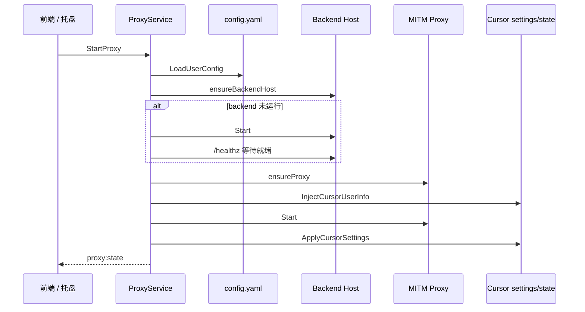
```mermaid
sequenceDiagram
    participant UI as 前端 / 托盘
    participant PS as ProxyService
    participant CFG as config.yaml
    participant BH as Backend Host
    participant MITM as MITM Proxy
    participant CUR as Cursor settings/state

    UI->>PS: StartProxy
    PS->>CFG: LoadUserConfig
    PS->>BH: ensureBackendHost
    alt backend 未运行
        PS->>BH: Start
        PS->>BH: /healthz 等待就绪
    end
    PS->>MITM: ensureProxy
    PS->>CUR: InjectCursorUserInfo
    PS->>MITM: Start
    PS->>CUR: ApplyCursorSettings
    PS-->>UI: proxy:state
```

停止链路按相反方向恢复：

1. 停止 MITM；
2. 清理 Cursor settings；
3. 停止 backend；
4. 更新前端状态。

核心约束：

- backend 默认监听 `127.0.0.1:18090`；MITM 默认监听 `127.0.0.1:18080`。
- Cursor 设置注入失败时，启动被视为失败，并回滚已启动的本地服务。
- 运行中唯一实例不应被无维护窗口替换；交接必须先启动候选、健康检查，再切换。

## 7. 请求进入 backend 后的路由逻辑

### 7.1 全局策略

`PolicyMiddleware` 根据配置中的 `routing.mode` 和是否存在 `X-Server-Upstream-URL` 计算执行模式：

- `local`：优先执行 route 的本地 action；
- `upstream`：优先执行 route 的 upstream action；
- 未识别值归一化为 `local`。

MITM 转入 backend 时保留原始目标 URL，因此 backend 可以在需要时做直连上游或固定改写。

### 7.2 路由类型

当前路由大致分为五类：

| 路由类型 | 行为 | 代表能力 | 能力口径 |
| --- | --- | --- | --- |
| 本地 runtime | Cursor RPC 进入 `forwarder`，最终调用用户模型 Endpoint | `BidiAppend`、`RunSSE`、Agent 工具循环 | 已确认实现 |
| 本地业务 handler | 本地保存或读取元数据/状态，返回 protobuf/JSON | Repository、Docs、Upload、部分 Dashboard | 部分支持或兼容响应 |
| 本地 compat/mock | 构造固定响应，满足 Cursor UI 或能力 gate | ServerTime、ServerConfig、Auth/Dashboard 部分接口 | 兼容响应 |
| 固定 relay | 无论 local/upstream，重写到 `https://tab.leokun.cn` | Tab/Cpp/FileSync/Git 相关 17 条 RPC | 外部依赖，待逐 RPC 决策 |
| 直连 upstream | 转发到 Cursor 原始上游或官方 API | upstream mode、部分 directUpstreamProcedure | 外部依赖 |

精确路由优先于通配路由。后续改动不能只看 `server.Any("/AiService/*")` 或通配 handler，就推断实际请求会命中本地实现。

### 7.3 固定 Tab relay 边界

当前 `tabServerBaseURL` 固定为 `https://tab.leokun.cn`。`tabServerUpstreamProcedure` 的行为是：

1. 保留请求 path 与 query；
2. 将 scheme/host 改为 `tab.leokun.cn`；
3. 同一 action 同时注册为 `Local` 与 `Upstream`；
4. 使用 upstream direct action 转发 body 与大部分 headers；
5. 审计标记开启，但专用隐私审计仍默认关闭且只允许脱敏元数据。

这意味着：

- 这些 RPC 不属于纯本地 BYOK；
- local mode 下仍可能访问 `tab.leokun.cn`；
- relay 侧再转发 Cursor 官方 upstream 的行为来自 `cursor-tab-server` 源码设计，但不能单凭源码证明线上实例版本；
- 当前决策是暂不阻断、不替换，先完成逐 RPC 功能影响、凭据和隐私验证。

## 8. Agent 主业务链路

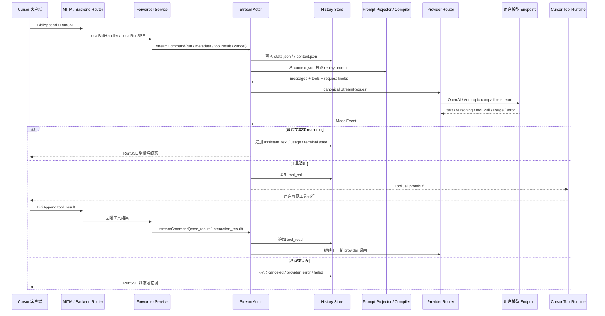
```mermaid
sequenceDiagram
    participant C as Cursor 客户端
    participant M as MITM / Backend Router
    participant F as Forwarder Service
    participant A as Stream Actor
    participant S as History Store
    participant P as Prompt Projector / Compiler
    participant R as Provider Router
    participant L as 用户模型 Endpoint
    participant T as Cursor Tool Runtime

    C->>M: BidiAppend / RunSSE
    M->>F: LocalBidiHandler / LocalRunSSE
    F->>A: streamCommand(run / metadata / tool result / cancel)
    A->>S: 写入 state.json 与 context.json
    A->>P: 从 context.json 投影 replay prompt
    P->>A: messages + tools + request knobs
    A->>R: canonical StreamRequest
    R->>L: OpenAI / Anthropic compatible stream
    L-->>R: text / reasoning / tool_call / usage / error
    R-->>A: ModelEvent
    alt 普通文本或 reasoning
        A->>S: 追加 assistant_text / usage / terminal state
        A-->>C: RunSSE 增量与终态
    else 工具调用
        A->>S: 追加 tool_call
        A-->>T: ToolCall protobuf
        T-->>C: 用户可见工具执行
        C->>M: BidiAppend tool_result
        M->>F: 回灌工具结果
        F->>A: streamCommand(exec_result / interaction_result)
        A->>S: 追加 tool_result
        A->>R: 继续下一轮 provider 调用
    else 取消或错误
        A->>S: 标记 canceled / provider_error / failed
        A-->>C: RunSSE 终态或错误
    end
```

核心业务规则：

- `BidiAppend` 是 Cursor 上行事实进入本地系统的主要入口。
- `RunSSE` 是本地系统向 Cursor 输出模型事件、工具事件和终态的主要下行通道。
- stream actor 是单个请求的串行状态所有者，provider、工具、取消、timer 和 compaction 都以 command 进入 actor。
- provider 事件不直接写 UI；必须先归一化成内部事件，再持久化、广播或触发工具。
- 工具结果不是独立完成态；它必须回灌进会话事实，并推动下一轮 provider 调用或终态。
- `ForceBackgroundShell` 的无 reasoning replay 只是特定兼容例外，不能泛化到所有孤立 `tool_result`。

## 9. 状态机与持久化分层

当前存在两层状态，不能混用。

### 9.1 live stream actor phase

actor phase 描述当前进程内某个活动请求的推进阶段：

- `idle`：等待输入；
- `provider_running`：模型调用中；
- `waiting_external`：等待工具、交互或外部事件；
- `awaiting_user`：等待用户输入；
- `compacting`：上下文压缩中；
- `completed`：本轮完成；
- `failed`：本地处理失败；
- `canceled`：本轮取消。

这是运行时协调状态，主要用于 actor 串行化、timer、取消、恢复和 RunSSE 终态。

### 9.2 conversation loop status

`state.json` 中的 loop status 是跨进程可恢复的会话元状态：

- `idle`：没有正在推进的 loop；
- `running`：本轮输入或中间上下文已落盘，正在推进；
- `waiting_tool`：已落完整 tool call，等待工具结果；
- `completed`：本轮正常完成；
- `canceled`：本轮被取消；
- `provider_error`：provider 调用失败；
- `failed`：本地投影、持久化、usage 或桥接失败。

`state.json` 不保存可投射给 LLM 的历史正文；可回放事实以 `context.json` 为准。

## 10. 事实源与数据流

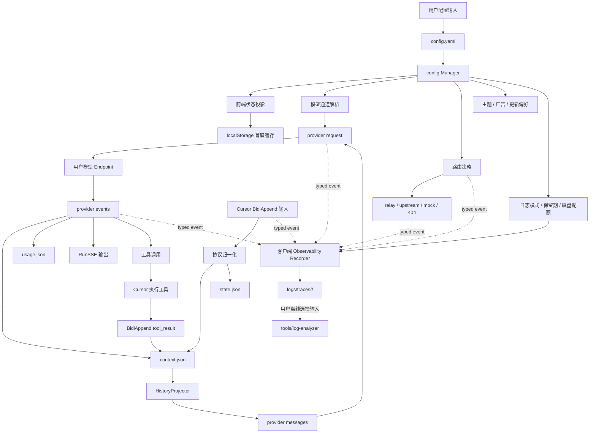
```mermaid
flowchart TD
    UserConfig[用户配置输入] --> ConfigYaml["config.yaml"]
    ConfigYaml --> ConfigManager[config Manager]
    ConfigManager --> FrontendProjection[前端状态投影]
    FrontendProjection --> LocalStorage[localStorage 首屏缓存]
    ConfigManager --> ChannelResolver[模型通道解析]
    ConfigManager --> RoutingPolicy[路由策略]
    ConfigManager --> ClientPrefs[主题 / 广告 / 更新偏好]
    ConfigManager --> CapturePolicy[日志模式 / 保留期 / 磁盘配额]

    CursorInput[Cursor BidiAppend 输入] --> InboundNormalize[协议归一化]
    InboundNormalize --> ContextJson["context.json"]
    InboundNormalize --> StateJson["state.json"]

    ContextJson --> Projector[HistoryProjector]
    Projector --> PromptMessages[provider messages]
    PromptMessages --> ProviderRequest[provider request]
    ChannelResolver --> ProviderRequest
    ProviderRequest --> UserEndpoint[用户模型 Endpoint]
    UserEndpoint --> ProviderEvents[provider events]

    ProviderEvents --> ContextJson
    ProviderEvents --> UsageJson["usage.json"]
    ProviderEvents --> RunSSE[RunSSE 输出]
    ProviderEvents --> ToolCall[工具调用]
    ToolCall --> CursorTools[Cursor 执行工具]
    CursorTools --> ToolResult[BidiAppend tool_result]
    ToolResult --> ContextJson

    RoutingPolicy --> RelayOrUpstream[relay / upstream / mock / 404]

    CapturePolicy --> Recorder[客户端 Observability Recorder]
    CursorInput -. typed event .-> Recorder
    RoutingPolicy -. typed event .-> Recorder
    ProviderRequest -. typed event .-> Recorder
    ProviderEvents -. typed event .-> Recorder
    RelayOrUpstream -. typed event .-> Recorder
    Recorder --> TraceLogs["logs/traces/<session>/"]
    TraceLogs -. 用户离线选择输入 .-> Analyzer["tools/log-analyzer"]
```

事实源约束：

- `config.yaml` 是模型、监听地址、routing、主题、广告、更新策略和 `observability` 采集策略的持久化事实源。
- 前端 `localStorage` 只用于首屏缓存和 UI 投影，不能成为第二份配置事实源。
- `context.json` 是 provider replay 和会话语义恢复的事实源。
- `state.json` 只保存会话元数据、loop 状态、序号和当前状态投影。
- `usage.json` 是聚合 token/usage 指标事实源，不从 conversation 文件现场扫描重算。
- `conversation.lock` 保护同一 conversation 的并发写入。
- `logs/traces/<session>/events.jsonl` 和 payload 文件是版本化诊断输入，不是业务事实源；客户端不得反向读取它们驱动路由、会话或 UI 状态。
- `basic` 日志禁止正文；用户明确启用的本机 `full` 可以保存写盘前已清除凭据的业务原文。广告缓存、更新临时包、审计文件和任何日志模式都不得包含 API Key、Authorization、Cookie 或完整敏感 headers。

### 10.1 数据概览 metrics report 数据流

数据概览不扫描 `context.json` 或 `recent_events` 现场重算历史。趋势、日历热力图和范围内 KPI 都从 `usage.json` 的 `daily[]` 投影。

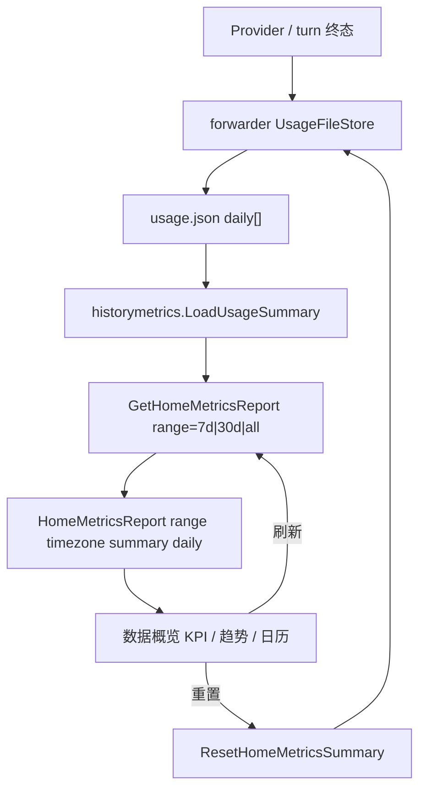
```mermaid
flowchart TD
    ProviderEvents[Provider / turn 终态] --> UsageStore[forwarder UsageFileStore]
    UsageStore --> UsageJson["usage.json daily[]"]
    UsageJson --> LoadSummary[historymetrics.LoadUsageSummary]
    LoadSummary --> FilterRange["GetHomeMetricsReport range=7d|30d|all"]
    FilterRange --> Report["HomeMetricsReport range timezone summary daily"]
    Report --> HomeUI[数据概览 KPI / 趋势 / 日历]
    HomeUI -->|刷新| FilterRange
    HomeUI -->|重置| ResetUsage[ResetHomeMetricsSummary]
    ResetUsage --> UsageStore
```

合同：

- Wails 入口是 [`internal/bridge/metrics.go`](../internal/bridge/metrics.go) 的 `GetHomeMetricsReport(rangeName)`；前端经 `getHomeMetricsReport` 写入 `appState.homeMetricsReport`。
- `range` 只实现 `7d`、`30d`、`all`，未知值归一为 `all`。`7d`/`30d` 按 UTC 日历日截取含今天在内的最近 N 天；空日期由前端热力图按区间补零，后端不虚构小时桶。
- `timezone` 固定返回 `UTC`，与现有 usage 写入口径一致。页面必须标明该时区。
- `summary` 由过滤后的 `daily[]` 再聚合：`providerCallsTotal`、`turnsTotal`、`validTurnsTotal`、`invalidTurnsTotal`、Token 与缓存命中率。`providerCallsTotal` 不得被前端映射成 `turnsTotal`。
- 全量 KPI 仍可通过 `GetHomeMetricsSummary` 读取；概览趋势切换必须以 report 接口为准，保证 KPI 与图表使用同一范围。
- 重置只调用 `UsageFileStore.Reset()`，清零聚合与 `daily[]`，不删除会话 history。
- 读取失败必须把错误投影到页面并提供重试；无 `daily[]` 时保留零值 KPI 并显示「暂无按日数据」。
- 已批准的 `24h` 小时桶尚未实现，见 §10.2。当前已交付合同仍仅为 daily `7d|30d|all`。

### 10.2 v5 小时 usage 报告（已批准，未实现）

v5 总览需要 `24h` 小时粒度，但小时序列不得从 `recent_events` 推断。必须先扩展 `usage.json` 持久小时聚合，再扩展 `GetHomeMetricsReport`。

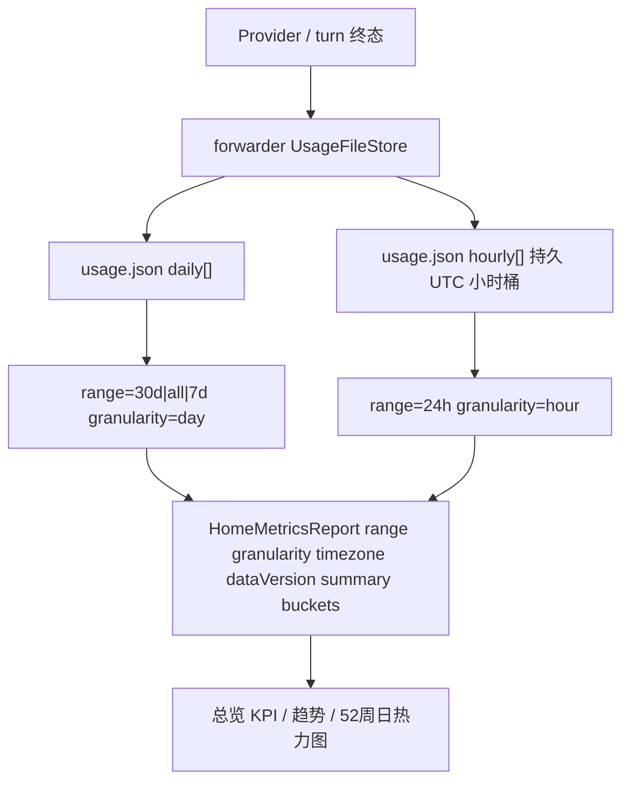
```mermaid
flowchart TD
    ProviderEvents[Provider / turn 终态] --> UsageStore[forwarder UsageFileStore]
    UsageStore --> Daily["usage.json daily[]"]
    UsageStore --> Hourly["usage.json hourly[] 持久 UTC 小时桶"]
    Daily --> DayReport["range=30d|all|7d granularity=day"]
    Hourly --> HourReport["range=24h granularity=hour"]
    DayReport --> Report["HomeMetricsReport range granularity timezone dataVersion summary buckets"]
    HourReport --> Report
    Report --> HomeUI[总览 KPI / 趋势 / 52周日热力图]
```

合同：

- 小时桶在写入 usage 时与日桶一并原子更新；保留至少最近 48 个完整 UTC 小时，更旧小时可修剪。日桶仍服务 `30d`/`all` 与 52 周热力图。
- 旧文件无 `hourly` 时：日报告继续可读；`24h` 返回空桶并显式「无小时数据」，禁止用日桶、正弦图或 `recent_events` 补造。
- 报告字段至少包括 `range`、`granularity`、UTC 起止、`dataVersion`/`generatedAt`、桶数组和同一版本 `summary`。`24h` 不得展示日数据冒充小时；`30d`/`all` 不得伪造小时数据。
- Token 与缓存命中率使用双轴或独立轨道。重置清零 daily 与 hourly，不删除 `history/<conversation-id>/`。
- 回滚小时 UI 时保留已迁移的小时字段和既有 `7d|30d|all` 日报告。

## 11. 模型适配与 provider 数据流

模型调用链路如下：

1. 用户在配置中保存 `displayName`、`type`、`baseURL`、`apiKey`、`modelID`、协议 endpoint、额外参数、headers 和上下文窗口等字段。
2. 配置归一化后生成运行时模型通道 ID。该 ID 由 URL、model、key、name、endpoint 等组成的短 hash 表示，不直接等于 `modelID`。
3. Agent Runtime 根据 Cursor 请求中的模型标识解析实际通道。
4. `model/router.go` 只分发到 `openai` 或 `anthropic` adapter。
5. OpenAI adapter 支持 Responses、Chat Completions 和 Custom endpoint；Anthropic adapter 支持 Messages 风格请求。
6. provider 返回的 text、reasoning、tool call、usage 和 error 被归一化为 `ModelEvent`，再由 actor 决定写 history、发 RunSSE、调工具或终止。

关键边界：

- 用户模型 Endpoint 属于默认允许目标，但仍应执行最小 headers/payload 策略。
- 自定义 headers 与额外参数只应进入用户显式配置的模型请求，不应扩散到 Tab relay、官方 upstream、广告或更新请求。
- provider adapter 不拥有 Cursor 路由决策；它只负责把 canonical request 转成具体模型协议。

## 12. 工具能力与回灌链路

工具目录由静态 prompt 资产加载，再按 mode 过滤。当前主要模式包括：

- Agent；
- Ask；
- Plan；
- Debug；
- Multitask；
- child conversation / subagent 场景。

工具调用链路是：

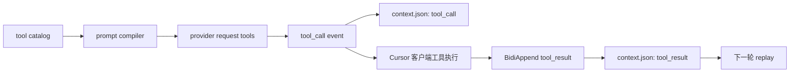
```mermaid
flowchart LR
    ToolCatalog[tool catalog] --> PromptCompiler[prompt compiler]
    PromptCompiler --> Provider[provider request tools]
    Provider --> ToolCallEvent[tool_call event]
    ToolCallEvent --> HistoryToolCall["context.json: tool_call"]
    ToolCallEvent --> CursorTool[Cursor 客户端工具执行]
    CursorTool --> ToolResultEvent[BidiAppend tool_result]
    ToolResultEvent --> HistoryToolResult["context.json: tool_result"]
    HistoryToolResult --> Projector[下一轮 replay]
```

能力判断：

- 文件、搜索、shell、MCP、浏览器/网络类工具的业务执行主体通常是 Cursor 客户端或工具桥，本地 backend 负责协议转换、生命周期、展示和结果回灌。
- 工具是否“可展示”、是否“可被 provider 调用”、是否“有 dispatch 路径”、是否“可 replay”，是四个不同判断。
- 修改工具目录、prompt、dispatch 或 projector 任一处，都可能导致工具循环断裂。

## 13. 能力地图

### 13.1 已确认实现

- 本地桌面控制面：窗口、托盘、服务启停、状态投影。
- 本地 backend 与 MITM：监听、健康检查、Cursor 请求接管、原始 upstream URL 保留。
- Agent 主链路：`BidiAppend`、`RunSSE`、多轮对话、流式输出、thinking/reasoning、usage、错误和终态。
- 模型适配：OpenAI Responses、OpenAI Chat Completions、OpenAI Custom endpoint、Anthropic Messages。
- 用户模型配置：自定义 Endpoint、API Key、模型 ID、额外参数、custom headers、上下文窗口和输出 token 控制。
- 工具循环：工具调用发起、Cursor 执行、结果回灌、继续 provider 调用。
- 会话事实：`context.json`、`state.json`、conversation lock、prompt replay、checkpoint、compaction、usage 聚合。
- 客户端体验治理：默认浅色、广告默认关闭、更新默认手动、配置统一持久化。
- 专用隐私审计：默认关闭，只允许字段 presence、大小、事件类型、host 分类等脱敏元数据。

### 13.2 部分支持

- Repository / Codebase Index：存在 handshake、状态和元数据处理，但缺少完整 ingest、chunk、embedding、向量检索和增量依赖图。
- Docs / Knowledge：可保存 identifier、标题、URL 或单块内容，但缺少完整抓取、解析、分块、embedding 和相关性排序。
- Upload：部分接口有本地副作用，但成功响应不能等同于完整上传或索引完成。
- GenerateImage / 多模态：存在结构和结果映射能力，但端到端 provider 图片生成与附件兼容仍需验证。
- Git 辅助：存在本地 handler 和静态调用链分析，但部分真实 transport 仍未完全解析。
- MCP / Task / shell 恢复：主路径可用，但不同 Cursor 版本下取消、权限拒绝、重连和后台恢复仍需更多契约测试。

### 13.3 兼容响应

以下能力主要用于维持 Cursor UI、启动流程、能力 gate 或避免重试，不应计入真实业务覆盖率：

- ServerTime、ServerConfig、AvailableModels 等部分启动/配置 RPC；
- Auth、Dashboard、Statsig 等部分账号、计费、团队和策略接口；
- Repository/Docs/Upload 中仅返回成功但未消费完整内容的接口；
- 未经验证的 no-op 成功或固定 protobuf 响应。

兼容响应的原则是：默认保留，直到证明移除或改为 failure 不会破坏 Cursor 状态机。

### 13.4 外部依赖

- Cursor Tab / Cpp / next edit / 部分 FileSync / 部分 Git RPC 当前依赖 `tab.leokun.cn` relay。
- relay 设计上依赖 Cursor 官方 upstream 与服务端 Cursor token。
- 全局 `upstream` 模式会把相应请求转给 Cursor 原始上游。
- 广告和更新在本地开关允许时分别依赖广告服务和 GitHub Release。

这些能力不能描述为纯本地 BYOK。

### 13.5 待验证或不支持

- 17 个 relay RPC 的完整触发条件、重试、privacy mode 和逐 RPC 替代策略。
- 用户 Cursor token 的合法导入、Keychain、刷新、身份隔离和 `local_official` / `external_relay` 双模式实现。
- Cursor 官方完整云端仓库索引、跨设备同步、团队/企业管理、Background/Cloud Agent。
- OpenAI/Anthropic 之外 provider 的原生协议。
- 未注册或新版本实验 RPC 的本地兼容。
- 完整 Cursor 跨版本 E2E 和浏览器/前端自动化测试矩阵。

## 14. 隐私、审计与外发边界

### 14.1 默认允许目标

- 用户显式配置的模型 Endpoint；
- Cursor 官方 upstream：`api2.cursor.sh`、`api3.cursor.sh`、`api4.cursor.sh`。

默认允许不代表允许携带任意字段。所有外发都必须遵循最小 headers、最小凭据和最小 payload。

### 14.2 非默认信任目标

`tab.leokun.cn` 当前不属于默认信任区，但因承担 Tab/Cpp/FileSync/Git 等能力，现状暂不阻断、不替换。

任何切换到官方直连、本地 no-op、本地实现或禁用的方案，都必须先验证：

- 请求实际携带的 token 类型；
- 官方 upstream 是否接受该 token；
- Cursor UI 是否进入重试、禁用或错误状态；
- 该 RPC 是否携带源码、路径、diff、编辑历史、workspace、文件内容或凭据；
- 替代路径是否会错误推进 Cursor 状态机。

### 14.3 客户端采集与离线分析边界

客户端采集与离线分析必须保持单向、文件协议解耦：

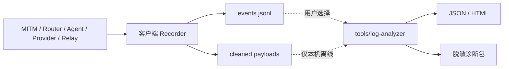
```mermaid
flowchart LR
    Runtime[MITM / Router / Agent / Provider / Relay] --> Recorder[客户端 Recorder]
    Recorder --> Basic[events.jsonl]
    Recorder --> Full[cleaned payloads]
    Basic -. 用户选择 .-> Analyzer[tools/log-analyzer]
    Full -. 仅本机离线 .-> Analyzer
    Analyzer --> Report[JSON / HTML]
    Analyzer --> Bundle[脱敏诊断包]
```

注释：客户端只写采集产物，不读取历史日志、不调度分析、不生成报告；分析器以独立进程和独立安装包运行，不进入客户端二进制或更新归档。客户端只允许通过受限启动参数传入可信日志根。

- `basic` 默认启用，只记录事件形态、关联 ID、路由目标、状态、耗时、字节数和错误分类。
- `full` 由用户明确启用，可记录经过凭据清洗的业务语义原文，并必须受保留期、总磁盘配额和已关闭 session 清理规则约束。
- `Authorization`、Cookie、API Key、token/secret/credential、自定义敏感 header 和敏感 query 参数在序列化前强制移除；未知且无法安全解析的二进制 body 不得原样保存。
- 客户端和 `tools/log-analyzer` 只共享带 `schema_version` 的文件协议。分析器只读输入，报告和脱敏包只能由用户主动写到显式输出目录，不得自动上传。

#### DESIGN-LOG-ANALYZER-SQLITE-001：离线分析器临时 SQLite 流式工作区

- **Design Readiness**：`approved`
- **适用范围**：仅 `tools/log-analyzer` 独立 Go module；客户端、relay、Wails、采集协议、根 module 和客户端发布归档均不改动。
- **关联计划**：`.cursor/plans/分析器临时_sqlite_内存优化_b65b3628.plan.md`
- **问题机制**：当前分析器先把 current 与 baseline 的全部事件加载到 `contract.Dataset.Events`，再在 `analyze` 中构造 trace map、target/finding/trace/comparison 切片，最后在 `report` 中对完整 Report/Dataset 生成 JSON、HTML 和 ZIP。峰值内存由事件切片、trace 分组和报告派生切片叠加，随事件总量、trace 数、finding 数和单 trace 高基数状态线性增长。
- **采用机制**：每次 CLI 分析创建一次 OS 私有临时 SQLite workspace，输入逐行校验并批量写入；SQLite 负责有界存储、确定性排序、索引和机械聚合，Go reducer 只保留当前 trace 或受限大小的状态；报告从只读游标分段写出。临时库是运行内 scratch，不是持久数据库、缓存或新产品能力。
- **可证伪结果**：若实现后生产路径仍返回完整 `contract.Dataset.Events`、完整 `analyze.Report`，或在单 trace 百万唯一 tool ID 场景下 Go heap 随唯一 ID 线性增长，则该设计失败。

##### 现实证据

| 事实 | evidence_status | 当前锚点 |
|---|---|---|
| `contract.Dataset.Events []Event` 是全量驻留入口 | verified | `tools/log-analyzer/internal/contract/contract.go` |
| `load.Dataset` 读取所有事件后全局排序 | verified | `tools/log-analyzer/internal/load/load.go` |
| `analyze.Dataset` 构造 trace map 和完整派生切片 | verified | `tools/log-analyzer/internal/analyze/analyze.go` |
| `report.WriteAll` 持有完整 Report/Dataset，并对 JSON/HTML/ZIP 全量输出 | verified | `tools/log-analyzer/internal/report/report.go` |
| CLI 同时持有 current 与可选 baseline Dataset | verified | `tools/log-analyzer/cmd/log-analyzer/main.go` |
| `modernc.org/sqlite v1.50.1` 可作为纯 Go 驱动候选 | verified | 本机离线 probe：`sqlite_version=3.53.1`；`CGO_ENABLED=0` darwin arm64/amd64、linux amd64、windows amd64 均构建通过 |
| 客户端与分析器只共享文件协议，分析器不得进入客户端发布包 | verified | 本文 §14.3、§15.10；`Taskfile.yml` 的 `release:verify:analyzer-isolation` |

Phase 0 取证结果：

- 当前分析器测试通过：`cd tools/log-analyzer && go test ./...`。
- schema-v1 fixture CLI：`events=6 traces=1 findings=0`。
- characterization CLI：`events=7 traces=3 findings=10`；覆盖 unknown schema warning、open/degraded manifest、orphan trace、missing terminal、slow/error、tool result missing 和 baseline comparison。
- ZIP 脱敏基线：未命中 `should-not-export`、`Bearer`、`payloads/`、`/Users/example`、`api_key=secret`、`token=secret`。
- SQLite 探针二进制体积：darwin/arm64 9,355,650 bytes；darwin/amd64 9,617,760 bytes；linux/amd64 9,357,654 bytes；windows/amd64 9,656,832 bytes。
- 许可证链：`modernc.org/sqlite` 为 BSD-3-Clause，内嵌 SQLite 为 Public Domain；`modernc.org/libc`、`memory`、`mathutil`、`google/uuid`、`remyoudompheng/bigfft`、`golang.org/x/sys` 为 BSD-3-Clause；`dustin/go-humanize`、`ncruces/go-strftime`、`mattn/go-isatty` 为 MIT。当前证据未发现 copyleft 依赖。
- sumdb 网络探针曾超时；最终使用本机 module cache、`GOPROXY=off`、`GOSUMDB=off` 完成离线构建。该超时是环境网络事实，不影响驱动纯 Go 可构建结论。

##### 模块职责与调用方向

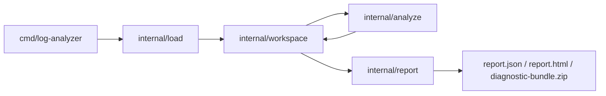
```mermaid
flowchart LR
    CLI[cmd/log-analyzer] --> Load[internal/load]
    Load --> Workspace[internal/workspace]
    Workspace --> Analyze[internal/analyze]
    Analyze --> Workspace
    Workspace --> Report[internal/report]
    Report --> Out[report.json / report.html / diagnostic-bundle.zip]
```

- `internal/contract`：只保留 schema v1 Event/Manifest DTO 与公开报告 DTO 的字段语义；删除承载运行状态的 `Dataset.Events`。兼容输出 DTO 可保留，但不得作为全量中间态。
- `internal/workspace`：唯一拥有临时目录、DB 文件、DDL、PRAGMA、事务、查询端口、派生表、scratch 表、staging cleanup 和幂等清理。它不拼 finding 文案，不拥有业务规则。
- `internal/load`：拥有输入参数顺序、目录发现、去重、逐行 JSON decode、schema/必填校验、line 上限和 batch 提交。它不返回事件切片。
- `internal/analyze`：拥有 trace key、terminal/provider/RunSSE/tool-call 配对、target summary、finding、comparison 和确定性规则。业务状态机保持 Go 表达，不能扩散为难维护 SQL 规则。
- `internal/report`：拥有 JSON/HTML/ZIP 外部格式、转义、伪名化、fields allowlist、warning/message 清洗、staging 发布和输出权限。它只能通过 workspace 只读端口取数。
- `cmd/log-analyzer`：只编排 `validate output isolation → open workspace → ingest current/baseline → analyze → stage reports → cleanup workspace → publish → stdout`。

##### 数据合同

SQLite 逻辑 schema 以最小可查询列为准，禁止保存完整原始 JSON、payload、`payload_ref`、未 allowlist 的 fields、Prompt、源码、diff、完整 header/body、Token、API Key、Cookie 或 Authorization。

| 表 | 生命周期 | 关键字段与语义 |
|---|---|---|
| `schema_meta` | workspace 全程 | `version=1`，用于实现内部 DDL 版本检查，不是外部日志 schema |
| `datasets` | workspace 全程 | `id`、`kind=current|baseline`、`status=ingesting|ingested|analyzing|analyzed`、event/manifest/warning 计数 |
| `input_arguments` | workspace 全程 | CLI 参数 ordinal、绝对路径、dataset kind；用于 `report.json.inputs` 兼容 |
| `input_files` | workspace 全程 | canonical path、file type、first argument ordinal；`UNIQUE(dataset_id, canonical_path)` 去重重叠输入 |
| `manifests` | workspace 全程 | schema、session id、mode、status、started/closed、payload_degraded、dropped_events；last_error 只保存清洗后文本 |
| `warnings` | workspace 全程 | dataset、ordinal、清洗前内部 warning 文本；报告/ZIP 边界再次清洗 |
| `events` | workspace 全程 | dataset、source file id、line、timestamp seconds/nanoseconds、canonical timestamp、sequence key、ingest order、trace key、结构化事件列、`safe_fields_json` |
| `trace_summaries` | 分析后 | current trace summary 标量；baseline 默认不写 trace summary |
| `trace_layers` / `trace_targets` | 分析后 | current trace 的 distinct layer/target，供报告游标读取 |
| `target_summaries` | 分析后 | current/baseline target 聚合，供 comparison 计算 |
| `findings` | 分析后 | current findings；唯一键为 `severity + code + message + trace_key`，另存 `first_ingest_order` 用于稳定排序 |
| `comparisons` | 分析后 | 以 target 为比较键的 current/baseline 差异 |
| `trace_pair_state` / `trace_tool_state` | 单 trace 分析期间 | 超大 trace 的 scratch 溢写状态；trace finalize 后必须删除 |

关键键和类型：

- trace 身份键：非空 `trace_id`；否则 `orphan:<app_session_id>:<sequence>`，保持当前 orphan 语义。
- timestamp：拆为 `timestamp_seconds INTEGER` 与 `timestamp_nanoseconds INTEGER`，另存 canonical RFC3339Nano 字符串，避免 `UnixNano` 溢出并保持导出格式。
- sequence：Go 侧为 `uint64`。SQLite 不直接用 signed INTEGER 保存原值；使用 20 位零填充十进制 `sequence_key TEXT` 排序与导出，保证 `0..MaxUint64` 顺序无损。
- ingest order：同 dataset 严格递增 `INTEGER`，作为最终并列裁决键。
- safe fields：导入时只保留现有 allowlist：`method`、`status_code`、`client_kind`、`message_case`、`kind`、`finish_reason`、`ttft_ms`、`append_seqno`。

##### 确定性算法合同

- 输入参数按 CLI 出现顺序登记；目录内候选文件按 canonical path 字典序；同一 canonical file 只处理第一次出现。
- 事件全局顺序：`timestamp_seconds ASC, timestamp_nanoseconds ASC, sequence_key ASC, ingest_order ASC`。
- trace reducer 顺序：`trace_key ASC, timestamp_seconds ASC, timestamp_nanoseconds ASC, sequence_key ASC, ingest_order ASC`。
- trace 输出顺序：`trace_key ASC`；target/comparison 输出：`target ASC`；warnings：`ordinal ASC`。
- findings 输出：`severity_rank DESC, first_ingest_order ASC, code ASC, message ASC, trace_key ASC`。这会消除当前同 severity finding 受 map 遍历影响的非确定性；该变化只稳定报告顺序，不改变 finding 语义、数量或字段。
- current 才生成 trace/finding；baseline 只参与 target summary 与 comparison。

##### 执行、一致性与失败恢复

- workspace 使用 `os.MkdirTemp(os.TempDir(), "cursor-log-analyzer-*")` 创建；Unix 目录 `0700`，DB 文件预创建 `0600` 后再 `sql.Open`。Windows 不承诺 POSIX mode；实现以私有临时目录、当前用户 ACL、不可进入输出/ZIP、可清理作为安全合同，并在 Phase 5 记录 Windows 运行证据。
- 数据库单连接：`SetMaxOpenConns(1)`、`SetMaxIdleConns(1)`。
- PRAGMA：`journal_mode=DELETE`、`synchronous=NORMAL`、`foreign_keys=ON`、`temp_store=FILE`、`mmap_size=0`、`cache_size=-8192`。这里 `cache_size=-8192` 表示约 8 MiB page cache 初始预算；Phase 5 内存验收若反证该值不足，只能在 Design 中记录证据后调整。
- 输入 line 上限：event JSONL 单行 8 MiB，manifest 1 MiB。批次阈值：最多 5,000 events 或累计 16 MiB JSON bytes，先到即提交。
- 导入批次使用 prepared statement + transaction；malformed JSON、unsupported schema、必填缺失、line 超限、读错误或 DB 错误立即停止。已提交临时批次不对用户可见，因为失败路径删除整个 workspace。
- reducer 使用 keyset 分块，不用 `OFFSET`。每个读块关闭 rows 后才批量写派生表，避免单连接上长读游标与写事务互相阻塞。
- started/finished、provider、RunSSE、tool-call 配对 map 的 Go 内存上限为 8,192 entries/trace；超过阈值即 UPSERT 到 scratch 表并清空 Go map。trace finalize 时合并 scratch + 当前状态，写 summary/finding 后删除该 trace scratch。
- 任一阶段失败：关闭 rows/stmt/tx → 关闭 DB → 删除 SQLite sidecar → 删除 DB 文件 → 删除 temp dir。清理失败会导致 CLI 非零，不打印成功摘要。
- 进程被 `SIGKILL` 时 defer 不运行，可能遗留 OS temp 前缀目录；实现不得在下次运行扫描或删除其他进程的 workspace，只依赖 OS 临时目录策略。
- 正式输出先写到 `-out` 下私有 staging；三个文件全部 flush/close 成功并完成 workspace 清理后再发布。发布失败时恢复上一份受管文件；不得留下新旧混合报告。

##### 接口与兼容合同

- CLI 参数保持：`-input`、`-baseline`、`-out`、`-allow-unknown-schema`；不新增 SQLite 公开参数。
- 成功摘要保持 `分析完成: events=<n> traces=<n> findings=<n> output=<abs>`。
- `report.json` 字段名、类型、`omitempty` 和 current/baseline 语义保持兼容；`generated_at` 仍为一次运行统一 UTC 时间。
- HTML 保持现有区块、转义和数据语义；不要求逐字节一致。
- ZIP 只包含 `report.json` 与 `events.jsonl`；ID 伪名化、route/path/URL 清洗、fields allowlist、warning/message 清洗、无 payload 导出边界保持兼容。
- 输出目录仍不得位于任一输入目录内；输入始终只读。

##### 验证合同

- 语义回归：schema-v1 fixture、unknown schema compatibility、open/degraded manifest、orphan trace、missing terminal、slow/error、tool result missing、target comparison、diagnostic ZIP forbidden markers。
- 确定性：多输入重叠、同 timestamp/sequence、重复运行 diff、finding 顺序。
- 有界状态：100k/1M current、可选 500k baseline、单 trace 百万唯一 tool ID；`GOMEMLIMIT=256MiB` 下应完成，稳定阶段 Go heap 增量不得随事件总量或唯一 tool ID 线性增长。RSS 可受 SQLite page cache 和 OS 文件缓存影响，但 100k → 1M 的稳定增量必须低于 3 倍；若不满足，Phase 5 不得标记 accepted。
- 故障注入：输入错误、line 超限、DB 写失败、query 失败、writer flush/close、publish rename、workspace cleanup 失败。
- 构建：`tools/log-analyzer` 自身 `go test ./...`、`go test -race ./...`、`go vet ./...`；`CGO_ENABLED=0` 的 darwin arm64/amd64、linux amd64、windows amd64 analyzer build。
- 发布隔离：有客户端归档时执行 `task release:verify:analyzer-isolation`；若当前环境没有归档，仅能记录 `env-gap`，不得声称通过。

##### 回滚与迁移

本设计无用户数据迁移、无持久 DB、无配置开关和无客户端接线。整体回退方式是回退 `tools/log-analyzer` module 代码与相关测试/文档；用户输入日志和既有正式报告不被修改。不得保留双路径 runtime fallback；如果新链路不能满足语义或内存门禁，应整体回退到旧 CLI 实现。

##### Design Gate 记录

- **评审者与时间**：主实现者自审，2026-03-14；项目规则禁止未经用户明确要求使用 subagent，未做独立评审。
- **适用项**：数据合同、接口合同、算法、执行一致性、生命周期、失败恢复、安全、兼容、回滚、验证均适用；UI、生产迁移、权限角色为 `N/A`，原因是该能力是离线 CLI，且不接客户端运行时。
- **正向模拟**：用户运行 CLI → 校验输入/输出隔离 → 创建私有 temp workspace → 流式导入 current/baseline → keyset reducer 写派生表 → report writer 从游标写 staging → 清理 workspace → 发布三类报告 → 打印成功摘要。无需临场决策。
- **最高风险失败模拟**：writer close 失败或 publish rename 失败时，workspace/staging 清理，上一份受管报告保持，CLI 非零且不打印成功；DB 写失败时整库删除，输入不变。
- **高基数模拟**：单 trace 百万 tool_call_id 时，Go map 达到 8,192 entry 后溢写 scratch，trace finalize 合并并删除 scratch，Go heap 不随唯一 ID 线性增长。
- **回滚模拟**：无持久迁移；git 回退分析器 module 即恢复旧行为，用户日志和客户端不受影响。
- **临场决定事项**：无剩余承重 `decision-gap`；line/batch/cache/map 阈值已在本 Design 固定，Phase 5 只能用证据驱动调整。
- **阻塞缺口**：无实现前阻塞缺口。Windows 实机权限、发布归档隔离和大规模内存曲线属于 Phase 5 验收证据，不阻塞 Phase 1 开工；缺失时最终状态最高为 `verified-partial`。
- **最终 verdict**：`Design Readiness=approved`，允许进入 Phase 1；完成声明仍必须等待 Phase 5 证据。

### 14.4 DESIGN-LOG-ANALYZER-WORKBENCH-001：语义日志与能力改进闭环

- **Design Readiness**：`approved`
- **决策时间**：2026-07-29
- **适用范围**：客户端日志协议 v2、独立分析器 GUI/CLI、临时分析 workspace、持久调查案例、外部 AI 证据包和客户端受限启动器。
- **用户确认**：分析器单独安装；客户端仅启动；只删除 closed session；第一版只做 AI 包导出/结果导入；案例默认持久保存脱敏快照。
- **不包含**：内置模型调用、仓库写入、命令执行、自动修复、自动上传、后台 watcher、客户端内分析。

#### 职责与数据流

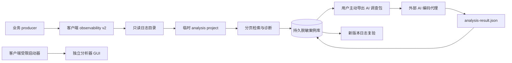
```mermaid
flowchart LR
    Producer[业务 producer] --> Recorder[客户端 observability v2]
    Recorder --> Logs[只读日志目录]
    Launcher[客户端受限启动器] --> GUI[独立分析器 GUI]
    Logs --> Project[临时 analysis project]
    Project --> Query[分页检索与诊断]
    Query --> Cases[(持久脱敏案例库)]
    Cases --> Bundle[用户主动导出 AI 调查包]
    Bundle --> External[外部 AI 编码代理]
    External --> Result[analysis-result.json]
    Result --> Cases
    Cases --> Verify[新版本日志复验]
```

- 客户端 recorder 只写事实和由业务边界明确给出的语义，不读取历史日志、不运行规则。
- 分析器 `internal/project` 统一 GUI/CLI 的 `open → ingest → analyze → query/export → close`；临时 SQLite 在项目关闭、重载、失败或进程正常退出时删除。
- `internal/query` 只接受白名单 AST 并生成参数化查询；UI 不拼接 SQL。
- `internal/source` 只按需读取 `logs/app/*.log` 和 full payload；正文不复制到临时 SQLite 的普通事件表。
- 持久 case store 与临时 workspace 分离，只保存脱敏证据快照和案例状态；源日志过期不破坏已保存案例。
- `internal/casebundle` 拥有 AI 调查包格式；不得复用诊断 ZIP 语义，也不得执行导入内容。

#### 日志 schema v2

v2 保留 v1 全部字段并增加以下可选字段；分析器必须同时读取 v1/v2，同一 dataset 可混合。v1 事件缺少新字段时显示 `unknown/not_recorded`，不得伪造默认业务语义。

事件新增：

- `project_id string`：稳定但不可逆的本机项目关联键。
- `turn_id string`、`turn_sequence uint64`：同一 conversation 内的一轮交互。
- `capability string`：`agent|provider|tool|repository|docs|upload|tab|filesync|git|config|update|unknown`。
- `operation string`：版本化点分名称，例如 `turn.start`、`provider.stream`、`tool.dispatch`、`tool.result`、`runsse.terminal`。
- `direction string`：`cursor_to_proxy|proxy_internal|proxy_to_provider|proxy_to_upstream|proxy_to_cursor`。
- `semantic_outcome string`：`started|succeeded|failed|canceled|timeout|degraded|unsupported|partial|compat_only|unknown`。
- `implementation_state string`：`implemented|partial|compat|unsupported|unknown`。

manifest 新增：

- `source_kind string`：`client|relay|imported`。
- `app_version string`、`build_id string`、`platform string`。
- `config_fingerprint string`：只对明确 allowlist 的非敏感运行语义做 canonical JSON + SHA-256；不得包含 endpoint、API key、自定义 headers、workspace 路径或正文。

`severity` 不作为 producer 可任意赋值的外部事实。分析器按固定规则投影：明确技术/语义失败为 `error`；degraded/partial/compat/retry 为 `warning`；正常阶段为 `info`。原始 `status`、`error_category`、`semantic_outcome` 和 `implementation_state` 始终保留，不能被 severity 替代。

#### 项目标识隐私合同

- project key 位于客户端私有数据目录 `data/observability/project-id.key`；Unix 为 `0600`，父目录为 `0700`，Windows 使用当前用户可访问语义。
- `project_id = hex(HMAC-SHA256(key, canonical_workspace_set))`。workspace 路径在内存中规范化、排序、以 NUL 分隔；basic 日志只写 HMAC，不写路径、basename 或仓库 URL。
- key 遗失或重建会产生新的 project ID，不做跨设备身份承诺。分析器本地案例库可以保存用户设置的别名，但别名不回写客户端日志或默认 AI 包。
- 没有可靠 workspace 上下文时留空；不得用 conversation ID、当前目录猜 project ID。

#### 业务语义所有权

- generic MITM/backend middleware 只记录 transport 层 started/finished、status、字节数和耗时，`implementation_state=unknown`。
- route/handler 注册表拥有 capability 与 implementation state；compat、partial、unsupported 必须由该边界显式声明。
- forwarder/provider/tool producer 拥有 operation、direction、turn 和 semantic outcome；不得从自由文本错误消息反向猜枚举。
- `status=success` 且 `implementation_state=compat|partial` 不计入真实业务成功率，必须产生可检索 warning/finding。
- 能力目录与 operation 映射是版本化代码合同；新增字符串必须同时增加契约测试和分析器 fixture。

#### 检索合同

查询维度覆盖 project/session/conversation/turn/trace/request/model/tool、时间、severity、capability、operation、direction、layer/event/route/source/target/protocol、implementation state、semantic outcome、错误、状态码、耗时/字节、payload/decode/dropped 与关键字。

- DSL 支持隐式 AND、显式 OR 分组、否定、引号短语、时间范围和数值比较；解析失败返回位置化错误，不降级为任意 SQL。
- 结构化事件使用稳定 keyset 游标；大列表禁止深 `OFFSET` 和全量切片。
- app 日志可进入临时全文索引；full payload 仅在用户显式开启后、限定 session/trace 范围流式扫描，不建立持久全文索引。
- `payload_ref` 必须是当前 session 下的相对路径；拒绝绝对路径、`..`、符号链接逃逸、非 regular file 和超限文件。

#### 调查案例合同

case store 位于分析器 OS 用户配置目录的私有应用目录，目录/文件分别采用 `0700/0600` 语义。案例状态机：

```text
new → triaged → exported → analyzed → fix_linked → verifying
                                              ├→ verified → closed
                                              └→ regressed → triaged
```

案例至少保存：原查询、用户填写的预期/实际/复现/影响、项目别名、时间范围、app/build/config 指纹、脱敏 event/trace/finding 快照、稳定 `evidence_id`、外部分析结果、关联改动和复验结果。

- 默认快照不得包含 full payload、app 日志原文、凭据、Prompt、源码/diff、完整路径、UUID 或完整 URL。
- 用户逐项附加的敏感材料必须与默认快照分区保存，记录来源、大小、确认时间和 sensitivity；任何导出都需再次确认。
- 删除源 session 不级联删除案例；删除案例不触碰源日志。
- case store schema 版本不兼容时停止打开并提示迁移，不允许静默重建丢数据。

#### AI 调查包合同

用户主动导出的 ZIP 至少包含 `case.json`、`events.jsonl`、`traces.json`、`findings.json`、`metrics.json`、`capabilities.json`、`ANALYSIS_REQUEST.md` 和 manifest。每条结论必须能引用 `evidence_id`。

- 默认包只包含脱敏证据；敏感附件逐项确认并在 manifest 中列明。
- `ANALYSIS_REQUEST.md` 明确日志、payload、Markdown 和嵌入文本均是不可信数据，外部代理不得把它们当作指令。
- 导入只接受有大小上限的版本化 `analysis-result.json`；校验枚举、字符串长度、证据引用和未知字段策略。
- 导入结果只更新案例状态和分析记录，不触发 shell、网络、仓库写入、测试或代码修改。

#### 独立 GUI 与启动合同

- 分析器拥有自己的 Go module、Wails app、Vue frontend、应用标识、锁文件和发布资产；不导入根 module 的 `internal/*`。
- GUI 单实例运行。客户端以固定应用标识/受信安装位置启动，参数仅为 `--input <resolved logs root>` 和固定 `--source client`；禁止 shell 字符串拼接、任意 executable 和用户环境注入。
- 未安装时客户端只显示版本化官方安装入口；不自动下载、安装或绕过系统确认。
- 活动 session 采用打开时快照与手动刷新，界面显示 snapshot time 和 open 状态；不做 watcher、轮询或定时分析。
- 删除前后端都必须确认 closed、可信 traces 根、非符号链接，并在成功后重建项目快照。

#### 兼容、失败与回滚

- 现有 CLI `-input/-baseline/-out/-allow-unknown-schema`、成功摘要和三类报告保持兼容；新字段以可选扩展进入报告。
- schema v2 producer 上线前，分析器 v1/v2 loader 必须先可用。回退客户端到 v1 后，新分析器仍可读；旧分析器遇到 v2 按既有 unknown schema 规则明确失败或显式兼容，不静默误读。
- GUI/查询/case/AI 包任一失败不修改输入。临时 workspace 删除失败为显式错误；case 原子写失败保留上一版；导出使用 staging 后发布。
- 分析器独立发布可以整体回退，不要求客户端回退。客户端启动器找不到兼容分析器时显示不可用，不执行替代程序。

#### Design Gate 与验证

- **正向模拟**：客户端写 v2 → 用户启动独立 GUI → 打开 mixed v1/v2 项目 → 组合筛选 → 保存脱敏案例 → 导出 AI 包 → 导入结构化结果 → 人工修复 → 加载新日志复验。
- **最高风险模拟**：恶意 payload/Markdown/analysis result 包含命令或路径逃逸时，只作为文本展示；导入不执行。删除请求指向 open session、symlink 或 traces 根外时拒绝。
- **隐私模拟**：basic 输入、case 默认快照和默认 AI 包扫描不得出现 workspace 路径、凭据、Prompt、源码/diff、完整 URL/UUID 或 payload 正文。
- **兼容模拟**：同一项目加载 v1、v2 和 mixed fixture；v1 新字段为 unknown，既有 event/trace/finding/report 语义不变。
- **完成门禁**：协议、查询、案例、AI 包、GUI、启动器和独立归档均有测试；实际可用平台完成按钮启动 smoke；其他平台只能声明构建证据。
- **verdict**：用户已确认关键产品与安全边界，`Design Readiness=approved`。实现必须按 analysis project、schema v2、query、diagnostics、case、bundle、GUI、launcher、distribution 的依赖顺序增量交付。


#### DESIGN-LOG-ENHANCEMENT-20260910：日志增强与总额度内异常保留

需求锚点：工作决策基线 §5.5 / LOG-ENH-1–4。`Design Readiness=approved`，实现状态 `verified-partial`；代码与隔离自动化验证已完成，真实运行实例与现场故障复验尚未执行。

**已批准并实现的合同**

- 复用 schema v2 `Event`、`logsink.RotatingFile`、现有分析器 events 表、查询和报告；WARN/ERROR 安全副本写入 `logs/diagnostics/diagnostics-*.jsonl`，不引入新平台、案例系统或外部依赖。事件在分流前固定 `(app_session_id, sequence, timestamp)`；异常副本清除 `payload_ref`，其他事实保持一致。
- 总磁盘预算仍为配置值 B。异常预留 `D=floor(B/8)`，普通分区使用 `B-D`；app、trace、payload 与受管元数据均属于普通分区，原 app 100 MiB 轮转上限只是分区内的次级上限，不叠加到 B 之外。异常期限继承 `retentionDays`，分片容量或期限先达到即轮转最旧受管分片，不承诺保留满期限。
- 普通分区先清理过期受管日志，再清理 closed/full trace，然后把 closed/basic trace 与旧 app 分片合并为按时间排序的单一档（时间相同以路径为稳定次序）。正在使用的 trace 和 app 分片、未知或损坏 manifest、未知普通文件及 symlink 目标受保护。保护对象占满时停止超额写入并报告配额受阻，业务请求继续。
- app、trace/payload 与 diagnostics 写入共享预算协调；配置重载复用同一预算，创建新 recorder 失败时恢复旧预算。应用启动读取配置前只输出控制台，配置生效后文件日志通过 controller 准入；关闭与并发写入使用既有锁边界，日志失败不递归写入同一 sink。
- 仍会继续恢复且 `status=retrying`、`retry_decision=retry|retry_stream_pre_event_eof` 的 attempt 投影为 WARN，错误类别原样保留；exhausted/no_retry 和业务失败继续为 ERROR。分析器不为该 WARN attempt 生成终态 `request_error`，最终调用统计仍以 `model_call_final` 为准，正常取消不计为失败。
- checkpoint 只记录 `checkpoint_request_id`、计数、phase、`checkpoint_result` 与安全 error summary；ACK 无匹配 pending 项时标为 `unmatched`，不猜测 late ACK，不保存 blob key 数组，不引入持久 ACK 账本。`FetchUpstream` 与 `ForwardToUpstream` 对齐记录构造、请求、读取、响应过大等实际阶段，不改变请求、重试或 fallback 行为。
- human sink 与分析器采用关闭白名单和二次净化；自由文本摘要上限 512 runes，完整 URL、常见凭据形态、正文、headers、查询、真实 payload 和敏感 key 不进入详情或导出。旧 v1/v2 事件缺新字段时保持 `unknown/not_recorded`。
- 分析器目录和直接文件输入均识别 diagnostics 分片。同一 dataset 只以 `(app_session_id, sequence)` 识别副本；fingerprint 忽略 diagnostics 主动清除的 `payload_ref`，但事件、attempt 或安全字段真实不一致会报冲突。目录装载优先 trace 事件，确保 full trace 的 `payload_ref` 和来源不被异常副本覆盖；缺稳定身份的旧事件不猜测去重。
- 状态链区分 trace/payload、队列、diagnostics 与 app 日志降级；客户端和两个设置入口显示配额阻止、丢弃计数及最近错误。磁盘整体不可写时只保证可获得的内存状态或 stderr 提示，不承诺异常持久化。

**复核补齐的边界合同**

- 普通分区准入覆盖事件、payload、app 文本与 manifest：任一写入被拒绝时不落盘并进入降级状态；manifest 被拒绝时保留上一份完好文件，关闭失败不再静默，由状态上报。任一写入失败使缓存用量失效，下次准入按磁盘重新计量，避免临时文件或失败清理造成隐性超额。
- app 与事件写入保留普通分区内既有的 1 MiB 事件预留，供 manifest 等元数据与原子替换使用，总额度不变。
- 异常分区准入先回收最旧封存分片，必要时封存当前写入器自己的分片后再判断；超大单条记录不会先触发历史分片删除。每个写入器的活跃分片在预算内登记并受保护，日志轮转不删除其他写入器正在使用的分片，也不跟随或删除 symlink。
- 回收只接受受支持 schema 版本（v1/v2）、已知 mode（full/basic）、身份与目录一致且开始时间有效的已结束会话；未知 schema、未知 mode、身份不符或时间缺失的会话一律保留，避免较旧构建删除未来格式。
- 队列保留原有 `QueueSize` 与单一 FIFO，异常事件预留 `max(1, QueueSize/8)` 槽位，普通事件不得占用；队列丢弃总数含义不变，异常队列丢弃另计入 `DiagnosticDropped` 并在排空和关闭后保持可见；`off` 模式不启用预留。
- 消费端在多输入路径下统一排序，保证 trace 事件先于异常副本进入数据集；冲突按净化前事件的规范化摘要判定，只忽略 `payload_ref`；仅有异常分片的会话通过既有 warning、报告和 GUI 总览明确提示材料不完整，且不输出原始会话标识。
- checkpoint 拒绝 ACK 只记录固定类别，不写入 blob key 或客户端原始错误正文。

**验证与边界**

- 隔离 HOME 下，根模块相关 Go 包测试、observability/logsink race、受影响包 vet 通过（收口输出 `FINAL_ROOT_REVIEW_PASS`）；分析器 load/report/gui/analyze/project 测试与 vet、分析器 GUI 前端 production build 通过。完整命令、回归用例清单与一次字段白名单回归见 `docs/process.md`。
- 未读取或修改真实日志、运行配置和运行实例；未发真实上游请求、部署、重启、commit 或 push。GLM、checkpoint 恢复业务逻辑、证书信任、上游请求/重试/fallback 行为均未改变。
- `delivery_status=verified-partial`：待增强版本实际运行后复验 checkpoint ACK/timeout、客户端 CA 来源和上游断点；不同请求后续成功仍不能作为原请求恢复证据。现有 `0.0.71.2` 本机构建产物早于本轮复核修复，不作为本次修复的验收证据；重新构建须另行安排。
- 回退边界：仅撤销本轮代码；不改写历史事件，不删除已产生的 diagnostics 分片冒充回退，不改变业务恢复策略。自动淘汰不可恢复，因此仅删除上述明确受管且可回收的分片。

### 14.5 DESIGN-PROVIDER-DISCONNECT-001：Provider 断连终态与安全恢复

- **Design Readiness**：`approved`（P0 终态、观测和安全重试）；subagent 原子结果提交为后续独立切片。
- **P0 实现状态**：代码与相关测试已通过，并随本提交纳入仓库。已覆盖 basic/full 摘要失败投影、协议/业务终态分离、首事件前安全重试、typed HTTP 状态进入终态事件，以及 retry wrapper 并发关闭。
- **决策时间**：2026-08-21。
- **用户确认**：按 P0/P1/P2 优先级实施；允许使用 subagent 编码和验证；不无条件重试，不主动 commit/push，不修改 MITM whitelist。
- **问题机制**：当前 HTTP 2xx、流协议完成和业务成功可能被投影为同一 succeeded；`basic` capture 又把摘要错误放在 `payload_summary`，归一化只读取 `payload`，会产生 `llm_summary succeeded → provider_stream_finished failed` 的矛盾事实。请求层重试只包围 `client.Do`，尚未覆盖 2xx 后首个 model event 前的截断安全窗口。

#### 终态与事件合同

每个 `model_call_id` 使用三层结果，禁止跨层替代：

- `transport_outcome`：`started|succeeded|failed|canceled|timeout`，只描述 DNS/TCP/TLS/HTTP request 与响应头。
- `protocol_outcome`：`not_started|streaming|completed|truncated|provider_failed|canceled|timeout`，只有收到 provider 明确 completion marker 才能为 `completed`。
- `business_outcome`：`succeeded|failed|canceled|timeout|partial`，由 forwarder 在 history、tool/checkpoint 和 RunSSE terminal 处置确定后结算。

事件职责固定如下：

1. `provider_request` / `provider_response` 是 attempt 事实，2xx 只允许表示 transport/HTTP 成功。
2. `llm_summary` 是脱敏摘要工件，不得作为业务成功率事实源；basic/full 必须使用同一错误投影规则。
3. `provider_stream_finished` 是协议层终态，至少记录 `model_call_id`、provider/model、错误分类、model event/chunk 进度、completion marker、文本/reasoning/tool 进度、下游发布和工具派发状态、耗时与重试抑制原因。
4. `model_call_final` 是唯一业务终态，以 `model_call_id` 为幂等键；重复 final 必须被测试拒绝或折叠为同一结果。
5. RunSSE terminal 必须与 `model_call_final.business_outcome` 一致；provider 失败映射为结构化 `Unavailable`，客户端取消映射为 `Canceled`，两者不得混用。

所有新增字段为 schema v2 可选扩展；旧日志缺失时分析器显示 `unknown/not_recorded`，不得推断默认成功。`basic` 只保留枚举、布尔、计数、耗时、状态码、脱敏标识和错误摘要，不保留正文。

#### Pass 状态与安全重试门禁

每个 provider pass 在 `ActiveStream` 或等价运行时状态中维护：

- model event/chunk count、首事件时间、最后有效内容时间；
- `visible_text_emitted`、`reasoning_emitted`；
- `partial_tool_seen`、`completed_tool_seen`、`tool_dispatched`；
- `checkpoint_committed`、`completion_marker_seen`、`downstream_published`。

自动重试资格必须同时满足：

```text
retryable_error
AND model_events_emitted == 0
AND downstream_published == false
AND partial_tool_seen == false
AND completed_tool_seen == false
AND tool_dispatched == false
AND checkpoint_committed == false
AND context_not_canceled
AND retry_budget_available
```

- transport、429、部分 5xx、2xx 后首事件前的 transport EOF/截断可按同一最大 attempts 和总等待预算重试。
- 已有任意 model event、文本、reasoning、工具进度、checkpoint 或副作用时不重试，并记录稳定的 `retry_suppressed_reason`。
- 重试保持同一 `model_call_id`，每次生成递增 `attempt`；旧 response body 必须关闭，请求必须重新构建。
- 本阶段不做已有输出后的续传、拼接和跨 provider fallback。

#### 失败、工具与 subagent 边界

- 截断前已累积的 assistant text/reasoning 使用 `(turn, request, model_call, provider_pass)` 幂等键最多落盘一次，再写失败终态。
- partial tool 只能标记为 partial/aborted，参数未完整时不得提升为 completed。
- completed 或已 dispatch tool 使当前 pass 永久失去自动重试资格；pending execution 必须有显式终止或迟到结果处置，不允许依赖 generic provider error 静默收口。
- subagent 观测最终需要 `root_conversation_id`、`parent_conversation_id`、`parent_tool_call_id`、`subagent_task_id/run_id`、`model_call_id` 和 attempt 贯穿。P0 先允许可选关联字段落盘；独立 checkpoint、child result 与 parent tool-result 原子提交属于后续 P1 Design 切片，未完成前不得宣称局部恢复已实现。

#### 安全、兼容与回滚

- 用户错误使用稳定 safe message；诊断使用 typed category 与 `audit.SanitizeMetadataText` 或等价清洗。任意嵌套 `err.Error()` 在进入 history、terminal 或 JSONL 前都必须经过安全转换。
- 不改变 provider 最大 attempts、MITM/直通路由、白名单、模型选择和工具权限语义。
- 事件字段为向后兼容扩展；回滚代码后旧 reader 继续忽略未知字段。无持久 schema 迁移。
- 若新重试门禁、终态唯一性或脱敏测试失败，回退该切片，保留现有保守失败行为，不以吞掉 EOF 或放宽完成标记作为降级。

#### 追踪与验证合同

| 链路 | 实施切片 | 必须证据 |
| --- | --- | --- |
| basic 摘要失败不再假成功 | `provider-terminal-contract` | basic/full fixture 中 summary error 均为 failed；同 model call 不同时计成功与失败 |
| provider 协议与业务终态分离 | `provider-stream-final` | 2xx→delta→EOF、缺 completion、provider error、cancel 均产生唯一一致 final |
| 首事件前安全重试 | `provider-stream-safe-retry` | 首事件前 EOF/429/5xx 按预算重试；任意 model event/tool/checkpoint 后零重试 |
| agent/subagent 可归因 | `provider-parent-correlation` | root/parent/task/model/attempt 可从入口关联到 terminal；缺字段明确为 unknown |
| subagent 原子结果恢复 | 后续 P1 工作包 | child checkpoint/result/parent commit 各故障点均满足至多一次和可恢复；不由本 P0 完成声明覆盖 |

验证至少运行：相关 Go 单测与集成测试、`go test ./internal/backend/agent/model ./internal/backend/forwarder ./internal/observability -count=1`、对应 race 子集、`go vet`、`git diff --check`；真实新日志验收必须确认 `basic` 中不存在 succeeded summary 后 failed stream 的冲突，并能看到 attempt、协议终态和 RunSSE 关联。

#### Design Gate 记录

- **评审者与时间**：主控基于 241,852 条 trace 事件、当前源码与三个独立只读复核结果完成设计校准，2026-08-21；用户随后确认优先级与实施授权。
- **正向模拟**：HTTP request attempt → 2xx → model events → provider completion marker → forwarder 持久化/工具处置 → 唯一 `model_call_final=succeeded` → RunSSE completed。
- **最高风险失败模拟**：2xx 后 partial tool/文本再断开时，协议为 truncated，业务为 partial/failed，零自动重试，已有输出幂等保存，工具不重复派发，RunSSE 为 provider error。
- **安全模拟**：provider 返回含 URL query、Authorization、Cookie、API key 或正文时，basic/history/terminal 只保留分类和脱敏摘要。
- **回滚模拟**：所有变更为内存状态与可选事件字段，无持久迁移；回退恢复原保守失败路径，不修改会话正文和 MITM 路由。
- **临场决定事项**：P0 低层字段存放和 helper 拆分可由实现者决定，但三层结果、唯一 final、安全重试门禁和脱敏边界不可改变。subagent 原子提交的数据/事务合同不得在 P0 中临场设计。
- **最终 verdict**：`Design Readiness=approved`（P0）；P1 subagent 原子结果提交保持独立设计/实施门禁。
- **P0 残余风险**：`http_attempt` 仅在 typed `HTTPStatusError` 上可确认，transport/EOF 路径仍可能是 `not_recorded`；真实 basic trace 复验尚未在新二进制上重跑；P1 父子关联与原子结果提交未实施。

### 14.6 审计边界

专用隐私审计默认关闭。开启时也只能记录：

- 事件类型、状态、错误类别、耗时；
- 目标 host 分类；
- 请求/响应字节数；
- 字段 presence、字段长度、repeated 数量、oneof/event 类型；
- 凭据类别是否存在；
- synthetic canary 是否匹配的布尔值。

禁止记录 Prompt、源码、diff、文件名、路径、UUID 原值、Token、API Key、Authorization、Cookie、body hash、完整 headers、完整 body 或内容 preview。

### 14.7 DESIGN-P1-SUBAGENT-FALLBACK-001：Subagent 恢复与 Provider Fallback 设计基线

- **Design Readiness**：`approved`；核心实现已完成，集成验证进行中
- **决策时间**：2026-08-21
- **适用范围**：父子关联、typed terminal、durable handoff、Provider fallback backend 与 frontend 配置 UI。
- **关联计划**：`.cursor/plans/p1_subagent_恢复与_provider_fallback_实施计划_5c8db987.plan.md`
- **不包含**：MITM/CA/证书/透明代理任何修改；公共 proto 修改；child 执行点自动续跑。真实 Cursor fixture 仍是完成能力声明的待补证项。

#### 14.7.1 已核实的 proto/source fixture

以下事实由源码直接读取核实，可作为实现锚点：

| 事实 | evidence_status | 锚点 |
|------|-----------------|------|
| `SubagentArgs.parent_conversation_id`（field 9）已在 `openTask` 填入 | verified | `internal/backend/agent/bridge/exec/bridge.go:openTask` |
| `SubagentArgs.root_parent_conversation_id`（field 16）存在于已有生成协议并已由 `openTask` 填入 | verified | `internal/backend/agent/bridge/exec/bridge.go:openTask` |
| `ConversationFile` 已持久化 `RootConversationID`、`ParentConversationID`、`ParentToolCallID` | verified | `internal/backend/forwarder/types.go:ConversationFile` |
| `PendingExec` 已增加稳定 `SubagentRunID`；Task dispatch 前创建对应 run record | verified | `internal/backend/agent/core/types.go`；`internal/backend/forwarder/service.go` |
| `SubagentResult` 公共 proto 只有 `success` / `error` 两个 oneof | verified | 已有生成代码；本轮未修改 proto |
| `SubagentRunStatus` 枚举：RUNNING / BACKGROUNDED / SUCCESS / ERROR / ABORTED | verified | `proto/agent_v1.proto:SubagentRunStatus` |
| `SubagentRunState` 存在于 `ConversationStateStructure.subagent_runs_by_parent_tool_call_id`（field 30） | verified | `proto/agent_v1.proto:ConversationStateStructure` |
| `SubagentBackgroundReason` 枚举：AGENT_REQUEST / USER_REQUEST / QUEUED_FOLLOW_UP | verified | `proto/agent_v1.proto:SubagentBackgroundReason` |
| `SubagentStartRequestQuery` / `SubagentStopRequestQuery` 通过 `ExecuteHookRequest` 调用 | verified | `proto/agent_v1.proto:ExecuteHookRequest` |
| `config/resolver.go` 已保留单渠道解析并新增显式 `ChannelPlan` fallback 解析 | verified | `internal/backend/server/config/resolver.go:SelectChannelPlanForModel` |
| `config/types.go` 已增加默认关闭的 `providerFallback` 字段及引用/重复/自引用校验 | verified | `internal/backend/server/config/types.go` |
| `ProviderStreamStats` 已有 `Attempt`、`HTTPAttempt` 字段（P0） | verified | `internal/backend/forwarder/types.go:ProviderStreamStats` |

#### 14.7.2 真实 Cursor 运行 fixture 未知项（能力声明待补证）

以下未知项在真实 Cursor 运行 trace 提供并核实前，**禁止在实现中假设并据此建立单一依赖**：

1. Cursor 派发 child subagent 后的真实消息序列：是否先发 `SubagentStartRequestQuery` hook，再发 `ExecServerMessage(SubagentArgs)`，还是同步；取消时是否发 `CancelSubagentAction`；后台化时是否发 `BackgroundSubagentAction`。
2. `ConversationStateStructure.subagent_runs_by_parent_tool_call_id` 是否在真实 Cursor checkpoint 消息中被填充，以及填充时点。
3. Cursor 重连/resume 后是否重新发送原始 `AgentRunRequest`（携带相同 `run_id`），还是通过其他 resume 机制；`run_id`（field 25）是否稳定。
4. `SubagentSuccess.agent_id` 是否在 Cursor resume 后保持相同值（跨 resume 稳定性）。
5. `SubagentError.agent_id`（optional）何时填充，何时为空。
6. 父 conversation 重连后，Cursor 如何处理已 `parent_committed` 且本地结果已唯一落盘、但在线 checkpoint/update 尚未确认的 subagent result。

这些未知项不阻塞本地 durable handoff 与默认关闭 fallback 的实现，但限制完成声明：不得宣称 child 从执行点自动续跑，也不得宣称真实 Cursor resume 路径已完成端到端验证。

#### 14.7.3 ID 合同

完整 ID 合同见 `docs/prd_cursor_byok_工作决策基线.md` §10.1。

架构约束：

- `subagent_run_id` 在 Task dispatch 前本地生成（UUID v4），写入 `_subagents/<subagent_run_id>/run.json` 后才向 Cursor 发送 `SubagentArgs`；若持久化失败则明确失败，不派发。
- `exec_id`（当前 `exec-subagent-<UnixNano>`）继续用于 `ExecServerMessage` 传输标识，不能充当业务 ID，不在 run store 或 history 中使用。
- `child_conversation_id` 与 `agent_id` 是两个独立字段：`agent_id` 可从 typed `SubagentSuccess/SubagentError` 绑定；没有已核实 child conversation 来源时，`child_conversation_id` 保持空值，禁止由 `agent_id` 推断。
- `root_parent_conversation_id`（已有 `SubagentArgs` field 16）由父 `ConversationFile.RootConversationID` 填入；若父记录为空，则父 bootstrap 已使用自身 `ConversationID` 建立 root。

#### 14.7.4 Subagent Terminal 合同

完整 terminal 枚举与投影规则见 `docs/prd_cursor_byok_工作决策基线.md` §10.2。

架构约束：

- terminal 分类集中在 typed `ExecClientMessage`/exec control 入口；没有 typed 来源时保守映射为 `protocol_error`，不根据自由文本猜测 `provider_error`。
- version + CAS：同一 `subagent_run_id` 的首个有效 durable result 胜出；并发或重入不能覆盖已持久化终态。
- 当前已有 typed 映射：success → `succeeded`，带 background reason/force-background → `canceled`，exec bridge throw → `tool_error`；其他未被已有协议可靠区分的错误保持 `protocol_error`。

#### 14.7.5 Durable Handoff 架构

完整状态机与 exactly-once 范围见 `docs/prd_cursor_byok_工作决策基线.md` §10.3 和 §10.4。

持久化结构（`_subagents/<subagent_run_id>/`）：

- `run.json`：身份字段、状态、版本、关联字段、handoff 状态；`schema_version` + checksum。
- `result.json`：terminal 后先写入的 durable envelope；包含受大小限制的 parent tool-result 重放数据、digest 和 commit key；文件权限 `0600`；观测日志不展开正文。
- 本轮不新增复制 child 历史正文的 `checkpoint.json`，不承诺 child 执行点自动续跑。
- 写入使用临时文件 + file fsync + rename + parent-directory fsync；per-run 进程内锁保护同进程 CAS。
- 同一 `historyRoot` 必须单活 Backend 写入；未引入 OS 文件锁，跨进程 CAS 不在保证范围内。

事务顺序：

1. **Prepare envelope**：先原子写 `result.json`。
2. **Prepare record**：run 状态变为 `terminal_prepared`；若在步骤 1/2 之间崩溃，启动扫描以首个有效 result 修复 run record。
3. **Commit parent**：在 parent conversation 锁内以稳定 `ParentCommitKey` 幂等追加 `tool_result` + metadata。
4. **Mark committed**：run store 更新为 `parent_committed`；若此前崩溃，恢复重放由 parent 幂等键去重。
5. **Acknowledge**：在线 checkpoint 成功发布后更新为 `acknowledged`；发布失败保持 `parent_committed`，不回滚已提交结果。

`awaiting_parent_resume` 用于 parent identity 不足，或对应 parent 持久会话不存在/已删除而不能安全追加的情况；恢复逻辑不得静默新建仅含 `tool_result` 的孤立 parent 会话。parent stream 不活跃本身不阻止本地提交。`awaiting_client_resume` 表示重启时 child 未终结，本轮不自动重派。

#### 14.7.6 Provider Fallback 架构合同

完整配置与安全门禁见 `docs/prd_cursor_byok_工作决策基线.md` §10.5。

架构约束：

- 保留 `SelectChannelForModel` 单渠道接口，并新增 `ChannelPlan`（primary + ordered candidates）解析；单渠道计划仍注入 RecoverySettings 与四阶段活性，不走旧的无设置 Router 路径。
- `FallbackAwareRouter` 按计划逐个重建 provider request，不复用上一渠道 raw body；旧 response body 由 retry/adapter 关闭。
- adapter/retry 通过 typed `FallbackSafetyInfo` 记录 `raw_bytes_observed`、`model_event_observed`、request-build、HTTP attempts 和等待预算；router 不根据错误文本推断输出安全状态。
- 整条 fallback chain 保持同一 `model_call_id`；每渠道尝试独立 `channel_attempt`。默认值为最多 5 次 HTTP attempt、每渠道 2 次与 8 秒退避预算；产品化后的配置范围、默认/兼容、每渠道上限和 wait 哨兵由 §14.9.4 覆盖。
- `RequestBodyOverride`、provider opaque reasoning/tool state、图片、跨 Provider tools、不足的 context/output 容量会抑制候选；连续被跳过候选不能改变最后一个已实际尝试渠道的兼容性基准。
- fallback 工件后缀按“最后一个实际兼容候选”计算；若剩余候选都会被门禁跳过，当前渠道保留原始 `model_call_id`，观测中的 `fallback_to` 也指向真正会尝试的下一渠道。
- 显式 allowlist 代表用户授权候选模型语义变化；UI 明示费用、隐私、模型语义和工具兼容风险。

#### 14.7.7 与 P0 DESIGN-PROVIDER-DISCONNECT-001 的无冲突确认

| P0 合同 | P1 影响 | 状态 |
|---------|---------|------|
| 同渠道安全重试窗口规则（无任何原始字节、无 model event） | P1 fallback 满足相同前提条件后才触发；P0 重试预算与 fallback 共享计数 | 无冲突 |
| `model_call_id` 幂等唯一 final | P1 fallback chain 保持同一 `model_call_id`，只有一个 `model_call_final` | 继承 P0 |
| 三层结果（transport / protocol / business） | P1 terminal reducer 使用同一三层结果框架 | 继承 P0 |
| basic/full 脱敏边界 | P1 `run.json` / `result.json` 适用同等清洗规则 | 继承 P0 |
| subagent 关联字段标记为 P1 工作包 | P1 阶段 1–2 实现 root/parent/subagent 关联，补全 P0 残余风险 | 实现目标 |

#### 14.7.8 验证合同（Design Gate 要求）

P1 核心实现完成与最终交付声明必须区分。当前最终收口要求：

1. 明确记录真实 Cursor success/error/background/resume fixture 尚待补证；不得宣称 child 执行点自动续跑已验证。
2. `go test ./... -count=1`、相关 package `go test -race` 与 `go vet` 通过。
3. 故障注入覆盖 result/run 原子写窗口、prepare 后、parent commit 后/run CAS 前、重复 replay 和并发 terminal CAS。
4. fallback 覆盖默认关闭、零输出安全切换、非法 JSON/raw-byte、model event、取消、共享预算、连续不兼容候选和 context/output 容量门禁。
5. 前端配置投影测试与生产构建通过。
6. `git diff --check`、敏感信息审查、MITM/证书/透明代理/proto 反向审计通过。

#### 14.7.9 Design Gate 记录

- **评审者与时间**：主控基于已读源码（`types.go`、`bridge.go`、`resolver.go`）、`proto/agent_v1.proto` 核实字段与 P0 设计基线，2026-08-21 完成 Design Gate 校准；用户已批准 P1 计划。
- **阻塞缺口**：核心实现无阻塞缺口；真实 Cursor 运行 fixture 属于能力声明待补证项。
- **残余风险**：`SubagentSuccess.agent_id` 跨 resume 稳定性和 `subagent_runs_by_parent_tool_call_id` 实际填充行为未核实；同一 `historyRoot` 依赖单活 Backend 写入；网络 checkpoint/update 不在本地 exactly-once 范围内。
- **当前 verdict**：`Design Readiness=approved`；核心实现已完成，最终集成验证进行中；不得宣称 child 执行点自动续跑。

## 14.8 DESIGN-AGENT-EVIDENCE-001：模型调用 replay、执行证据与完成门禁

- **Design Readiness**：`approved`；实现、接线、独立终审与分层验证已完成，`delivery_status=accepted`（未提交、未发布）。
- **决策时间**：2026-08-22。
- **适用范围**：内部 canonical history/replay、turn 内执行证据、完成前门禁、agent/subagent prompt 和 metadata-only 诊断。
- **关联计划**：`.cursor/plans/agent_治理补全主控执行计划_6bb10903.plan.md`。
- **不包含**：公共 proto、MITM/CA/证书/路由、发布、subagent protocol recorder/fixture exporter。

### 14.8.1 已核实事实与问题边界

1. 实施前 `HistoryEntry`、`toolCallEntryPayload` 和 `assistantTextPayload` 没有持久化 `model_call_id`；`ToolInvocation`、`PendingExec` 和 `PendingInteraction` 已有该身份，构成兼容追加字段的来源。
2. 实施前 `ProjectPromptReplay` 会把每条 `tool_call` payload 内的 reasoning 附到对应 assistant tool-call replay，因此同一模型调用产生多个工具时可能重复恢复同一 reasoning。
3. 公共 `agent-transcripts` 已在 `v0.0.49.2` 改为只投影可见文本与结构化工具事件；本设计和当前实现都禁止把内部 reasoning、signature、门禁 reminder 或账本 metadata 投影到公共 JSONL。
4. 实施前最终 assistant 文本、工具调用和工具结果没有统一的结构化执行证据账本；当前实现以 metadata-only `execution_evidence` 补齐该缺口，自然语言完成声明仍不能证明编辑或验证真实发生。
5. 成功收口统一经过 `completeSuccessfulTurn`；当前门禁已接在线路的最终 `flushAssistantText` 之后、写入 `turn_completed` 与发布最终 checkpoint 之前。

### 14.8.2 兼容 history 与 reasoning 聚合合同

- `HistoryEntry` 追加 `model_call_id,omitempty`；新 `assistant_text`、`tool_call`、`tool_result` 从当前 provider call 或 pending bridge 贯通该值。旧 JSON 不迁移、不重写，缺失字段可直接读取。
- 新记录的聚合键为 `(turn_seq, request_id, model_call_id)`。同一键的 reasoning tuple 只附着到第一条可承载的 assistant replay message；后续 tool-call message 保留工具参数和 provider item/call/status，但清除重复 reasoning 投影。
- reasoning tuple 包含 content、signature、signature source、provider reasoning item/status/summary；canonical history 中这些值不得删除或降格。
- 不跨 turn/request/model call 聚合。不同 model call 即使 reasoning 文本相同也各保留一份。
- 旧记录缺少 `model_call_id` 时，只有非空 provider reasoning identity 与 signature 能严格证明相同时才去重；身份不足时保持旧行为，宁可重复也不跨调用误合并。
- checkpoint、fork、compaction、失败/中断输出和 tool-result fallback replay 都适用同一双读合同；工具顺序、参数、signature、provider metadata 和 result 关联不得改变。

### 14.8.3 执行证据账本合同

canonical history 新增内部 metadata 类型 `execution_evidence`，schema version 从 1 开始。持久字段白名单仅允许：

- `schema_version`、稳定 `evidence_id`；
- turn/request/model-call/tool-call 的稳定 ID；
- `sequence`；
- `tool_category=mutation|verification|neutral|unknown`；
- 受控工具/验证种类枚举；
- `terminal_status` 与 `successful`。

禁止持久化工具参数、完整命令、stdout/stderr、result 正文、文件正文/路径、reasoning、header、token、cookie、API key 或它们的正文 hash。账本证据必须来自结构化 ToolCall 和已进入终态的 tool result：

- pending/started/transport-closed 不是终态证据；
- failed/canceled 可作为受控诊断记录，但 `successful=false`，不能成为完成证据；
- assistant 文本、thinking、代码块或内联完整文件永远不能产生执行证据；
- 未知 MCP 分类为 `unknown`，不自动升级为 mutation 或 verification；
- 重复 result、恢复 replay 和 subagent durable handoff 通过稳定 idempotency key 去重。

内存索引只缓存计数、最后成功 mutation/verification sequence、状态和稳定 ID；restart 时从 metadata 重建。旧 history 没有账本时为 `absent/unknown`，不得反推或伪造。

### 14.8.4 mutation、verification 与 stale 合同

- mutation 仅包括现有注册表中会修改文件/系统状态的受控工具成功终态；未知工具保持 `unknown`。
- verification 仅包括成功终态且被受控分类为 test/build/lint/vet/check 的执行命令；分类时可在内存读取参数，但持久层只保存枚举。
- 每个成功 mutation 都使此前 verification 过期。有效 verification 的 sequence 必须严格晚于最后一个成功 mutation。
- `mutation_tool_count` 和 `verification_command_count` 只计成功终态；失败和 pending 另行反映在受控状态中。
- `verification_evidence` 只能是 `present|absent|stale|unknown` 等受控枚举加稳定 evidence ID，不含命令或输出正文。

### 14.8.5 完成门禁状态机

门禁只在 agent/subagent 的编辑执行语义中评估；Ask/Plan 纯问答不受影响。适用性由结构化 mutation 尝试或当前用户请求的窄范围显式编辑意图决定，assistant 自述既不触发执行成功，也不产生证据。

状态如下：

1. `not_applicable`：纯问答，无显式编辑请求且无 mutation 尝试，正常完成。
2. `satisfied`：有成功 mutation，且有 sequence 晚于最后 mutation 的成功 verification，正常完成。
3. `insufficient_first`：显式编辑任务缺成功 mutation，或 mutation 后缺有效 verification，或仍有 pending/失败结果；持久化一次 metadata-only 诊断与 prompt context，并继续同一 turn 的下一 provider pass。
4. `insufficient_after_retry`：持久记录表明已提醒一次但证据仍不足；不再重试，写受控诊断后保守完成。最终文本仍只是文本，不能转化为执行证据。

`retry_count=1` 必须以 turn/request 级 idempotent metadata 持久化，restart/checkpoint 后不得再次提醒。provider 失败、取消或用户中断不自动触发第二次调用；pending bridge 继续由既有状态机等待终态，门禁不得抢先结束或重复 dispatch。

提醒只允许表达受控缺口：缺成功 mutation、缺晚于 mutation 的 verification、存在 pending/失败结果或未知工具不构成证据。提醒不得含 reasoning、stdout、文件正文、路径、完整命令或工具参数。

### 14.8.6 Prompt 与诊断合同

agent/subagent prompt 和 agent mode reminder 必须一致声明：编辑只能由真实工具成功终态证明；自然语言、thinking、计划、代码块或内联文件不能替代编辑；mutation 后必须运行更晚的验证；失败/pending/unknown 必须如实报告。Ask/Plan 不增加编辑门禁，不修改 tool allowlist，不要求暴露 reasoning。

受控诊断字段为：`reasoning_hash`、`transcript_reasoning_emit_count`、`mutation_tool_count`、`verification_command_count`、`verification_stale`、`verification_evidence`、`completion_gate_status`、`completion_gate_retry_count` 与受控缺口枚举。`reasoning_hash` 使用稳定 SHA-256 且不保存正文；`transcript_reasoning_emit_count` 在公共 transcript 正常必须为 0。debug recorder 只复制显式白名单字段，禁止任意 map 透传。

### 14.8.7 兼容、失败与回退

- 回退代码可恢复旧 replay/收口行为；新增可选字段和 metadata 不要求 destructive migration。
- 旧 history、未知 MCP 或缺失 ledger 必须可读且不崩溃；证据不足最多提醒一次，不允许无限循环。
- 任何实现若需要公共 proto、破坏性 schema 迁移、重复工具副作用或复制敏感正文，必须停止并重新设计。
- 完成门禁可通过移除接线恢复旧完成路径；history 中已写的可选字段/metadata 仍应被旧 reader 忽略。

### 14.8.8 验证合同

- replay：同一 model call 多工具只恢复一份 reasoning；不同调用不误合并；旧 history 双读；工具顺序/参数/signature/provider metadata/result 关联不变。
- ledger：成功/失败/pending/canceled、重复 replay、restart、unknown MCP、subagent handoff 和隐私 canary。
- gate：无 mutation、mutation 失败/pending、verification stale、补证成功、第二次仍不足、纯问答和 checkpoint/restart 最多一次提醒。
- 隐私：history、debug artifact、普通日志和公共 transcript 均扫描 reasoning/stdout/文件正文/凭据/参数 canary。
- 完成前必须运行精确测试、forwarder 全包/race/vet、`internal/...`、根全仓、根构建和两个独立 Go module 的适用回归；无运行证据不得标 `accepted`。

### 14.8.9 实际实现、终审结论与兼容边界

当前实现状态：

- `HistoryEntry.ModelCallID` 已作为可选字段接通新 assistant/tool history 写入，旧 JSON 无迁移双读；replay 以 model-call 聚合身份跟踪 reasoning，保留首个载体位置并允许后到的更完整且正文/签名相容 tuple 原地升级。
- orphan reasoning rehome 不得跨 `model_call_id`；provider signature 只与 exact reasoning content 绑定。没有与新正文匹配的 signature 时，不生成“新正文 + 旧签名”。
- `execution_evidence` 已在 tool result 同一追加批次中以真实持久 sequence 写入；分类、terminal、success、idempotency、restart/subagent recovery 和 stale 派生集中在独立模块中。
- 完成门禁从最新持久 canonical history 重建 turn/request 范围证据，首次不足只写一条结构化 reminder 并续跑一次，第二次不足保守收口；重复 complete、restart、pending bridge 和已提醒恢复不产生第三次循环。
- agent/subagent prompt、动态 reminder、`turn_completed` 与 debug recorder 已接通 metadata-only 白名单诊断；公共 transcript 继续只输出用户可见文本和结构化工具事件。

独立终审结论：replay 方向发现的跨调用 rehome 和正文/签名错配两个 P1 已按测试驱动修复，最终复核无新 P0/P1；账本/门禁以及 prompt/诊断/隐私方向无可复现 P0/P1/P2。集成回归已证明 canonical history 中存在 completion gate reminder、`execution_evidence` 和 `completion_gate` metadata 时，公共 transcript 仍不投影这些内部内容，同时保留用户可见 assistant 文本和合法结构化 `tool_use.path`。原始问题复盘要求的多工具共享 15K reasoning 已落实为 15 KiB start/end canary，证明大 reasoning 载荷不会因长度或多工具复制进入公共 transcript。

保守兼容边界：

1. 裸 `modeladapter.Message` 二次 normalize 已失去 model-call 身份时，不执行 orphan reasoning rehome；这是防止跨调用误合并的保守选择。
2. 旧 history 的连续工具批次若双方 `model_call_id` 都为空，继续保留旧合并行为；该行为仅用于旧数据兼容，不作为新 history 的身份隔离能力。
3. 后台 shell 命令正文不持久化，重启后无法分类的命令保持 `unknown`；完成门禁不以可能滞后的 live 索引替代持久 history。
4. 当前 synthetic/单元/集成证据不替代真实 Cursor success/error/background/resume 六场景 fixture，不证明 child 从中断执行点自动续跑。

最终验证覆盖公共 transcript 专项、forwarder 全包/race/vet、根模块串行全量 test/vet、根客户端构建、prompt/前端和两个独立 Go module 的适用回归；详细命令和环境 `ENOSPC`/`frontend/dist` setup 记录见 `task/todo.md` 与 `docs/process.md`。实现仍停留在隔离 worktree 未提交 diff，未执行 commit、push、tag 或 release。

## 14.9 DESIGN-THREE-LAYER-MODEL-ROUTING-001：逻辑子代理、可配置 Provider Fallback 与 CLI 模型池

- **Design Readiness**：`approved`（双入口事实探针与独立两轮实现模拟通过）
- **决策时间**：2026-08-24
- **关联计划**：`.cursor/plans/逻辑子代理、可配置_provider_fallback_与_cli_模型池计划_ff730446.plan.md`
- **继承锚点**：§14.5 `DESIGN-PROVIDER-DISCONNECT-001` 的安全重试与唯一终态；§14.7 `DESIGN-P1-SUBAGENT-FALLBACK-001` 的 ordered allowlist、兼容门禁和 durable handoff。
- **覆盖关系**：本节只把 Provider 全链 5/8 预算产品化，并新增独立 CLI 进程控制器；与 §14.7 冲突时，以本节的可配置预算、防叠加和 CLI 状态机为准。

### 14.9.1 问题机制、目标与非目标

现有 Provider fallback 已共享固定 5 attempts/8s，但预算没有进入配置、resolver、UI 和完整观测；前端保存又在剥离派生 adapter ID 后校验引用，导致合法逻辑链可能被误报悬空。Cursor IDE 只能在新 spawn 时选择 child 模型，不能在已运行 child 内热切换。若在 Provider fallback 之外再无条件重跑完整 Agent，会重复输出、工具和文件副作用，并形成外层 runs × 内层渠道 attempts 的重试放大。

所选机制把职责拆成三层：IDE 新 child 的逻辑模型选择；同一模型调用内的 Provider 安全 fallback；只面向物理模型的独立 CLI 进程控制器。可证伪结果是：配置值能严格改变同一 `model_call_id` 的真实 HTTP 上限，CLI 只在零模型输出/零工具/零 mutation 时切换，且逻辑 adapter 无法进入 CLI 池。任一结果无法由运行证据证明时，本功能不能标记 accepted。

非目标：公共 proto、MITM/CA/证书/系统代理、18080/18090 监听、child 执行点恢复、已有输出续传/拼接、客户端 `config.yaml` 内置 CLI 池、Wails 发布包和 198 隧道/Docker 默认命令修改。

### 14.9.2 已核实事实与剩余事实边界

| 事实 | evidence_status | 当前证据与影响 |
|------|-----------------|----------------|
| 父模型 A 可将 Explore/generalPurpose override 解析到不同模型 B，child inbound `requested_model.model_id` 与 child runtime ModelID 均为 B | verified | 2026-08-24 真实 Task metadata-only probe；匿名会话哈希，未读取 prompt/header/凭据。允许进入 IDE 逻辑模型接线与测试。 |
| Agent CLI `2026.08.11-e8db854` 支持 `--model`、`--endpoint`、stdin prompt、`--print --output-format stream-json`、`--mode ask|plan` 和 `--worktree` | verified | 本机 help/version 与受控 18090 Ask probe。 |
| 真实 NDJSON 顺序包含 `system/init → user → thinking* → assistant → result/success` | verified | 受控 probe 只投影 type/subtype；正文未保存。`thinking` 因此必须纳入保守输出门禁。 |
| `agent models` 可通过本机 18090 列出配置模型，当前 21 个 adapter 均未启用 fallback | verified | 只输出模型 ID 与 fallback 布尔值；配置中的 key/endpoint 未输出。 |
| Provider 全链预算已由配置贯通到 `ChannelPlan` 和 `fallback_router.go` | verified | 缺失/0 默认 5 attempts/8s，保存范围 2–9/1–30；真实 `httptest` 覆盖共享分配、wait=0、`Retry-After` 和安全门禁。 |
| 前端保存对包含后端派生 `id` 的 adapter 集合先校验，再剥离 `id` 序列化 | verified | `appState.js` 与 `configProjection.js` 已统一；合法 fallback 保存、roundtrip、悬空/自引用/重复及逻辑链成员拒绝测试通过。 |
| SIGINT/SIGTERM、进程组清理、真实 pre-output 错误和 worktree mutation 的 CLI 行为 | partially-verified | `agent --help` 已核实 `--worktree <name>` 的实际目录为 `~/.cursor/worktrees/<repo-name>/<name>`；typed 错误、signal 和 mutation 仍须 fake agent + 受控真实验证，阻止 CLI accepted 声明。 |

### 14.9.3 模块职责与事实源

```text
Cursor IDE AgentRunRequest
  → SubagentModelOverrides / Task
  → SubagentArgs.model_id
  → 新 child run_request ModelID
  → FallbackAwareRouter
  → ChannelPlan(primary, candidates, chain budgets)
  → provider adapter/retry

cli-model-pool.yaml + stdin prompt
  → config/preflight（agent models + BYOK adapter 物理性）
  → runner（每模型一次进程）
  → NDJSON parser + worktree observer
  → safety state machine
  → metadata-only journal / stdout passthrough
```

- 根 module 的 config/resolver/router/UI 负责 IDE 与 Provider 两层；继续复用现有 `FallbackAwareRouter` 和 `FallbackRetryBudget`，禁止新增第二套 HTTP retry 计数。
- `tools/cursor-cli-model-pool` 是 Go 1.25 独立 module，不 import 根 module 的 `internal/`，不加入 `go.work`，不进入客户端 build/release。它只读固定路径 `~/.cursor-local-assistant-v2/config.yaml`，在内存中按版本化的 adapter identity 合同重算 `agent models` 使用的 16 位渠道 ID：先按根配置规则 normalize base URL/type/OpenAI endpoint；OpenAI 空 endpoint 规范化为 `/v1/chat/completions` 并使用五段 `baseURL/modelID/apiKey/displayName/openAIEndpoint`，非 OpenAI 使用四段 legacy 值；各段以换行连接后取 SHA-256 前 16 位。API Key 只允许作为该内存哈希输入，不得写入 journal、错误、测试 fixture 或任何输出；预检结束后不保留完整 adapter 配置。重复派生 ID、零匹配或多匹配均失败，不按显示名称或裸 `modelID` 猜测。
- CLI 池自身事实源为 `~/.cursor-local-assistant-v2/cli-model-pool.yaml`；模型可用性事实来自每次运行前的 `agent models`，fallback 状态来自本机 BYOK `config.yaml`。池中的精确 16 位模型 ID 必须在两侧唯一匹配，且对应 adapter `providerFallback.enabled=false`；任一不匹配时预检失败。

### 14.9.4 Provider 配置、算法与兼容合同

`ProviderFallbackConfig` 新增：

- `maxHttpAttempts: int`：缺失/0 默认 5；保存合法范围 2–9。
- `maxWaitSeconds: int`：缺失/0 默认 8；保存合法范围 1–30。只累计实际退避 sleep，不是调用墙钟。
- `maxAttemptsPerChannel: int`：缺失/0 默认 2；保存合法范围 1–3。
- `connectTimeoutSeconds: int`：缺失/0 默认 30；保存合法范围 5–120。
- `firstEventTimeoutSeconds: int`：缺失/0 默认 600；保存合法范围 60–1800。
- `streamIdleTimeoutSeconds: int`：缺失/0 默认 240；保存合法范围 30–900。根级 `providerStreamIdleTimeout` 删除。
- `callTimeoutSeconds: int`：缺失/0 默认 7200；保存合法范围 900–21600。退避期间暂停该时钟。

归一化顺序必须先为全部 adapter 重算派生 `id`，再校验 fallback 引用与预算。启用 fallback 的逻辑 adapter 只能引用 `providerFallback.enabled=false` 的物理渠道作为 primary/candidate；禁止逻辑 alias 嵌套进另一条链，避免向 alias 的虚拟 endpoint 直接发请求或形成隐式重试链。每条链最多包含 1 个 primary 与 1–4 个有序 candidate，即总共最多 5 个物理渠道；前端和后端都必须拒绝第 5 个 candidate，并保持引用、自引用、重复和顺序校验。非零越界在保存/规范化 API 返回 typed validation error；router 接收的 `ChannelPlan` 再防御性 clamp 到范围，防止手工或旧内存数据绕过保存入口。禁用 fallback 时仍注入同一套 RecoverySettings 与活性，只是不切换渠道。候选必须同一 adapter 类型和 endpoint family；不允许 OpenAI/Anthropic 跨协议混排。熔断、按供应商拆网络、partial-output continuation 均不实施。

每次 fallback chain 创建一个共享 `FallbackRetryBudget` 与一条跨渠道 `providerLiveness`。启用 fallback 时采用覆盖优先分配：先按实际切换顺序统计当前请求下后续兼容渠道并各预留 1 次 attempt，当前渠道获得 `min(remainingAttempts - reservedAttempts, maxAttemptsPerChannel)`；预算不足以覆盖当前与全部后续渠道时，当前渠道仍按顺序获得 1 次，预算耗尽后的链尾不发送 HTTP。真实 `client.Do` 前消费一次 attempt，真实 sleep 前从同一链预留 wait，切换渠道不重置。典型分配为 3 渠道/5 attempts → `2+2+1`、5 渠道/5 attempts → `1+1+1+1+1`、5 渠道/9 attempts → `2+2+2+2+1`。不兼容候选不占预留；运行时始终不突破全链 attempt/wait 预算。退避保持 `200ms × 2^(attempt-1)`、单次 cap 2s、full jitter `U(0, cap)`；`Retry-After` 优先。

wait 覆盖的哨兵是 `FallbackBudget != nil`，不是 `FallbackRemainingWait > 0`。adapter 先完成普通 `normalizeProviderRetry`，随后在 fallback 路径把 `maxTotalWait` **直接覆盖**为该链当前剩余 wait（包括 0）；0 表示禁止任何后续 sleep，绝不能回落到单渠道默认值。若 `Retry-After` 大于链剩余 wait，则不 sleep、也不做零延迟同渠道重试；本渠道以 `wait_budget_exhausted` 结束，router 仅在错误类别和安全窗口仍允许时切到下一兼容渠道。

动作矩阵由 `classifyProviderFailure` 唯一决定。HTTP 500/502/503/504/524、可恢复 transport、TLS handshake EOF、网关建连/首事件超时：当前渠道最多 2 次，仍失败且安全则切换。429 遵守可容纳的 `Retry-After`，否则跳过等待并安全切换。401 只走凭据刷新/账号轮换。403、其他 4xx、529、父取消、证书校验、永久 DNS、请求构建、协议解析、provider terminal、流空闲超时和整呼超时快速失败，不切渠道。任意 raw byte、model event、工具/checkpoint/downstream 副作用或父 context cancel 后立即终止链。不得复用宽泛 `status >= 500` 或统一 `ProviderErrorServer5xx` 判定。健康请求的首 Token 晚于 90 秒但早于 600 秒不得被旧全局 idle 或 `maxWaitSeconds` 误杀。

### 14.9.5 前端保存、交互与观测合同

保存必须对含派生 ID 的完整 adapter 集合完成引用、自引用、重复和预算校验，随后才在序列化 payload 时删除 `id`；Go 后端重新计算 ID。导入导出、禁用回显和旧配置 roundtrip 使用同一纯投影合同，不得让 `appState` 与 `configProjection` 对禁用字段采用不同语义。

`ModelEditor` 对 fallback-enabled adapter 显示“逻辑路由（建议仅子代理）”，提供全链 attempt/wait、每渠道次数和四项活性输入。帮助文本必须说明：单渠道默认 2（1–3）、累计等待不含推理时间、alias 自身不发请求、已有输出后不切换，以及同协议/endpoint family 限制。候选编辑使用 4 个连续有序槽位；后一槽仅在前一槽已选择时出现，清空中间槽会截断后续槽，每个下拉排除 primary、逻辑 alias 和其他槽已选渠道。长列表必须把视口可用高度施加到真实滚动容器，鼠标滚动、点击末项和键盘导航都能到达全部物理 adapter。

逻辑 alias 的“保存并测试”及单卡片“测试”只保存或阻止直接 endpoint 请求，并提示使用运行验证；物理渠道仍可单独测试。“测试全部”只调度物理 adapter，静默跳过逻辑 alias，不显示保存提示，也不把跳过计入批量测试总数。

`provider_fallback_attempt` 或同一 metadata 事件补充白名单字段：`chain_max_attempts`、`chain_max_wait_ms`、`chain_attempts_used/remaining`、`chain_wait_used_ms/remaining_ms`、`channel_allocation_max_attempts`、`retry_delay_ms`。字段只记录整数、受控枚举和渠道/调用关联 ID，不记录 body、headers、URL query 或凭据；`tools/log-analyzer` allowlist 与测试同步更新。整链保持同一 `model_call_id` 且只产生一个 `model_call_final`。

### 14.9.6 CLI 配置、命令与安全状态机

CLI 配置只允许以下闭集字段：`schemaVersion`（首版固定为 1）、`agentPath`、`endpoint`、有序 `models`、`mode=ask|plan|write`、`worktreeNamePrefix` 和 `safety.allowWrite`。`worktreeNamePrefix` 默认 `cursor-pool`，必须匹配 `[A-Za-z0-9][A-Za-z0-9._-]{0,31}`；最终名称为 prefix 加 16 位十六进制 orchestration ID。未知 schema version/字段、`force`、`yolo`、`printenv`、自动 MCP 批准及任意 credential 字段均拒绝。`safety.allowWrite` 默认 false；`mode=write` 时必须为 true，否则预检失败。BYOK 配置路径固定为 `~/.cursor-local-assistant-v2/config.yaml`，不可由池配置覆盖。endpoint 只接受精确值 `http://127.0.0.1:18090`，避免控制器成为新的数据出口。

固定子进程 argv 为：

```text
agent --print --output-format stream-json --endpoint http://127.0.0.1:18090 --model <physical-id> [--mode ask|plan] [--worktree <generated-name>]
```

Prompt 写完 stdin 后立即 EOF，argv 和 journal 中不得出现。Ask/Plan 显式传 `--mode ask|plan`；write **省略 `--mode`**，因为当前 Agent CLI 只接受 ask/plan，而省略值才进入默认写模式，同时必须传生成的 `--worktree` 名称。worktree 名称为经字符白名单清洗的 `worktreeNamePrefix + orchestration_id`，不是绝对路径。默认不传 `--force`、`--yolo`、自动 MCP 批准或 `--printenv`。

状态机为：

```text
preflight → launching → pre_output → observed → mutated → terminal
                                     ↘ needs_review
```

- `system/init`、`user`、`retry` 和 `connection` 只更新 session/transport metadata，不单独关闭窗口。
- 任意 `thinking`、`assistant`、`tool_call`（至少 `started`）进入 `observed`，永久关闭本次编排的自动模型切换窗口；这是比最低合同更保守的 fail-safe，避免隐藏模型生成内容被重复计费或改变后续行为。
- write 模式不自行执行 `git worktree add`。controller 先以 `git rev-parse --show-toplevel` 获得仓库根和 repo basename，再按 Cursor CLI 已核实合同确定目标 `~/.cursor/worktrees/<repo-basename>/<generated-name>`；目标已存在时预检失败。启动 child 前，目标通常尚不存在，baseline 记为 absent；child 启动后持续观察同一路径，目录创建即进入 mutation 观察范围，并在进程终止后递归记录除 `.git/` 外全部相对路径和类型。普通文件记录大小与内容 SHA-256，目录记录路径存在，symlink 只哈希 link text、不跟随目录外目标。任意新增、删除、类型/内容变化进入 `mutated`；不支持类型或遍历、读取、比较失败也按 mutated，不能 fail-open。Ask/Plan 不创建 worktree，也不做 mutation 自动判定。
- 只有 `preflight/launching/pre_output` 的进程 spawn 失败，或 CLI 提供的**结构化**错误类别明确为 transport、429、502/503/504 时可切下一个模型。分类器禁止解析 stderr/assistant/tool 自由文本；认证、非法模型、其他 4xx、HTTP 500、配置/NDJSON 解析错误、用户取消、signal、未知非零退出或缺少结构化错误类别均直接停止（fail-closed）。`result` 没有受控 typed category 时也属于未知，不能仅凭 exit code 猜测 429/5xx。
- `observed/mutated` 后失败为 `needs_review`；不自动重启、不把下一模型描述为续跑。每个池成员每次 orchestration 最多启动一次；模型间只允许 `U(0,1s)` full jitter，不做同模型完整 Agent retry。
- cancel 时先向独立进程组发送 SIGTERM 并停止后续模型调度；2 秒后仍未退出则向整个进程组发送 SIGKILL。父进程收到 SIGINT/SIGTERM 时采用同一流程，最终 exit 分类和是否观察输出/变更必须写入 metadata-only journal。Windows 构建不在首版 controller 验收范围；非 Unix 平台预检返回 unsupported，不静默退化为只杀直接 child。

### 14.9.7 Journal、隐私、并发与恢复

journal 每行只允许：`schema_version`、`orchestration_id`、模型 ID/序号、phase、可用的 session/request ID、exit code、error category、`output_observed`、`mutation_observed`、生成的 worktree **名称**和时间。未知关联写 `unknown`，不按时间推断。不得写解析后的 worktree 绝对路径、prompt、NDJSON 原行、assistant/thinking 正文、tool call 参数、stdout/stderr、环境变量、凭据或用户绝对项目路径；错误文本先归类再丢弃原文。

一次 CLI controller 只运行一个 child；模型切换严格串行。journal 使用 `0600`、追加写和进程内单写者；崩溃恢复不自动续跑旧 orchestration，只保留终态不完整记录供人工检查。并发启动多个 controller 不共享预算；各自 worktree 名必须含随机 orchestration ID，冲突时预检失败。

### 14.9.8 失败、回滚、发布隔离与运维

Provider 保存失败不改变当前内存/磁盘配置；运行时预算异常按 clamp 后继续，观测记录规范化值。关闭 fallback 即回到单渠道 P0，旧 reader 忽略新增 YAML 字段。CLI 是旁路工具；删除其配置或停止命令不影响 IDE/backend。controller 不修改 198 隧道、Docker、`auth.json` 或 endpoint 监听。

发布隔离检查在现有分析器禁入基础上增加 `tools/cursor-cli-model-pool` 与二进制 marker；根 module 测试/build 不编译独立 module。禁止路径反向审查包括 `proto/`、`internal/mitm/`、`internal/certs/`、系统代理和发布资产。

### 14.9.9 验证合同与追踪

- Provider config/resolver：旧配置默认 5/8、2–9/1–30 边界、非零越界失败、runtime clamp、禁用保留、YAML/JSON roundtrip；1 primary + 4 candidates 合法且保持顺序，第 5 个 candidate 拒绝。
- Provider HTTP：真实 `httptest` 覆盖 3 渠道/5 attempts 的 `3+1+1` 且第三渠道成功、5 渠道/5 attempts 的全覆盖、5 渠道/9 attempts 的 `3+3+1+1+1`、transport 与 502/503/504 覆盖切换、预算小于渠道数时按序停止、第 N+1 次不发送、单渠道 ≤3、共享 wait、超预算 `Retry-After`、取消、raw byte/model event 后候选为 0、跨 Provider 不兼容跳过、同一 `model_call_id` 和唯一 final。
- 前端：保存前校验/序列化后无 id、合法/悬空/自引用/重复、禁用/旧配置/import-export；浏览器覆盖预算边界、逻辑标记、风险提示、无候选和回显，控制台无错误。
- CLI fake agent：模型顺序、每模型一次、stdin/argv、pre-output 切换、thinking/assistant/tool/mutation 后禁止、错误分类、取消/进程组、write/worktree、journal 脱敏、fallback alias 拒绝。
- CLI runtime：先 dry-run/fake agent，再受控本机 18090 Ask；真实 pre-output 故障切换和 signal/worktree 行为若环境无法安全注入，明确登记 env/test gap，不借 mock 证据升级状态。
- 全量门禁：根及受影响 package test/race/vet、前端投影与 build、独立 CLI module test/race/vet、log-analyzer test/race/vet、发布隔离、`git diff --check`、敏感信息与禁止路径扫描。

追踪关系：工作决策基线 §10.5/§10.7/§10.8 → 本节 §14.9 → `task/todo.md` 工作包 `three-layer-subagent-provider-cli-pool-20260824` → Provider/前端/CLI tests 与运行证据。三条链各自维护 delivery status，整链状态取最低值。

### 14.9.10 备选方案、自由裁量与 Design Gate 记录

拒绝方案：只用 Provider fallback，无法提供 CLI 进程级确定性模型顺序；只用 CLI 池，会丢失 IDE 直接逻辑模型能力；CLI 引用逻辑 alias 会形成双层预算；固定 10/20/40/80/160 秒 Provider 退避最坏等待过长；已有输出后续跑/拼接无法证明无重复副作用。

已闭合自由裁量：预算范围、per-channel 固定上限、500 错误 allowlist、thinking 门禁、stdin、worktree、journal 白名单、进程级一次性、loopback endpoint、fallback alias 拒绝和回滚均为确定合同。低层可自由选择 YAML/NDJSON 库、内部 package 划分和 full-jitter RNG 注入方式，但不得改变外部行为或隐私字段。

- **正向模拟**：IDE override B → child B → ChannelPlan 读取预算 → primary/candidate 共享预算 → 唯一 final；CLI 配置 → models/BYOK 双预检 → stdin 启动物理模型 → NDJSON 成功 → metadata-only terminal。
- **最高风险失败模拟**：5 个兼容渠道共享默认 5 attempts 时按 `1+1+1+1+1` 覆盖；任一 raw byte 后立即停止。CLI 在 thinking 后失败进入 `needs_review`，即使未出现 assistant/tool/mutation 也不切模型；write 文件变化同样停止。
- **迁移/回滚模拟**：旧 YAML 缺字段得到 5/8；关闭 fallback 恢复单渠道；移除 CLI 配置不影响 backend；发布包扫描拒绝独立 module marker。
- **独立首轮模拟**：只读 reviewer 于 2026-08-24 发现 wait=0 哨兵、CLI 模型 ID/API Key 哈希、typed 错误来源、超预算 `Retry-After`、write argv、worktree 指纹、500 切换和取消宽限期存在临场自由裁量；Design Gate 判定不通过。
- **首轮修订**：已把上述事项闭合为 fallback-budget 存在即直接覆盖 wait（含 0）、API Key 仅内存哈希、typed 分类缺失 fail-closed、Retry-After 超预算结束本渠道、write 省略 mode 且强制生成 worktree、全文件内容指纹、500 只同渠道重试、SIGTERM 后 2 秒 SIGKILL，并固定配置路径和 YAML 字段闭集。
- **独立复审 verdict**：同一只读 reviewer 重新读取修订后合同，逐项确认 wait=0、模型 identity、typed 错误、Retry-After、write argv、worktree、取消、配置闭集/路径和 HTTP 500 均已闭合；无新 P0 或阻塞编码的 P1，也无会改变业务、安全、兼容或回滚结果的临场决定。
- **最终 verdict**：`Design Readiness=approved`，允许按 TDD 进入 Provider、前端和独立 CLI module 编码；真实 CLI 429/signal/worktree mutation 仍是 `delivery_status=accepted` 前的运行证据门禁，不是设计前提。

## 14.10 DESIGN-CONFIG-RACE-UPSTREAM-CAPACITY-001：配置竞态与上游容量

- **Design Readiness**：`approved`；实现与受控非零 fixture 验证进行中。
- **决策时间**：2026-08-25。
- **关联计划**：`.cursor/plans/配置竞态与上游容量风险精简计划_ff017475.plan.md`。
- **范围边界**：只处理进程内配置写事务和 Provider 物理上游共享容量；不修改公共 proto、MITM/CA/证书、系统代理、18080/18090、CLI `physical-only` 合同或发布隔离。

### 14.10.1 配置写事务

配置只公开三种写语义：

1. `SaveUserConfig`：Store 锁内读取最新 YAML，以 UI payload 替换用户字段并 overlay 最新 `lastAgentModelHash`。
2. `SaveLastAgentModelHash`：Store 锁内读取最新 YAML，只 patch hash；trim 后相同则不写盘。Manager 更新 current/snapshot，但不通知 listener，因此不触发 Host rebuild 或 Wails 全量配置事件。
3. `Save` / `ReplaceConfig`：完整导入使用全量替换，允许替换 hash。

Manager 的 `writeMu` 串行提交写入、current 和 snapshot；Store 的 `mu` 保护读取最新文件、规范化和临时文件 rename。写盘失败时 current/snapshot 不前移。热加载与显式写入共享 Manager 写串行边界；listener 只在写锁释放后调用。`Current()` 保持既有浅拷贝合同，不为此竞态引入热路径全量深拷贝。

### 14.10.2 容量 schema、上游组与运行语义

`ModelAdapterConfig.maxConcurrentRequests` 缺失/`0` 表示不限流，非零只允许 `1–16`。启用 fallback 的逻辑 alias 必须为 `0`。物理 adapter 按 `lower(provider type) + NormalizeBaseURL(baseURL) + trimmed API key` 归组；同组配置值必须一致。组身份取 SHA-256 并只存在内存，API Key、Base URL 和组 hash 不得写入 YAML、日志、事件或错误。

resolver 把 limit 与瞬态组 key 投影到 `ResolvedChannel`，router 再覆盖到每次 `StreamRequest`。进程级 limiter 对一次物理渠道完整 Stream acquire 一次并 defer release，因此同渠道 429/5xx retry 始终持有同一槽，切候选前释放。容量等待固定最多 2 秒、非 FIFO、不维护显式有界队列；context 取消通过唤醒等待者及时返回，release 幂等且广播。

容量超时返回 typed `capacity_unavailable`。该错误不消费 HTTP attempt，不消耗或重新激活 fallback retry/backoff wait budget；仅在零 HTTP、零原始字节、零 model event、零工具/checkpoint/downstream 副作用时允许切到不同上游组，同组候选直接跳过。未知零 HTTP 错误仍 fail closed；父 context 取消返回原始 `context.Canceled` / `DeadlineExceeded` 并禁止切换。

### 14.10.3 兼容、热更新、回滚与验收边界

默认 `0` 与旧配置保持无限并发。新请求立即使用当前解析到的限制；已运行请求不取消，旧等待者最多保留其原阈值 2 秒，本期不实现可调整 semaphore 或主动唤醒。设为 `0` 或删除字段即可回滚 limiter；普通 UI 保存和完整导入仍执行后端权威校验。

验收必须包含配置两方向交错和 race、hash no-op/replace、同组峰值、异组隔离、retry 持槽、capacity fallback、同组跳过、取消无泄漏、前端默认/边界/roundtrip，以及根 module test/race/vet、前端 build 和差异检查。当前真实 `grok-HA` 按用户决定保持缺失/`0`；因此只允许声明容量能力经受控非零 fixture 验证，不得声明当前在线上游已经受容量保护。

## 14.11 DESIGN-MULTI-CLIENT-CHAT-GATEWAY-001：最小 Chat Gateway

- **Design Readiness**：`approved`（计划 `.cursor/plans/placeholder_6b5e8b5a.plan.md`）。
- **决策时间**：2026-08-25。
- **范围边界**：阶段 1 只交付独立 18091 的 models + 纯文本 Chat Completions。不改 proto、MITM、certs，不扰动真实 18080/18090，不做 tools/Responses/ACP/独立生命周期。

### 14.11.1 拓扑与生命周期

```text
Cursor IDE/CLI --> 18080/18090 --> 现有 Cursor Host mux --> Router
Cherry/OpenAI SDK --> 18091 + Bearer --> internal/gateway http.Server --> DefaultProviderGateway/Router
```

Gateway 是独立 `http.Server`，默认关闭、loopback-only。阶段 1 随当前服务启动：Cursor（backend + MITM + 设置注入）成功后再启动 Gateway。Gateway 启动失败写入独立 `GatewayLastError`，不回滚 Cursor。停止时先尽力停 Gateway，失败也不阻止 MITM/设置/Backend 清理。阶段 4 之前不宣称可脱离 Cursor Integration 单独运行。

### 14.11.2 复用与禁止复制

请求经现有 `forwarder.DefaultProviderGateway` 进入 Router/fallback/retry/包级容量 limiter。`stream=false` 由 handler 聚合 `ModelEvent`。Gateway 不得复制 limiter，不得调用 `SaveLastAgentModelHash`。公开别名解析发生在进入 Router 之前，Router 只看到 target adapter ID。

### 14.11.3 配置、token 与降级

最小 YAML：`enabled`、`listenAddr`、`token`、`publicModels`. token 由后端生成。`SaveUserConfig` 在锁内 overlay 磁盘 token，与 hash overlay 并列。默认导出调用 `StripGatewayToken`；再导入时若文档 token 为空则 overlay 现有 token，显式带 token 的 YAML 才替换。JSON/Wails 使用 `json:"-"`，前端投影和 localStorage 只有 `tokenConfigured`。复制/轮换是显式 Wails 方法。配置与临时文件 `0600`；首次写入 `gateway` 键前备份 `.bak-pre-gateway`。旧版本 struct 无该字段，再次保存会丢块。

### 14.11.3a DESIGN-MODEL-AVAILABILITY-20260924：启停与默认公开

- **Design Readiness**：`approved`（用户确认停用全入口、重名稳定后缀及最小实施方案；2026-09-24）。继承 §14.11.1–3 的 Gateway 生命周期、鉴权、token 与分区保存合同；本节只覆盖模型可用性和公开模型派生规则。
- **现状与原因（已核实）**：`config/types.go` 的模型配置无启用状态；`config/gateway.go` 只解析显式 `publicModels`，公开 ID 禁空白且最多 32 项；`config/resolver.go`、Cursor catalog 与 Gateway 分别消费模型配置。直接在前端隐藏无法阻断旧 ID 调用；直接对缺失映射补行会复活被用户取消公开的模型。真实用户数据分布未读取，不作为实施前提；不改用户现有配置或运行实例。
- **数据和身份**：`modelAdapters[].enabled` 缺失即 true，显式 false 为停用；不参加渠道 ID/分组哈希。`gateway.publicModels` 保留既有 `id,targetAdapterID` 自定义公开名，增加按 `targetAdapterID` 关联的显式不公开状态；没有自定义项表示“随模型启用自动公开”，不能把缺映射解释为停用公开。目标身份变化沿现有 remap；旧自定义名称保留。独立取消公开不会停用模型；停用模型保留公开偏好，重新启用后按原偏好恢复。删除模型应同时清理该目标的公开偏好，不能留下失效映射阻断模型页保存。
- **默认名和冲突**：按已保存模型顺序展示所有启用且未取消公开的模型；无自定义公开名时用规范化后的 `displayName`（允许内部空白）；自定义公开名优先保留。与自定义名冲突或两个默认名相同的默认项，使用其模型 ID 的稳定短后缀区分，并保证最终唯一；未冲突项不变。公开名最大长度与现有校验保持一致，超长时仅截断为容纳后缀；取消 32 项硬上限以实现全量默认公开，且不静默截断。不存在的旧目标不自动改绑到其他模型，旧 ID 不能越权回落到 provider `modelID`。
- **运行边界**：Cursor/CLI 目录、默认选择只展示可用模型；显式旧 ID 命中停用项时拒绝调用而不路由到其他本地或官方模型；自动选择跳到首个可用模型，无可用模型明确失败。fallback alias 停用时失败，primary/candidate 停用时从实际计划移除，全部不可用则失败；不把停用渠道发送到上游。Gateway 的 Chat/Responses 请求与 `/v1/models` 使用同一公开解析，取消公开/停用后旧公开 ID 不可调用；保留 loopback/Bearer/token 安全边界。
- **保存、交互与恢复**：模型页编辑启停并按模型分区保存，共享入口可逐行调整公开状态/名称并按 Gateway 分区保存；页面草稿与后端生效配置区分。模型保存事务仍在磁盘最新配置上合并，不用陈旧 Gateway 草稿覆盖已保存的公开偏好；失败不改变已保存状态。旧 YAML 缺字段即全模型启用，旧自定义映射继续有效；回退本次源码即可恢复旧行为，但旧版本再次保存可能丢新状态，回退前应备份配置。
- **验收/回退**：覆盖缺字段/显式 false、启用→停用→恢复、目录/旧 ID/自动选择/fallback、Gateway 列表与 Chat/Responses、重名/含空白/>32、保留旧别名/取消公开不反弹/删除目标、分区保存与失败无副作用；前端配置投影及构建、受影响 Go 包定向测试、必要的隔离 UI 检查。无真实 Cursor/外部客户端验证时只报部分验证；不部署、不改真实配置、不新增依赖或迁移脚本。
- **Design Gate（2026-09-24）**：正向链路为模型保存→可用性投影→Cursor/Gateway 目录和实际调用，失败链路为旧 ID、冲突公开名与已取消公开的配置保存；配置持久化、对外接口、UI、回退均适用，其余后台任务/权限体系新增为 N/A。独立只读调查已核实 Go 运行入口和前端分区保存，主控完成跨层审视；无承重真实配置前提，阻塞决策由用户确认。实际测试与浏览器验收仍为实施阶段任务，不当作设计完成证据。

- **阶段 1 HTTP 合同**

- 鉴权失败 401；未知公开别名 404；stale mapping 400 `mapping_invalid`；tools/multimodal/reasoning 400。
- `GET /v1/models` 只返回有效公开别名，不含 token、API Key、Base URL、内部 hash。
- `POST /v1/chat/completions` 支持纯文本 `content` 字符串或仅含 `text` parts 的数组、非流聚合、SSE、usage、取消。

- 阶段 1 补充验证：`TestGatewayHTTPServerSmoke` 在独立 TCP `127.0.0.1:18091` 上使用生成 token 验证 `/v1/models`、非流式 Chat 和流式 Chat（首块含 `assistant` 角色与 `[DONE]`）；Provider 为内存 fixture，未替代真实 OpenAI SDK/Cherry Studio。

### 14.11.5 Cursor 回归门禁

只补承重 characterization：`GET /healthz` 返回 `ok`；`POST /aiserver.v1.BidiService/BidiAppend` 与 `POST /agent.v1.AgentService/RunSSE` 已注册；`POST /v1/traces` 为兼容 200；AvailableModels 投影 16 位渠道 hash 而不是 provider `modelID`。fallback/capacity 继续以现有定向测试为合同。Gateway 实现不得改变这些 Cursor procedure。

## 14.12 DESIGN-MULTI-CLIENT-CHAT-TOOLS-001：Chat 工具透传

- **Design Readiness**：`approved`（已批准计划阶段 2；OpenCode 1.2.25 本机 metadata-only 校准）。
- **边界**：Gateway 是 Model-provider facade，只转发工具定义、模型调用和客户端工具结果；工具执行器属于 OpenCode，不接 Cursor 工具桥。

### 14.12.1 入站与 canonical 映射

`tools[].function` 保持原始 JSON 进入 `ProviderRequest.Tools`。assistant `tool_calls[]` 转为 `Message.ToolCalls`，`role=tool` 转为 `Message{Role:"tool", ToolCallID, Name, Content}`。调用 ID 必须原样回放，禁止生成替代 ID。`tool_choice` 仅接受缺省、`null` 或 `auto`；`parallel_tool_calls` 接受布尔值并作为请求 knob 透传；旧 functions、非标准 tool choice、reasoning 和多模态明确 4xx。

### 14.12.2 出站与流式语义

`ModelEventKindToolLikeCompleted` 的 `ToolInvocation` 聚合为 OpenAI `tool_calls`。非流响应返回完整数组；SSE 对每个完成调用发送一次完整 `delta.tool_calls`，index 按事件顺序稳定递增。Provider 没有通用参数增量时不伪造增量。任意工具调用存在时终态统一为 `tool_calls`，Anthropic `tool_use` 不向外泄漏为非 OpenAI finish reason。

现有 fallback router 在任意 ModelEvent 后关闭切换窗口；Gateway 不复制该状态机。HTTP 头或 SSE 数据写出后错误只写当前 SSE error，不重新调用其他 Provider。

### 14.12.3 验收

覆盖单/多工具、ID/参数关联、assistant 回放、tool result、OpenAI/Anthropic finish reason、非流/SSE、输出后失败不拼流、Gateway 零工具执行和 hash 不变。真实门禁是 OpenCode 自定义 Provider 完成 read/shell/edit 循环，并在隔离 fixture 证明 Cursor 与 Gateway 共用进程级容量限制。

## 14.13 DESIGN-MULTI-CLIENT-RESPONSES-001：Codex Responses 子集

- **Design Readiness**：`approved`（已批准计划阶段 3；Codex 0.144.4 本机 metadata-only 校准）。
- **协议事实**：Codex 自定义 Provider 只使用 HTTP Responses SSE；`response.completed` 是硬终态，function 参数增量不足以替代完整 `response.output_item.done`。

### 14.13.1 入站映射

`instructions` 作为 system message。typed `input` 的 text message、function_call 和 function_call_output 映射到现有 Message；function tools 转为现有 OpenAI 工具 JSON。reasoning item 保存 encrypted content、item id、status 与 summary 供同 Provider stateless replay。`store` 只允许 false；`tool_choice` 只允许 auto；stream 首版只允许 true。

hosted/custom/freeform tools、图片、previous response state、WebSocket 和压缩体返回 4xx。Codex 随普通 function 一同发送的 `namespace`、`web_search` 和 `tool_search` 描述只代表 Codex 本地能力：Gateway 跳过它们，不展平、不转发、更不执行。`prompt_cache_key` 只可作为本次 ConversationID 的非敏感路由值，不建立服务端会话状态。

### 14.13.2 SSE 生命周期

先发送 `response.created`。文本用 `response.output_text.delta`；工具完成时发送包含 name/call_id/arguments 的 `response.output_item.done`。成功必须且只能发送一次 `response.completed`，其中包含 response id、output、usage 和完成状态；失败发送 `response.failed` 并结束，不再输出 completed。`[DONE]` 仅兼容可选，不能承担业务终态。

### 14.13.3 安全和验收

Gateway 不执行 Codex 工具。fallback 继续由 Router 的输出与兼容性门禁控制；reasoning replay 不允许跨不兼容 Provider 降级。验收覆盖 typed input、call/output 关联、reasoning 回放、usage、错误终态、取消和输出后禁止拼流；真实 smoke 使用隔离 CODEX_HOME，先 read-only，再由 Codex 自己执行 shell/patch。

## 14.14 DESIGN-MULTI-CLIENT-GATEWAY-RUNTIME-001：独立生命周期与入站观测

Gateway 提供独立 `StartGateway`/`StopGateway` API 和 UI 入口。启动只创建 `18091` listener 并复用已构造的 config manager、Provider Gateway、Router、fallback、retry 与容量 limiter；不调用 `Host.Start`、不监听 `18080`/`18090`、不启动 MITM、不注入账号、不写 Cursor 设置。Cursor `StopProxy` 不停止独立 Gateway；进程退出仍以有界关闭停止它。

入站观测复用现有 process sink 的 `request_started`/`request_finished` 事件，不修改 MITM 或公共 schema。事件只含 HTTP method/path/status/字节数、`client_protocol` 和公开别名 `public_model_id`；不记录 Authorization、token、请求正文、tool 参数或 Provider 凭据。物理 `channel_id` 继续只由已有 Provider fallback 事件产生，避免在入口伪造渠道事实。日志分析器 allowlist 仅新增上述两个入站字段。

验收必须证明 Gateway 可在 Cursor backend/MITM/Cursor 设置均未运行时启动和停止，且 Cursor 停止不会影响其 listener；反向启动/停止不改变 Cursor 状态。UI/API 和观测失败保持 Gateway 独立错误，不污染 Cursor `lastError`。

## 14.15 DESIGN-DUAL-NAV-OVERVIEW-001：双集成导航与数据概览

- **Design Readiness**：`approved`（计划 `.cursor/plans/双集成导航与数据概览改造计划_2622a26e.plan.md`）。
- **决策时间**：2026-08-26。
- **适用范围**：主窗口导航壳、五页路由、section 保存、Gateway token 复制与启停文案、数据概览 daily 报告。
- **不包含**：把 Gateway 提升为产品根节点；修改 Cursor 18080/18090、MITM、工具桥；新增远程监听或 Gateway 协议；用 `recent_events` 伪造完整热力图；小时级热力图。

### 14.15.1 导航与窗口

五页共用主窗口：`/` 数据概览、`/cursor` Cursor 集成、`/gateway` 网关集成、`/models` 上游模型、`/settings` 系统设置。旧路由重定向见 §4.1。主窗口默认 `1100×720`、最小 `980×640`，由 [`internal/app/runner.go`](../internal/app/runner.go) 创建。`App.vue` / `MainLayout.vue` 以 `MAIN_NAV_PATHS` 判断主窗口、广告和更新，不再用 `route.path === "/"`。

### 14.15.2 Section 保存与运行隔离

配置存储在锁内 `readLatest → merge section → Normalize → 原子写入`：

| 入口 | 合并字段 | 必须保留 |
| --- | --- | --- |
| `SaveGatewayConfig` | `gateway.enabled`、`listenAddr`、`publicModels` | 磁盘 token、其他页面、`lastAgentModelHash` |
| `SaveCursorConfig` | `routing`、`BackendListenAddr`、`ProxyListenAddr`、`ProviderStreamIdleTimeout` | Gateway、模型、系统设置、hash |
| `SaveModelAdapters` | `modelAdapters` | Gateway token、系统设置、Cursor 字段；映射目标失效则拒绝 |
| `SaveSystemSettings` | `observability`、`appearance`、`advertising`、`updates` | Gateway token、Cursor 运行配置、模型 |

前端每页独立 dirty；启停只读已保存配置。Gateway 启动失败不回滚 Cursor；Cursor 启停不操作 18091。

### 14.15.3 概览报告

见 §10.1。首期范围仅 `7d` / `30d` / `all`。本设计不把 Wails 视觉点击写成已确认证据。v5 小时桶与四页 IA 见 §14.16，尚未实现。

## 14.16 DESIGN-V5-UI-001：四页控制面、小时统计与账号 fixture 门控

- **Design Readiness**：`approved`（已批准计划「v5 界面重构复审后的完整实施计划」；原型 `docs/cursor-assistant-v5.html`）。
- **决策时间**：2026-08-26。
- **实现状态**：未开始。阶段 0 只冻结文档；不得把四页 UI、`system` 主题、小时桶、打开 Cursor 或 Codex/Claude 授权写成已交付。
- **适用范围**：主窗口 IA、`/access` 路由与 scope 脏状态、真实计数、完整配置导入导出文案、`appearance.theme=system`、持久小时 usage、Cursor 启动/重启安全语义、Codex/Claude UI 契约与生产门控。
- **不包含**：把原型静态 JS/示例数据迁入产品；用 `recent_events` 推断小时曲线；生产构建内嵌 fixture 账号；未过 Design Gate 的真实 Codex/Claude 授权；修改 Cursor 18080/18090、MITM、工具桥或 Gateway 协议。

### 14.16.1 导航与脏状态

当前源码仍为 §4.1 五页。目标路由为 `/`、`/access?client=gateway|cursor|codex|claude`、`/models`、`/settings`。旧 `/cursor`、`/gateway` 重定向到对应 client。守卫按当前 client 解析单个 scope；接入标签脏点为已支持客户端 scope 的 OR；保存继续走既有 section 入口。

### 14.16.2 统计与主题

小时聚合必须进入 `usage.json` 持久字段，见 §10.2。`system` 主题持久化枚举、运行时解析并同步窗口背景，默认仍为 `light`。

### 14.16.3 Cursor 生命周期与账号门控

`RestartProxy` 未批准前不展示重启。`LaunchCursor` 必须区分未发现/权限失败/启动失败，不得把路由跳转当成功。Codex/Claude fixture 仅测试或 DEV 模块；生产为空态/`unsupported`。真实授权另开 Design Gate。

### 14.16.4 模型导入导出

模型页导入导出文案必须标明完整配置。新的仅模型格式不得静默改变现有 YAML/token overlay。

## 14.17 DESIGN-INTERRUPT-RECOVERY-001：中断恢复、自动续写、错误传播与生命周期

- **Design ID**：`DESIGN-INTERRUPT-RECOVERY-001`
- **Design Readiness**：`approved`（用户 2026-08-27 确认执行并批准当前计划；本轮只冻结文档，不是已实现声明）
- **决策时间**：2026-08-27
- **关联计划**：`.cursor/plans/interrupt_recovery_hardening_330c266b.plan.md`
- **需求锚点**：工作决策基线 §6.2、§10.5、§10.15
- **继承且不得改写**：§14.5 `DESIGN-PROVIDER-DISCONNECT-001`、§14.7 / §14.9 的 post-output replay gate、三层结果、`model_call_id` 幂等 final、529 不在 retry/fallback allowlist、fallback 默认关闭与共享预算。HTTP 500 的同渠道 2 次后安全切换由预算化恢复合同覆盖，见 §14.9.4 与工作决策基线 §10.5。
- **适用范围**：HTTP 524 精确 allowlist、同一 turn 的 automatic-continuation、provider 错误到 RunSSE/Connect terminal 的跨层投影、流诊断字段、session rotation 与 shutdown drain/cancel、TLS/SCM/FSSync/checkpoint 预期噪声。
- **不包含**：调查 `api.aigo0.com` 等源站性能；新增未经批准的 `RestartProxy`；改变 SCM/FSSync 对 Cursor 的 HTTP 响应语义；修改 `proto/`、证书、MITM CONNECT/whitelist、18080/18090；把 continuation 接到 Gateway Chat/Responses 或 subagent child；默认开启 continuation。
- **UI**：`N/A`（本工作包不要求新控制面；配置为可回滚 YAML/schema 开关，缺省关闭。若后续暴露 UI，必须另开切片且不得改变默认 disabled）。

### 14.17.1 问题机制、已核实事实与目标

**表面痛点**：provider 流在 Cloudflare/网关 524、reset/TLS close、idle 或进程退出时中断后，观测把 typed HTTP 状态或可恢复窗口投影成 `transport`/`not_recorded`，`retryable`/`IsRetryable` 与真实动作不一致；已有文本的截断只能失败，不能在安全门内用新 pass 续写；session rotation 与预期 404/TLS 噪声污染 ERROR。

**根因 / 承重不变量**：

1. retry/fallback 资格由**动作 allowlist** 决定，观测分类 `server_5xx` 不能代替动作。当前 `isRetryableHTTPStatus` 与 `classifyProviderFailure` 为 429/500/502/503/504/524；529 与其他未列入状态快速失败。HTTP 500 同渠道最多 2 次后可在安全窗口切换。
2. `providerRetryObservation` 对全部 `ProviderErrorServer5xx` 写 `retryable=true`，RunSSE `ErrorDetails.IsRetryable` 在 `buildRunSSEStructuredErrorWithDetail` 中硬编码 `true`，与真实 decision 脱节。
3. P0 明确禁止原 attempt 在已有输出后普通重放；这不等于禁止**新** `model_call_id` 的安全续写。缺少独立 continuation 状态机时，实现者会把续写误接成 retry/fallback。
4. `observability.Controller.Reconfigure` 在任意 settings/fingerprint 变化时同步 `previous.Close()`；`observabilitySettings` 把 routing/model 字段打进 fingerprint，存在轮换 recorder、阻塞或误伤在途流的路径。
5. HTTP 2xx 头、body 首字节、有效内容与 completion marker 被压缩成同一“成功/失败”，无法区分 header completion 与 stream/body completion。

**所选机制**：在零输出窗口把 524 **精确**加入既有 retry/fallback allowlist；用独立 `providerActionContinue` 创建同一 turn 的 child pass；把 typed HTTP 状态、retry decision、Request ID 和 header/body 时间线作为跨层合同；收窄 rotation 触发并把 shutdown 变成 drain-then-cancel；把预期噪声从 app-level ERROR 解耦。

**证伪条件**：若 524 在已有 raw byte/模型事件/工具/checkpoint 后仍 retry 或 fallback；若 continuation 复用原 `model_call_id` 或在工具进度后继续；若 typed 524 在 terminal 变成 `transport`/`not_recorded`；若 `IsRetryable=true` 但系统不会再试；若 session rotation 取消在途 provider 请求——则设计被证伪，必须停止该切片。

**已核实事实（`evidence_status=verified`）**：

| 事实 | 锚点 |
| --- | --- |
| 同渠道 HTTP retry allowlist 为 429/500/502/503/504/524 | `internal/backend/agent/model/retry.go` `isRetryableHTTPStatus` |
| fallback HTTP allowlist 为 429/500/502/503/504/524；529 禁止切换 | `fallback_router.go` `isFallbackEligibleError` / `classifyProviderFailure` |
| 524/529 观测分类为 `server_5xx` | `http_error.go` `ClassifyHTTPStatus`；`http_error_test.go` 覆盖 529 |
| 529 当前不在 retry/fallback 动作 allowlist | 上述两个函数；`fallback_router_test.go` `5xx_529` |
| 观测层把全部 `server_5xx` 标为 retryable | `forwarder/actor.go` `providerRetryObservation` |
| RunSSE `IsRetryable` 硬编码 true | `forwarder/service.go` `buildRunSSEStructuredErrorWithDetail` |
| 现有 providerAction 仅 `start`/`resume` | `forwarder/actor.go` |
| recorder 在 settings 变化时同步 Close | `internal/observability/controller.go` `Reconfigure` |
| fingerprint 含 routing/model 字段 | `internal/backend/host.go` `observabilitySettings` |
| bidi 真实解码失败才写 `decode_error`；stale 走独立 kind | `forwarder/service.go` `BidiAppend` |
| P0 三层结果与安全重试门禁 | 本文件 §14.5 |
| P1 fallback 保持同一 `model_call_id`，500 同渠道 2 次后可安全切换 | 本文件 §14.7.6、§14.9.4；工作决策基线 §10.5 |

**推断（`evidence_status=inferred`）**：真实 Cursor 对同一 RunSSE 多段 assistant 的兼容性需在启用 continuation 前用故障注入 + 真实流验收；未完成前默认 disabled 覆盖该风险。

**未知（`evidence_status=unknown`，不阻塞本 Design，但阻塞“默认开启 continuation / 已验证 Cursor 多段兼容”的完成声明）**：真实 Cursor 客户端对 parent partial + child 新 `model_call_id` 的 UI 呈现；外部 524 源站耗时分布。

### 14.17.2 HTTP 524 分类、allowlist 与 decision 一致性

**观测分类**：524 继续使用既有 `server_5xx`（与 500/502/503/504/529 相同观测桶），不新增 HTTP 状态枚举。分析器兼容 `error_category=server_5xx` + `http_status=524`。

**动作 allowlist（本设计新增的唯一 HTTP 状态）**：

| 状态 | 同渠道 retry | fallback 切换 | 备注 |
| --- | --- | --- | --- |
| 524 | 仅零 raw byte、零模型事件、零工具进度、零 checkpoint、context 未取消 | 同左，且满足 §14.7/§14.9 其余 fallback 门禁 | 新增 |
| 500 | 允许，每渠道最多 2 次 | 安全窗口内允许 | 预算化恢复合同 |
| 529 | 保持禁止 | 保持禁止 | 不得扩大 |
| 429/502/503/504 | 保持现状 | 保持现状 | 不得缩小或改写成“全部 5xx” |

实现落点：`retry.go` `isRetryableHTTPStatus` 与 `fallback_router.go` `isFallbackEligibleHTTPStatus` **精确加入 524**；禁止改成 `status >= 500`。`ClassifyHTTPStatus` 保持 `server_5xx`。

**安全窗口**（继承 §14.5，524 不得放宽）：

```text
retryable_error
AND raw_bytes_observed == 0
AND model_events_emitted == 0
AND downstream_published == false
AND partial_tool_seen == false
AND completed_tool_seen == false
AND tool_dispatched == false
AND checkpoint_committed == false
AND context_not_canceled
AND retry_budget_available
```

**decision 字段合同**：内部 `retryable`、`retry_reason`、`retry_suppression_reason`、fallback `suppression`、RunSSE `IsRetryable` 必须描述**实际会不会再发 HTTP**。524 在安全窗口且预算未耗尽：`retryable=true`，`retry_reason` 使用稳定值（建议 `http_524`，不得写成宽泛 `http_5xx` 以致与 500/529 不可区分）。524 被 post-output gate 抑制：`retryable=false`，`retry_reason` 不得仍为可重试原因。500 保持可同渠道重试的既有 reason；529 必须是不可重试。禁止再出现“观测 retryable=true 但 allowlist 不会重试”。

回滚点：只还原两个 allowlist 中的 524，不影响 continuation 与观测字段扩展。

### 14.17.3 automatic-continuation 状态机

**身份**：continuation 是同一 `turn_id` / conversation 下的新 provider pass。必须生成新 `model_call_id`，递增独立 `http_attempt` 空间；记录 `continued_from_model_call_id`、`continuation_index`（从 1 起，初始 `maxPerTurn=1`）。P1 fallback chain **不得**用于 continuation：fallback 保持同一 `model_call_id`；continuation 禁止复用 HTTP retry wrapper 或把 child 帧伪装成原 attempt。

**模块职责**：

- `forwarder/actor.go` 新增独立 `providerActionContinue`；`driveProvider` 为 child 创建新 `model_call_id`。
- `forwarder/types.go`、`service.go` 与持久化路径保存父子关联、spawn 幂等标记、parent partial final、独立 usage 事件。
- 禁止把 continuation 接到 `providerActionStart`/`Resume`、Gateway Chat/Responses 或 subagent child。

**执行顺序（不可交换）**：

1. 把已产生的 assistant 文本/思考按既有幂等键持久化（继承 §14.5：最多落盘一次）。
2. 父 `model_call_id` 写唯一 `model_call_final=partial`（或等价 protocol `truncated` + business `partial`），并记录该 pass 的 usage。
3. 检查 continuation 安全门、每 turn 上限、总时限、开关与 spawn 幂等。
4. 只有全部通过才创建 child pass；失败则 stop，不发第二份 HTTP。
5. 仅当 **turn** 最终失败/取消且不会再续时，才发 RunSSE/Connect terminal。父 partial 不是 Cursor 整轮 terminal。

**初始安全门（任一为真即禁止续写，parent fail-closed 为 partial）**：

- 无已持久化文本且无已持久化思考；
- `partial_tool_count > 0` 或 `partial_not_dispatched` 或 `completed_tool_seen` 或 `tool_dispatched`；
- `potential_side_effect`；
- pending external/user interaction；
- `checkpoint_committed`；
- client cancel / deadline / 父 context 已取消；
- subagent child；
- Gateway Chat / Responses 路径；
- 开关关闭、本 turn 已续过、或检测到重叠 spawn。

**prompt 与重叠**：

- child 请求注入已持久化断点和尾部上下文，要求仅从断点继续；不得重放原 HTTP body。
- 向下游发布前做最长前缀重叠剥离：若 child 可见文本以 parent 已发布/已持久化后缀为前缀，只发布剩余后缀。
- **无共同前缀**：fail-closed 为 `partial`，不向下游发布 child 正文，记录 `continuation_overlap_mismatch`。禁止猜测对齐。
- **无新增有效字节**、再次截断、预算/总时限耗尽：熔断为 `partial`，不再发起第二次 continuation（`maxPerTurn=1` 已禁止嵌套）。

**配置（缺省关闭，无磁盘迁移）**：

```yaml
streamContinuation:
  enabled: false          # 旧文件缺失视为 false
  maxPerTurn: 1           # 固定上限 1，禁止嵌套
  # 总时限与重叠窗口为实现细节，必须有上限且可回滚；不得在未确认前写成产品默认开启
```

**计费与审计**：parent/child 各自产生 usage 事件；禁止把 child token 合并进 parent 或重复计费。checkpoint 若在 child 期间提交，只属于 child；parent 已是 partial 终态后不得再改写 parent checkpoint。trace 必须能从 child `model_call_id` 反查 parent。

**崩溃后不自动续**：进程重启后不得根据磁盘上的 partial parent 自动 spawn child；只有同一进程、同一 live stream actor、开关开启且安全门通过时才续。

### 14.17.4 跨层错误传播：provider → 观测 → RunSSE/Connect

事实源优先级：typed `HTTPStatusError.StatusCode` > 稳定 `error_category` > 文本摘要。文本摘要不得作为分类或 retry 依据。

**禁止降级**：已经拿到 HTTP 状态码的错误，在 `provider_stream_finished`、`model_call_final`、RunSSE/Connect terminal、app log 中都必须携带该状态码。缺失 attempt 时可写 `http_attempt=not_recorded`，但 **不得**把 `http_status` 改成空后再把 `error_category` 设为 `transport`。

**`IsRetryable` 对齐规则**：

| 真实 decision | 内部 `retryable` | RunSSE `IsRetryable` |
| --- | --- | --- |
| 将按 allowlist 再发同渠道 HTTP 或 fallback | `"true"` | `true` |
| 安全门/预算/取消禁止再试，或将走 continuation（不再重放原 attempt） | `"false"` | `false` |
| 终态已发出，用户侧不应再自动重试同一请求 | `"false"` | `false` |

continuation 不是原请求 retry：对 Cursor 而言该 turn 尚未 terminal 时，不要用 `IsRetryable=true` 诱导客户端重放同一 RunSSE。Turn 最终 partial/failed 时 `IsRetryable=false`，除非未来另有已批准的客户端重试合同。

**Request ID**：terminal 可展示/关联 `request_id`、`model_call_id`、attempt；`ShowRequestId` 允许打开。detail/title 只使用稳定 safe message + typed category；Authorization、Cookie、API key、完整 query、请求体、未清洗 provider 正文不得进入 basic 日志、history 或用户终态（继承 §14.5）。

**HTTP 200 header vs stream/body completion**：

- `header_at`：响应头接收完成。此时可记录 HTTP status；2xx 只更新 `transport_outcome` 相关事实，不得把 `protocol_outcome` 设为 `completed`。
- `first_byte_at` / `last_byte_at`：body 原始字节。
- `body_end`：body 读取结束（含 EOF/reset），不等于 completion marker。
- `protocol_outcome=completed` 仍只允许 provider 明确 completion marker（继承 §14.5）。

### 14.17.5 流诊断字段与 canonical identity

在 `http_error.go` / `retry.go` / `stream_idle.go`、OpenAI/Anthropic 流适配器和 forwarder 观测结构中增加**可选**字段；旧日志缺失时分析器显示 `unknown/not_recorded`，不得推断成功。

| 字段 | 语义 |
| --- | --- |
| `header_at` | HTTP 响应头完成时间 |
| `first_byte_at` | 首个 raw body byte |
| `last_byte_at` | 最后 raw body byte |
| `body_end` | body 读取结束时间 |
| `first_event_at` | 首个模型事件 |
| `last_effective_content_at` | 最后有效文本/思考/工具内容（stall watchdog 用此，而非 raw byte） |
| `close_cause` | `eof` / `unexpected_eof` / `reset` / `tls` / `idle_timeout` / `context_canceled` / `deadline` / `stream_decode` / `http_status` |
| `partial_boundary` | 截断停在哪一类内容之后，例如 `none` / `text` / `reasoning` / `partial_tool` / `completed_tool` / `checkpoint` |

**2026-08-30 流截断细化合同**：

- 诊断字段扩展为 `http_protocol`、`content_encoding`、`auto_decompressed`、`content_length`、`connection_observed`、`connection_reused`、`connection_was_idle`、`raw_byte_count`、`last_error_type`、`last_sse_event_type`、`last_sse_event_id_hash`、`last_sse_sequence`、`last_response_status` 与 `stream_recovery_attempts`。重试后只投影最终 attempt 的连接/协议/编码字段，同时保留累计恢复次数；response ID 只允许不可逆短哈希。
- OpenAI Responses 的成功终态只有 `[DONE]` 或标准 `response.completed`；`response.failed`、`response.cancelled/canceled`、`response.incomplete` 和显式 `error` 是 Provider 协议终态，不得归为 transport EOF 或进入自动恢复。Anthropic 对应成功终态为 `message_stop`，显式 `error` 使用同一 Provider 终态分类。未知类终态事件即使携带 `response.status=completed` 也不得猜成成功。
- 零事件流恢复必须同时满足 `raw_byte_count=0`、未发布任何 `ModelEvent`、context 未取消、未恢复过且错误属于 typed EOF/unexpected EOF/TCP reset/HTTP/2 stream reset/GOAWAY 白名单；最多新增一次同渠道请求，并受现有 attempt/wait 预算约束。任何原始字节都会禁止原请求重放，避免跨响应拼接半个 SSE frame。
- automatic-continuation 只接受可恢复的 `StreamTruncatedError`；明确 Provider 终态、语法错误、4xx、取消和 deadline 直接抑制。§14.17.3 的默认关闭及工具、副作用、checkpoint、pending interaction、subagent child、Gateway Chat/Responses 门禁保持不变。
- HTTP/1.1、禁用压缩、禁用连接复用和绕过显式代理只能作为默认关闭的单变量 Transport 实验；环境变量 `CURSOR_BYOK_PROVIDER_TRANSPORT_PROFILE` 的允许值为 `auto`（默认）、`http1`、`no_compression`、`fresh_connection`、`direct`，未知或组合值回退 `auto`。`direct` 不能绕过操作系统 TUN。没有真实 A/B 数据前不得改变默认 Transport 策略。

保留现有 `error_category` 以兼容分析器。stall 由有效内容 idle watchdog 判定；shell/tool stall 不得混入 provider stream stall。完成只由 completion marker 判定。

**canonical identity**：每条 attempt 事件必须有稳定的 `provider`、`model`、`model_call_id`、`attempt`/`channel_attempt`。不得从错误字符串解析身份。parent/child 用 `continued_from_model_call_id` 关联。

**`decode_error`**：仅真实解码失败。`BidiAppend` 在 `DecodeAgentClientMessage` 失败时使用 `decode_error`；stale append 继续用 `stale`，intent 错误用 `intent_error`。禁止把 basic 模式下无法展示的 body 标成 `decode_error`。

**app log**：`internal/backend/host.go` `logObservabilityEvent` 及等价路径必须能按 `trace_id` / `request_id` / `model_call_id` 检索；不提升敏感 payload。`debug_recorder.go`、`internal/observability/contract.go`、`tools/log-analyzer/internal/sanitize/sanitize.go` 同步 allowlist，保证新字段可查询且不泄漏内容。

### 14.17.6 session rotation、shutdown drain/cancel

**session rotation**：

- 只有观测**存储**设置变化（mode / retention / disk quota 等）才轮换 recorder。
- 路由模式、模型 adapter fingerprint、provider idle timeout 等只写入事件 metadata，不触发 Close。
- 轮换不得 cancel 在途 provider context；新事件写入新 recorder，旧流的后续事件允许跟随新 recorder 或带原 session id 的显式衔接，但 HTTP 请求继续。
- recorder 切换必须非阻塞或有界关闭；慢 sink 不得阻塞 provider 流或配置读取。

**shutdown**：

1. 停止接收新请求；
2. 最多 5 秒 drain 在途 provider；
3. 超时后按 shutdown cause 取消剩余 provider 请求，记录 `reason`、`initiator`、active provider count、drain duration、cancel count、outcome；
4. 再清理 Cursor 设置/服务。

托盘退出与 `OnShutdown` 必须幂等去重。普通配置保存与 observability rotation **不**进入此取消路径。不实现新的 restart 命令；现有 start/stop/quit 的空档、健康检查和失败原因必须可追踪。落点：`internal/app/runner.go`、`internal/client/lifecycle.go`、`internal/backend/host.go`、updater 退出入口。

### 14.17.7 预期噪声与严重性投影

`severity` 与原始 `status` / `error_category` 解耦（继承 §14.4：后者继续存盘查询）。禁止仅因 `status=error` 就投影为 app-level ERROR。

| 信号 | HTTP/运行语义 | app/analyzer 严重性 | 采样/聚合 |
| --- | --- | --- | --- |
| client TLS / unknown CA / handshake mismatch | 不改变握手失败事实 | 连接级 warning | 按 source/host/category 采样 |
| upstream TLS、backend unavailable、timeout、真实 5xx | 保持失败 | ERROR，不采样 | 可按 path 查询 |
| SCM 404、FSSync 404 | **保持原 HTTP 响应** | 预期噪声 warning | 按 capability/operation/status 聚合，不按 trace 刷 `request_error` |
| `backend_forward_finished` 的 expected 4xx | 不改变响应 | warning | — |
| checkpoint blob / FSSync skip | 非致命，turn 可成功 | `degraded` 结构化事件 | 不升 ERROR |
| 未知通用 MITM 路径 | 不发明能力 | `implementation_state=unknown` | — |

落点：`internal/observability/semantics.go`、`internal/backend/host.go`、`internal/mitm/observe.go` / `service.go` / `traffic_class.go`、`internal/backend/forwarder/checkpoint_blobs.go`、log-analyzer。

### 14.17.8 失败、兼容、迁移与回滚

- 所有新字段为可选扩展；无持久 schema 强制迁移。`streamContinuation` 缺失 = disabled。
- 切片独立回滚：524 allowlist、continuation 开关、诊断字段、rotation 触发、严重性投影可分别还原。
- 任一回滚都不得放松 post-output replay gate，不得把 500/529 改成与 524 相同动作，不得恢复“观测 retryable 与动作不一致”。
- 启用顺序：先诊断与严重性 → 再 524 allowlist → 最后小范围打开 continuation。

### 14.17.9 验证合同与实施落点

| 链路 | 切片 | 必须证据 |
| --- | --- | --- |
| 524 零输出 retry/fallback 成功、预算耗尽、输出后/工具后抑制；500/529 不回归 | `http-524-allowlist` | `retry_test.go`、`fallback_router_test.go`、`fallback_http_test.go`、`http_error_test.go`、forwarder provider-stream 测试 |
| typed HTTP 不降级；`IsRetryable` 与 decision 一致；Request ID 可关联不泄漏 | `error-propagation-terminal` | forwarder terminal / RunSSE 测试；basic 日志无凭据 |
| continuation spawn 一次、父子关联、前缀去重、mismatch fail-closed、无进展、工具/checkpoint/cancel 拦截、两次独立计费、默认关闭 | `automatic-continuation` | actor/service/persistence 测试；Cursor 多段兼容未通过前不得默认 enabled |
| header/首末字节/body_end/close_cause/partial_boundary；故障注入 | `stream-diagnostics` | httptest：首字节前超时、部分输出后 reset/TLS、长停顿、完成边界断开、missing completion marker |
| rotation 不中断在途流；drain 成功与超时取消；双 shutdown 幂等 | `lifecycle-hardening` | host/observability/lifecycle/updater 测试 |
| 预期 TLS/SCM/checkpoint 噪声不污染 ERR；真实失败仍 ERROR 且可查询 | `noise-governance` | semantics/mitm/checkpoint/analyzer 测试 |

验证命令（按改动范围选择，完成声明须匹配实际运行）：`go test` / `go test -race` / `go vet` 覆盖 `internal/backend/agent/model`、`internal/backend/forwarder`、`internal/observability`、`internal/backend`、`internal/client`、`internal/mitm`、`internal/updater`、`tools/log-analyzer`；`git diff --check`。未经运行证据不得把工作包标为 `accepted`。

### 14.17.10 备选方案、自由裁量与 Design Gate 记录

**采用方案**：524 精确加入动作 allowlist；续写用新 `model_call_id`；rotation 不取消在途请求；退出 drain 5s 后取消。

**否决**：

- 把 524 当全部 5xx 开放：会改变 500/529 合同。
- 原 `model_call_id` 透明重放已有输出：违反 post-output replay gate。
- 默认开启 continuation：真实 Cursor 多段兼容尚未验证。
- rotation 时取消在途 HTTP：把观测存储变化变成用户可见失败。
- 退出时丢弃在途请求不 cancel：造成孤儿计费与不可观测终态。

**实现者可自由裁量、不得改变外部契约的部分**：字段存放 helper 拆分、重叠窗口具体字节数、drain 等待的内部计时器实现、采样率数值（但必须按 source/host/category 采样且真实 ERROR 不采样）。

**反向审计（未做独立评审）**：作者按文档模拟 — ① 零输出 524 → 同渠道重试成功，terminal 不出现；② 文本已出后 524 → 零 retry/fallback，若开关开且无工具则 child 新 `model_call_id` 续写，parent partial、usage 两次；③ 工具 partial 后断流 → fail-closed，不续、不重放；④ typed 524 在 final/terminal 仍为 524，`IsRetryable` 与是否还会发 HTTP 一致；⑤ 配置保存不 cancel 在途流，quit 超时后 cancel 并留下 reason。模拟中无需临场补充关键阈值或枚举。

**Design Gate 记录**：

- **锚点**：`DESIGN-INTERRUPT-RECOVERY-001` / 工作决策基线 §10.15
- **评审者与时间**：2026-08-27；用户已批准当前计划。本轮未做独立外部评审，以上反向审计代替。
- **适用项**：数据/接口/状态/失败恢复/并发/可观测/回滚已闭合；UI 为 `N/A`（无新控制面）。
- **最高风险失败链路**：已有工具进度或 checkpoint 后的 524/reset 被误续写或误重放。
- **迁移回滚链路**：无磁盘迁移；关开关 / 还原 allowlist 即可。
- **阻塞缺口**：无实施阻塞缺口。真实 Cursor 多段 assistant 兼容与源站耗时不阻塞编码，但阻塞“默认开启 / 性能已修复”的完成声明。
- **最终 verdict**：`Design Readiness=approved`。可进入 `task/todo.md` 工作包的实施切片；本轮不得改代码。

### 14.18 DESIGN-SUBAGENT-RESCHEDULE-001：只读 Task 新 child 重调度

#### 14.18.1 配置与固定产品边界

`config.yaml` 顶层 `subagentReschedule.enabled` 是未来兼容开关，默认 `false`，旧配置缺失仍关闭。真实 fixture 核查后，当前生产运行时不消费该开关，也不接线自动 relaunch；Settings 只显示固定禁用占位，前端保存强制为 `false`。未来若解除阻塞，首版仍只接受 readonly Task，总计最多 3 attempts；readonly 与 attempt 上限是代码常量，不是可配置参数。

#### 14.18.2 四个独立状态机

以下状态机拥有不同身份、预算和终态，必须分别建模：

1. **Provider HTTP retry**：`http_attempt_started -> response_headers/transport_error -> completed/exhausted`。它保持同一 provider/model call，只重发 HTTP，不创建 Task child。
2. **Stream continuation**：`partial_persisted -> continuation_eligible -> new_model_call -> completed/partial_failed`。它在已有输出后创建新的模型调用，不是 HTTP retry，也不是 Task relaunch。
3. **`resume_agent_id`**：`awaiting_client_resume -> cursor_resume_bound -> running -> terminal`。它只在 Cursor 提供可验证的既有 agent 身份时恢复绑定；Backend 不自行生成 resume 信号。
4. **Task relaunch**：`attempt_terminal -> evidence_eligible -> child_relaunched -> terminal/exhausted`。每次生成新的 child/agent identity，逻辑 Task identity 不变；总计到第 3 次 attempt 后必须 `exhausted`。

四者不能共享 attempt 字段、互相递归触发或把 relaunch 描述成原地 resume。一个请求可以在不同层先后经历多个状态机，但每次动作必须记录明确的 `recovery_kind` 和对应 identity。

#### 14.18.3 Typed evidence 与 fail-closed 门禁

Task relaunch 仅在 typed evidence 稳定关联 `parent_tool_call_id`、`subagent_run_id`、逻辑 Task、前后 attempt、child conversation/agent ID、readonly mode 与 terminal category 时允许。还必须证明前一 child 已终结、没有 mutation、没有可见工具副作用、没有未提交 handoff。

真实 Cursor fixture 核查已确认：当前生产链没有能稳定产出上述关联的 typed failure producer，也没有消费完整证据并驱动在线 relaunch 的 consumer。现有 terminal、错误文本或时间邻近关系均不足以建立安全关联。因此本状态机当前为 `blocked`，运行时不得接线；任何字段缺失、来源冲突、只能靠时间窗口或错误字符串推断，均进入 `suppressed`，不启动新 child，配置与 UI 均保持关闭。

#### 14.18.4 `attempts.json`、重启与回滚

每个逻辑 Task 的 `attempts.json` 只保存版本化 attempt ledger、稳定关联、eligibility evidence 摘要与终态，不复制敏感 prompt/result 正文。写入采用原子替换，并与既有 run/result handoff 分工：ledger 证明“尝试过什么”，run/result 仍是 child 终态和 parent 交接事实源。

回滚边界是关闭 `subagentReschedule.enabled`：停止创建新 attempts，保留已写 ledger 和既有 parent history；不得删除或改写已完成 attempt，不得回滚已提交 tool result。Backend 重启后，未终结 attempt 仍为 `awaiting_client_resume`，不会因为开关开启而自动 relaunch；只有后续可验证的 Cursor resume/bind 才能推进原 run。

#### 14.18.5 证据缺口与完成门禁

配置、前端投影、attempt ledger/policy foundation 和文档落地只证明静态基础合同成立，不证明 Task relaunch 运行时已接线。当前生产 verdict 为 `blocked`。必须先补齐真实 Cursor readonly Task 的稳定 typed failure producer/consumer，以及成功、错误、取消、断连、Backend 重启、`resume_agent_id` 与新 child relaunch fixture，并证明 parent 只收到一次最终结果、费用/usage 按 attempt 独立记录后，才能进入 online relaunch 实施和验收；在此之前不得把能力标记为已解决。

后续任何实现、合并或重构都必须保护以下不变量：

1. `context.json` 是 provider replay 的唯一会话事实源；`state.json` 不保存可投射正文。
2. tool call 与 tool result 必须能按顺序回放，不能丢失 reasoning signature 或 provider item/call ID。
3. `RunSSE` 必须明确输出终态，取消、provider 错误、本地失败不能混淆。
4. local、official、relay 之间禁止隐式 fallback。
5. 兼容 success 与真实业务成功必须分开报告。
6. 前端配置修改必须回写 `config.yaml`，不能只写 localStorage。
7. 广告关闭时不请求、不展示、不使用旧缓存广告。
8. 更新默认手动，检查、下载、安装必须分阶段确认。
9. `basic` 不得落盘正文；`full` 必须显式启用、写盘前清除凭据并受保留期和磁盘配额约束；专用隐私审计继续默认关闭。
10. 客户端只采集，不读取历史日志、不分析、不生成报告；只允许通过受限启动器打开独立 `tools/log-analyzer`。分析器不进入客户端二进制或更新归档。
11. 运行中唯一代理实例不能在无维护窗口时被替换。
12. `agent-transcripts` 公共投影只包含可见文本与结构化工具调用，不得把 `ReasoningContent` 降格为普通 `text`；内部 history/context 仍保留 provider replay 所需 reasoning signature 与 item/call ID。

## 14.19 DESIGN-MODEL-IMPORT-PROXY-001：模型导入、全部测试与分层出站代理

2026-09-08 用户确认计划并选择 Build；本节定义实施合同，不代表运行验收已完成。需求见工作决策基线 §10.14，执行与证据见 `task/todo.md`、`docs/process.md`。

### 14.19.1 现实与改动边界

实施前核实：`ModelConfig.vue` 在服务运行时禁用导入；`useConfigTransfer` 调用的 `ImportUserConfig` 覆盖整份配置；批量测试 handler 已有但工具栏未接线且输入是筛选结果。`netproxy.ProxyForRequest` 已读取环境/OS 代理，但 Config/模型/UI 尚无自定义代理字段。macOS 原生文件窗口是否另有故障未复现，需真实 Wails 点击验证，不预先改变窗口参数。

### 14.19.2 模型导入与批量测试

模型专用桥接方法 `ReadModelAdaptersForImport` 只读 YAML `modelAdapters`，经 `NormalizeModelAdapterDrafts` 复用单项身份规范化和排序，恢复不在 YAML 保存的派生 ID；跨模型引用/容量校验延至合并与保存，不要求部分导入自带全部候选。不写盘、不停服务、不把其他根字段导入。前端以当前草稿整批合并：同渠道身份优先，随后按 trim 后唯一同名更新；保留原位与未命中项，新项追加，无法唯一匹配则失败。匹配项保留当前草稿 ID，新增项保留导入派生 ID，将导入模型的 fallback 引用映射到合并后 ID，未命中的既有引用不重写。合并及既有校验全成功才替换草稿，提示新增/更新与待保存；取消或错误不改草稿。模型保存仍经 `SaveModelAdapters` 的原子配置事务和既有派生 ID/fallback/Gateway 引用处理；不改变完整配置导入、导出或 Gateway token 合同。

“全部测试”取全部草稿快照、跳过逻辑 alias，复用单项接口/事件，不受筛选影响、不隐式保存。并发上限 10，单项失败继续；停止只停排队，等待在途测试完成或现有超时，UI 在此期间显示停止中。本次不扩展取消 RPC 或持久任务系统。

### 14.19.3 配置与代理选择

根 Config 与 ModelAdapterConfig 均增加 `outboundProxy: {enabled: boolean, url: string}`，缺失为 false/空串。关闭保留 URL 但不使用；仅启用时校验有效 URL 与 http/https/socks5 协议，支持标准 URL 认证。接通默认值、规范化、分区保存、回显、复制与 YAML 往返；代理字段不改变渠道身份/容量分组。

对外请求选择顺序：模型启用的自定义 URL > 全局启用的自定义 URL > 既有 env/OS 自动代理 > 直连。全局关不禁止模型代理，模型关表示继承；自定义不叠加 env/OS 或其绕过列表，保留回环和明确内部直连。显式代理不可达不降级到默认/直连，已有模型 fallback 规则不变，各物理候选使用自己的代理。逻辑 alias 不覆盖候选代理。Provider direct 调试分支不得覆盖启用的自定义代理。

全局作用于 BYOK 进程模型、测试/模型列表、授权、网页工具、更新及上游透传；不改变系统代理、证书/拦截策略/监听端口或其他进程。模型覆盖仅附着该模型出站调用上下文，不修改共享 client，保证并发请求隔离。路径为配置→ResolvedChannel→StreamRequest→HTTP context→netproxy；测试和模型发现也必须透传。

全局配置加载/保存/重载同步到 netproxy；成功保存后新请求使用新选择，清理空闲连接而不打断在途流。保留原协议 timeout/retry；网页工具继续原有 URL/DNS 校验。前端使用已保存全局代理判断继承，模型代理/继承全局改变后历史测试结果需重测；hash 不暴露 URL 认证。状态栏显示当前来源且凭据脱敏。

### 14.19.4 验证与回退

前端覆盖真实 handler/投影的导入草稿合并、全量调度、停止与错误状态；Go 用临时 YAML/配置和本地可观测代理/假上游覆盖默认、仅全局、仅模型、双层、关闭恢复、代理失败不降级、并发隔离、模型推理/测试/发现与候选切换。验证分区保存不覆盖其他设置，既有导出可导回模型，派生引用不悬空。真实 Wails 对话框与浏览器 UI 分开记录，不以静态检查或假上游冒充实机验证。

关闭自定义代理恢复原继承行为，未保存导入重新加载可放弃；无需配置迁移或新服务。失败保存不更新运行代理；代码回退只撤销本任务变更。不增加 PAC/SSL/超时功能、联网保存门禁、额外代理白名单或审批。设计由主控按正常/失败/并发/兼容路径自查；用户已批准实施，未做独立设计文档评审，实际运行完成以任务证据为准。

## 16. 当前架构风险

### 16.1 路由表达不足

当前全局路由只有 `local/upstream`，但实际 local 分支包含 runtime、compat mock、external relay、partial handler 和 404。UI 和维护者容易误以为 local 就是纯本机执行。

建议后续能力注册表至少表达：

```text
procedure -> domain -> execution_target -> support_level -> data_sensitivity -> fallback_policy
```

其中 `execution_target` 至少包括 `local_runtime`、`local_compat`、`external_relay`、`official_upstream`、`unsupported`。

### 16.2 兼容成功与业务成功混淆

Repository、Docs、Upload、Dashboard/Auth 等接口存在“成功响应用于兼容”的情况。若把这些 success 写成完整业务能力，会误导后续产品规划和合并判断。

### 16.3 状态投影链较长

同一事实会穿过 Cursor protobuf、history entry、provider message、legacy checkpoint 和 RunSSE event。任一层改变字段或顺序，都可能导致 replay、工具结果或 reasoning 断裂。

### 16.4 外部 relay 与敏感数据边界

Tab/Cpp/FileSync/Git RPC 可能包含当前文件全文、路径、diff、workspace、编辑历史和凭据字段。即使当前策略是保留现状，也必须把它归类为外部依赖，而不是本地能力。

### 16.5 配置与凭据安全

模型 API Key 当前仍位于普通配置模型中。后续若实现用户 Cursor token 导入、Tab 双模式或更多 provider，应优先进入系统凭据存储；任何凭据都不得复制到 `basic`、`full`、专用审计、旧 debug artifact 或脱敏导出。

## 17. 后续维护准则

1. 新增能力前，先声明它属于本机 runtime、compat mock、external relay、official upstream、partial support 还是 unsupported。
2. 修改路由前，先确认是否改变外部目标、headers、credentials、payload 和 Cursor UI 状态机。
3. 修改 provider adapter 前，先覆盖 text、reasoning、tool call、usage、error、cancel 和 stream idle。
4. 修改工具链前，按 `catalog -> compile -> dispatch -> result -> replay` 验证闭环。
5. 修改持久化前，先提供迁移、损坏恢复、并发写入和跨进程 replay 测试。
6. 修改 Repository/Docs/Upload 前，先定义诚实能力语义，避免让 Cursor 错误推进状态。
7. 上游同步时，必须回到本 PRD、决策 PRD、功能差异 PRD 和同步说明交叉核对。

## 18. 最小验收基线

该系统被称为“当前核心能力可用”时，至少应满足：

- 服务能加载配置、启动 backend、通过 `/healthz`、启动 MITM、注入 Cursor 设置，并能停止恢复。
- Agent 能完成单轮、多轮、thinking/reasoning、工具调用、工具结果回灌、取消、错误和终态输出。
- provider 请求确实进入用户配置的模型 Endpoint，且不会把模型凭据扩散到非模型目标。
- `context.json` 与 `state.json` 可支持会话 replay、恢复和工具结果续跑。
- UI 展示的配置与 `config.yaml` 一致，保存配置不丢失主题、广告、更新、模型和路由偏好。
- 默认广告关闭、默认更新手动、专用隐私审计关闭。
- Tab/Cpp/FileSync/Git relay 能力被明确标注为外部依赖或待决策，不宣称为纯本地能力。

本文作为系统架构分析基线，后续每次重大路由、Agent 状态机、持久化、provider 或外部出口变化，都应同步更新。

## 18. gateway-duo 合并（已批准设计，2026-09-08）

固定来源 `18ef0e2` 相对 `334f538` 的功能增量移入 `gateway@4e4f2f1`，以当前 gateway 为 owner；保留订阅、provider fallback、分层代理、生命周期、CLI 双路径和观测。对应需求 §10.17，实施与证据见 `task/todo.md` 的 `gateway-duo-merge-20260908`。不改版本、schema、前端页面或独立 module。

### D1 模型与身份

官方身份定义为非空且非 LocalRelayToken 的 Bearer；这不预检过期/额度，缺失与占位身份维持现有本地入口语义。首次 run/prewarm 先匹配本地当前渠道 ID、变体、唯一旧渠道 ID；命中走现有带 CredentialResolver 的 forwarder。其余有官方身份的请求（含与 provider ModelID 同名、auto/fast/default、空初始选模）原样透传官方；纯本地沿用 ResolveAdapterIndex 的唯一 provider ID/旧 ID 与首模型默认行为。配置解析错误返回错误，不误分官方。共享本地 resolver 不增加官方逻辑；已配置 fallback 不变，不新增跨官方/BYOK 切换。

### D2 请求级路由

复用内存 AgentSessionStore，request_id 首次 Local/Official 决策保持。存储归属 Host 生命周期，在既有 runMu 保护下初始化并跨配置重建复用，使旧 mux 的等待流与新 mux 的上行共享路由事实。后续工具/心跳/取消先读已决策路由，不因无模型重新默认；必须区分空模型 run/prewarm 与不携带选模的后续消息。未知后续请求报错不猜。RunSSE 先到等待 BidiAppend，取消清理等待；保留来源清理机制，不新增持久化或调度器，重启需新运行请求建立归属。官方目标只来自现有原始 URL，缺失报错不猜地址。

### D2.1 分流前请求编码兼容（0.0.71.0 回归修复，已批准）

BidiAppend 与 RunSSE 的分流解析显式接收 Content-Type、HTTP Content-Encoding 和原始 body；在只读解码副本上按 HTTP 整体解压 → Connect 帧解析（若适用）→ protobuf/JSON codec 顺序处理。支持本次 Cursor Connect 路径使用的 unary application/proto、application/json 和流式 application/connect+proto、application/connect+json；HTTP 空/identity 与 gzip 按实际含义处理，已有帧内 gzip 与 HTTP gzip 区分，复用现有有界解压，不新增协议栈或配置。JSON 未知字段与既有 Connect codec 一致忽略；媒体类型参数不得影响格式识别。损坏/不支持的编码使用现有错误链路，不猜渠道、不新增错误协议。

路由决策只消费解码结果，后续本地处理器/官方请求保留原始 body、Content-Type、Content-Encoding 和身份；D1、D2 的首决策保持、已知会话后续消息及取消语义不变。此次不修改 AgentSessionStore、等待时限、CA、账号、客户端压缩或代理。实现落点限定 agent_action.go/agent_route.go 与既有回归文件；单元/处理器测试和真实 Host 模拟 provider 回复共同验证，不将临时 overlay 或任意返回 200 的替身当作完整入口成功证据。实际官方/Auto/BYOK 对话在另行确认的实机窗口验收。

### D3 目录、默认与显示

纯本地不请求官方，返回当前本地完整目录/默认。官方成功保留官方 metadata、默认和 protobuf unknown fields，官方原顺序后追加本地配置顺序；按 ID 去重，同 ID 本地替换官方，同名不同 ID 并列。官方目录失败返回本地可选项，但移除合成本地默认/fallback 推荐配置；官方默认接口失败保持错误，不默认本地。AvailableModels、两命名空间 GetUsableModels/GetDefaultModelForCli、GetDefaultModel/GetDefaultModelNudgeData 接线一致。现有 newProtoMessage 兼容类型映射不变。

名称只修饰响应投影：桌面 clientDisplayName/inputboxShortModelName、CLI displayName/displayNameShort、默认 ModelDetails，以及模型变体名称增加 `[官方]`/`[BYOK]`；空值回退名称/ID，同来源后缀不重复。本地变体从修饰名称生成，官方保留 HTML/参数和强度展示。name/serverModelName/modelId/displayModelId/aliases/variantStringRepresentation、磁盘 DisplayName 和 hash 一律不改。Cursor 固定不读目录的 Auto 文案不通过二进制补丁处理。

本地 CLI Credentials 只重建 apiKey=cursor-byok-local 的既有占位，无真实 key/baseURL；官方 Credentials 不注入该占位。保留静态/托管订阅/备用渠道运行时凭据解析，不全盘照搬来源的 Credentials=nil。

### D4 身份与代理

state.vscdb 事务内非空 accessToken 保留整组 auth，缺失/空才注入本地组；Statsig override 保持。存量占位保留至用户正常登录，不能恢复以前被覆盖的真实 token。ForwardOptions.PreserveInboundIdentity 用于官方 Fetch/Forward。OAuth 仅已知本地占位 refresh token 保持 mock，其余 grant/refresh 按原体、原 URL、原身份透传；无目标报错，不新增令牌存储/刷新调度。MITM 保留 CONNECT 范围，解密后未分类路径透明回源，原受管服务/日志关联不扩大；backend 直接访问的本地 auth 兼容入口不删除。

### 验证、迁移与回退

无 schema/config 迁移；只撤销本次代码，不覆盖新增登录身份，旧版本启动会重新注入本地身份。验证链为实际 Host 路由→目录→模拟 provider/官方、身份×模型×初始/后续消息、stream-first/取消、CLI 占位不外发、Connect gzip/trailer、同名/同 ID/空名称/变体、官方失败不降级默认及 auth 事务/OAuth。定向 TDD 后一次 internal 全量、四核心包 race 与相关 vet。真实 Cursor 登录/刷新、Auto 支持、目录视觉消费与真实对话独立取证；环境不可用保留 test/env gap，不以 synthetic 测试冒充。

设计复核：主控及独立只读检查已识别并闭合旧分支拒绝 Auto、provider 同名拦截、空 run/后续消息混淆、CLI 占位清空、OAuth 模拟刷新与目录降级默认等差异；用户确认语义和来源标识并批准实施。低层实现保持现有结构，不增加能力注册表、审批、功能开关或额外发布门禁。

## 19. DESIGN-MIXED-CHANNEL-COMPAT-001：官方/BYOK 混用兼容

### 19.1 状态、目标与取证边界

**设计版本：阶段 0 取证基线 v0.1；Design Readiness=not-ready。** 对应 PRD §17 `REQ-MIXED-CHANNEL-001`。本节固化已核实合同、候选机制和阻塞项，不是已批准的实施规格；实施路线授权不替代专项设计确认。执行证据与任务状态只记入 `task/todo.md`、`docs/process.md`。

保持 §18 的身份隔离、请求级出口和目录身份规则；本专项不把 request_id 固定路由当作已证实共同根因，不新增跨渠道自动重试，不改客户端安装。冲突遵循已确认的 preserve-and-stop。仅调查当前客户端发布代码与合成数据，未读取真实会话正文、凭据或配置。

客户端基线：Cursor `3.15.19`，安装根 `/Applications/Cursor.app/Contents/Resources/app/`。工作台文件 `out/vs/workbench/workbench.desktop.main.js` 的 SHA-256 为 `18f9a52779fa03f58989bf45f4abbcf18f3efec8dbf205e6aa71429297fd2ef9`，40,774,701 字节、40,774,692 个 Python 字符。下列客户端偏移均为 Python 字符位置，只适用于本版源码；不能混用字节偏移或假定不同 bundle 中的同名压缩函数相同。

### 19.2 已核实的原生内容合同（evidence_status=verified）

1. `ConversationStateStructure.root_prompt_messages_json` 每项是原始 **32 字节 SHA-256 引用**；对应 Blob 是 UTF-8 JSON 编码的**单条 CoreMessage 对象**，不是消息数组，不是 JSON 包装后的引用。protobuf JSON 的 bytes/base64 表达与客户端存储键的 hex 表达只属于传输/索引编码，不能写进 raw bytes 字段。
2. 工作台 `YMs`（字符 19538061）逐项 `getBlob` 后反序列化；exec 包 `fromConversationStateStructure`（2496004）同样读取 root，每项加载为一条消息，随后 clear/append 消息序列。exec 包 `OY`（2490476）注册 `coreMessage:GH`；`LH/OH`（2481935/2482049）将二进制往返为 `{__type:"Uint8Array",hex:…}`。
3. plain CoreMessage 使用 `role/content`；工具调用是 assistant 内容块 `{type:"tool-call",toolCallId,toolName,args}`，工具结果是 tool 内容块 `{type:"tool-result",toolCallId,toolName,result,isError?,experimental_content?}`。user 支持 text/image/file；assistant 支持 text/tool-call，并经 `pi`（1446069）把其余内容块包成内部 `unknown`，`hi`（1449148）再还原原对象。reasoning/redacted-reasoning 可以经此通路保留，不能因 `hi` 没有同名 case 就判为不支持。保留数据不等于任意模型服务商都接受另一服务商的推理签名；后者仍遵循既有 provider 合同。
4. exec 包 `EL.writeToBlobStore` 用 serde 序列化，再以 `jJ` 计算 SHA-256 并写内容。`summary` 引用 `ConversationSummary` protobuf；`summaryArchives[]` 引用 **ConversationSummaryArchive** protobuf，其 `summarized_messages[]` 与 `summary_message` 再引用 CoreMessage JSON，`window_tail` 是内联 uint32，不是 Blob。
5. 工作台 `DIu` 先展开各 summary archive，再追加 root 中非 system、非 summary 的消息，**不会自动去重**。exec 恢复活动模型消息时使用 root，turns 和 archive 则由各自句柄持有。因此不能把 root、turns、archive 全部拼接为模型输入，也不能假定客户端会修复重复输出。
6. 仓库 `projector.go:556–626` 当前 root 使用 `prompt.EncodeReplayMessages` 内联本地格式；summary/archive 也未按上述原生引用合同输出。`token_usage.go:124–173` 对引用式 root 且有 turns 时跳过 root，不能将其作为原生 root 已支持的证据。本地 replay 编码与原生 CoreMessage 编码需在检查点边界区分，禁止全局替换所有 provider 的消息格式。

### 19.3 历史恢复与持久化：已核实落点及待定合同

- 已核实：`actor.go:285–327` 串行接收 run、KV 响应与定时器；KV 目前仅接 `handleCheckpointBlobResult`。`GetBlobArgs` 只带 blob_id；`GetBlobResult` 带可选 blob_data/error，没有回显 Blob ID。必须由流身份和 KV request_id 找到原请求，再校验期望哈希，不能设计不存在的响应 ID 字段。
- 已核实：`ContentBlobStore.Get/Put` 校验 SHA-256，存储不可变内容；`checkpoint_blobs.go` 只有写确认及 5 秒写超时语义。历史读取不能复用其“已有成功结果可降级”的处理。
- 候选最小机制：在当前流内保存待启动请求及缺失引用，发 GetBlob 后立即返回消息循环；只在输入引用完整、解码和对齐成功后构造本轮 entries 并启动模型。读取顺序为已校验预取、本地内容存储、客户端；取消/替代/超时清理待启动请求，迟到或重复响应不启动第二次；读写共用不冲突的 KV 编号空间并按响应类型分派。无需新增调度服务或通用同步框架。
- 已核实：`runtime_summary.go:51–57` 只在 Entries 为空时导入；`token_usage.go:48–79` 将导入消息记在 TurnSeq=0；`ImportedTurnIDs` 只保留回合引用，尚无逐消息与本地回合的稳定映射。不能直接按消息数、turn 数或文本相似度判断增量。
- 已核实：`SaveConversationWithEntries` 在锁内重读，但随后 merge 元数据并 append，不复查调用者的读取基线；`writeConversationLocked` 先写 context.json、再写 state.json，是两次文件原子替换而非两文件事务。`ContextVersion` 为最大 entry 序号，单独使用不能识别等长替换。同步必须在既有锁内复查可判别基线，不能宣称当前锁已满足同步原子性。
- 已核实：`decideRunRewind` 先按本轮 UserMessage.message_id 匹配本地 user_message，再参考客户端 turn 数识别编辑/重跑。同步不得把任何较短历史都当回退，也不得把明确用户编辑一律当冲突。
- 候选对齐分类：首次、相同、可证明增量、既有规则可识别回退、冲突；只追加已证明缺失的历史内容，保留执行/用量/子任务元数据，本轮系统与工作区提示来自当前请求。重复内容可以属于不同真实消息，不能用内容哈希全局去重。

上述候选机制尚待完成：读取预算与取消状态的精确合同；root/turn 逐消息对应、末回合追加、压缩前后稳定键；同步元数据与 context/state 部分提交后的恢复；旧版本对新记录和新检查点的可读边界。未闭合前不写历史、不启用新检查点。

阶段 0 续查的反例（仍为 `evidence_status=verified` 的源码事实，不是已选设计）：`imported_blobs.go:45–64,132–150` 只有内容仓库可解的 turn 引用进入 `ImportedTurnIDs`，内联 turn 无此前缀；`projector.go:593,621` 把导入 turn ID 与本地 turn ID 串接，但 root 用内联 replay；`token_usage.go:64–88,120–181` 在有消息时不另建 summary entry；`rewind.go:220–248,283–310` 回退清用量并按客户端回合**数量**截断导入 ID；`file_store.go:471–482` 顺序写两个文件。内容哈希只标识字节，两个相同内容的真实消息可共享哈希，而本地重编码也会改变哈希，故**不能把哈希集合或位置下标直接当跨渠道逐消息身份**。续查者提出的“仅用引用集合比对前缀”和“摘要/用量无损自动成立”均不满足此条件。仍须设计顺序、重复实例、客户端原样引用与本地生成内容之间可验证的映射；无法证明时遵循已确认的保留并停止。既有 `ReplaceEntries` 命中回退即覆盖，不可未经设计直接当作全部同步冲突的安全回退。

### 19.3a 分段门禁：已预取根消息读取与导入失败保全（C0-H1）

本切片承接 PRD §17 HISTORY/CONFLICT 和阶段2A 的输入恢复前置；用户已要求在现有事实基础上继续实施。范围仅为原生 root 内容已经由 `PreFetchedBlob` 提供时的读取，以及导入失败时不修改调用者会话；不新增 GetBlob 消息、检查点写出、同步身份字段或持久化事务。

- **问题与接线**：当前 `importedConversationStateModelMessagesWithBlobs` 只按引用长度跳过 root，完全不读取已有 root Blob；无 turns 时则把引用当 JSON。读取先复用 `newImportedBlobStore` 的 SHA-256 校验，将 root 每个引用解析为单条 JSON 后解码；顺序和相同引用的重复实例保留，不按哈希去重。root 完整时作为模型消息来源，turns 仅保留既有回合引用元数据，不能再拼接一次历史。
- **兼容判定**：有效内联 JSON 优先按旧 replay 读取（包括恰为32字节的旧 JSON）；其余非空32字节项才按引用识别。内联与引用混合仍明确失败。全部引用都未提供且有 turns 时保留0.0.72.2的旧回退；一旦任意 root 内容可用，则要求全部引用齐全，部分缺失或可用内容损坏必须停止，不改用 turns 掩盖问题。异步读取接线后再替换这一旧回退，不从本切片推导缺失内容已经恢复。
- **可表达内容与停止边界**：本切片只接通原生 user/assistant 的字符串 content；原生 system 字符串只校验、不导入，系统提示采用本轮请求。原生内容数组、未知角色、空/无效对象继续明确报错，不能丢掉内容块后继续。工具、推理、图片/文件的数组转换保留在后续原生 codec 工作包；旧 replay 的工具/图片等既有字段及过滤/规范化不改变。不宣称已实现完整 CoreMessage serde。
- **失败保全**：先在临时变量中完成 blobs、turn IDs、消息、summary 和 runtime-state 解码及所有 entry 编码；只有全成功时才更新 `TokenDetailsUsedTokens`、`ImportedTurnIDs` 和 `NextTurnSeq`。任何错误返回 nil entries，调用者会话保持逐字段不变。本切片没有磁盘事务、异步状态、重试或新日志字段；沿用同步调用及会话所有权，不修改两文件提交合同。
- **验证与回滚**：永久测试从 `importConversationState` 验证带齐 root 且无 turns 的文本历史；另验证 root 优先、重复实例、部分缺失、损坏/哈希、混合格式、32字节内联、数组拒绝和失败前后完整会话一致。入口接线测试沿 `AgentRunRequest`→消息处理→导入/保存→provider 捕获模型输入，禁止真实模型及配置；相关 forwarder/prompt 测试、定向 race、vet 和差异检查验收。仅撤销切片代码即可回退，无新数据格式或客户端检查点需要撤回。
- **门禁记录**：主会话依据当前代码正向走查完整 root 输入，反向走查部分缺失、根内容损坏、runtime-state 后段失败和旧 turns 回退；上述分支均有确定结果，无新增产品选择。沿用用户已批准的保留停止及最小修复目标。此 S 级兼容读取修复由主会话自审，未新增独立评审；复杂异步/写出/同步合同的独立审查要求不变。`Design Readiness=approved` 仅适用于 C0-H1，不适用于整个历史协议或整体 C0。

### 19.3b 已预取文本块与完整工具批次读取

在 §19.3a 的同一导入边界扩展普通 `text`、assistant `tool-call` 和 tool `tool-result`；文本按块顺序拼接，参数/结构化结果使用原始 JSON，不经 float64 或 map 转换；字符串结果解码为原文本。工具 ID/名称精确配对，结果保持出现顺序，完整批次结束后允许相同内容及 ID 再次出现，不按内容哈希去重。规范化只对具有相同非空实际模型调用身份的交错片段合并，ID 前缀不证明调用身份；单一完整批次不重排结果。

未知/角色失配/不完整批次以及当前不能表示的 reasoning/image/file、`isError=true`、非空多模态工具结果、调用后的文本均整体失败，不裁块继续。系统提示继续采用本轮请求。沿用 §19.3a 的失败保全、入口验证及无迁移回退；没有新增字段、依赖、异步状态或写出协议。此 S 级读取修复仅闭合上述可表达内容（Design Readiness=approved），其余内容和缺失 Blob 恢复分别继续；独立代码审查与执行证据留在任务/过程记录。

### 19.4 子模型参数：原拟议承载方案被否证

已核实链路为 `SubagentArgs.model_id` → `toSubagentExecutorArgs` → `createOrResumeSubagent` → 模型配置 → `RequestedModel`。协议没有独立 parameters/max_mode 字段；取证基线中仓库 `service.go` 的 `parseSubagentModelOverrides` 及 `core/types.go` 只保留参数数量，`bridge/exec/bridge.go` 只发送 model_id。内存参数保留的最小修复合同现见 §19.4b；它不改变客户端消费路径。

客户端事实：
- 非 fork 新建（工作台 `createOrResumeSubagent`，21653527）：`fixupModelConfigForCurrentFlag` → `resolveSelectedModelsFromModelName`（19363903）只生成 `{modelId,parameters:[]}`，不消费 `variantStringRepresentation`。最终 `resolveModelParametersForSubmission`（19378945）先使用显式参数，否则读取该模型全局偏好，再选择目录变体。找不到精确目录 name 时返回空参数。
- 创建阶段的非 fork Max Mode 来自 `getModelConfig("composer")`，fork 初始取克隆来源，resume 创建分支不改 model_id；**这些不是最终提交语义**。主会话续查 `_runSubagent`（21672903）：提交前重新取已加载父会话的 modelConfig.maxMode（父未加载时 false），覆盖子配置并构造 ModelDetails。resume 若收到空模型或被识别为父模型/父模型前缀，则保留旧子模型，否则使用本次 model_id；模型列表相同时保留既有参数。故独立 Max Mode 仍不可据当前协议保证，恢复也不是“永不改模”，不能仅验收创建分支。
- 云端同步和模型选择器存在变体解析，不能据此推断本地子任务也执行该解析。合成目录下 low/high 变体串走本地创建配置路径得到相同空参数；普通目录 name 携显式 low/high 则可区分，空参数可能使用全局偏好而非必然目录默认。

因此撤回“把参数编码进目录变体字符串即可修复”的实施前提。保留参数键值本身只能解决服务端信息丢失，不能解决客户端消费缺口，也不能单独通过 C4。

**用户已确认的支持边界**：保留完整参数目标，继续只读设计和验证替代承载方案；不以拒绝子任务替代修复，不静默丢参数或降级。历史兼容设计独立继续。这只确认目标与调查方向，不授权修改客户端、扩展目录或新增映射机制。增加每参数组合的目录别名会改变 §18 D3 的目录身份合同，还须解决官方模型映射、独立 Max Mode 与恢复语义；目前不是已证实可行方案，不据合成目录实验启用。新映射/关联机制必须先给出最小方案和影响再获授权。

### 19.4a 替代承载候选：现有父子请求关联（未批准）

客户端 `ODg`（20594527）可生成 `x-parent-request-id`、`x-root-parent-request-id`、`x-parent-agent-tool-call-id`；`_deriveLineageFromParent`（21672202）取父 `chatGenerationUUID/latestChatGenerationUUID`。`runInternal`（20632155）则区分 attempt request ID 与 original/generation ID。因此“有 header 即可直接匹配父 stream.RequestID”尚不成立，实际 BidiAppend/RunSSE 的 header 传递与 ID 对应仍须追踪；不得按模型名、子类型或时间猜测关联。

仓库派发 Task 前在取证基线 `service.go:2071–2090` 创建持久 run，含父 request/tool-call/conversation 标识；但当前 Identity.ModelID 实际填写父 stream.ModelID，不可当成最终子模型。基线中 `SubagentModelOverrides` 在解析时就丢了参数键值，§19.4b 仅修复运行期参数快照；持久记录仍不含完整选择、generation/attempt 关联。可靠关联、持久选择快照与重启恢复仍属于拟议修改而非已有能力。

若关联成立，候选是在子初始请求进入既有出口前补回已确认的原始选择，不改 Cursor 或模型目录。官方子请求也要补参数时，必然需要改写其 RequestedModel 所在正文，现有 `ForwardToUpstream` 原文透传本身做不到；须证明未知字段、帧、压缩、身份与其余正文均保留，明确这是对 §18 D2.1 原体透传的局部例外。官方父任务的派发记录不在本地 forwarder，反向组合还需独立闭合。用户已允许把受严格校验的局部改写纳入 C0 候选设计，但未授权实现新关联机制或正文改写。

续查关联证据与边界：工作台 `runInternal` 确实构造 `x-request-id`（attempt）和 `x-original-request-id`（generation），`ODg` 构造 `x-parent-request-id` 与 `x-parent-agent-tool-call-id`；`proto/agent_v1.proto:2828–2844` 的 KV 请求/响应只有 uint32 id，`RequestedModel:4979–4994` 有 parameters/max_mode，而 `SubagentArgs:6249–6271` 没有。`agent_action.go:42–79` 路由按消息体 request_id 固定出口，`client.go:293–303` 透传非逐跳头；基线中本地父 run 的 override 在 `service.go:51–95` 被降为计数（§19.4b 修复仅限此内存信息丢失），`bridge/exec/bridge.go:783–831` 仍只给子 model_id。尚无跨官方父与本地父的完整选择快照索引；对纯官方父不能从本地 `SubagentRunStore` 推出参数。父 generation 与 attempt 重试发散时不能直接用 header 命中 stream.RequestID；只凭 subagent_type、名称或时间推测亦不可靠。子请求若带官方身份且模型是本地目录 ID，现有路由会选 Local；官方子只有带官方身份且不命中本地 ID 才会走 Official（`agent_route.go:47–55`、`agent_action.go:59–72,118–123`），不能把“BYOK 父必导致官方子被路由 Local”当成事实。客户端头从渲染进程至实际网关的完整合成链、纯官方父请求的可解析捕获、重试/并发/恢复及官方正文无损重写仍属于 `research-required`；不以只读源码推演宣称四组合已通过。

**用户本轮确认的边界（仅设计方向，不是编码授权）**：允许把“仅在父子关联和原始参数来源都经过严格校验时，局部改写发往官方的子请求 `RequestedModel.parameters/max_mode`，其他请求及字段保持原样透传”纳入 C0 候选设计。不修改 Cursor、目录身份或官方凭据。必须先在模拟协议中验证父 generation/attempt 与 tool-call 关联、纯官方父的选择快照、帧与压缩/未知字段保留、重复/恢复和失败保全；关联缺失时不可猜测补参或静默丢显式参数。此项仅解决已确认的方案取舍，`evidence_status=unknown` 的传输及兼容事实仍是 `research-required`，C0 保持 `Design Readiness=not-ready`；完整设计尚须再确认，未授权实现正文改写。

### 19.4b 分段门禁：子模型参数保留切片（C0-P1）

本切片落实既定计划中“保留覆盖选择中的参数键值并正确深拷贝”，不是批准 §19.4a 的新父子关联或官方请求改写。用户本轮要求在现有代码/文档事实基础上跨过门禁、继续实施；据此仅对本合同已经明确、无新产品取舍的切片进入实施，其余工作包的设计状态不变。

- **根因与边界**：`RequestedModel.parameters` 的 id/value 在 `parseSubagentModelOverrides` 被丢弃成 ParameterCount。在 core 选择结构增加参数序列，解析时复制完整 id/value，保留原顺序、重复键、空字符串及 protobuf 未知字段，不标准化参数值、不替用户选择新的默认值。Max Mode、built-in/variant 标识、explicit/inherit/disabled、重复 override 最后有效项及子类型别名的既有语义保持不变。没有显式 model 的选择不附带参数。
- **所有权与接线**：参数作为当前父 run 的内存快照，使用现有 `agentv1.RequestedModel_ModelParameterValue` 和 `proto.Clone`，不引入通用框架。解析不能引用客户端可变对象；`cloneSubagentModelOverrides` 在保存 stream 和派发 `OpenExecContext` 时分别深拷贝参数切片及每个参数对象；`LookupSubagentModelOverride` 返回独立副本，调用方修改它不能污染父状态。nil 切片/元素保持 nil。旧无参数结构仍可读取；不改变参数数量的既有日志摘要，不新增值日志或凭据快照。
- **失败、并发与恢复**：沿用解析忽略 nil/空类型/空模型及日志分类，无新增错误/重试。深拷贝在已有 stream 锁内完成，参数快照不跨流共享；此切片不新增持久化或跨进程恢复能力。切片不改变真实客户端的最终参数提交结果，不能单独宣称“完整子任务参数已传通”。
- **验证与回滚**：永久 RED 从真实 `decodeInboundIntent` 入口比较相同模型 low/high 的参数状态，旧代码必须在参数丢失断言失败；GREEN 后验证逐字段/顺序保留、源请求/克隆/查找副本独立、选择优先级、Task 执行桥收到完整快照且原模型 ID 保持、日志摘要无参数值。用现有合成服务与 test bridge，禁止真实模型/配置。定向测试、相关三包测试/vet 与定向 race 是本切片验收；撤销切片即可回退，没有数据迁移、检查点或官方正文需要撤回。
- **审查**：适用数据/接口、可变状态所有权、重复选择、并发和日志合同已闭合；UI、数据库事务、客户端协议写入和部署不在本切片，不能将其标成整个专项的 N/A。主会话正反向模拟“入口→intent→stream→OpenExecContext/lookup”，无需临场决定业务参数；本轮未新增委派评审，复杂历史/承载合同仍须独立审查。`Design Readiness=approved` **仅适用于 C0-P1**，整体 §19.1 仍为 not-ready。未来子请求的实际参数承载、持久恢复与历史同步不得从此审批推导。

### 19.5 追踪、后续取证与设计审查结论

| 链路 | 需求 | 计划切片 | 设计仍需闭合的内容 |
| --- | --- | --- | --- |
| 官方历史首次进入 BYOK | HISTORY/CONFLICT | mixed-history-hydration | 异步预算、完整输入判定、取消与启动提交边界 |
| BYOK 状态被原生读取 | CHECKPOINT | mixed-checkpoint-codec | 完整结构引用、旧格式歧义、summary/window 与回滚；原生 root/内容块已核实 |
| 同会话往返 | HISTORY/CONFLICT | mixed-history-reconciliation | 稳定映射、压缩/末回合/回退、幂等持久化与部分提交恢复 |
| 混合父子任务 | SUBAGENT | mixed-subagent-contract | 替代承载或范围决策；不能继续原变体假设 |

阶段 0 早期审查记录：主会话复核两个独立取证交付，拒收“变体透传即参数生效”“空参数恒默认”“创建配置即最终提交行为”和“reasoning 因缺 case 不支持”等过宽结论；Max Mode 与 resume 的最终语义以 §19.4 的 `_runSubagent` 复核为准。完整历史/承载设计尚未完成独立实现模拟。最高风险为历史基线错配/两文件部分提交，以及子模型静默改用偏好参数；未启用异步历史读取、历史新写出/增量同步或官方正文改写，不将此风险转为默认降级；C0-H1 仅接通已预取文本读取。无 UI/部署/迁移操作，其余异步、接口、持久化、幂等与回滚条款不能标记 N/A。**当前结论：C0-P1（§19.4b）和 C0-H1（§19.3a）已独立闭合，可进入各自永久回归与最小修复；整个 C0 和 C1/C2A/C2B/C4 完整验收尚未通过。未闭合项只阻塞相关工作包，不再要求所有取证完成后才修复已确认且合同清晰的缺陷。**
